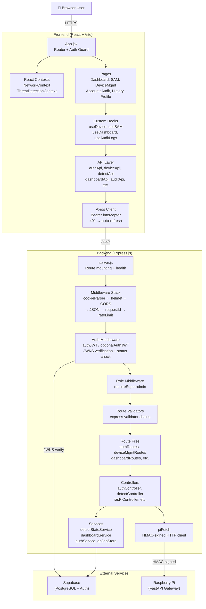
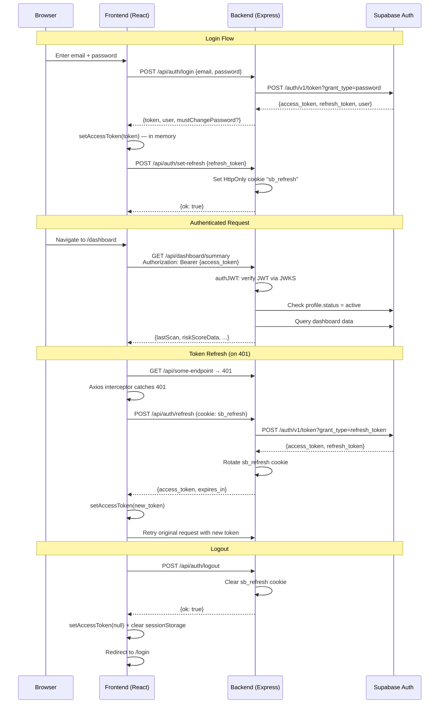
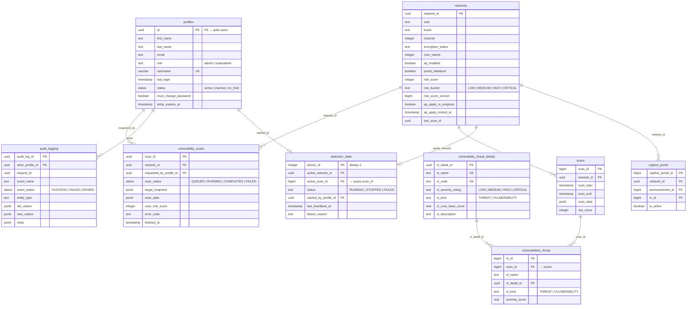
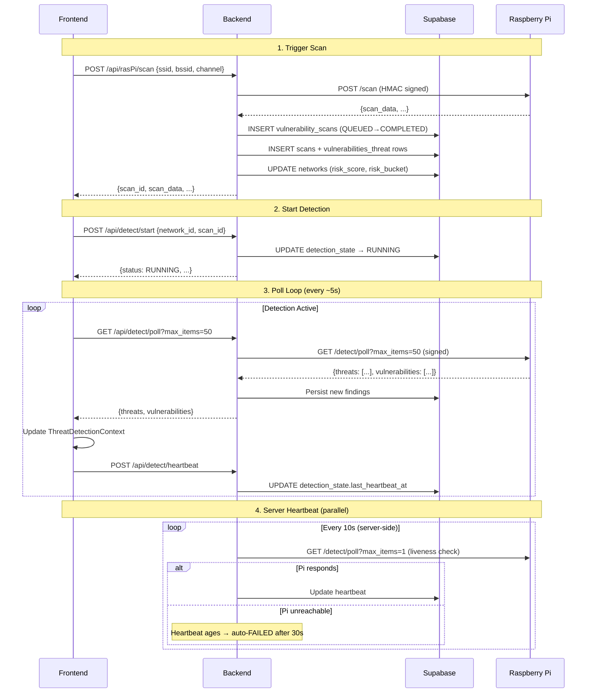
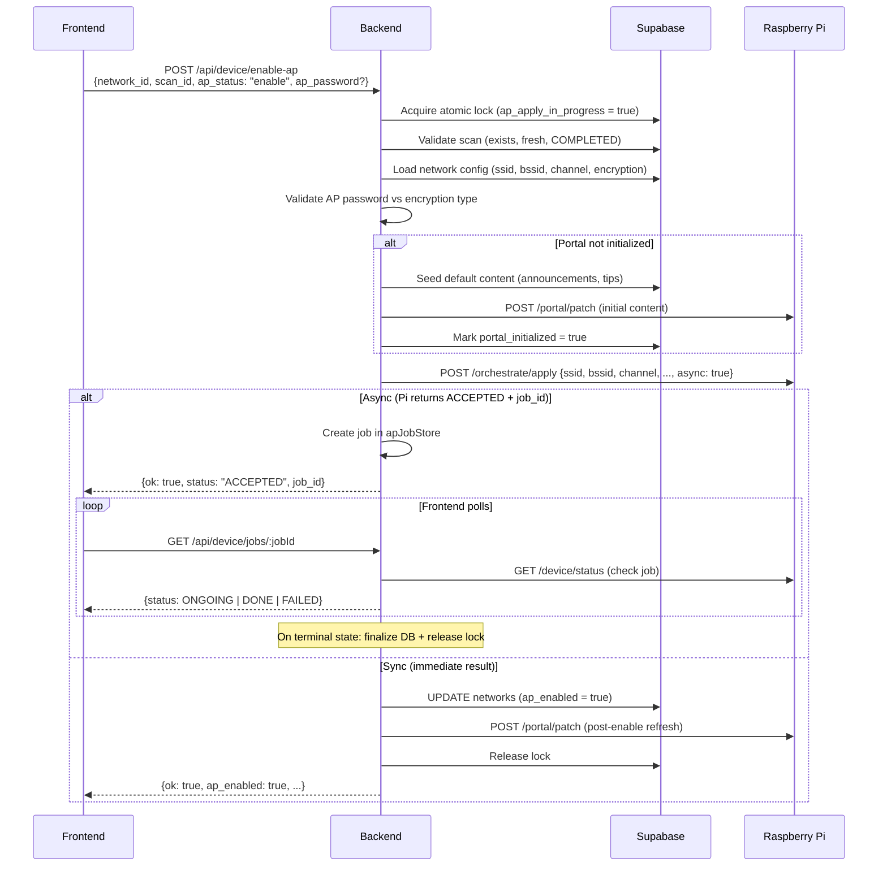

# API Context Documentation

> **Single source of truth** for how data moves between the frontend, backend, and database in the WifiShield application.
> Last updated: 2026-06-01

---

## Table of Contents

1. [System Overview](#1-system-overview)
2. [Architecture Diagrams](#2-architecture-diagrams)
3. [Technology Stack](#3-technology-stack)
4. [Authentication Architecture](#4-authentication-architecture)
5. [API Client Configuration](#5-api-client-configuration)
6. [Middleware Pipeline](#6-middleware-pipeline)
7. [API Endpoint Reference](#7-api-endpoint-reference)
8. [Frontend State Management](#8-frontend-state-management)
9. [Frontend Routing & Pages](#9-frontend-routing--pages)
10. [Database Schema Overview](#10-database-schema-overview)
11. [Pi Gateway Communication](#11-pi-gateway-communication)
12. [Error Handling Patterns](#12-error-handling-patterns)
13. [Environment Variables](#13-environment-variables)
14. [Key Data Flows](#14-key-data-flows)

---

## 1. System Overview

WifiShield is a Wi-Fi security monitoring and management platform. The application consists of:

- **Frontend**: A React SPA (Vite) that provides dashboards, threat detection controls, device management, user administration, and audit logging.
- **Backend**: A Node.js/Express API server that acts as the sole intermediary between the frontend and all data sources (Supabase DB, Raspberry Pi FastAPI gateway).
- **Database**: Supabase (hosted PostgreSQL) stores all persistent data — profiles, networks, scans, threats, audit logs, detection state, and captive portal content.
- **Pi Gateway**: A FastAPI service running on a Raspberry Pi that performs physical network operations — scanning, threat detection polling, access point orchestration, and captive portal content delivery. The Express backend communicates with it via HMAC-signed HTTP requests.

### High-Level Data Flow

```
Browser (User)
    │
    │  HTTPS (JSON + HttpOnly cookies)
    ▼
┌──────────────────────────────────────────────────┐
│  Frontend  (React + Vite)                        │
│  ─ Axios API client with token interceptors      │
│  ─ React Context (NetworkContext, ThreatContext)  │
│  ─ Custom hooks (useDevice, useSAM, etc.)        │
└──────────────────────┬───────────────────────────┘
                       │  /api/* (JSON + Bearer token)
                       ▼
┌──────────────────────────────────────────────────┐
│  Backend  (Express.js on Node)                   │
│  ─ JWT verification (JWKS from Supabase)         │
│  ─ Role & status middleware                      │
│  ─ Rate limiting, Helmet, CORS                   │
│  ─ Route → Validator → Controller → Service      │
└────────┬─────────────────────────┬───────────────┘
         │                         │
         │  supabase-js            │  HMAC-signed HTTP
         │  (service role)         │  (piFetch utility)
         ▼                         ▼
┌─────────────────┐     ┌─────────────────────────┐
│  Supabase       │     │  Raspberry Pi (FastAPI)  │
│  (PostgreSQL)   │     │  ─ /detect/poll          │
│  ─ profiles     │     │  ─ /orchestrate/apply    │
│  ─ networks     │     │  ─ /portal/patch         │
│  ─ scans        │     │  ─ /device/status        │
│  ─ audit_logging│     │  ─ /networks             │
│  ─ detection_*  │     └─────────────────────────┘
└─────────────────┘
```

---

## 2. Architecture Diagrams

### 2.1 Full System Architecture



### 2.2 Authentication Flow



---

## 3. Technology Stack

### Frontend

| Layer | Technology | Purpose |
|-------|-----------|---------|
| Framework | React 19 | UI components & routing |
| Build Tool | Vite 7 | Dev server, HMR, production builds |
| Routing | react-router-dom v7 | SPA routing with auth guards |
| HTTP Client | Axios 1.x | API communication with interceptors |
| Charts | Recharts 3 | Dashboard visualizations |
| Auth Client | @supabase/supabase-js v2 | Password reset / magic-link only (no localStorage tokens) |
| State | React Context + sessionStorage | NetworkContext, ThreatDetectionContext |

### Backend

| Layer | Technology | Purpose |
|-------|-----------|---------|
| Runtime | Node.js | Server runtime |
| Framework | Express 5 | HTTP routing & middleware |
| Auth | jose (JWKS) | JWT verification via Supabase's public key set |
| Database | @supabase/supabase-js v2 | Service-role client (bypasses RLS) |
| Validation | express-validator 7 | Request body/param validation |
| Security | helmet, cors, express-rate-limit | Headers, CORS, rate limiting |
| Pi Comms | Custom piFetch + HMAC signing | Signed requests to Raspberry Pi |

### Database

| Component | Technology |
|-----------|-----------|
| Provider | Supabase (hosted PostgreSQL) |
| Auth | Supabase Auth (manages auth.users) |
| Access | Service-role key (bypasses RLS) |
| Views | `latest_scan_per_network`, `latest_scan_findings` |

---

## 4. Authentication Architecture

### 4.1 Token Strategy

The application uses a **split-token pattern** for security:

| Token | Storage | Lifetime | Purpose |
|-------|---------|----------|---------|
| **Access Token (JWT)** | In-memory JS variable | ~1 hour (Supabase default) | Sent as `Authorization: Bearer <token>` on every API call |
| **Refresh Token** | HttpOnly cookie (`sb_refresh`) | 30 days | Stored server-side, never exposed to JS. Sent automatically with `withCredentials: true` |

> **Why this pattern?** Access tokens in memory are not vulnerable to XSS-based token theft (no localStorage/sessionStorage). The refresh token in an HttpOnly cookie cannot be read by JavaScript and is scoped to `/api/auth` path only.

### 4.2 JWT Verification (Backend)

The `authJWT` middleware (`backend/middleware/authMiddleware.js`):

1. Extracts `Bearer <token>` from the `Authorization` header.
2. Verifies the JWT using Supabase's JWKS endpoint (`/auth/v1/.well-known/jwks.json`) — jose caches the keys automatically.
3. Validates the `aud` claim equals `"authenticated"`.
4. Populates `req.user = { id, email, role, aud }`.
5. **Account-status enforcement (C8 fix)**: Queries the `profiles` table to check `status = 'active'`. Blocks deactivated/on_hold users even if their JWT is still valid.

### 4.3 Cookie Configuration

```javascript
{
  httpOnly: true,                          // Not accessible via JS
  secure: isProd || crossOrigin,           // HTTPS only in production
  sameSite: crossOrigin ? "none" : "lax",  // Cross-origin support when needed
  path: "/api/auth",                       // Only sent to auth endpoints
  maxAge: 30 * 24 * 60 * 60 * 1000,       // 30 days
}
```

### 4.4 CSRF Protection

- **Origin header check** on all auth mutation endpoints (`assertOrigin()`).
- In production, the `Origin` header is required and must match `ALLOWED_ORIGINS`.
- In development, missing `Origin` is allowed (for Postman/cURL testing).

### 4.5 Force-Reset Password Flow

When a superadmin issues a temporary password to a user:

1. `profiles.must_change_password = true` and `profiles.temp_expires_at` are set.
2. On login, the backend checks these flags. If the temp password has expired, login is blocked with `TEMP_PASSWORD_EXPIRED`.
3. If valid, the backend responds with `mustChangePassword: true`.
4. The frontend redirects to `/force-reset-password` (no sidebar).
5. After the user sets a new password via Supabase Auth, the frontend calls `POST /api/auth/clear-force-reset` to clear the flags.

### 4.6 Role Hierarchy

| Role | Capabilities |
|------|-------------|
| `superadmin` | Full access: user management, audit logs, all network operations |
| `admin` | Standard access: dashboards, scans, device management, own profile |

---

## 5. API Client Configuration

### 5.1 Axios Instance (`src/api/axios.js`)

```javascript
const api = axios.create({
  baseURL: import.meta.env.VITE_API_BASE_URL || "/api",
  headers: { "Content-Type": "application/json" },
  withCredentials: true,  // Send cookies (sb_refresh) on every request
});
```

**Dev**: Vite proxy forwards `/api` → `http://localhost:3000`  
**Prod**: `VITE_API_BASE_URL` points to the Railway backend URL

### 5.2 Request Interceptor

Automatically attaches the in-memory access token:

```javascript
api.interceptors.request.use((config) => {
  if (accessToken) {
    config.headers.Authorization = `Bearer ${accessToken}`;
  }
  return config;
});
```

### 5.3 Response Interceptor (Auto-Refresh)

On a `401` response (except for the refresh call itself):

1. Queues concurrent requests during refresh to prevent token stampede.
2. Calls `POST auth/refresh` (cookie sent automatically).
3. Updates the in-memory access token.
4. Retries all queued requests with the new token.
5. On refresh failure: clears token, clears `wf:*` session keys, redirects to `/login`.

---

## 6. Middleware Pipeline

Every request through the Express backend traverses this middleware stack (in order):

```
Request
  │
  ▼
┌─ Health Check (/health) ─── Returns immediately, skips all middleware
  │
  ▼
  cookieParser()              ─── Parse cookie headers (sb_refresh)
  │
  ▼
  helmet()                    ─── Security headers (CSP, HSTS in prod)
  │
  ▼
  cors()                      ─── Origin validation from ALLOWED_ORIGINS
  │
  ▼
  express.json({limit:'100kb'}) ─── Parse JSON bodies, reject large payloads
  │
  ▼
  requestIdMiddleware         ─── Generate/propagate X-Request-Id UUID
  │
  ▼
  globalLimiter               ─── 5000 req / 15 min per IP (all routes)
  │
  ▼
  Route-specific middleware:
  │
  ├─ authJWT                  ─── Verify JWT + check profile.status = active
  ├─ optionalAuthJWT          ─── Best-effort JWT (logout still works without token)
  ├─ requireSuperadmin        ─── Role check (profiles.role = 'superadmin')
  ├─ validateUUID('param')    ─── Param format validation (400 on invalid UUID)
  ├─ loginLimiter             ─── 500 req / 15 min (login only)
  ├─ refreshLimiter           ─── 1000 req / 15 min (refresh only)
  └─ express-validator chains ─── Field-level input validation
  │
  ▼
  Controller
  │
  ▼
  Global Error Handler       ─── Catches unhandled errors, returns generic message
```

---

## 7. API Endpoint Reference

### 7.1 Authentication (`/api/auth`)

| Method | Path | Middleware | Request Body | Response | Description |
|--------|------|-----------|-------------|----------|-------------|
| `POST` | `/auth/login` | `loginLimiter`, `loginValidation`, `validate` | `{ email, password }` | `{ token, user, mustChangePassword?, tempExpiresAt? }` | Login via Supabase Auth REST. Checks temp password expiry. |
| `POST` | `/auth/set-refresh` | None | `{ refresh_token }` | `{ ok: true }` | Stores refresh token as HttpOnly cookie. CSRF origin check. |
| `POST` | `/auth/refresh` | `refreshLimiter` | None (uses cookie) | `{ access_token, expires_in }` | Exchanges refresh cookie for new tokens. Rotates cookie. |
| `POST` | `/auth/logout` | `optionalAuthJWT` | None | `{ ok: true }` | Clears refresh cookie. Audit logged if user identified. |
| `POST` | `/auth/clear-force-reset` | `authJWT` | None | `{ ok: true }` | Clears `must_change_password` and `temp_expires_at` on profile. |

### 7.2 Dashboard (`/api/dashboard`)

| Method | Path | Middleware | Params / Query | Response | Description |
|--------|------|-----------|---------------|----------|-------------|
| `GET` | `/dashboard/summary` | `authJWT` | None | `{ lastScan, riskScoreData, severityData, topRisks, networkEncryptionData, ... }` | Aggregated stats across all networks. |
| `GET` | `/dashboard/networks` | `authJWT` | None | `[{ network_id, ssid }]` | Network list for dropdown. |
| `GET` | `/dashboard/network/:networkId` | `authJWT`, `validateUUID` | `?scanId=<uuid>` (optional) | `{ lastScan, riskScoreData, severityData, commonVulnsData, clientsRiskTrendData, scanList, ... }` | Per-network dashboard data. Optional scan date filter. |
| `GET` | `/dashboard/network/:networkId/scans` | `authJWT`, `validateUUID` | None | `[{ scan_id, finished_at }]` | Completed scans list for date dropdown. |

### 7.3 Detection Lifecycle (`/api/detect`)

| Method | Path | Middleware | Request Body / Query | Response | Description |
|--------|------|-----------|---------------------|----------|-------------|
| `GET` | `/detect/status` | `authJWT` | None | `{ status, active_network_id, active_scan_id, failure_reason, ... }` | Current detection state. Auto-marks FAILED if heartbeat timed out. |
| `POST` | `/detect/start` | `authJWT`, `detectStart`, `validate` | `{ network_id, scan_id }` | Detection state row | Start detection or switch target. `scan_id` is bigint. |
| `POST` | `/detect/stop` | `authJWT`, `detectStop`, `validate` | `{ reason_code, reason_note? }` | Detection state row | Stop detection with governance reason. |
| `POST` | `/detect/heartbeat` | `authJWT` | None | Detection state row | Update heartbeat timestamp (only when RUNNING). |
| `GET` | `/detect/poll` | `authJWT` | `?max_items=50` | `{ threats: [...], vulnerabilities: [...] }` | Poll live threat results from Pi (gated by RUNNING state). |

### 7.4 Device Management (`/api/device`)

| Method | Path | Middleware | Request Body | Response | Description |
|--------|------|-----------|-------------|----------|-------------|
| `GET` | `/device/status` | `authJWT` | None | Pi device status | Proxies to Pi `/device/status`. |
| `GET` | `/device/ap-state/:networkId` | `authJWT`, `validateUUID` | None | `{ ap_enabled, portal_initialized }` | AP state from DB (source of truth). |
| `POST` | `/device/enable-ap` | `authJWT`, `deviceEnableAp`, `validate` | `{ network_id, scan_id?, ap_status, ap_password? }` | `{ ok, status, job_id?, ap_enabled?, ... }` | Enable/disable AP via Pi orchestration. Supports async jobs. |
| `GET` | `/device/jobs/:jobId` | `authJWT`, `deviceJobPoll`, `validate` | None | Job status object | Poll async AP job status. |
| `GET` | `/device/ap-live` | `authJWT` | None | `{ ok, ap_status, is_transitioning, uplink_status }` | Real-time AP state from Pi. |
| `GET` | `/device/network/:networkId/state` | `authJWT`, `validateUUID` | None | Admin network state | Authoritative AP + scan + portal + risk state. |
| `POST` | `/device/portal/update` | `authJWT`, `devicePortalUpdate`, `validate` | `{ network_id, update_type, reason, payload }` | Update result | Partial portal update (announcement/tips/risk/active/bulk). |
| `POST` | `/device/signal_ap` | `authJWT` | `{ toggleState }` | `{ success, status }` | Legacy AP toggle (backward compat). |

### 7.5 Captive Portal (`/api/captivePortal`)

| Method | Path | Middleware | Params / Body | Response | Description |
|--------|------|-----------|--------------|----------|-------------|
| `GET` | `/captivePortal/announcement` | `authJWT` | `?network_id=<uuid>` | Announcement data | Get current announcement. |
| `GET` | `/captivePortal/announcement/history` | `authJWT` | `?network_id=<uuid>` | Announcement history | All announcements for network. |
| `POST` | `/captivePortal/announcement` | `authJWT`, `portalAnnouncement`, `validate` | `{ content, network_id }` | Created announcement | Publish new announcement. |
| `GET` | `/captivePortal/tips` | `authJWT` | `?network_id=<uuid>` | Tips array | Get tips for network. |
| `POST` | `/captivePortal/tips` | `authJWT`, `portalTips`, `validate` | `{ tips: [...], network_id }` | Upserted tips | Create/update tips. |
| `GET` | `/captivePortal/risk-classifications` | `authJWT` | None | Risk scale data | Get `wifi_risk_scale` table. |
| `GET` | `/captivePortal/summary` | `authJWT` | `?network_id=<uuid>&score=<int>` | Portal summary | Preview portal content. |
| `POST` | `/captivePortal/sync` | `authJWT`, `portalSync`, `validate` | `{ network_id, score? }` | Sync result | Push portal content to Pi via `/portal/patch`. |

### 7.6 RasPi / Networks (`/api/rasPi`)

| Method | Path | Middleware | Request Body | Response | Description |
|--------|------|-----------|-------------|----------|-------------|
| `GET` | `/rasPi/networks` | `authJWT` | None | Network list | Get all network records from DB. |
| `GET` | `/rasPi/networks/:networkId` | `authJWT`, `validateUUID` | None | Single network | Get network by ID. |
| `POST` | `/rasPi/networks` | `authJWT`, `rasPiSaveNetwork`, `validate` | `{ ssid, bssid, channel, city?, province?, notes?, scan? }` | Saved network | Save network metadata + scan data. |
| `POST` | `/rasPi/scan` | `authJWT`, `rasPiScan`, `validate` | `{ ssid, bssid, channel }` | Scan result | Trigger a vulnerability scan via Pi. |
| `GET` | `/rasPi/networks_list` | `authJWT` | None | Network SSID list | Lightweight network list for SAM page. |

### 7.7 SAM (Security Assessment Module) (`/api/sam`)

| Method | Path | Middleware | Response | Description |
|--------|------|-----------|----------|-------------|
| `GET` | `/sam/threats/:idOrName` | `authJWT` | Threat detail | Get threat by `vt_code` or `vt_name`. |
| `GET` | `/sam/vulnerabilities/:idOrName` | `authJWT` | Vulnerability detail | Get vulnerability by `vt_code` or `vt_name`. |

### 7.8 History (`/api/history`)

| Method | Path | Middleware | Response | Description |
|--------|------|-----------|----------|-------------|
| `GET` | `/history/vulnerabilities` | `authJWT` | Vulnerability history | User-scoped: admin sees own scans, superadmin sees all. |
| `GET` | `/history/threats` | `authJWT` | Threat history | User-scoped: same scoping as vulnerabilities. |

### 7.9 User Management (`/api/webapp/users`)

| Method | Path | Middleware | Request Body | Response | Description |
|--------|------|-----------|-------------|----------|-------------|
| `GET` | `/webapp/users/profiles/me` | `authJWT` | None | Current user profile | Get authenticated user's profile. |
| `GET` | `/webapp/users/profiles` | `authJWT` | None | All profiles | List all user profiles. |
| `PUT` | `/webapp/users/profiles/:id` | `authJWT`, `validateUUID`, `userUpdate`, `validate` | `{ first_name?, last_name?, username?, email?, role?, status? }` | Updated profile | Update user profile (superadmin only, enforced in controller). |
| `DELETE` | `/webapp/users/profiles/:id` | `authJWT`, `validateUUID` | None | Deleted result | Delete user profile. |
| `POST` | `/webapp/users/profiles/:id/activate-with-temp` | `authJWT`, `validateUUID`, `userActivateWithTemp`, `validate` | `{ first_name, last_name, username, email, role }` | Activated profile + temp password | Activate user and issue temp password (superadmin only). |
| `POST` | `/webapp/users/profiles/:id/deactivate` | `authJWT`, `validateUUID`, `userDeactivate`, `validate` | `{ anonymize? }` | Deactivated result | Deactivate user + archive profile (superadmin only). |
| `POST` | `/webapp/users/profiles/:id/reactivate` | `authJWT`, `validateUUID`, `userReactivate`, `validate` | `{ targetStatus?, issueTempPassword?, profileUpdates? }` | Reactivated profile | Reactivate deactivated account (superadmin only). |

### 7.10 Audit Logging (`/api/audit`)

| Method | Path | Middleware | Params / Query | Response | Description |
|--------|------|-----------|---------------|----------|-------------|
| `GET` | `/audit/logs` | `authJWT`, `requireSuperadmin` | `?page=1&limit=25&search=&status=&startDate=&endDate=` | `{ logs, total, page, limit }` | Paginated audit logs with filtering. |
| `GET` | `/audit/export` | `authJWT`, `requireSuperadmin` | `?from=YYYY-MM-DD&to=YYYY-MM-DD&status=` | CSV Blob | Download audit logs as CSV. |
| `POST` | `/audit/archive` | `authJWT`, `requireSuperadmin` | None | Archive result | Move logs older than 7 days to archive table. |

### 7.11 Metadata (`/api/webapp`)

| Method | Path | Middleware | Response | Description |
|--------|------|-----------|----------|-------------|
| `GET` | `/webapp/network_metadata` | `authJWT` | Network metadata | Network metadata for display. |
| `GET` | `/webapp/vulnerabilities_latest` | `authJWT` | Latest vulnerabilities | Most recent vulnerability data. |

### 7.12 Pi Proxy (`/api/pi`)

Direct proxy endpoints to the Pi FastAPI gateway (all HMAC-signed):

| Method | Path | Middleware | Description |
|--------|------|-----------|-------------|
| `GET` | `/pi/device/status` | `authJWT` | Pi device status |
| `GET` | `/pi/networks` | `authJWT` | Pi-scanned network list |
| `POST` | `/pi/scan` | `authJWT` | Trigger scan on Pi |
| `GET` | `/pi/detect/poll` | `authJWT` | Poll Pi for detection results |
| `POST` | `/pi/orchestrate/apply` | `authJWT` | Apply AP configuration on Pi |
| `POST` | `/pi/portal/patch` | `authJWT` | Push portal content to Pi |

### 7.13 Health / Internal

| Method | Path | Middleware | Description |
|--------|------|-----------|-------------|
| `GET` | `/health` | None | Health check — always returns `{ status: "ok" }`. Pre-middleware. |
| `GET` | `/internal/pi-smoke` | Optional `INTERNAL_SMOKE_TOKEN` | Pi connectivity smoke test via `piFetch('/device/status')`. |

---

## 8. Frontend State Management

### 8.1 In-Memory Auth State

**Location**: `src/api/axios.js`

```javascript
let accessToken = null;
export function setAccessToken(token) { accessToken = token; }
export function getAccessToken() { return accessToken; }
```

- Set on login and refresh.
- Cleared on logout or refresh failure.
- Never persisted to storage (security).

### 8.2 NetworkContext (`src/context/NetworkContext.jsx`)

Provides the currently selected network and scan across all pages.

| Field | Type | Persisted | Description |
|-------|------|-----------|-------------|
| `networkId` | `string \| null` | sessionStorage (`wf:networkScan`) | Currently selected network UUID |
| `scanId` | `string \| null` | sessionStorage (`wf:networkScan`) | Currently selected scan UUID |

**Key behaviors**:
- `setNetworkId(id)` — Sets network and resets scanId if network changed.
- `setNetworkScan(nId, sId)` — Atomic set of both (used after scan save).
- `clearNetworkScan()` — Called on logout.
- Stored as a single atomic key to prevent partial writes.
- sessionStorage is tab-scoped — clears on tab close.

### 8.3 ThreatDetectionContext (`src/context/ThreatDetectionContext.jsx`)

Provides global threat detection state — single polling loop for the entire app.

| Field | Type | Description |
|-------|------|-------------|
| `detectionStatus` | `string` | `RUNNING`, `STOPPED`, `FAILED` |
| `detectionResults` | `array` | Raw poll results |
| `liveThreats` | `array` | Processed live threats |
| `displayThreats` | `array` | Formatted for UI display |
| `failureReason` | `string \| null` | Why detection failed |
| `backendState` | `object` | Full detection_state row from backend |
| `activeNetwork` | `string \| null` | SSID of monitored network (resolved from backend + session cache) |
| `lastUpdated` | `number` | Timestamp of last status/results change |

### 8.4 Custom Hooks

| Hook | File | Primary API Calls | Purpose |
|------|------|-------------------|---------|
| `useDashboard` | `hooks/useDashboard.js` | `dashboardApi.*` | Dashboard data fetching & state |
| `useDevice` | `hooks/useDevice.js` | `deviceApi.*` | Device management (AP toggle, portal, scan) |
| `useSAM` | `hooks/useSAM.js` | `samApi.*`, `detectApi.*`, `rasPiApi.*` | Security assessment, detection polling, network scanning |
| `useAuditLogs` | `hooks/useAuditLogs.js` | `auditApi.*` | Audit log pagination, filtering, export |
| `useProfile` | `hooks/useProfile.js` | `webapp/users/profiles/me` | Current user profile management |
| `useUsers` | `hooks/useUsers.js` | `userApi.*` | User account administration |
| `useSAMHistory` | `hooks/useSAMHistory.js` | `samHistoryApi.*` | Historical threat/vulnerability data |
| `useSessionState` | `hooks/useSessionState.js` | None | SessionStorage-backed React state (wf:* keys) |
| `usePagination` | `hooks/usePagination.js` | None | Generic pagination logic |
| `useSeverityTableControls` | `hooks/useSeverityTableControls.js` | None | Table sorting/filtering for severity data |

---

## 9. Frontend Routing & Pages

### 9.1 Route Structure

```
/                        → Redirects to /login
/login                   → Login page (public)
/forgot-password         → Forgot password (public)
/reset-password          → Reset password (public)
/force-reset-password    → Force reset (authenticated, no sidebar)

── Protected (require access token) ──
/dashboard               → Dashboard page
/security-assessment     → SAM page (scan, detect, threats)
/device-management       → Device Management page
/accounts-audit          → Accounts & Audit page (superadmin)
/history                 → History page
/profile                 → User Profile page
/test-auth               → Auth testing page (dev)
```

### 9.2 Auth Guard

In `App.jsx`, the `isAuthenticated` check is simply `!!getAccessToken()`. If false, all protected routes redirect to `/login`.

On app bootstrap:
1. If on a public page (`/login`, `/forgot-password`, `/reset-password`), skip session restore.
2. Otherwise, call `POST auth/refresh` to restore session from the HttpOnly cookie.
3. Show loading screen until auth state is resolved.

---

## 10. Database Schema Overview

### 10.1 Core Tables



### 10.2 Key Database Views

| View | Source Tables | Purpose |
|------|-------------|---------|
| `latest_scan_per_network` | `vulnerability_scans`, `scans` | One row per network: latest COMPLETED scan with risk_score |
| `latest_scan_findings` | `vulnerabilities_threat`, `vulnerability_threat_details`, `scans` | Findings joined for the latest scan per network |

### 10.3 Key Table Relationships

- `profiles.id` → `auth.users.id` (1:1, Supabase Auth)
- `networks` → central entity for all network-scoped data
- Two scan systems exist in parallel:
  - **`vulnerability_scans`** (UUID `scan_id`) — lifecycle tracking (QUEUED → RUNNING → COMPLETED)
  - **`scans`** (bigint `scan_id`) — raw scan data + findings storage + risk_score
  - `detection_state.active_scan_id` references `scans.scan_id` (bigint)
  - `networks.last_scan_id` references `vulnerability_scans.scan_id` (UUID)

---

## 11. Pi Gateway Communication

### 11.1 piFetch Utility (`backend/utils/piFetch.js`)

All Express → Pi requests go through `piFetch()`, which:

1. Resolves the Pi base URL from `PI_BASE_URL` or `FASTAPI_BASE_URL` env vars.
2. JSON-serializes the body (if provided).
3. Builds HMAC-signed headers using `CONTROL_SIGNING_SECRET`:
   - Signs: `method + pathWithQuery + bodyBytes`
   - Produces: `X-Signature`, `X-Timestamp`, `X-Nonce` headers
4. Sends the request with an abort timeout (default 10s).
5. Returns `{ ok, status, data, rawText }` — never throws on HTTP errors (lets callers decide).
6. **Enforces signing in production** — throws if `CONTROL_SIGNING_SECRET` is not set.

### 11.2 Pi FastAPI Endpoints Called by Backend

| Pi Endpoint | Express Caller | Method | Purpose |
|-------------|---------------|--------|---------|
| `/device/status` | `server.js`, `deviceMgmtRoutes.js` | GET | Pi health + AP status |
| `/detect/poll` | `detectController.js`, `detectStateService.js` | GET | Poll live threat results |
| `/orchestrate/apply` | `deviceMgmtRoutes.js` | POST | Enable/disable AP (async job support) |
| `/portal/patch` | `deviceMgmtRoutes.js`, `captivePortalController.js` | POST | Push portal content to Pi |
| `/networks` | `piProxyController.js` | GET | List Pi-visible networks |
| `/scan` | `rasPiController.js`, `piProxyController.js` | POST | Trigger vulnerability scan |

### 11.3 Async AP Orchestration

The AP enable/disable flow supports **asynchronous jobs**:

1. Frontend calls `POST /api/device/enable-ap`.
2. Backend acquires an atomic DB lock (`ap_apply_in_progress`).
3. Backend calls Pi's `/orchestrate/apply` with `async: true`.
4. If Pi responds with `{ status: "ACCEPTED", job_id: "orch_..." }`:
   - Backend creates a job in `apJobStore` (in-memory).
   - Returns `{ ok: true, status: "ACCEPTED", job_id }` to frontend.
   - Frontend polls `GET /api/device/jobs/:jobId` for status updates.
5. When the job reaches a terminal state (DONE/FAILED), the backend finalizes DB writes and releases the lock.

**Concurrency controls**:
- Atomic DB lock (`networks.ap_apply_in_progress`) with TTL auto-expiry.
- In-memory `apJobStore` prevents duplicate jobs per network.
- Stale lock recovery after `AP_LOCK_TTL_SECONDS` (default 120s).

---

## 12. Error Handling Patterns

### 12.1 Global Error Handler (Backend)

```javascript
app.use((err, _req, res, _next) => {
  if (err.type === 'entity.parse.failed')
    → 400 { error: 'INVALID_JSON', message: 'Malformed JSON in request body' }
  if (err.message === 'CORS not allowed')
    → 403 { error: 'CORS_REJECTED' }
  else
    → 500 { error: 'INTERNAL_ERROR', message: 'An unexpected error occurred' }
});
```

No stack traces or internal details are leaked in production.

### 12.2 Structured Error Codes

The device management routes classify FastAPI errors into structured codes:

| Error Code | Category | Retryable | Description |
|-----------|----------|-----------|-------------|
| `PI_NETWORK_CONFLICT` | rejected | No | Target network matches Pi's management network |
| `SSID_NOT_FOUND` | not_found | No | SSID not visible to Pi |
| `PASSWORD_REQUIRED` | auth | Yes | Encrypted network needs password |
| `INCORRECT_PASSWORD` | auth | Yes | Wrong Wi-Fi password |
| `ENCRYPTION_MISMATCH` | outdated | No | Security type changed — rescan needed |
| `NETWORK_DATA_OUTDATED` | outdated | No | Channel/BSSID mismatch — rescan needed |
| `DEVICE_BUSY` | busy | Yes | Pi is processing another operation |
| `DEVICE_EXCEPTION` | internal | Yes | Internal error on Pi |
| `UPLINK_DISCONNECTED` | connection | Yes | AP ended up disconnected |
| `CONNECTION_FAILED` | connection | Yes | Could not connect (weak signal, timeout) |

### 12.3 Frontend Error Handling

The Axios response interceptor handles auth errors (401 → refresh → retry → redirect to login on failure). Application-level errors are handled in custom hooks and displayed via component-level error states.

### 12.4 Validation Errors

All input validation uses `express-validator`. On validation failure:

```json
{
  "error": "VALIDATION_ERROR",
  "errors": [
    { "type": "field", "msg": "network_id must be a valid UUID", "path": "network_id", "location": "body" }
  ]
}
```

---

## 13. Environment Variables

### 13.1 Frontend (Vite — `VITE_` prefix required)

| Variable | Required | Default | Description |
|----------|----------|---------|-------------|
| `VITE_API_BASE_URL` | Prod only | `/api` (dev proxy) | Full backend URL in production |
| `VITE_SUPABASE_URL` | Yes | — | Supabase project URL |
| `VITE_SUPABASE_ANON_KEY` | Yes | — | Supabase anonymous key (public) |

### 13.2 Backend

| Variable | Required | Default | Description |
|----------|----------|---------|-------------|
| `PORT` | No | `3000` | Express server port |
| `NODE_ENV` | No | `development` | Environment mode |
| `APP_ENV` | No | `development` | App-specific env override |
| `SUPABASE_URL` | Yes | — | Supabase project URL |
| `SUPABASE_ANON_KEY` | Yes | — | Supabase anonymous key (for auth token refresh) |
| `SUPABASE_SERVICE_ROLE_KEY` | Yes | — | Supabase service role key (bypasses RLS) |
| `ALLOWED_ORIGINS` | No | `http://localhost:5173` | Comma-separated CORS origins |
| `CROSS_ORIGIN_COOKIES` | No | `false` | Enable SameSite=None for cross-origin deployments |
| `PI_BASE_URL` / `FASTAPI_BASE_URL` | No | `http://127.0.0.1:8000` | Raspberry Pi FastAPI URL |
| `CONTROL_SIGNING_SECRET` | Prod | — | HMAC secret for signing Pi requests |
| `SCAN_RUNNER_TOKEN` | Prod | — | Shared secret for scan webhook authentication |
| `INTERNAL_SMOKE_TOKEN` | Prod | — | Token for `/internal/pi-smoke` endpoint |
| `PI_SIGNING_OPTIONAL` | Dev only | `false` | Skip Pi signing in development |
| `SCAN_MAX_AGE_SECONDS` | No | `300` | Max scan age for AP enable (5 min) |
| `AP_LOCK_TTL_SECONDS` | No | `120` | Stale AP lock auto-expiry (2 min) |
| `RAILWAY_PUBLIC_DOMAIN` | Auto | — | Set by Railway for CSP connect-src |

---

## 14. Key Data Flows

### 14.1 Scan → Detect → Display Flow



### 14.2 AP Enable/Disable Flow



### 14.3 Audit Logging

Every significant action writes to `audit_logging`:

| Event Name | Trigger |
|-----------|---------|
| `LOGIN_SUCCESS` | Successful login |
| `LOGIN_FAILED` | Failed login attempt |
| `LOGIN_TEMP_EXPIRED` | Temp password expired on login |
| `AUTH.REFRESH` | Token refresh |
| `AUTH.LOGOUT` | User logout |
| `USER_PASSWORD_CHANGED` | Force-reset password cleared |
| `AUTHORIZATION.DENIED` | Role check failed |
| `DETECTION.START` | Detection started |
| `DETECTION.STOP` | Detection stopped (with reason) |
| `DETECTION.SWITCH_TARGET` | Detection target switched |
| `DETECTION.FAILED` | Heartbeat timeout |
| `AP_ENABLE_REQUEST` | AP enable attempt (SUCCESS/FAILED/ACCEPTED) |
| `AP_DISABLE_REQUEST` | AP disable attempt |
| `PORTAL_PATCH` | Portal content pushed to Pi |

Each audit entry includes: `actor_profile_id`, `request_id`, `actor_ip`, `user_agent`, `event_name`, `event_status`, `entity_type`, `old_values`, `new_values`, and `meta` (JSON).

---

## Appendix A: Frontend API Module Map

```
src/api/
├── axios.js           ─ Shared Axios instance + interceptors + token management
├── authApi.js         ─ login(), logout()
├── dashboardApi.js    ─ getDashboardSummary(), getDashboardForNetwork(), getNetworks(), getScansForNetwork()
├── detectApi.js       ─ getDetectStatus(), startDetect(), stopDetect(), pollDetect()
├── deviceApi.js       ─ toggleAP(), pollApJob(), pollApLive(), getApState(), getNetworkState(), updatePortal(), portal helpers
├── auditApi.js        ─ getAuditLogs(), exportAuditLogs()
├── rasPiApi.js        ─ getNetworks(), sendMetadata(), triggerScan(), toggleAccessPoint()
├── samApi.js          ─ getThreats(), getVulnerabilities(), getThreatDetail(), getVulnerabilityDetail(), getNetworksList()
├── samHistoryApi.js   ─ getVulnHistory(), getThreatHistory()
└── userApi.js         ─ getUserAccounts(), updateUser(), activateUserWithTemp(), deactivateUser(), reactivateUser()
```

## Appendix B: Backend File Map

```
backend/
├── server.js                    ─ Express app setup, route mounting, health check, global error handler
├── config/
│   ├── supabaseClient.js        ─ Service-role Supabase client (debug-instrumented)
│   └── envValidation.js         ─ Fail-fast env var validation on startup
├── middleware/
│   ├── authMiddleware.js        ─ authJWT (JWKS + status check), optionalAuthJWT
│   ├── roleMiddleware.js        ─ requireSuperadmin
│   ├── rateLimiter.js           ─ loginLimiter, refreshLimiter, globalLimiter
│   ├── requestIdMiddleware.js   ─ UUID request ID generation/propagation
│   ├── statusMiddleware.js      ─ requireActiveProfile (alternative status check)
│   └── validateUUID.js          ─ Route param UUID format validation
├── validators/
│   ├── routeValidators.js       ─ All express-validator chains + validate() runner
│   ├── authValidator.js         ─ Login validation
│   └── userValidators.js        ─ User-specific validators
├── routes/
│   ├── authRoutes.js            ─ /api/auth/*
│   ├── dashboardRoutes.js       ─ /api/dashboard/*
│   ├── detectRoutes.js          ─ /api/detect/*
│   ├── deviceMgmtRoutes.js      ─ /api/device/* (largest file — AP orchestration logic)
│   ├── captivePortalRoutes.js   ─ /api/captivePortal/*
│   ├── rasPiRoutes.js           ─ /api/rasPi/*
│   ├── samRoutes.js             ─ /api/sam/*
│   ├── historyRoutes.js         ─ /api/history/*
│   ├── userRoutes.js            ─ (mounted under /api/webapp/users)
│   ├── webAppRoutes.js          ─ /api/webapp/* (users + metadata)
│   └── piProxyRoutes.js         ─ /api/pi/* (direct Pi proxy)
├── controllers/
│   ├── authController.js        ─ Login, set-refresh, refresh, logout, clear-force-reset
│   ├── dashboardController.js   ─ Delegates to dashboardService
│   ├── detectController.js      ─ Detection lifecycle (start, stop, heartbeat, poll)
│   ├── captivePortalController.js ─ Announcements, tips, risk, portal sync
│   ├── rasPiController.js       ─ Network CRUD, scan triggering
│   ├── samController.js         ─ Threat/vulnerability detail lookups
│   ├── historyController.js     ─ User-scoped historical data
│   ├── userController.js        ─ User CRUD, activate, deactivate, reactivate
│   ├── metadataController.js    ─ Network metadata, latest vulnerabilities
│   └── piProxyController.js     ─ Thin proxy to Pi via piFetch
├── services/
│   ├── detectStateService.js    ─ Detection state machine (DB-backed, optimistic locking)
│   ├── dashboardService.js      ─ Dashboard data aggregation queries
│   ├── authService.js           ─ SA login/OTP (legacy, partially used)
│   └── apJobStore.js            ─ In-memory async AP job tracking
├── repositories/
│   ├── auditRepository.js       ─ Audit log DB queries
│   ├── authRepository.js        ─ Auth-related DB queries
│   ├── assessmentRepository.js  ─ Assessment queries
│   └── userRepository.js        ─ User profile queries
└── utils/
    ├── piFetch.js               ─ HMAC-signed HTTP client for Pi
    ├── signing.js               ─ HMAC signature generation
    ├── auditLogger.js           ─ logAuditEvent() — structured audit log writer
    ├── riskPipeline.js          ─ Risk score computation + network risk updates
    ├── scoring.js               ─ Risk score calculation algorithms
    ├── scanValidation.js        ─ Scan freshness/status/data validation
    ├── normalization.js         ─ Data normalization helpers
    ├── sorting.js               ─ Sorting utilities
    ├── portalTipResolver.js     ─ Portal tip resolution + hash computation
    └── exportFormatters.js      ─ CSV export formatting
```
