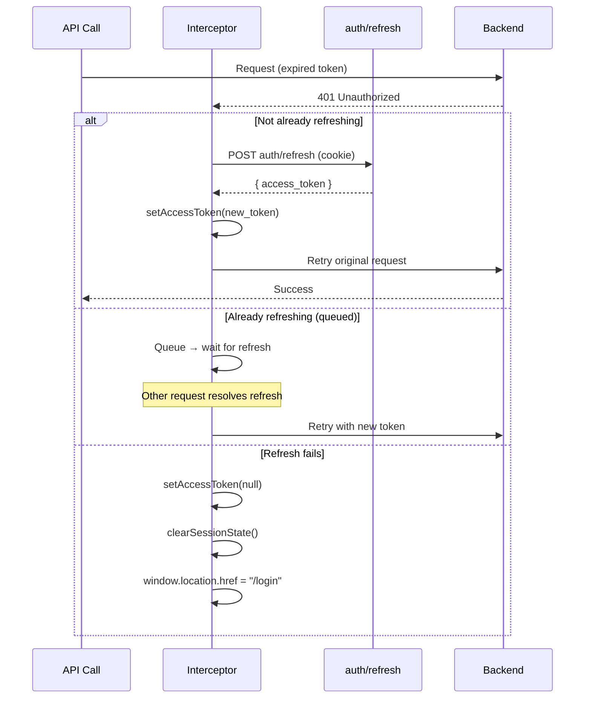
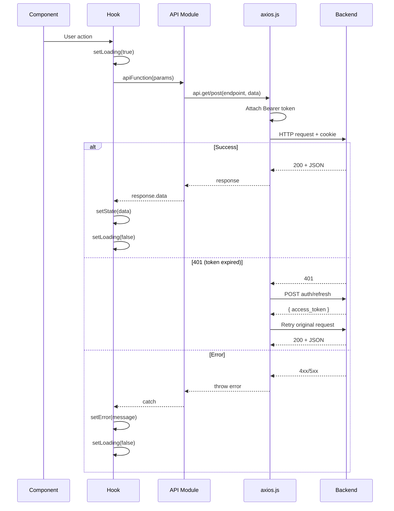

# API Integration Context

> **HTTP Client:** Axios 1.13.3  
> **Client Config:** `src/api/axios.js`  
> **Base URL:** `VITE_API_BASE_URL` (production) or `/api` (dev, via Vite proxy)  
> **Last Updated:** 2026-06-22

> MFA enroll/challenge/verify calls go directly through `supabase.auth.mfa.*`
> (Supabase JS SDK), not a backend REST endpoint — see
> [`AUTHENTICATION_AND_AUTHORIZATION.md` §11](./AUTHENTICATION_AND_AUTHORIZATION.md#11-multi-factor-authentication-totp)
> for the full mechanics. Only the two backend MFA endpoints are listed below.

---

## 1. API Client Architecture

### Axios Instance Configuration

**File:** `src/api/axios.js`

```javascript
const api = axios.create({
  baseURL: import.meta.env.VITE_API_BASE_URL || "/api",
  headers: { "Content-Type": "application/json" },
  withCredentials: true, // send HttpOnly cookies on every request
});
```

### Key Design Decisions

| Decision | Implementation |
|----------|---------------|
| **Token storage** | In-memory module variable (`let accessToken = null`) — NOT in localStorage |
| **Cookie strategy** | `withCredentials: true` sends HttpOnly refresh cookie automatically |
| **Base URL** | Environment-driven; fails fast in production if `VITE_API_BASE_URL` is missing |
| **Dev proxy** | Vite proxies `/api` → `http://localhost:3000` in development |

### Production Guard

```javascript
if (import.meta.env.PROD && !import.meta.env.VITE_API_BASE_URL) {
  throw new Error("VITE_API_BASE_URL is not set.");
}
```

---

## 2. Interceptors

### Request Interceptor

Attaches Bearer token to every request:

```javascript
api.interceptors.request.use((config) => {
  if (accessToken) {
    config.headers.Authorization = `Bearer ${accessToken}`;
  }
  return config;
});
```

### Response Interceptor (401 → Auto-Refresh → Retry)



**Key Behaviors:**
- **Single refresh**: Uses `isRefreshing` flag + `refreshQueue` to prevent concurrent refreshes
- **Clean retry**: Builds minimal config for retry to avoid Axios 1.x stale property bugs
- **Logout on failure**: Clears token, wipes `wf:*` sessionStorage, redirects to `/login`
- **Skip for refresh call itself**: Prevents infinite loop on `auth/refresh` 401

---

## 3. API Service Modules

### Auth API (`src/api/authApi.js`)

| Function | Method | Endpoint | Request | Response |
|----------|--------|----------|---------|----------|
| `login` | POST | `/auth/login` | `{ email, password }` | `{ access_token, ... }` |
| `logout` | POST | `/auth/logout` | — | Clears HttpOnly cookie |

> **Note:** The actual login flow uses `supabase.auth.signInWithPassword()` client-side, then `auth/set-refresh` to store the refresh token as an HttpOnly cookie. `authApi.login` exists but may not be the primary login path.

---

### MFA Endpoints (backend, called from `src/api/userApi.js` and inline in `MFASetup.jsx`/`Login.jsx`)

| Function / Call Site | Method | Endpoint | Auth | Request | Response |
|----------|--------|----------|------|---------|----------|
| `MFASetup.jsx` (inline, post-verify) | POST | `/auth/set-refresh` | No (sets cookie) | `{ refresh_token }` | Sets HttpOnly cookie with new aal2 session |
| `MFASetup.jsx` / `Login.jsx` (inline, post-verify) | POST | `/auth/mfa/sync-status` | JWT (aal1 ok) | — | Re-derives `mfa_enrolled` from Supabase's real factor list; audit-logs `USER.MFA_ENROLLED`/`USER.MFA_UNENROLLED` |
| `adminUnenrollMfa(id)` (`src/api/userApi.js`) | POST | `/auth/mfa/admin-unenroll/:id` | JWT + AAL2 + superadmin | — | Removes all TOTP factors for the target user, sets `mfa_enrolled=false`, audit-logs `USER.MFA_RESET` |

> Enrollment/challenge/verify themselves (`supabase.auth.mfa.enroll/challenge/verify/listFactors`) are Supabase Auth SDK calls — no backend route exists for them. Full reference: [`AUTHENTICATION_AND_AUTHORIZATION.md` §11](./AUTHENTICATION_AND_AUTHORIZATION.md#11-multi-factor-authentication-totp).

---

### Dashboard API (`src/api/dashboardApi.js`)

| Function | Method | Endpoint | Request | Response |
|----------|--------|----------|---------|----------|
| `getDashboardSummary` | GET | `/dashboard/summary` | — | Aggregated data for all networks |
| `getDashboardForNetwork` | GET | `/dashboard/network/{networkId}` | `?scanId=` (optional) | Per-network data + scan list |
| `getNetworks` | GET | `/dashboard/networks` | — | Network list for dropdown |
| `getScansForNetwork` | GET | `/dashboard/network/{networkId}/scans` | — | Scan list for date dropdown |

---

### Detect API (`src/api/detectApi.js`)

| Function | Method | Endpoint | Request | Response |
|----------|--------|----------|---------|----------|
| `getDetectStatus` | GET | `/detect/status` | — | `{ status, network_id, ssid, ... }` |
| `startDetect` | POST | `/detect/start` | `{ network_id, scan_id }` | `{ status: "RUNNING" }` |
| `stopDetect` | POST | `/detect/stop` | `{ reason_code, reason_note? }` | `{ status: "STOPPED" }` |
| `pollDetect` | GET | `/detect/poll` | `?max_items=50` | `{ threatRows, status }` |

**Stop Reason Codes:** `MAINTENANCE`, `DEVICE_RESTART`, `FALSE_POSITIVES`, `CLIENT_REQUEST`, `SCOPE_CHANGE`, `EVIDENCE_PRESERVATION`, `OTHER`

---

### Device API (`src/api/deviceApi.js`)

| Function | Method | Endpoint | Request | Response |
|----------|--------|----------|---------|----------|
| `getAnnouncement` | GET | `/captivePortal/announcement` | `?network_id=` | Announcement content |
| `getAnnouncementHistory` | GET | `/captivePortal/announcement/history` | `?network_id=` | Announcement history |
| `publishAnnouncement` | POST | `/captivePortal/announcement` | `{ content, network_id }` | — |
| `getTips` | GET | `/captivePortal/tips` | `?network_id=` | Tips array |
| `upsertTips` | POST | `/captivePortal/tips` | `{ tips, network_id }` | — |
| `getRiskClassifications` | GET | `/captivePortal/risk-classifications` | — | Risk scale data |
| `getPortalSummary` | GET | `/captivePortal/summary` | `?network_id=&score=` | Portal summary |
| `syncPortal` | POST | `/captivePortal/sync` | `{ network_id, score }` | — |
| `toggleAP` | POST | `/device/enable-ap` | `{ network_id, scan_id?, ap_status, ap_password? }` | `{ ok, status, job_id? }` |
| `pollApJob` | GET | `/device/jobs/{jobId}` | — | `{ job_status, error_code? }` |
| `pollApLive` | GET | `/device/ap-live` | — | `{ ap_status, is_transitioning }` |
| `getApState` | GET | `/device/ap-state/{networkId}` | — | AP state from DB |
| `getNetworkConfig` | GET | `/rasPi/networks/{networkId}` | — | Network config |
| `getNetworkState` | GET | `/device/network/{networkId}/state` | — | Full admin state |
| `updatePortal` | POST | `/device/portal/update` | `{ network_id, update_type, reason, payload }` | — |

**Update Types:** `announcement`, `terms`, `tips`, `risk`, `active`, `bulk`

---

### SAM API (`src/api/samApi.js`)

| Function | Method | Endpoint | Request | Response |
|----------|--------|----------|---------|----------|
| `getThreats` | GET | `/sam/threats` | — | Threat definitions |
| `getVulnerabilities` | GET | `/sam/vulnerabilities` | — | Vulnerability definitions |
| `getThreatDetail` | GET | `/sam/threats/{idOrName}` | — | Rich threat detail |
| `getVulnerabilityDetail` | GET | `/sam/vulnerabilities/{idOrName}` | — | Rich vulnerability detail |
| `getNetworksList` | GET | `/rasPi/networks_list/` | — | `{ status, networks, cached }` |

---

### SAM History API (`src/api/samHistoryApi.js`)

| Function | Method | Endpoint | Request | Response |
|----------|--------|----------|---------|----------|
| `getVulnHistory` | GET | `/history/vulnerabilities` | — | Historical vulnerability data |
| `getThreatHistory` | GET | `/history/threats` | — | Historical threat data |

---

### Audit API (`src/api/auditApi.js`)

| Function | Method | Endpoint | Request | Response |
|----------|--------|----------|---------|----------|
| `getAuditLogs` | GET | `/audit/logs` | `?page=&limit=&search=&status=&startDate=&endDate=` | `{ logs, total, page, limit }` |
| `exportAuditLogs` | GET | `/audit/export` | `?from=&to=&status=` | CSV Blob |

**Access:** Superadmin only (server-enforced).

---

### User API (`src/api/userApi.js`)

| Function | Method | Endpoint | Request | Response |
|----------|--------|----------|---------|----------|
| `getUserAccounts` | GET | `/webapp/users/profiles` | — | User array |
| `updateUser` | PUT | `/webapp/users/profiles/{id}` | User data | Updated user |
| `activateUserWithTemp` | POST | `/webapp/users/profiles/{id}/activate-with-temp` | User data | Activation result |
| `deactivateUser` | POST | `/webapp/users/profiles/{id}/deactivate` | `{ anonymize }` | — |
| `reactivateUser` | POST | `/webapp/users/profiles/{id}/reactivate` | `{ targetStatus, issueTempPassword, profileUpdates }` | — |
| `adminUnenrollMfa` | POST | `/auth/mfa/admin-unenroll/{id}` | — | Removes all TOTP factors for the user (superadmin + AAL2 only) |

---

### RasPi API (`src/api/rasPiApi.js`)

| Function | Method | Endpoint | Request | Response |
|----------|--------|----------|---------|----------|
| `getNetworks` | GET | `/rasPi/networks` | — | Network list |
| `sendMetadata` | POST | `/rasPi/networks` | Metadata payload | — |
| `triggerScan` | POST | `/rasPi/scan` | `{ ssid, bssid, channel }` | Scan result |
| `toggleAccessPoint` | POST | `/device/signal_ap` | `{ toggleState }` | Toggle result |

---

## 4. Request/Response Flow

### Standard Authenticated Request



---

## 5. Environment-Based URL Configuration

| Environment | `VITE_API_BASE_URL` | Behavior |
|------------|---------------------|----------|
| **Development** | Empty/unset | Axios uses `/api` → Vite proxy forwards to `localhost:3000` |
| **Production** | `https://api-service.up.railway.app/api` | Axios uses full URL directly |

### Vite Proxy Config (`vite.config.js`)

```javascript
server: {
  proxy: {
    "/api": {
      target: "http://localhost:3000",
      changeOrigin: true,
    },
  },
},
```

---

## 6. Error Handling Patterns

### Hook-Level Error Handling

```javascript
// Standard pattern in every hook
try {
  setLoading(true);
  setError(null);
  const res = await apiFunction(params);
  setData(res.data);
} catch (err) {
  const msg = err.response?.data?.error || err.message || "Default error message";
  setError(msg);
} finally {
  setLoading(false);
}
```

### Device API Error Code Mapping

The `useDevice` hook maps 30+ backend error codes to user-friendly messages:

| Error Code | User Message |
|------------|-------------|
| `SCAN_REQUIRED` | (Sets `scanError` state) |
| `AP_PASSWORD_REQUIRED` | "Password is required for this network." |
| `INCORRECT_PASSWORD` | "Incorrect Wi-Fi password." |
| `DEVICE_BUSY` | "Device is busy. Please wait and try again." |
| `SSID_NOT_FOUND` | "Network SSID could not be found." |
| `CONNECTION_FAILED` | "Couldn't connect to the uplink network." |

### Rate Limiting (Audit Export)

```javascript
// 5-second cooldown between exports
const now = Date.now();
if (now - lastExportRef.current < 5000) {
  setExportError("Please wait a few seconds before exporting again.");
  return false;
}
```

---

## 7. Retry and Polling Behavior

### Token Refresh Retry

- **Trigger:** 401 response on any non-refresh request
- **Mechanism:** Single refresh attempt, queue concurrent requests
- **Failure:** Redirect to `/login`

### Detection Polling (`useThreatDetection`)

- **Interval:** 3 seconds
- **Trigger:** When `detectionStatus === "DETECTING"`
- **Stop conditions:** Backend returns status !== `RUNNING`, or manual stop

### AP Job Polling (`useDevice`)

- **Job poll:** `pollUntil` with 2.5s interval, max 120 attempts
- **Live poll:** After job completes, 3s interval, max 20 attempts to confirm AP state
- **Reconciliation:** On gateway timeout (502/503/504), scheduled checks at 3s, 10s, 20s, 35s, 50s, 60s

### Admin State Polling (`useDevice`)

- **Interval:** 12 seconds when AP is enabled
- **Suspended during:** Timeout reconciliation or active async job

---

## 8. Authentication Headers

| Header | When Set | Source |
|--------|----------|-------|
| `Authorization: Bearer {token}` | Every request (if token exists) | Request interceptor |
| `Content-Type: application/json` | All requests (default) | Axios instance config |
| Cookie: `sb_refresh=...` | Every request (automatic) | `withCredentials: true` |

---

## ⚠️ Needs Verification

- **`authApi.login` usage**: The `login` function in `authApi.js` exists but the actual Login page uses `supabase.auth.signInWithPassword()` instead — verify if `authApi.login` is used elsewhere
- **`rasPiApi.toggleAccessPoint`**: Uses `/device/signal_ap` endpoint which may be a legacy path; `deviceApi.toggleAP` uses `/device/enable-ap` — verify which is canonical
- **`rasPiApi.triggerScan`**: Contains `console.log` debug statements — verify if these should be removed for production
- **Rate limit headers**: Backend uses `express-rate-limit` but frontend does not handle `429 Too Many Requests` responses specifically
