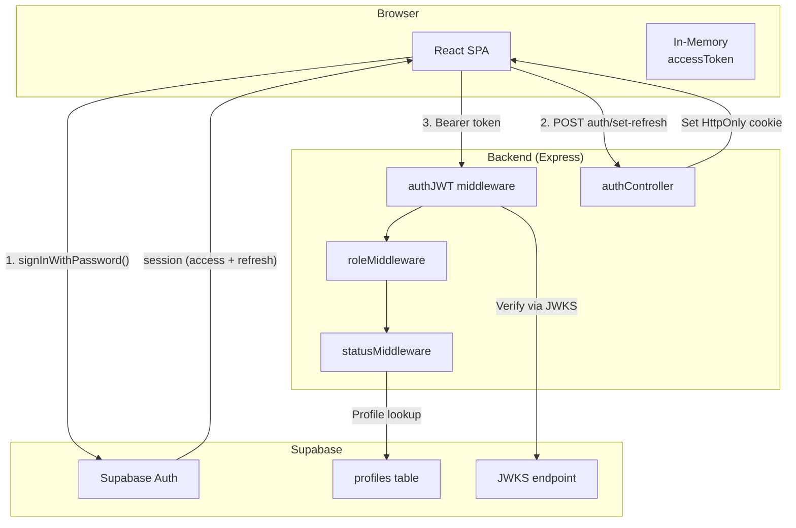
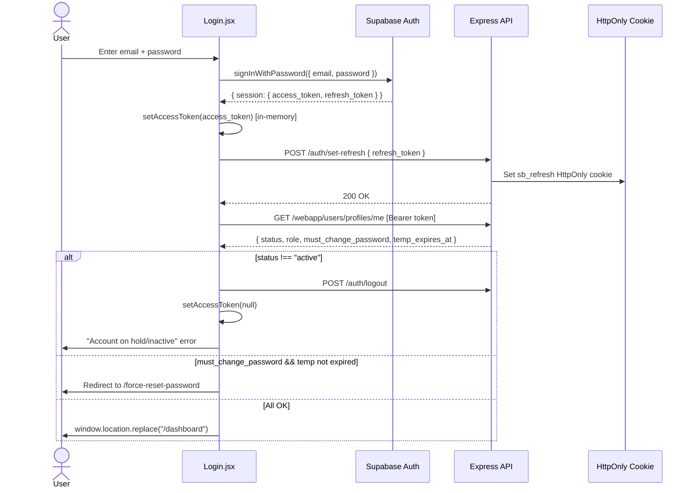
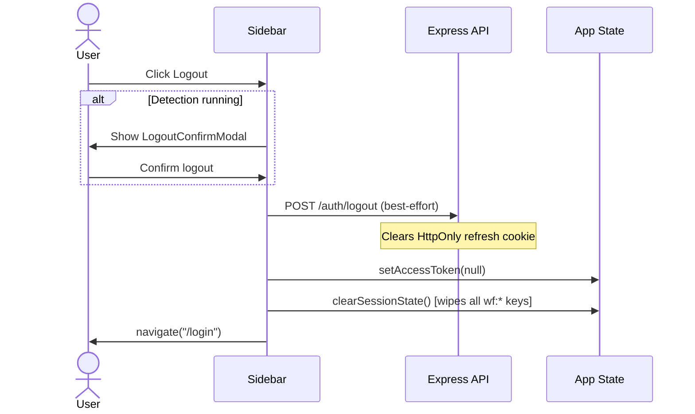
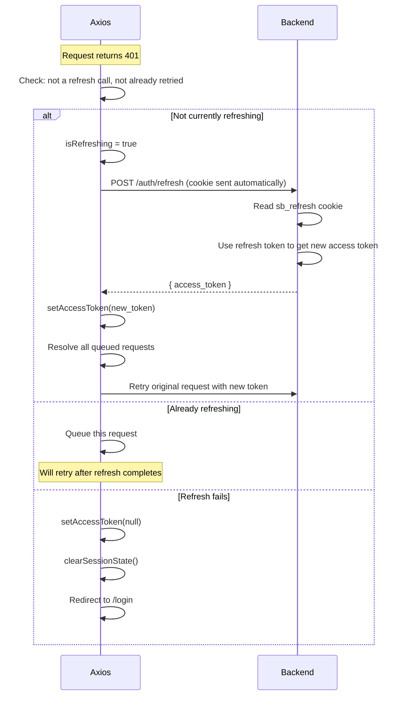
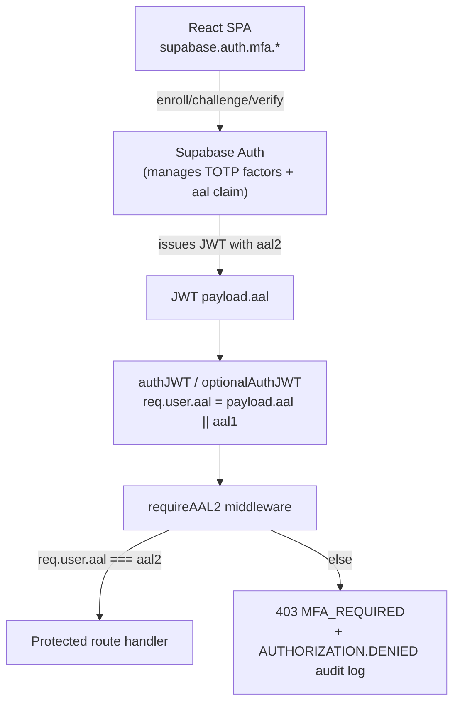

# Authentication & Authorization

> **Auth Provider:** Supabase Auth  
> **Token Strategy:** JWT access token (in-memory) + HttpOnly refresh cookie  
> **Authorization Model:** Role-based (admin / superadmin)

---

## 1. Authentication Architecture



---

## 2. Login Flow



---

## 3. Logout Flow



---

## 4. Token Lifecycle

### Access Token

| Property | Value |
|----------|-------|
| **Storage** | In-memory module variable (`src/api/axios.js`) |
| **Format** | JWT (from Supabase Auth) |
| **Lifetime** | Supabase default (~1 hour) |
| **Set on** | Login success, token refresh |
| **Cleared on** | Logout, refresh failure, manual `setAccessToken(null)` |
| **Attached** | Every request via Axios request interceptor (`Bearer {token}`) |

### Refresh Token

| Property | Value |
|----------|-------|
| **Storage** | HttpOnly cookie (`sb_refresh`) set by backend |
| **Format** | Opaque token from Supabase |
| **Lifetime** | Cookie expiry set by backend |
| **Set on** | Login → `POST /auth/set-refresh` |
| **Cleared on** | `POST /auth/logout` (backend clears cookie) |
| **Used by** | `POST /auth/refresh` endpoint (auto via 401 interceptor) |

### Token Refresh Flow



---

## 5. Session Lifecycle

### Session Bootstrap (on page load/refresh)

```
1. App.jsx mounts
2. Check: is current path public? (/login, /forgot-password, /reset-password, /)
   → YES: setAuthReady(true), skip refresh
   → NO: continue
3. POST /auth/refresh (HttpOnly cookie sent)
   → Success: setAccessToken(response.access_token), setAuthReady(true)
   → Failure: setAccessToken(null), setAuthReady(true)
4. Render routes based on !!getAccessToken()
```

### Session Termination

| Trigger | Actions |
|---------|---------|
| **Manual logout** | `POST /auth/logout` → `setAccessToken(null)` → `clearSessionState()` → navigate `/login` |
| **Token refresh failure** | `setAccessToken(null)` → `clearSessionState()` → redirect `/login` |
| **Tab close** | `sessionStorage` auto-clears (tab-scoped); access token lost (in-memory) |
| **Account deactivated** | Next API call → 401 → refresh fails → forced logout |

---

## 6. Route Protection

### Frontend Guards

| Guard | Mechanism | Scope |
|-------|-----------|-------|
| **Auth gate** | `!!getAccessToken()` in `App.jsx` | All `/*` routes |
| **Force-reset gate** | Separate auth check, no sidebar | `/force-reset-password` |
| **Role-based hiding** | `profile.role !== "superadmin"` | Sidebar hides Accounts & Audit |

### Backend Guards

| Middleware | File | Purpose |
|-----------|------|---------|
| `authJWT` | `middleware/authMiddleware.js` | Verifies JWT via Supabase JWKS |
| `requireSuperadmin` | `middleware/roleMiddleware.js` | Checks `profile.role === "superadmin"` |
| `requireActiveStatus` | `middleware/statusMiddleware.js` | Checks `profile.status === "active"` |

### Route-Level Protection Map

| Backend Route Group | Auth Required | AAL2 Required | Role Required |
|---------------------|:---:|:---:|:---:|
| `/api/auth` (login, set-refresh, refresh, logout, clear-force-reset) | ✗/✓* | ✗ | — |
| `/api/auth/mfa/sync-status` | ✓ | ✗ | — |
| `/api/auth/mfa/admin-unenroll/:id` | ✓ | ✓ | superadmin |
| `/api/webapp/users/profiles/me` (GET) | ✓ | ✗ | — |
| `/api/webapp` (all other routes, incl. `/users/*`) | ✓ | ✓ | varies |
| `/api/rasPi` | ✓ | ✓ | — |
| `/api/sam` | ✓ | ✓ | — |
| `/api/dashboard` | ✓ | ✓ | — |
| `/api/device` | ✓ | ✓ | — |
| `/api/device/scan-completed` | ✗ (shared-secret token) | ✗ | — |
| `/api/captivePortal` | ✓ | ✓ | — |
| `/api/detect` | ✓ | ✓ | — |
| `/api/history` | ✓ | ✓ | — |
| `/api/pi` | ✓ | ✓ | — |
| `/api/audit` | ✓ | ✓ | superadmin |
| `/health` | ✗ | ✗ | — |

\* `login`/`set-refresh`/`refresh` don't need a prior token; `logout`/
`clear-force-reset` do — see `routes/authRoutes.js`.

AAL2-exempt routes are the pre-MFA auth steps above, plus the MFA
enrollment endpoints themselves (`mfa/sync-status`) and `GET
/users/profiles/me` — the frontend needs to read `mfa_enrolled` at `aal1`
to know whether to redirect to `/mfa-setup` (see §11).

---

## 7. Authorization Model (RBAC)

### Roles

| Role | Description | Count |
|------|-------------|-------|
| `admin` | Standard user — full access to scanning, detection, device management | Default |
| `superadmin` | Administrative user — all admin permissions + user management + audit logs | Limited |

### Permission Matrix

| Feature | admin | superadmin |
|---------|:-----:|:----------:|
| Dashboard | ✓ | ✓ |
| Security Assessment | ✓ | ✓ |
| Device Management | ✓ | ✓ |
| Scan History | ✓ | ✓ |
| Profile | ✓ | ✓ |
| Accounts Management | ✗ | ✓ |
| Audit Logs | ✗ | ✓ |
| Audit Export (CSV) | ✗ | ✓ |
| Activate/Deactivate Users | ✗ | ✓ |
| Issue Temp Passwords | ✗ | ✓ |

### Account Statuses

| Status | Can Login | Description |
|--------|:---------:|-------------|
| `active` | ✓ | Normal access |
| `on_hold` | ✗ | Temporarily suspended |
| `inactive` | ✗ | Deactivated (may be anonymized) |

---

## 8. Password Policies

### Password Requirements (`src/passwordValidation.js`)

| Rule | Requirement |
|------|-------------|
| Minimum length | 8 characters |
| Uppercase | At least one (A-Z) |
| Numeric | At least one (0-9) |
| Special character | At least one (`!@#$%^&*(){}:";><,.?_-`) |

### Force Reset (AUTH-009)

| Aspect | Detail |
|--------|--------|
| **Trigger** | Superadmin issues temp password → sets `must_change_password = true` + `temp_expires_at` |
| **Behavior** | User must change password before accessing the app |
| **Expiry** | If `temp_expires_at` has passed, force-reset is skipped |
| **Clear** | `POST /auth/clear-force-reset` resets the flag after password change |

---

## 9. Supabase Client Configuration

**File:** `src/lib/supabaseClient.js`

```javascript
export const supabase = createClient(supabaseUrl, supabaseAnonKey, {
  auth: {
    persistSession: false,    // NO localStorage tokens
    autoRefreshToken: false,  // Backend handles refresh via HttpOnly cookie
    detectSessionInUrl: true, // Needed for password-reset / magic-link flows
  },
});
```

**Key Design:**
- **No browser token storage** — Supabase client is stateless by design
- **No auto-refresh** — The Express backend manages token lifecycle via cookies
- **URL detection** — Enabled for password reset flow (Supabase processes `#access_token=...` hash)

---

## 10. Security Design Decisions

| Decision | Rationale |
|----------|-----------|
| In-memory access token | Prevents XSS from reading tokens in `localStorage`/`sessionStorage` |
| HttpOnly refresh cookie | Cannot be accessed by JavaScript; CSRF mitigated by SameSite |
| No Supabase session persistence | Avoids storing tokens in browser storage |
| JWKS verification | Backend verifies JWTs against Supabase JWKS endpoint (no shared secret) |
| Status check on login | Prevents deactivated/on-hold users from accessing the app |
| Force-reset expiry check | Prevents users from being permanently trapped on force-reset page |

---

## 11. Multi-Factor Authentication (TOTP)

MFA is **mandatory for every account** (admin and superadmin alike) —
password-only auth was the weakest link in an otherwise hardened stack.
There is no opt-out and no "disable MFA" surface anywhere in the app.

### Architecture

MFA is implemented entirely via **Supabase Auth's native MFA API**
(`supabase.auth.mfa.*`) on the frontend. Supabase manages TOTP factors in
its own `auth.mfa_factors` table — the backend never generates, stores, or
verifies a TOTP secret/code itself. The enforcement signal is the JWT
**`aal` claim** (`aal1` = password only, `aal2` = password + verified MFA),
which Supabase adds to the access token once a verified factor exists for
a user.



### Backend enforcement

| Component | File | Role |
|-----------|------|------|
| `authJWT` / `optionalAuthJWT` | `middleware/authMiddleware.js` | Surfaces `payload.aal` (default `"aal1"`) onto `req.user.aal` |
| `requireAAL2` | `middleware/mfaMiddleware.js` | 403s with `{ error, code: "MFA_REQUIRED" }` unless `req.user.aal === "aal2"`; audit-logs `AUTHORIZATION.DENIED` (`reason: "aal_insufficient"`) on denial, mirroring `requireSuperadmin`'s pattern |
| `mfaController.syncStatus` | `controllers/mfaController.js` | `POST /api/auth/mfa/sync-status` — re-derives `profiles.mfa_enrolled` from `supabaseAdmin.auth.admin.mfa.listFactors()` (never trusts the client body alone); audit-logs `USER.MFA_ENROLLED`/`USER.MFA_UNENROLLED` |
| `mfaController.adminUnenroll` | `controllers/mfaController.js` | `POST /api/auth/mfa/admin-unenroll/:id` (superadmin + AAL2 only) — removes all TOTP factors via `supabaseAdmin.auth.admin.mfa.deleteFactor()`, sets `mfa_enrolled = false`, audit-logs `USER.MFA_RESET` |

`profiles.mfa_enrolled` (boolean, default `false`) is an **advisory** flag
only, used for fast UI checks (the forced-enrollment gate, the Profile
page badge, the Accounts table). It's kept in sync by the backend on
enroll/unenroll, but a stale flag can't bypass security — actual
enforcement is always the JWT `aal` claim, checked fresh on every request.

### Frontend flow

| Step | File | Behavior |
|------|------|----------|
| Login challenge | `pages/Login/Login.jsx`, `pages/Auth/MFAChallenge.jsx` | After password sign-in, checks `getAuthenticatorAssuranceLevel()`. If the account needs `aal2`, renders `MFAChallenge` (6-digit code, auto-submit, auto-retry on expired challenge) before continuing to the dashboard |
| Forced enrollment gate | `src/App.jsx` | During bootstrap, fetches `mfa_enrolled` (via the AAL2-exempt `GET /users/profiles/me`) and redirects any authenticated user without it to `/mfa-setup` — a persistent gate re-checked on every render, not just at login |
| Enrollment | `pages/Auth/MFASetup.jsx`, `components/auth/TotpQrDisplay.jsx` | QR code + manual-entry secret, 6-digit verify, "Start over"/"Retry" recovery. `mode="forced"` (standalone `/mfa-setup` page) and `mode="self-service"` (embedded in a Profile modal, replaces the existing factor) |
| Profile management | `pages/Profile/Profile.jsx` | "Two-Factor Authentication" card — Enabled badge + "Re-enroll (new device)", or a setup prompt if somehow not enrolled. No disable option |
| Superadmin recovery | `pages/AccountsAudit/AccountsAudit.jsx` | Per-row "Reset MFA" action (confirmation required) for any account — calls `admin-unenroll/:id` |

On every successful `verify()` (login challenge or enrollment), the
frontend immediately applies the new `aal2` session
(`setAccessToken` + `POST auth/set-refresh`) **before** making any other
backend call, so the very next request isn't bounced by `requireAAL2`.

### Recovery — always admin-assisted

Supabase TOTP has **no recovery codes**. If a user loses their
authenticator device, a superadmin must reset their MFA via the Accounts
table ("Reset MFA" action → `POST /api/auth/mfa/admin-unenroll/:id`),
which removes all factors and forces re-enrollment on the user's next
login.

**Break-glass procedure** (sole superadmin loses their device, no other
superadmin available to reset them): there is no UI for this case. The
factor must be removed manually via **Supabase Dashboard → Authentication
→ Users → select user → remove MFA factor**. Document-only, by design —
this is the one case where the Admin API path doesn't apply.

### Migration note for existing accounts

On first deploy, every existing account has `mfa_enrolled = false` and
gets forced through `/mfa-setup` on next login — there's no grace period,
since MFA is mandatory for everyone from day one of this feature.

---

## ⚠️ Needs Verification

- **Supabase JWT expiry**: Default Supabase access token expiry is ~1 hour; verify if custom expiry is configured
- **Cookie attributes**: Verify `SameSite`, `Secure`, `HttpOnly`, `Path`, and `Max-Age` attributes on the refresh cookie
- **CORS + cookies in production**: `CROSS_ORIGIN_COOKIES=true` must be set on Railway backend for cross-origin cookie flow
- **Multi-tab behavior**: Each tab has its own in-memory access token; verify that refresh cookie sharing across tabs works correctly
- **Supabase project MFA settings**: confirm TOTP MFA is enabled in Supabase Dashboard → Authentication → Providers → Multi-Factor Authentication ("Authenticator App" toggle ON) — `mfa.enroll()` fails at runtime regardless of code if this is off
- **`aal` claim presence**: confirm the issued JWT actually includes `aal` for this project (enroll a test factor, decode the resulting access token, check for `aal: "aal2"` after `mfa.verify()`) — Supabase only emits `aal` once any factor exists for the project/user
