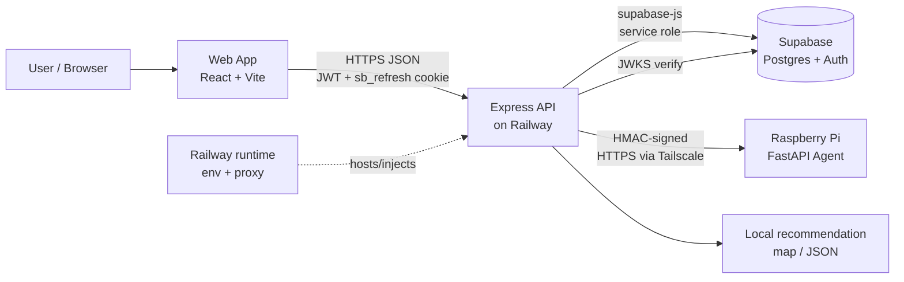
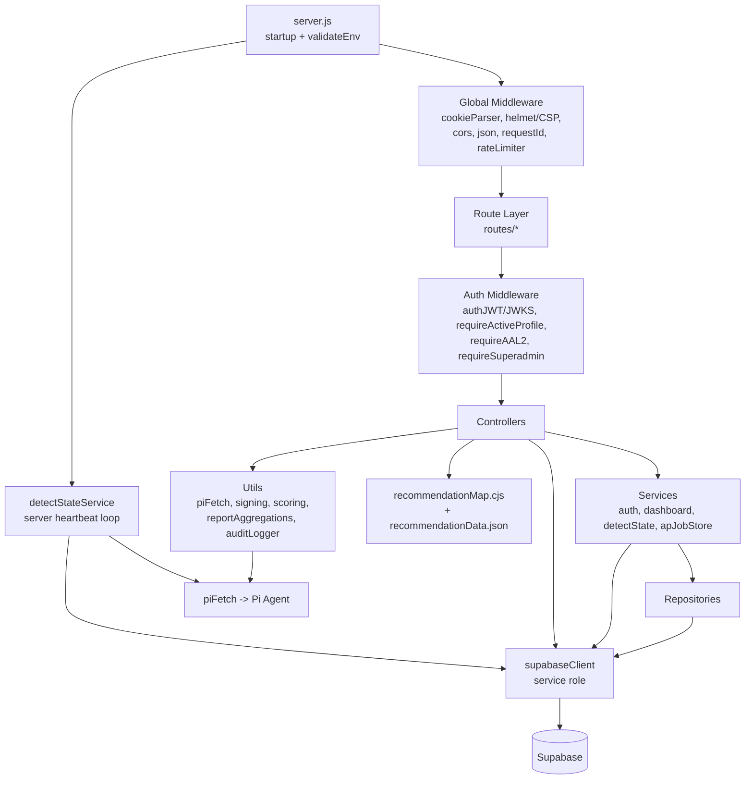
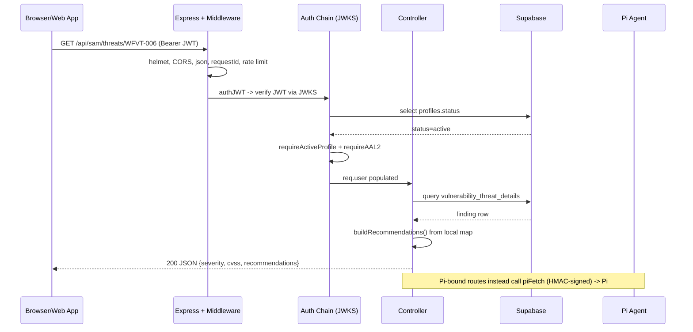
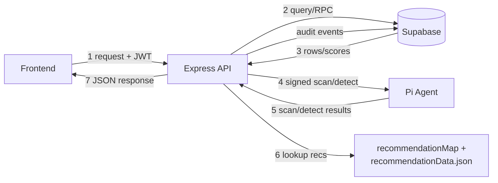

# Backend Architecture & Process Analysis — Why-PII?

> **Scope:** Read-only analysis of the Node.js/Express backend (`backend/`) for architectural diagramming and Chapter 4 / capstone documentation. No code was modified.
>
> **Legend:** Confirmed = read directly from code. **(Assumption)** = inferred, not proven in code. Secrets are redacted — only environment-variable *names* are shown.

---

## A. Backend architecture summary

The backend is a **Node.js / Express 5 API service** that sits between a React/Vite web app and two data planes: **Supabase (Postgres)** for persistence and auth-key verification, and a **Raspberry Pi FastAPI agent** for live Wi-Fi scanning/detection. It is the only component allowed to talk to the Pi — the browser never reaches the Pi directly. Every Pi call is HMAC-SHA256 signed. Deployed on **Railway** from `mico-testing-branch`. Layering is `routes/ → controllers/ → services/ + repositories/ → config/supabaseClient.js`, with pure logic in `utils/` and static reference data in `src/data/`.

Confirmed entry point: `backend/server.js` (`package.json` `main` + `start: node server.js`).

---

## B. Backend process inventory

| Process | Route(s) | Main files | Input | Responsibility | Output | External dep |
|---|---|---|---|---|---|---|
| Startup / env validation | — | `server.js`, `config/envValidation.js` | env vars | Fail-fast validation, dev/prod cross-wire guard, Express init, listen | running server | Railway env |
| Health probe | `GET /health` | `server.js` | none | Liveness, pre-middleware (no auth/rate limit) | `{status:'ok'}` | — |
| Pi smoke test | `GET /internal/pi-smoke` | `server.js`, `piFetch` | optional `INTERNAL_SMOKE_TOKEN` | Verify signing + Pi reachability | `{pi_reachable,...}` | Pi agent |
| Auth | `POST /api/auth/login,/refresh,/set-refresh,/logout,/clear-force-reset` | `routes/authRoutes.js`, `controllers/authController.js`, `services/authService.js`, `authRepository.js` | creds / refresh cookie | Login, refresh via `sb_refresh` HttpOnly cookie, logout | JWT + Set-Cookie | Supabase Auth |
| MFA enroll/recovery | `POST /api/auth/mfa/*` | `mfaRoutes.js`, `mfaController.js` | JWT + TOTP | MFA enrollment / sync (mfaLimiter) | MFA status | Supabase |
| SAM finding detail | `GET /api/sam/threats/:id`, `/vulnerabilities/:id` | `samRoutes.js`, `samController.js`, `recommendationMap.cjs` | vt_code or name | Lookup finding in DB, attach standards-based recs | finding + recommendations | Supabase + local data |
| Dashboard | `GET /api/dashboard/summary,/networks,...` | `dashboardRoutes.js`, `dashboardController.js`, `dashboardService.js`, `reportAggregations.js` | JWT | Aggregate scan/risk data, build reports | summary/report JSON | Supabase |
| RasPi scan/networks | `GET/POST /api/rasPi/*` | `rasPiRoutes.js`, `rasPiController.js` | JWT, scan params | Trigger scans, save/list network metadata | scan/network data | Pi + Supabase |
| Detection lifecycle | `GET/POST /api/detect/status,start,stop,heartbeat,poll` | `detectRoutes.js`, `detectController.js`, `detectStateService.js` | JWT | Manage detection state (optimistic-lock), poll Pi, persist threats | detection state/threats | Pi + Supabase |
| Server heartbeat loop | — (background) | `detectStateService.startServerHeartbeatLoop()` | timer (10s) | Pings Pi independent of browser; marks FAILED after 30s stale | DB state | Pi + Supabase |
| Captive portal | `GET/POST /api/captivePortal/*` | `captivePortalRoutes.js`, `captivePortalController.js` | JWT, network_id | Announcements, tips, risk classes, portal sync | portal JSON | Supabase (+Pi via patch) |
| Device management / AP | `POST/GET /api/device/*` | `deviceMgmtRoutes.js`, `apJobStore.js` | JWT | Enable AP, signal AP, job polling, portal update | AP state/job | Pi + Supabase |
| Pi proxy (raw) | `GET/POST /api/pi/*` | `piProxyRoutes.js`, `piProxyController.js` | JWT | Forward 6 Pi endpoints with signed headers | Pi response passthrough | Pi agent |
| History | `GET /api/history/vulnerabilities,/threats` | `historyRoutes.js`, `historyController.js` | JWT | User-scoped historical findings | history JSON | Supabase |
| Audit | `GET/POST /api/audit/logs,export,archive` | `auditRoutes.js`, `auditController.js`, `auditRepository.js`, `auditLogger.js` | JWT + superadmin | Read/export/archive audit log | audit JSON/export | Supabase |
| Metadata | `GET /api/webapp/network_metadata,/vulnerabilities_latest` | `webAppRoutes.js`, `metadataController.js` | JWT | Network metadata + latest vulns | metadata JSON | Supabase |
| User mgmt | `/api/webapp/users/*` (userRoutes) | `userRoutes.js`, `userController.js`, `userRepository.js` | JWT (+role) | Profile CRUD, activation | user JSON | Supabase |
| Device status proxy | `GET /api/device/status` | `server.js` inline + `piProxyController` | JWT | Pi device status passthrough | status JSON | Pi |
| Global error handler | all | `server.js` | thrown err | Strip details, return `{error,message}` only | safe error | — |

---

## C. Request-flow summary (normal lifecycle)

1. **Web app sends request** — `fetch`/axios with `Authorization: Bearer <JWT>`, `credentials: include` (refresh cookie).
2. **Express receives** — `trust proxy=1`, `x-powered-by` disabled. `/health` and `/internal/pi-smoke` short-circuit before middleware.
3. **Global middleware** — `cookieParser` → `helmet`+CSP → `cors` (env allowlist, credentials) → `express.json({limit:'100kb'})` → `requestIdMiddleware` → `globalLimiter` (300/15min/IP).
4. **Route mount** — matched under `/api/<area>`; router applies per-route chain `authJWT → requireActiveProfile → requireAAL2` (+ `requireSuperadmin` for audit, + validators).
5. **Auth chain** — `authJWT` verifies Supabase JWT via cached JWKS (P-256), loads `profiles.status`, rejects non-active; `requireActiveProfile` reuses stamp; `requireAAL2` requires `aal==='aal2'`.
6. **Controller → service/repo** — business logic, then Supabase (service-role client) and/or Pi via `piFetch` (HMAC-signed) and/or local `recommendationMap.cjs`.
7. **Response** — controller returns JSON; thrown errors hit global handler → generic `{error,message}`, no stack/detail leaked.

---

## D. External integration map

| System | Purpose | Direction | Protocol | Env var(s) |
|---|---|---|---|---|
| **Frontend / web app** | API consumer (React/Vite) | inbound | HTTPS/JSON + CORS + cookies | `ALLOWED_ORIGINS`, `CROSS_ORIGIN_COOKIES` |
| **Supabase** | Postgres data, Auth JWT verify (JWKS), RPC (`compute_scan_risk`) | backend → Supabase (service role); backend ← JWKS | HTTPS (supabase-js), JWKS over HTTPS | `SUPABASE_URL`, `SUPABASE_SERVICE_ROLE_KEY` |
| **Raspberry Pi / FastAPI agent** | Wi-Fi scan, detect, AP/portal control | backend → Pi (signed) | HTTPS/JSON over Tailscale Funnel **(assumption: Tailscale)**, HMAC headers | `PI_BASE_URL` (fallback `FASTAPI_BASE_URL`), `CONTROL_SIGNING_SECRET`, `PI_SIGNING_OPTIONAL` |
| **Railway** | Hosting/runtime, reverse proxy, env injection | hosts backend | container/HTTP | `PORT`, `RAILWAY_PUBLIC_DOMAIN`, `RAILWAY_GIT_BRANCH` |
| Internal smoke caller | deploy verification | inbound | HTTPS bearer | `INTERNAL_SMOKE_TOKEN` |

Other env: `NODE_ENV`, `APP_ENV`, `DATABASE_URL` (cross-wire check only).

---

## E. Security-relevant architecture notes

- **CORS** — env allowlist (`ALLOWED_ORIGINS`, comma-split), dev fallback `http://localhost:5173`; `credentials:true`; rejects unknown origins → `403 CORS_REJECTED`.
- **Cookies** — refresh token in `sb_refresh` **HttpOnly** cookie; `CROSS_ORIGIN_COOKIES=true` switches to cross-origin mode **(assumption: SameSite=None;Secure — set in `authController.refreshCookieOpts()`, not fully read)**; cleared scoped to `/api/auth`. JWT itself is in-memory only (per CLAUDE.md, not persisted).
- **Internal tokens** — `INTERNAL_SMOKE_TOKEN` gates `/internal/pi-smoke` in prod (open in dev when unset).
- **Request signing (Pi)** — HMAC-SHA256 in `signing.js`+`piFetch.js`. Canonical: `METHOD\nPATH_WITH_QUERY\nTIMESTAMP\nNONCE\nBODY_SHA256`; headers `X-Control-Timestamp/Nonce/Body-SHA256/Signature`; 16-byte hex nonce. Signing mandatory in prod; dev skips only if `PI_SIGNING_OPTIONAL=true`. Never silently unsigned in prod (throws).
- **Env validation** — `validateEnv()` runs before Express; requires `SUPABASE_URL`+`SUPABASE_SERVICE_ROLE_KEY` always, plus `ALLOWED_ORIGINS/PI_BASE_URL/CONTROL_SIGNING_SECRET` in prod; blocks dev/prod DB cross-wire; restricts prod branches to `main/security/mar15-async`; `process.exit(1)` on failure.
- **Secret handling** — secrets read from env only; `maskUrl()` masks logged URLs; `piFetch` never logs signature/secret; global error handler returns generic messages.
- **Backend↔Pi** — all via `piFetch` (single choke point); 10s timeout via AbortController; network/timeout wrapped to 504 `pi_unreachable`.
- **Security headers** — Helmet active: CSP (`default/script/style-src 'self'`, `styleSrcAttr 'unsafe-inline'`, env-driven `connectSrc`), HSTS in prod only, `x-powered-by` disabled.
- **AuthN/Z** — JWKS JWT verify (no shared JWT secret); per-request `profiles.status==='active'`; AAL2 (MFA) on sensitive routes; `requireSuperadmin` writes `AUTHORIZATION.DENIED` audit events.
- **Rate limiting** — in-memory (per-IP, `trust proxy=1`): global 300, login 10, refresh 30, MFA 20 / 15min. **Known limit: not multi-instance safe, resets on restart.**

---

## F. Diagram-ready component list

- User / Browser
- Web app / Frontend (React/Vite)
- Backend / API service (Express 5 on Railway)
- Express middleware layer (cookieParser, helmet/CSP, CORS, json, requestId, rate limiter)
- Auth middleware (authJWT/JWKS, requireActiveProfile, requireAAL2, requireSuperadmin)
- Route layer (`routes/*`)
- Controller layer (`controllers/*`)
- Service layer (`services/*`: authService, dashboardService, detectStateService, apJobStore)
- Repository layer (`repositories/*`)
- Utility/helper layer (`utils/*`: piFetch, signing, scoring, riskPipeline, reportAggregations, auditLogger)
- Backend-local data modules (`backend/src/data/recommendationMap.cjs` + `backend/src/data/recommendationData.json`)
- Supabase client (`config/supabaseClient.js`, service role, resilient fetch)
- Supabase (Postgres + Auth/JWKS + RPC)
- Raspberry Pi / FastAPI agent (via Tailscale)
- Background server heartbeat loop
- Railway hosting/runtime
- Environment variables / secrets

---

## G. Mermaid diagrams

### 1. High-level architecture

### 2. Backend component diagram

### 3. Request sequence (typical web-app API request)

### 4. Data-flow view

---

## H. Chapter 4 / capstone explanation draft

The backend of the Why-PII? Wi-Fi security assessment system is implemented as a stateless Node.js service built on the Express 5 framework and deployed on the Railway platform from the `mico-testing-branch`. It functions as the central mediator of the architecture, exposing a versioned REST API to the React/Vite web client while brokering all communication with two external data planes: a Supabase-hosted PostgreSQL database and a Raspberry Pi field probe running a FastAPI agent. A deliberate architectural constraint dictates that the browser never communicates with the Raspberry Pi directly; instead, every command destined for the probe is relayed through the backend, which cryptographically signs each request using an HMAC-SHA256 scheme over a canonical representation of the method, path, timestamp, nonce, and body digest.

The service follows a strict layered architecture in which incoming HTTP requests traverse a route layer, an authentication and authorization chain, a controller layer, and finally service, repository, and utility layers before reaching the persistence boundary. Cross-cutting concerns are enforced through a global middleware stack comprising security headers (Helmet with a Content-Security-Policy), an environment-driven CORS allowlist, JSON body-size limiting, request correlation identifiers, and per-IP rate limiting. Authentication is performed by verifying Supabase-issued JSON Web Tokens against a remotely fetched JSON Web Key Set, after which each request is further checked for an active account status and, on sensitive endpoints, for an elevated authentication assurance level corresponding to multi-factor authentication.

Persistence is mediated exclusively through the Supabase JavaScript SDK using a service-role credential, wrapped in a resilient fetch layer that transparently retries transient transport failures. Domain logic that is purely computational—risk bucketization, report aggregation, and the mapping of detected findings to standards-based remediation recommendations—is isolated in independently testable utility and data modules. A server-side heartbeat loop, initiated at startup and independent of any browser session, continuously polls the Raspberry Pi to maintain detection state, ensuring threat monitoring persists even when no client is connected. The system enforces a fail-fast configuration policy: a startup validation routine verifies the presence of required environment variables and guards against deploying production code against non-production databases before the Express application is permitted to initialize. Collectively, these characteristics establish clear process boundaries—client, API/runtime, database, and field-probe—that delineate the system's trust zones and inform its architectural and data-flow diagrams.

---

## I. Files inspected

| File | Contribution |
|---|---|
| `server.js` | Entry point: env validation call, middleware stack, route mounts, health/smoke endpoints, error handler, startup + heartbeat init |
| `config/envValidation.js` | Fail-fast env validation, dev/prod cross-wire + branch guard |
| `config/supabaseClient.js` | Service-role Supabase client, resilient retrying fetch, null-UUID debug wrapper |
| `utils/piFetch.js` | Single choke point for Pi calls; query/body handling, signing enforcement, timeout, error wrapping |
| `utils/signing.js` | HMAC-SHA256 canonical string + `X-Control-*` header builder |
| `utils/reportAggregations.js` | Pure report-shaping (risk tables, findings buckets, remediation plan) |
| `middleware/authMiddleware.js` | JWKS JWT verify + per-request profile status enforcement |
| `middleware/roleMiddleware.js` | Superadmin gate + AUTHORIZATION.DENIED audit side effect |
| `middleware/statusMiddleware.js` | Active-profile defense-in-depth |
| `middleware/mfaMiddleware.js` | AAL2 enforcement |
| `middleware/rateLimiter.js` | In-memory per-IP limiters (global/login/refresh/mfa) |
| `routes/samRoutes.js` + `controllers/samController.js` | SAM finding-detail endpoints + recommendation assembly |
| `backend/src/data/recommendationMap.cjs` | Backend-local CJS view of finding→recommendation map + helpers |
| `src/data/recommendationData.json` | Static SOURCES + RECOMMENDATION_MAP data (referenced, head not opened) |
| `controllers/piProxyController.js` | Raw signed proxy to the 6 Pi endpoints |
| `services/detectStateService.js` | Detection state (optimistic lock) + server heartbeat loop |
| `routes/*` | Full route→middleware→controller map across all areas |
| `controllers/authController.js` | `sb_refresh` HttpOnly cookie set/clear, cross-origin mode |
| `package.json` | Dependencies (express 5, supabase-js, jose, helmet, cors, express-rate-limit), scripts, entry point |

### Assumptions & unknowns

- **Tailscale**: `PI_BASE_URL` is a configurable URL; Tailscale Funnel is per project context/CLAUDE.md, not literally in code read.
- **Cookie SameSite/Secure flags**: `refreshCookieOpts()` exists in `authController.js` (grep only); exact `SameSite=None;Secure` switch not line-verified.
- `recommendationData.json` contents not opened (large data file); structure inferred from consumers.
- Internals of `dashboardController/Service`, `rasPiController`, `deviceMgmtRoutes` handlers read only at signature/route level, not full bodies.
