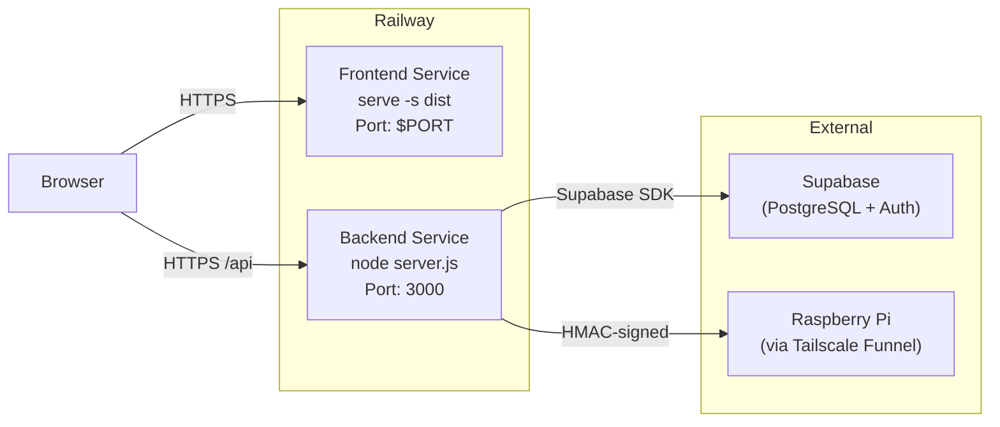
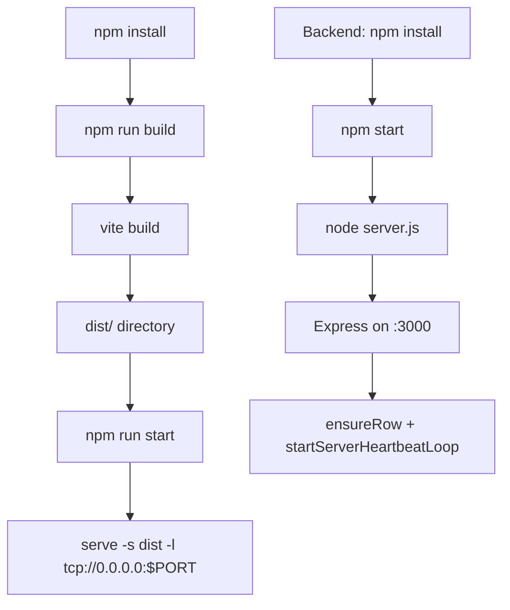

# Build, Deployment & Runtime

> **Package Manager:** npm  
> **Build Tool:** Vite 7  
> **Hosting:** Railway (frontend + backend as separate services)

---

## 1. Build Process

### Frontend Build

| Command | Script | Description |
|---------|--------|-------------|
| `npm run dev` | `vite` | Start Vite dev server on `:5173` |
| `npm run build` | `vite build` | Production build → `dist/` |
| `npm run preview` | `vite preview` | Preview production build locally |
| `npm run start` | `serve -s dist -l tcp://0.0.0.0:$PORT` | Serve production build (Railway) |
| `npm run lint` | `eslint .` | Run ESLint checks |

### Backend Build

| Command | Script | Description |
|---------|--------|-------------|
| `npm start` | `node server.js` | Start Express server |
| `npm run start:dev` | `APP_ENV=development node server.js` | Dev mode |
| `npm run start:prod` | `APP_ENV=production node server.js` | Production mode |
| `npm test` | `jest --config jest.config.js` | Run all tests |
| `npm run test:unit` | `jest --testPathPattern=unit` | Unit tests only |
| `npm run test:integration` | `jest --testPathPattern=integration` | Integration tests only |
| `npm run test:coverage` | `jest --coverage` | Tests with coverage report |

### E2E Tests

| Command | Script | Description |
|---------|--------|-------------|
| `npm run test:e2e` | `npx playwright test` | Headless E2E tests |
| `npm run test:e2e:headed` | `npx playwright test --headed` | Headed E2E tests |
| `npm run test:e2e:ui` | `npx playwright test --ui` | Playwright UI mode |

---

## 2. Vite Configuration

**File:** `vite.config.js`

```javascript
export default defineConfig({
  plugins: [react()],
  cacheDir: ".vite-cache",  // Avoid node_modules/.vite lock on Railway
  preview: {
    host: true,
    allowedHosts: "all",    // Railway uses dynamic subdomains
  },
  server: {
    proxy: {
      "/api": {
        target: "http://localhost:3000",
        changeOrigin: true,
      },
    },
  },
});
```

| Setting | Purpose |
|---------|---------|
| `cacheDir: ".vite-cache"` | Prevents Railway build issues with `node_modules/.vite` lock |
| `allowedHosts: "all"` | Railway dynamic subdomain support |
| `proxy /api` | Dev server forwards `/api/*` to Express on `:3000` |

---

## 3. Environment Variables

### Frontend (Vite — must start with `VITE_`)

| Variable | Required | Description | Example |
|----------|:--------:|-------------|---------|
| `VITE_API_BASE_URL` | Production only | Full URL of backend API service | `https://api-production.up.railway.app/api` |
| `VITE_SUPABASE_URL` | ✓ | Supabase project URL | `https://PROJECT.supabase.co` |
| `VITE_SUPABASE_ANON_KEY` | ✓ | Supabase anonymous key | `eyJ...` |

**Source:** `.env.example` (frontend root)

### Backend

| Variable | Required | Description |
|----------|:--------:|-------------|
| `PORT` | ✗ (default: 3000) | Express server port |
| `SUPABASE_URL` | ✓ | Supabase project URL |
| `SUPABASE_SERVICE_ROLE_KEY` | ✓ | Supabase service role key |
| `SUPABASE_JWT_SECRET` | ✓ | JWT verification secret |
| `ALLOWED_ORIGINS` | ✓ (prod) | CORS allowed origins (comma-separated) |
| `CROSS_ORIGIN_COOKIES` | ✓ (prod) | Enable SameSite=None for cross-origin cookies |
| `APP_ENV` | ✗ | `development` or `production` |
| `NODE_ENV` | ✗ | Node environment |
| `RAILWAY_PUBLIC_DOMAIN` | Auto (Railway) | Auto-set by Railway for CSP |
| `CONTROL_SIGNING_SECRET` | ✓ | HMAC secret for Pi command signing |
| `PI_BASE_URL` | ✓ | Raspberry Pi Tailscale Funnel URL |
| `INTERNAL_SMOKE_TOKEN` | ✗ | Bearer token for `/internal/pi-smoke` |

**Source:** `backend/.env.example`

> **⚠️ SECURITY:** Never commit `.env` files. The `.gitignore` blocks `.env` and `.env.*` at all depths (except `.env.example` and `.env.production.example`).

---

## 4. Deployment Architecture



### Railway Service Configuration

| Service | Start Command | Port | Notes |
|---------|--------------|------|-------|
| Frontend | `npm run start` → `serve -s dist -l tcp://0.0.0.0:$PORT` | Dynamic (`$PORT`) | Static file server |
| Backend | `npm start` → `node server.js` | 3000 (or `$PORT`) | Express API |

### Railway Settings

| Setting | Value | Purpose |
|---------|-------|---------|
| `trust proxy` | `1` | Correct IP detection behind Railway proxy |
| `x-powered-by` | Disabled | Hide Express fingerprint |
| Health check | `GET /health` → `{ status: "ok" }` | Railway uptime monitoring |

---

## 5. Production Build Pipeline



---

## 6. ESLint Configuration

**File:** `eslint.config.js`

| Setting | Value |
|---------|-------|
| ECMAScript version | 2020 |
| Source type | ES Module |
| JSX | Enabled |
| Extends | `js.configs.recommended`, `reactHooks.flat.recommended`, `reactRefresh.configs.vite` |
| Custom rules | `no-unused-vars` ignores vars starting with uppercase or underscore |
| Ignored dirs | `dist/` |

---

## 7. Playwright E2E Configuration

**File:** `playwright.config.js`

| Setting | Value |
|---------|-------|
| Test directory | `./e2e` |
| Timeout | 30 seconds |
| Base URL | `http://localhost:5173` |
| Browser | Chromium only |
| Headless | `true` |
| Screenshots | Only on failure |
| Traces | Retain on failure |

### Web Servers (auto-started)

| Server | Command | Port | Timeout |
|--------|---------|------|---------|
| Backend | `cd backend && node server.js` | 3000 | 15s |
| Frontend | `npm run dev` | 5173 | 15s |

---

## 8. Backend Server Startup

**File:** `backend/server.js`

### Startup Sequence

1. Load `.env` via `dotenv`
2. Validate environment (`envValidation.js`) — fail fast on missing vars
3. Configure Express: `trust proxy`, disable `x-powered-by`
4. Mount health check (`/health`) — before any middleware
5. Mount Pi smoke test (`/internal/pi-smoke`)
6. Apply middleware: `cookieParser`, `helmet`, `cors`, `express.json`, `requestId`, `rateLimiter`
7. Mount route groups (12 route files)
8. Mount global error handler
9. Start listening on `$PORT` or 3000
10. `detectStateService.ensureRow()` — ensure detection state DB row
11. `detectStateService.startServerHeartbeatLoop()` — background heartbeat

### Port Conflict Resolution

If port is busy (`EADDRINUSE`), the server:
1. Auto-kills the stale process via `netstat` + `taskkill` (Windows)
2. Retries once after 1 second
3. Fails if still blocked

---

## 9. Security Middleware Stack

| Order | Middleware | Purpose |
|:---:|-----------|---------|
| 1 | Health check | Before everything — never blocked |
| 2 | `cookieParser` | Parse cookies for auth |
| 3 | `helmet` | Security headers + CSP |
| 4 | `cors` | Origin whitelist |
| 5 | `express.json({ limit: '100kb' })` | Body parsing with size limit |
| 6 | `requestIdMiddleware` | Attach unique request ID |
| 7 | `globalLimiter` | Rate limiting |
| 8 | Route-specific auth | `authJWT`, `requireSuperadmin`, etc. |
| 9 | Global error handler | Catch-all, no stack traces leaked |

---

## 10. CI/CD

> **⚠️ Needs Verification:** No CI/CD configuration files (GitHub Actions, Railway Procfile, Dockerfile) were found in the repository root. Railway likely uses auto-deploy from a Git branch.

| Aspect | Status |
|--------|--------|
| CI pipeline config | Not found in repository |
| Docker support | Not found |
| Procfile | Not found |
| Build command config | Likely configured in Railway dashboard |
| Auto-deploy | Needs Verification — likely Git push to Railway |

---

## ⚠️ Needs Verification

- **Railway build settings**: Build and start commands are likely configured in the Railway dashboard, not in repository files
- **Node.js version**: No `.nvmrc` or `engines` field in `package.json` — Railway may use a default Node version
- **Production URL**: The Railway public domain for both services is environment-specific
- **Docker**: No Dockerfile exists — verify if Railway uses Nixpacks or buildpacks
- **Branch strategy**: Verify which branch triggers auto-deploy on Railway
