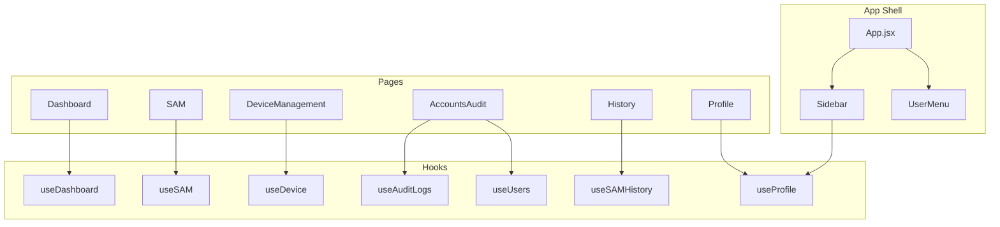

# Component Reference

> **Component Root:** `src/components/`  
> **Naming Convention:** PascalCase directories and files  
> **Styling:** Co-located CSS files per component

---

## 1. Component Inventory

### Common Components

| Component | Path | Purpose | Props | Used By |
|-----------|------|---------|-------|---------|
| `ErrorBoundary` | `components/common/ErrorBoundary.jsx` | Catches render errors in child tree | `children` | `DeviceManagement` |
| `BaseModal` | `components/common/Modal/BaseModal.jsx` | Reusable modal overlay | `isOpen`, `onClose`, `children` | Various modals |
| `Pagination` | `components/common/Pagination/Pagination.jsx` | Page navigation controls | `page`, `totalPages`, `onPageChange` | Tables |
| `Tabs` | `components/common/Tabs/Tabs.jsx` | Tab switching component | `tabs`, `activeTab`, `onTabChange` | `AccountsAudit`, `History` |
| `UserMenu` | `components/common/UserMenu/UserMenu.jsx` | Floating user dropdown (top-right) | None (uses `useProfile` hook) | `App.jsx` |

### Dashboard Components

| Component | Path | Purpose | Props | Used By |
|-----------|------|---------|-------|---------|
| `DashboardHeader` | `components/dashboard/DashboardHeader.jsx` | View mode toggle + dropdowns | `viewMode`, `setViewMode`, `isSummary`, `networks`, `scanList`, `selectedScanId`, `onScanChange` | `Dashboard` |
| `LegendForScore` | `components/dashboard/LegendForScore.jsx` | Risk score legend/key | `showLegend`, `toggleLegend` | `SummarySection`, `NetworkSection` |
| `SummarySection` | `components/dashboard/SummarySection.jsx` | Aggregated dashboard view | `showLegend`, `toggleLegend`, `data`, `hoverContext`, `setHoverContext`, `clearHoverContext` | `Dashboard` |
| `NetworkSection` | `components/dashboard/NetworkSection.jsx` | Per-network dashboard view | `showLegend`, `toggleLegend`, `data`, `hoverContext`, `setHoverContext`, `clearHoverContext` | `Dashboard` |

### SAM Components

| Component | Path | Purpose | Props | Used By |
|-----------|------|---------|-------|---------|
| `SAMSidebar` | `components/sam/SAMSidebar.jsx` | Network selection + scan controls | Network selection, scan trigger, detection controls | `SAM` |
| `VulnerabilitiesTable` | `components/sam/VulnerabilitiesTable.jsx` | Vulnerability listing with filters | Vulnerability data, severity controls, pagination | `SAM` |
| `ThreatsTable` | `components/sam/ThreatsTable.jsx` | Threat listing with session details | Threat data, detection status | `SAM` |
| `ThreatDetail` | `components/sam/ThreatDetail.jsx` | Finding detail panel | Finding data, recommendations | `SAM` |
| `ExportDropdown` | `components/sam/ExportDropdown.jsx` | PDF report export menu | Export handlers, report data | `SAM` |

### Device Components

| Component | Path | Purpose | Props | Used By |
|-----------|------|---------|-------|---------|
| `AccessPointPanel` | `components/device/AccessPointPanel.jsx` | AP control panel | AP state, toggle handler, job status, error states | `DeviceManagement` |

### Accounts Components

| Component | Path | Purpose | Props | Used By |
|-----------|------|---------|-------|---------|
| `AccountsTable` | `components/accounts/AccountsTable.jsx` | User listing table | `users`, `onEdit` | `AccountsAudit` |
| `AuditLogsTable` | `components/accounts/AuditLogsTable.jsx` | Paginated audit log viewer | Audit log data, filters, pagination, export | `AccountsAudit` |
| `UserForm` | `components/accounts/UserForm.jsx` | User editing form | User data, save/cancel handlers | `AccountsAudit` |

### History Components

| Component | Path | Purpose | Props | Used By |
|-----------|------|---------|-------|---------|
| `ScanDetailsDrawer` | `components/history/ScanDetailsDrawer.jsx` | Slide-out scan detail panel | Scan data, open/close state | `History` |
| `ThreatHistoryTable` | `components/history/ThreatHistoryTable.jsx` | Historical threat data table | Threat history data | `History` |
| `VulnerabilityHistoryTable` | `components/history/VulnerabilityHistoryTable.jsx` | Historical vulnerability table | Vulnerability history data | `History` |

### Profile Components

| Component | Path | Purpose | Props | Used By |
|-----------|------|---------|-------|---------|
| `ProfileModal` | `components/profile/ProfileModal.jsx` | Password change modal | `isOpen`, `onClose` | `Profile` |

### Modal Components

| Component | Path | Purpose | Used By |
|-----------|------|---------|---------|
| `AccountsAuditModal` | `components/modals/AccountsAuditModal/` | Account action confirmations | `AccountsAudit` |
| `FindingDetailModal` | `components/modals/FindingDetailModal/` | Vulnerability/threat detail view | `SAM` |
| `LogoutConfirmModal` | `components/modals/LogoutConfirmModal/` | Logout confirmation (warns if detection running) | `Sidebar` |
| `RawEvidenceModal` | `components/modals/RawEvidenceModal/` | Raw evidence/payload viewer | `SAM` |
| `ScanConfirmModal` | `components/modals/ScanConfirmModal/` | Scan initiation confirmation | `SAM` |
| `StopDetectionModal` | `components/modals/StopDetectionModal/` | Stop detection with reason code | `SAM` |

### Layout Components

| Component | Path | Purpose | Used By |
|-----------|------|---------|---------|
| `Sidebar` | `layouts/Sidebar.jsx` | Main navigation (desktop + mobile) | `App.jsx` |

### Auth Page Components

| Component | Path | Purpose | Used By |
|-----------|------|---------|---------|
| `PasswordChecklist` | `pages/Auth/PasswordChecklist.jsx` | Live password strength indicator | `ResetPassword`, `ForceResetPassword` |

---

## 2. Component Architecture Patterns

### Pattern: Hook-Driven Pages

Pages are thin orchestrators that delegate to hooks and compose sub-components:

```jsx
// Typical page pattern (Dashboard.jsx)
const Dashboard = () => {
  const { viewMode, setViewMode, loading, error, summary, networkData, ... } = useDashboard();
  
  return (
    <div className="dashboard">
      <DashboardHeader viewMode={viewMode} setViewMode={setViewMode} ... />
      {loading && <p>Loading...</p>}
      {error && <p className="error-text">{error}</p>}
      {!loading && !error && (
        isSummary ? <SummarySection data={summary} ... /> : <NetworkSection data={networkData} ... />
      )}
    </div>
  );
};
```

### Pattern: Context Consumers

Components read shared state via context hooks:

```jsx
// Sidebar reads threat detection state
const { detectionStatus, displayThreats, lastUpdated, activeNetwork } = useThreatDetectionContext();
```

### Pattern: Co-located Styles

Each component typically has a co-located CSS file:

```
ComponentDir/
├── Component.jsx
└── Component.css
```

---

## 3. Key Component Details

### Sidebar (`src/layouts/Sidebar.jsx`)

**Responsibilities:**
- Desktop sidebar navigation (fixed 186px width)
- Mobile hamburger menu with slide-out drawer
- SAM detection status indicator (green/blue/red dots + threat count badge)
- Role-based menu item filtering (superadmin-only items)
- Logout flow with confirmation modal

**Key State:**
- `isOpen` — mobile drawer toggle
- `showLogoutModal` — logout confirmation
- `profile` — from `useProfile()` hook
- Detection state — from `useThreatDetectionContext()`

**Detection Indicator Logic:**
- `DETECTING` → green dot + threat count badge
- `SCANNING` → blue pulsing dot
- `FAILED` → red dot

---

### UserMenu (`src/components/common/UserMenu/UserMenu.jsx`)

**Responsibilities:**
- Floating dropdown in top-right of main content area
- Shows user name and role
- Profile and Logout quick actions
- Closes on outside click

**Pattern:** Uses `useRef` + `mousedown` event listener for click-outside detection.

---

### AccessPointPanel (`src/components/device/AccessPointPanel.jsx`)

**Responsibilities:**
- AP enable/disable toggle with password input
- Async job progress visualization (ACCEPTED → polling → DONE/FAILED)
- Live AP state confirmation polling
- Error state display with scan-specific error codes
- Portal update trigger

**Size:** 13,066 bytes — the most complex single component.

---

### AuditLogsTable (`src/components/accounts/AuditLogsTable.jsx`)

**Responsibilities:**
- Paginated table with server-side pagination
- Search with 300ms debounce
- Status filter (SUCCESS/FAILED)
- Date range filter
- CSV export with rate limiting (5s cooldown)
- Export modal for date selection

**Size:** 19,073 bytes

---

## 4. Component Dependency Map



---

## ⚠️ Needs Verification

- **Modal component structure**: Each modal subdirectory likely contains a `.jsx` and `.css` file, but internal props were not fully inspected for all modals
- **Chart library usage**: `SummarySection` and `NetworkSection` use Recharts (3.6.0) for data visualization — specific chart types need verification
- **UserForm complexity**: At 13,831 bytes, the UserForm handles activate-with-temp, deactivate, and reactivate flows — full prop interface needs verification
