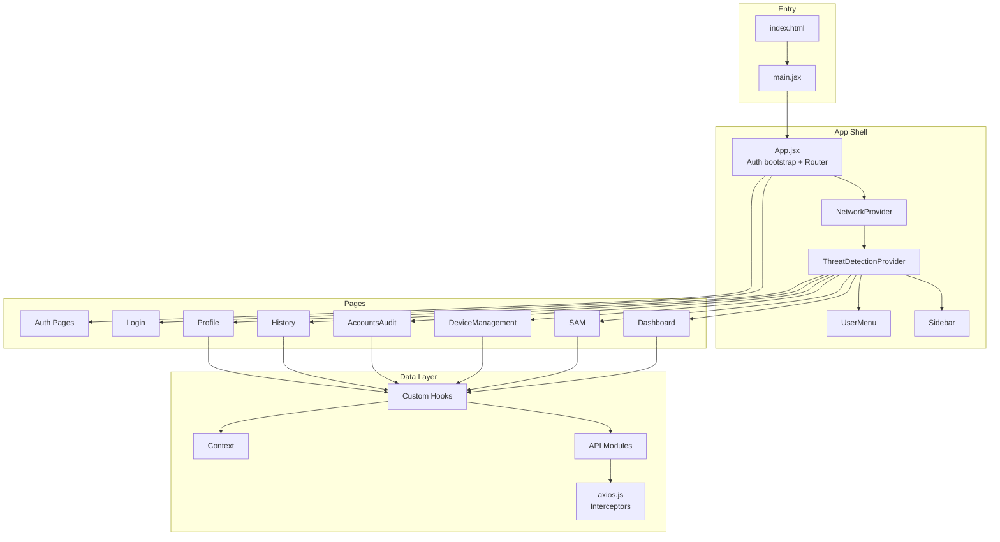
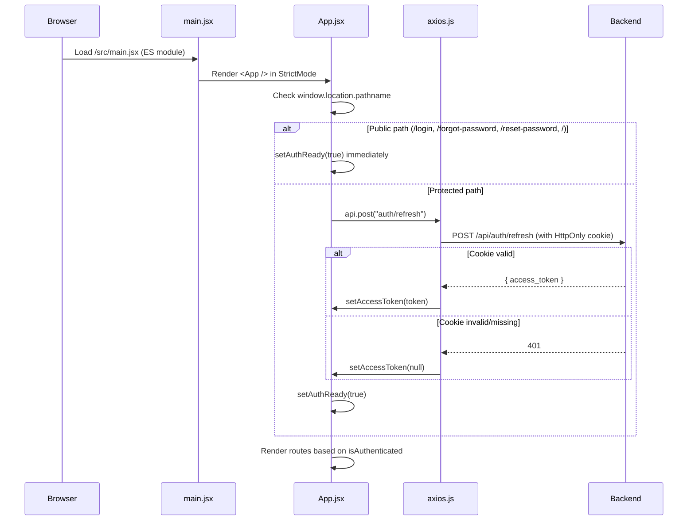
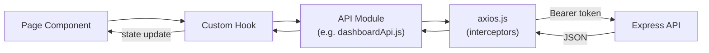
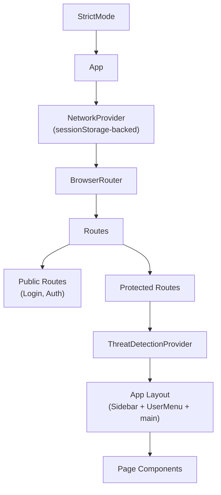

# Frontend Architecture

> **Source of Truth:** `src/` directory  
> **Framework:** React 19 + Vite 7 + React Router 7  
> **Rendering Strategy:** Client-Side SPA (Single Page Application)

---

## 1. Architecture Overview

Why-PII? follows a **hook-driven, service-layer architecture** where:

- **Pages** are thin route-level components that compose hooks and sub-components
- **Hooks** encapsulate all data fetching, state management, and business logic
- **API modules** provide typed service functions wrapping the shared Axios instance
- **Context providers** share global state (network selection, threat detection)
- **Components** are pure presentation, receiving data and callbacks via props



---

## 2. Folder Structure

```
src/
├── api/                          # API Service Layer
│   ├── axios.js                  # Shared Axios instance, interceptors, token management
│   ├── authApi.js                # Login, logout endpoints
│   ├── auditApi.js               # Audit log retrieval and CSV export
│   ├── dashboardApi.js           # Dashboard summary, per-network, networks list
│   ├── detectApi.js              # Threat detection lifecycle (start/stop/poll/status)
│   ├── deviceApi.js              # AP toggle, portal management, network state
│   ├── rasPiApi.js               # Network listing, scan triggers, AP signal
│   ├── samApi.js                 # Threats, vulnerabilities, details
│   ├── samHistoryApi.js          # Vulnerability/threat history
│   └── userApi.js                # User CRUD, activate, deactivate, reactivate, adminUnenrollMfa
│
├── components/                   # Reusable UI Components
│   ├── accounts/                 # AccountsTable, AuditLogsTable, UserForm
│   ├── auth/                     # TotpQrDisplay (MFA enrollment QR + manual-entry secret)
│   ├── common/                   # ErrorBoundary, BaseModal, Pagination, Tabs, UserMenu
│   ├── dashboard/                # DashboardHeader, LegendForScore, NetworkSection, SummarySection
│   ├── device/                   # AccessPointPanel
│   ├── history/                  # ScanDetailsDrawer, ThreatHistoryTable, VulnerabilityHistoryTable
│   ├── modals/                   # AccountsAuditModal, FindingDetailModal, LogoutConfirmModal, etc.
│   ├── profile/                  # ProfileModal (password reset)
│   └── sam/                      # ExportDropdown, SAMSidebar, ThreatDetail, ThreatsTable, VulnerabilitiesTable
│
├── context/                      # React Context Providers
│   ├── NetworkContext.jsx        # Network/scan selection (sessionStorage-backed)
│   └── ThreatDetectionContext.jsx # Global threat detection state + polling
│
├── data/                         # Static application data
│   ├── dashboardData.js          # Shared chart color constants
│   ├── recommendationData.json   # Finding-specific recommendation data
│   └── recommendationMap.js      # Frontend recommendation helpers
│
├── hooks/                        # Custom React Hooks
│   ├── useAuditLogs.js           # Paginated audit log fetching + CSV export
│   ├── useDashboard.js           # Dashboard data orchestration (summary/network views)
│   ├── useDevice.js              # AP state, toggle, portal updates, async job polling
│   ├── usePagination.js          # Generic client-side pagination
│   ├── useProfile.js             # User profile loading + password reset
│   ├── useSAM.js                 # Networks, threats, vulnerabilities, threat detection
│   ├── useSAMHistory.js          # Historical threat/vulnerability data
│   ├── useSessionState.js        # sessionStorage-backed useState replacement
│   ├── useSeverityTableControls.js # Sort, filter, paginate severity tables
│   └── useUsers.js               # User account listing
│
├── layouts/                      # Layout Components
│   ├── Sidebar.jsx               # Main navigation sidebar (desktop + mobile drawer)
│   └── Sidebar.css               # Sidebar styling
│
├── lib/                          # External Library Configuration
│   └── supabaseClient.js         # Supabase client (no session persistence, no auto-refresh)
│
├── pages/                        # Route-Level Page Components
│   ├── AccountsAudit/            # Tabbed view: Accounts + Audit Logs (superadmin)
│   ├── Auth/                     # ForgotPassword, ResetPassword, ForceResetPassword, MFASetup, MFAChallenge
│   ├── Dashboard/                # Network overview with charts
│   ├── DeviceManagement/         # AP management, captive portal, scanning
│   ├── History/                  # Historical scan data browser
│   ├── Login/                    # Email/password login
│   ├── Profile/                  # User profile viewer
│   └── SAM/                      # Security Assessment Management (main feature page)
│
├── utils/                        # Utility Functions
│   ├── exportReport.js           # Print-to-PDF report export
│   ├── pollUntil.js              # Generic polling utility with AbortController
│   └── reportTemplates.js        # HTML templates for PDF reports (Plotly charts)
│
├── App.jsx                       # Root component: auth bootstrap, routing, providers
├── App.css                       # Global layout styles (flex layout, responsive)
├── main.jsx                      # Application entry point (StrictMode, createRoot)
├── index.css                     # Global CSS resets and defaults
└── passwordValidation.js         # Password strength validation utility
```

---

## 3. Application Bootstrap Process



### Bootstrap Steps (in `App.jsx`)

1. **`useState(authReady)`** — initially `false`, shows "Loading..." screen
2. **Public path check** — if on `/login`, `/forgot-password`, `/reset-password`, or `/`, skip refresh attempt
3. **Silent refresh** — `api.post("auth/refresh")` sends HttpOnly cookie to backend
4. **Token storage** — on success, `setAccessToken()` stores JWT in a module-level variable (in-memory only)
5. **Auth gate** — `isAuthenticated = !!getAccessToken()` controls route rendering

---

## 4. Rendering Strategy

| Aspect | Approach |
|--------|----------|
| **Type** | Client-Side SPA (CSR) |
| **SSR/SSG** | Not used |
| **Bundler** | Vite 7 with `@vitejs/plugin-react` |
| **Code Splitting** | `lazy()`/`Suspense` route-level splitting for all route-level pages in `src/App.jsx` |
| **Dev Server** | Vite dev server on `:5173` with proxy to backend `:3000` |
| **Production** | `vite build` → `dist/` → `serve -s dist` on Railway |

---

## 5. Component Architecture

### Hierarchy Pattern

```
Page Component (thin orchestrator)
  └── Custom Hook (data + logic)
       ├── API Module (HTTP calls)
       └── Context (shared state)
  └── Feature Components (presentation)
       ├── Tables
       ├── Charts
       ├── Panels
       └── Modals
```

### Component Categories

| Category | Location | Pattern |
|----------|----------|---------|
| **Pages** | `src/pages/` | Thin wrappers; compose hooks + sub-components |
| **Layout** | `src/layouts/` | Sidebar (desktop + mobile) |
| **Feature** | `src/components/{feature}/` | Feature-specific UI (dashboard, SAM, etc.) |
| **Common** | `src/components/common/` | Reusable: Modal, Pagination, Tabs, ErrorBoundary |
| **Modals** | `src/components/modals/` | Domain-specific modals |

---

## 6. Layout Architecture

### Desktop Layout

```
┌──────────────────────────────────────────────┐
│ .app (display: flex)                          │
│ ┌──────────┐ ┌──────────────────────────────┐ │
│ │ Sidebar  │ │ .main-content               │ │
│ │ (186px)  │ │  ┌────────────────────────┐  │ │
│ │          │ │  │ UserMenu (floating)    │  │ │
│ │ Nav      │ │  ├────────────────────────┤  │ │
│ │ Items    │ │  │ Page Content           │  │ │
│ │          │ │  │ (padding-top: 80px)    │  │ │
│ │          │ │  │                        │  │ │
│ │ Logout   │ │  └────────────────────────┘  │ │
│ └──────────┘ └──────────────────────────────┘ │
└──────────────────────────────────────────────┘
```

### Mobile Layout (≤768px)

```
┌──────────────────────┐
│ Mobile Topbar        │
│ [☰] Why-PII?         │
├──────────────────────┤
│ Main Content         │
│ (full width)         │
│                      │
└──────────────────────┘

(Slide-out drawer when ☰ tapped)
```

- **Sidebar** wraps at 768px breakpoint (`@media (max-width: 768px)`)
- Mobile uses a slide-out drawer with overlay
- UserMenu floats in top-right of main content area

---

## 7. Shared Utilities

| Utility | Path | Purpose |
|---------|------|---------|
| `passwordValidation.js` | `src/passwordValidation.js` | Validates: ≥8 chars, uppercase, number, special char |
| `exportReport.js` | `src/utils/exportReport.js` | Opens HTML in new tab, triggers `window.print()` for PDF |
| `pollUntil.js` | `src/utils/pollUntil.js` | Generic async polling with AbortController + max attempts |
| `reportTemplates.js` | `src/utils/reportTemplates.js` | Full HTML templates for Wi-Fi security reports (Plotly charts) |

---

## 8. Custom Hooks Summary

| Hook | Path | Purpose |
|------|------|---------|
| `useSessionState` | `src/hooks/useSessionState.js` | Drop-in `useState` with `sessionStorage` sync |
| `useDashboard` | `src/hooks/useDashboard.js` | Dashboard data (summary/network view switching) |
| `useDevice` | `src/hooks/useDevice.js` | AP state management, async job orchestration |
| `useAuditLogs` | `src/hooks/useAuditLogs.js` | Paginated audit logs with search/filter/export |
| `usePagination` | `src/hooks/usePagination.js` | Generic client-side pagination |
| `useProfile` | `src/hooks/useProfile.js` | Profile loading + password change |
| `useSAM` | `src/hooks/useSAM.js` | Networks, threats, vulns, threat detection polling |
| `useSAMHistory` | `src/hooks/useSAMHistory.js` | Historical threat/vulnerability data |
| `useSeverityTableControls` | `src/hooks/useSeverityTableControls.js` | Sort/filter/paginate severity data |
| `useUsers` | `src/hooks/useUsers.js` | User listing for account management |

---

## 9. Error Handling Strategy

| Layer | Mechanism |
|-------|-----------|
| **Component Rendering** | `ErrorBoundary` class component catches render errors in device panel |
| **API Calls** | Try/catch in hooks; errors stored in state, displayed via `.error-text` |
| **Auth Failures** | 401 interceptor in `axios.js` → silent refresh → retry or redirect to `/login` |
| **Network Errors** | Graceful degradation; loading/error states in every hook |
| **Form Validation** | Inline validation (password strength, required fields) |
| **Unhandled** | React StrictMode for development warnings |

---

## 10. Architecture Diagrams

### Data Flow: Page → Backend



### Context Provider Hierarchy



---

## ⚠️ Needs Verification

- **Error boundaries**: Only one `ErrorBoundary` exists (for device panel) — other pages may lack render-error protection
- **SSR consideration**: The app assumes CSR-only; `useSessionState` guards against missing `window` for build-time safety
