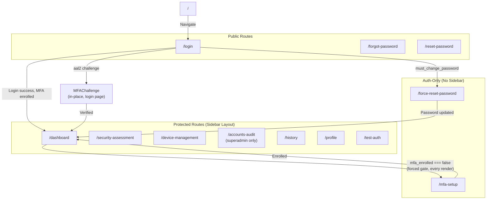
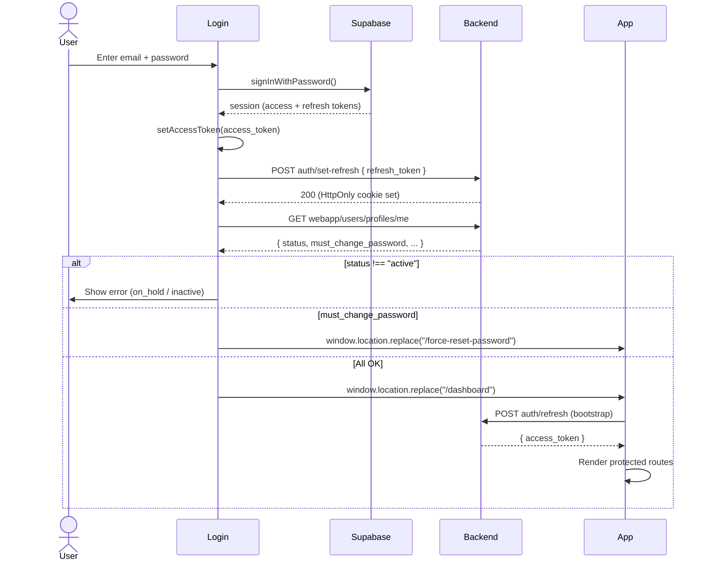
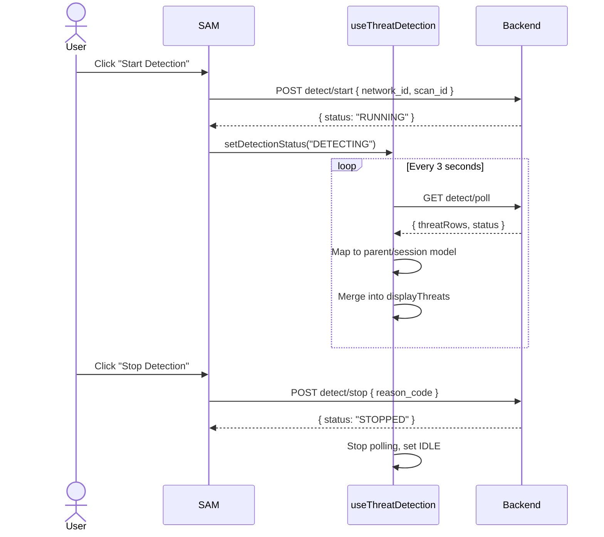

# Pages, Routes & User Flows

> **Router:** React Router DOM v7 (`BrowserRouter`)  
> **Route Definition:** `src/App.jsx`  
> **Auth Gate:** In-memory access token check (`getAccessToken()`)  
> **Last Updated:** 2026-06-22

> MFA enrollment/challenge mechanics (TOTP, AAL2) are documented in
> [`AUTHENTICATION_AND_AUTHORIZATION.md` §11](./AUTHENTICATION_AND_AUTHORIZATION.md#11-multi-factor-authentication-totp).
> This file covers route inventory and navigation only.

---

## 1. Route Inventory

| Route | Component | Auth Required | Access Control | Purpose |
|-------|-----------|:---:|:---:|---------|
| `/` | `Navigate → /login` | ✗ | Public | Root redirect |
| `/login` | `Login` | ✗ | Public | Email/password authentication |
| `/forgot-password` | `ForgotPassword` | ✗ | Public | Request password reset email |
| `/reset-password` | `ResetPassword` | ✗ | Public | Set new password via email link |
| `/force-reset-password` | `ForceResetPassword` | ✓ | Authenticated (no sidebar) | Forced password change after temp password |
| `/mfa-setup` | `MFASetup mode="forced"` | ✓ | Authenticated (no sidebar) | Mandatory TOTP enrollment gate — any authenticated user without a verified MFA factor is redirected here |
| `/dashboard` | `Dashboard` | ✓ | Protected | Network security overview with charts |
| `/security-assessment` | `SAM` | ✓ | Protected | Vulnerability/threat assessment & detection |
| `/device-management` | `DeviceManagement` | ✓ | Protected | Raspberry Pi & AP control |
| `/accounts-audit` | `AccountsAudit` | ✓ | Protected + superadmin | User management & audit logs |
| `/history` | `History` | ✓ | Protected | Historical scan data browser |
| `/profile` | `Profile` | ✓ | Protected | View profile & reset password |
| `/test-auth` | `TestAuth` | ✓ | Protected | Debug/test authentication (dev only) |

---

## 2. Route Architecture



### Route Protection Mechanism

```jsx
// In App.jsx
const isAuthenticated = !!getAccessToken();

// Public routes: rendered regardless of auth state
<Route path="/login" element={<Login />} />

// Force-reset: requires auth but no sidebar
<Route path="/force-reset-password" 
  element={isAuthenticated ? <ForceResetPassword /> : <Navigate to="/login" />} />

// Protected routes: redirect to /login if not authenticated
<Route path="/*" element={
  isAuthenticated ? (
    <ThreatDetectionProvider>
      <div className="app">
        <Sidebar />
        <UserMenu />
        <main className="main-content">
          <Routes>
            {/* Nested protected routes */}
          </Routes>
        </main>
      </div>
    </ThreatDetectionProvider>
  ) : <Navigate to="/login" replace />
} />
```

---

## 3. Route Guards

| Guard Type | Implementation | Scope |
|-----------|---------------|-------|
| **Authentication** | `!!getAccessToken()` check in `App.jsx` | All `/*` routes |
| **Force Reset** | Separate `isAuthenticated` check without sidebar | `/force-reset-password` |
| **Forced MFA enrollment** | `mfaEnrolled === false` redirects to `/mfa-setup`, re-checked on every render (`src/App.jsx`) | All protected `/*` routes |
| **AAL2 (backend)** | `requireAAL2` middleware 403s mutating/sensitive routes unless `req.user.aal === "aal2"` — see `AUTHENTICATION_AND_AUTHORIZATION.md` §11 | Most authenticated backend routes |
| **Role-based (UI)** | `profile.role === "superadmin"` in Sidebar | `/accounts-audit` hidden for non-superadmin |
| **Role-based (API)** | `requireSuperadmin` middleware on backend | Audit log endpoints |
| **Status-based** | Login checks `profile.status !== "active"` | Blocks on_hold/inactive users |

> **Note:** Frontend role-based hiding is UI-only. The backend enforces actual authorization via middleware.

---

## 4. Detailed Page Documentation

### 4.1 Login (`/login`)

**File:** `src/pages/Login/Login.jsx`

**Purpose:** Email/password authentication entry point.

**User Actions:**
1. Enter email and password
2. Click "Login now"
3. Optionally click "Forgot your password?"

**Login Flow:**
1. `supabase.auth.signInWithPassword()` — client-side auth
2. Checks `getAuthenticatorAssuranceLevel()` — if the account requires `aal2` and isn't already there, renders `MFAChallenge` (6-digit TOTP code, auto-submit) in place before continuing
3. `setAccessToken(session.access_token)` — store in memory
4. `api.post("auth/set-refresh", { refresh_token })` — send to backend for HttpOnly cookie
5. `api.get("webapp/users/profiles/me")` — check profile status
6. Status validation: `active` → dashboard; `on_hold`/`inactive` → error message; `null` → logout
7. Force-reset check: if `must_change_password && temp_expires_at > now` → `/force-reset-password`
8. Success: `window.location.replace("/dashboard")` (full page navigation for auth bootstrap)

**APIs Used:** `supabase.auth.signInWithPassword`, `supabase.auth.mfa.*` (challenge/verify), `auth/set-refresh`, `webapp/users/profiles/me`, `auth/logout`

> Full MFA login-challenge mechanics: [`AUTHENTICATION_AND_AUTHORIZATION.md` §11](./AUTHENTICATION_AND_AUTHORIZATION.md#11-multi-factor-authentication-totp).

---

### 4.2 Forgot Password (`/forgot-password`)

**File:** `src/pages/Auth/ForgotPassword.jsx`

**Purpose:** Request a password reset email.

**User Actions:**
1. Enter email address
2. Click "Send reset link"
3. Check inbox for email

**Flow:**
1. `supabase.auth.resetPasswordForEmail(email, { redirectTo })` — Supabase sends email
2. `redirectTo` is set to `${window.location.origin}/reset-password`
3. Success message displayed; user checks email

**APIs Used:** `supabase.auth.resetPasswordForEmail`

---

### 4.3 Reset Password (`/reset-password`)

**File:** `src/pages/Auth/ResetPassword.jsx`

**Purpose:** Set a new password after clicking the email link.

**User Actions:**
1. Click reset link in email → lands on `/reset-password` with token in URL hash
2. Enter new password (with live checklist)
3. Toggle password visibility
4. Click "Update password"

**Flow:**
1. `supabase.auth.onAuthStateChange` listens for `PASSWORD_RECOVERY` event
2. Supabase JS processes URL hash automatically (`detectSessionInUrl: true`)
3. User enters new password; client-side validation via `validatePassword()`
4. `supabase.auth.updateUser({ password })` — update via Supabase
5. Success → redirect to `/login` after 2 seconds

**APIs Used:** `supabase.auth.onAuthStateChange`, `supabase.auth.getSession`, `supabase.auth.updateUser`

---

### 4.3a MFA Setup (`/mfa-setup`)

**File:** `src/pages/Auth/MFASetup.jsx` + `src/components/auth/TotpQrDisplay.jsx`

**Purpose:** Mandatory TOTP enrollment. `mode="forced"` renders this as the standalone route (no sidebar) for any authenticated user without a verified factor; `mode="self-service"` is reused embedded in a Profile modal for re-enrollment.

**User Actions:**
1. Scan QR code (or copy manual-entry secret) into an authenticator app
2. Enter 6-digit verification code
3. "Start over"/"Retry" on enrollment errors

**APIs Used:** `supabase.auth.mfa.enroll/challenge/verify`

> Full enrollment/recovery details: [`AUTHENTICATION_AND_AUTHORIZATION.md` §11](./AUTHENTICATION_AND_AUTHORIZATION.md#11-multi-factor-authentication-totp).

---

### 4.4 Force Reset Password (`/force-reset-password`)

**File:** `src/pages/Auth/ForceResetPassword.jsx`

**Purpose:** Mandatory password change when a superadmin issues a temporary password (AUTH-009).

**User Actions:**
1. Enter new password + confirm password
2. Click "Set new password"

**Flow:**
1. Prime Supabase session: `supabase.auth.setSession({ access_token, refresh_token: "not-used" })`
2. Validate password strength + confirm match
3. `supabase.auth.updateUser({ password })` — update password
4. `api.post("auth/clear-force-reset")` — clear `must_change_password` flag
5. Success → redirect to `/dashboard` after 2 seconds

**APIs Used:** `supabase.auth.setSession`, `supabase.auth.updateUser`, `auth/clear-force-reset`

---

### 4.5 Dashboard (`/dashboard`)

**File:** `src/pages/Dashboard/Dashboard.jsx`

**Purpose:** Aggregated and per-network security overview with interactive charts.

**User Actions:**
1. View overall summary (default)
2. Switch between networks via dropdown
3. Select specific scan dates
4. Toggle legend visibility
5. Hover over chart elements for linked highlighting

**State Dependencies:** `useDashboard` hook manages all state.

**Sub-components:**
- `DashboardHeader` — View mode toggle, network/scan dropdowns
- `SummarySection` — Aggregated charts (all networks)
- `NetworkSection` — Per-network charts and data

**APIs Used:** `dashboard/summary`, `dashboard/network/{id}`, `dashboard/networks`, `dashboard/network/{id}/scans`

---

### 4.6 Security Assessment Management (`/security-assessment`)

**File:** `src/pages/SAM/SAM.jsx` (18,949 bytes — largest page)

**Purpose:** Core feature page for vulnerability scanning, threat detection, and report generation.

**User Actions:**
1. Select a network from the sidebar network list
2. View vulnerabilities table (filterable, sortable, paginated)
3. View threats table
4. Click a finding → detail modal with NIST/OWASP recommendations
5. Start/stop threat detection
6. Export PDF reports (overall or per-network)
7. Clear vulnerability list for a network

**Sub-components:**
- `SAMSidebar` — Network selection + scan controls
- `VulnerabilitiesTable` — Vulnerability listing with severity controls
- `ThreatsTable` — Threat listing
- `ExportDropdown` — PDF report export
- `ThreatDetail` — Finding detail overlay

**APIs Used:** `rasPi/networks_list`, `webapp/vulnerabilities_latest`, `sam/threats`, `sam/vulnerabilities`, `detect/start`, `detect/stop`, `detect/status`, `detect/poll`

---

### 4.7 Device Management (`/device-management`)

**File:** `src/pages/DeviceManagement/DeviceManagement.jsx`

**Purpose:** Raspberry Pi access point control and captive portal management.

**User Actions:**
1. View network configuration (SSID, BSSID, channel, encryption)
2. Enable/disable access point (with password input for encrypted networks)
3. Update captive portal content
4. Monitor async AP job progress
5. View scan error states with remediation guidance

**Query Parameters:** `?network_id=<uuid>&scan_id=<uuid>` (set via Sidebar links)

**State Dependencies:** `useDevice` hook, `NetworkContext`

**Sub-components:**
- `AccessPointPanel` — AP toggle, status display, job progress

**APIs Used:** `rasPi/networks/{id}`, `device/network/{id}/state`, `device/enable-ap`, `device/jobs/{id}`, `device/ap-live`, `device/portal/update`

---

### 4.8 Accounts & Audit (`/accounts-audit`)

**File:** `src/pages/AccountsAudit/AccountsAudit.jsx` (25,081 bytes)

**Purpose:** Superadmin-only page for user management and audit trail viewing.

**Access:** Hidden in sidebar for non-superadmin users; backend enforces role check.

**User Actions:**
1. Switch between "Accounts" and "Audit Logs" tabs
2. **Accounts tab:** View user list, edit roles/status, activate with temp password, deactivate/reactivate, **Reset MFA** (per-row action, confirmation required — removes all TOTP factors for lost-device recovery; see `AUTHENTICATION_AND_AUTHORIZATION.md` §11)
3. **Audit tab:** Search, filter by status/date, paginate, export CSV

**Sub-components:**
- `AccountsTable` — User listing
- `UserForm` — User editing form
- `AuditLogsTable` — Paginated audit log viewer with export

**APIs Used:** `webapp/users/profiles`, `webapp/users/profiles/{id}`, `webapp/users/profiles/{id}/activate-with-temp`, `webapp/users/profiles/{id}/deactivate`, `webapp/users/profiles/{id}/reactivate`, `audit/logs`, `audit/export`

---

### 4.9 Scan History (`/history`)

**File:** `src/pages/History/History.jsx`

**Purpose:** Browse historical vulnerability and threat data across scans.

**User Actions:**
1. Switch between "Vulnerabilities" and "Threats" tabs
2. View historical data tables
3. Click a scan row → expand detail drawer

**Sub-components:**
- `VulnerabilityHistoryTable` — Historical vulnerability data
- `ThreatHistoryTable` — Historical threat data
- `ScanDetailsDrawer` — Slide-out drawer with detailed scan information

**APIs Used:** `history/vulnerabilities`, `history/threats`

---

### 4.10 Profile (`/profile`)

**File:** `src/pages/Profile/Profile.jsx`

**Purpose:** View user profile details and change password.

**User Actions:**
1. View email, first name, last name, username (read-only)
2. Click "Reset Password" to open modal
3. Enter current password + new password → change via Supabase

**Sub-components:**
- `ProfileModal` — Password change form

**APIs Used:** `webapp/users/profiles/me`, `supabase.auth.signInWithPassword`, `supabase.auth.updateUser`

---

## 5. User Flow Diagrams

### Login → Dashboard Flow



### Threat Detection Flow



---

## 6. Navigation Structure

### Sidebar Menu Items

| Order | Icon | Label | Path | Visibility |
|:---:|:---:|-------|------|------------|
| 1 | ☷ | Dashboard | `/dashboard` | All users |
| 2 | ⚡ | Security Assessment Management | `/security-assessment` | All users |
| 3 | 📱 | Device Management | `/device-management` | All users |
| 4 | 📁 | Accounts & Audit | `/accounts-audit` | Superadmin only |
| 5 | 📊 | Scan History | `/history` | All users |
| 6 | 👤 | Profile | `/profile` | All users |
| — | 🚪 | Logout | — | All users (button) |

### Special Navigation Behaviors

- **Device Management link** includes query params: `?network_id={id}&scan_id={id}` from `NetworkContext`
- **SAM indicator** shows detection status: green dot (running), blue pulsing (starting), red dot (failed), threat count badge
- **Logout** shows confirmation modal if detection is running; warns about stopping active monitoring

---

## ⚠️ Needs Verification

- **`/test-auth` page**: This appears to be a development/debug tool (47KB). Verify if it should be included in production builds.
- **Dynamic routes**: No dynamic route segments (`:id`) are used in the frontend router — all entity-level navigation uses query parameters or modals.
- **Fallback routes**: No explicit 404/catch-all route is defined. Unmatched paths under `/*` will render an empty main content area.
