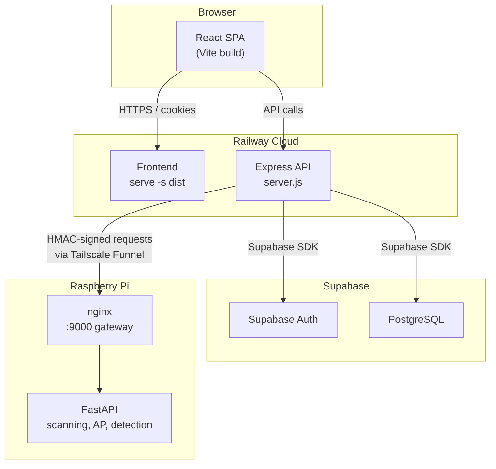

# Why-PII? — Project Context & Product Requirements Document

> **Generated:** 2026-06-02 | **Last Updated:** 2026-06-17  
> **Codebase Version:** 0.0.0 (package.json)  
> **Status:** Documentation-only analysis — no source code was modified.

---

## 📖 Documentation Index

| # | Document | Purpose |
|---|----------|---------|
| 1 | [PROJECT_CONTEXT_AND_PRD.md](./PROJECT_CONTEXT_AND_PRD.md) | Project overview, tech stack, architecture, reading order |
| 2 | [FRONTEND_ARCHITECTURE.md](./FRONTEND_ARCHITECTURE.md) | Frontend architecture, folder structure, rendering strategy |
| 3 | [PAGES_ROUTES_AND_USER_FLOWS.md](./PAGES_ROUTES_AND_USER_FLOWS.md) | Route inventory, user flows, page-level documentation |
| 4 | [COMPONENT_REFERENCE.md](./COMPONENT_REFERENCE.md) | Component inventory with props, paths, and dependencies |
| 5 | [API_INTEGRATION_CONTEXT.md](./API_INTEGRATION_CONTEXT.md) | API client setup, endpoint mapping, request/response flows |
| 6 | [STATE_MANAGEMENT.md](./STATE_MANAGEMENT.md) | State ownership, context providers, hooks, persistence |
| 7 | [AUTHENTICATION_AND_AUTHORIZATION.md](./AUTHENTICATION_AND_AUTHORIZATION.md) | Auth flows, token lifecycle, route protection, RBAC |
| 8 | [BUILD_DEPLOYMENT_RUNTIME.md](./BUILD_DEPLOYMENT_RUNTIME.md) | Build process, deployment, environment variables, CI/CD |
| 9 | [SECURITY_AND_RISKS.md](./SECURITY_AND_RISKS.md) | XSS, CSRF, token risks, API security, environment risks |
| 10 | [UI_UX_SYSTEM_REFERENCE.md](./UI_UX_SYSTEM_REFERENCE.md) | Design system, layout, typography, accessibility, UX flows |
| 11 | [TESTING_AND_QUALITY_ASSURANCE.md](./TESTING_AND_QUALITY_ASSURANCE.md) | Test architecture, coverage, QA considerations |
| 12 | [CAPSTONE_DOCUMENTATION.md](./CAPSTONE_DOCUMENTATION.md) | Formal academic documentation of the entire system |

---

## 1. Project Overview

**Why-PII?** is a full-stack web application for assessing the security of public Wi-Fi access points in communal spaces (cafés, libraries, co-working areas). It uses a Raspberry Pi microcontroller as a field probe to perform passive wireless scanning, threat detection, and captive portal demonstrations.

### Core Purpose

The system enables network administrators and security professionals to:

1. **Scan** nearby wireless networks and catalogue their security posture
2. **Deploy a captive portal** on a controlled access point to demonstrate credential interception risks
3. **Detect threats in real-time** — rogue APs, deauth floods, evil twin attacks, MAC spoofing
4. **Score and track** each network's risk over time with CVSS-based scoring
5. **Manage users and audit trails** — role-based access with full audit logging

### Key Principle

> The browser never communicates with the Raspberry Pi directly. The Express backend acts as a secure relay, signing every command with HMAC and routing traffic through a Tailscale Funnel tunnel.

---

## 2. Technology Stack

### Frontend

| Technology | Version | Purpose |
|------------|---------|---------|
| React | 19.2.0 | UI framework |
| React DOM | 19.2.0 | DOM rendering |
| React Router DOM | 7.11.0 | Client-side routing |
| Vite | 7.2.4 | Build tool / dev server |
| Axios | 1.13.3 | HTTP client |
| Recharts | 3.6.0 | Data visualization charts |
| Supabase JS | 2.93.3 | Supabase client for auth flows |
| Jose | 6.1.3 | JWT utilities |
| Serve | 14.2.6 | Production static file server |

### Backend

| Technology | Version | Purpose |
|------------|---------|---------|
| Express | 5.2.1 | API framework |
| Supabase JS | 2.90.1 | Database access (PostgreSQL) |
| Helmet | 8.1.0 | Security headers |
| CORS | 2.8.6 | Cross-origin configuration |
| express-rate-limit | 8.2.1 | Rate limiting |
| express-validator | 7.3.1 | Input validation |
| Jose | 6.1.3 | JWT verification |
| cookie-parser | 1.4.7 | Cookie parsing |
| dotenv | 17.2.3 | Environment variable management |
| node-fetch | 3.3.2 | HTTP client for Pi communication |

### Development & Testing

| Technology | Version | Purpose |
|------------|---------|---------|
| ESLint | 9.39.1 | Code linting |
| Playwright | 1.58.2 | E2E testing |
| Jest | 30.2.0 | Backend unit/integration testing |
| Supertest | 7.2.2 | HTTP assertion library |

### Infrastructure

| Component | Technology |
|-----------|------------|
| Database | PostgreSQL via Supabase |
| Authentication | Supabase Auth (JWKS JWT) |
| Hosting | Railway (frontend + backend) |
| Hardware | Raspberry Pi (FastAPI + nginx) |
| Tunnel | Tailscale Funnel |

---

## 3. Architecture Overview



### Data Flow

1. **Browser → Express**: All API calls go through the Express backend via `/api/*` routes
2. **Express → Supabase**: Database reads/writes use the Supabase JS SDK (no raw SQL)
3. **Express → Raspberry Pi**: Device commands are HMAC-signed and routed through Tailscale Funnel
4. **Express → Browser**: Access tokens in memory, refresh tokens in HttpOnly cookies

---

## 4. Repository Map

```
whypii/
├── src/                          # React frontend (Vite)
│   ├── api/                      # Axios instance + API service modules (10 files)
│   ├── assets/                   # Static assets (react.svg)
│   ├── components/               # Reusable UI components (8 subdirs)
│   │   ├── accounts/             # AccountsTable, AuditLogsTable, UserForm
│   │   ├── common/               # EmptyState, ErrorBoundary, Modal, Pagination, Spinner, Tabs, Toast, UserMenu
│   │   ├── dashboard/            # DashboardHeader, LegendForScore, NetworkSection, SummarySection
│   │   ├── device/               # AccessPointPanel
│   │   ├── history/              # ScanDetailsDrawer, ThreatHistoryTable, VulnerabilityHistoryTable
│   │   ├── modals/               # AccountsAuditModal, FindingDetailModal, LogoutConfirmModal, etc.
│   │   ├── profile/              # ProfileModal
│   │   └── sam/                  # ExportDropdown, SAMSidebar, ThreatDetail, ThreatsTable, VulnerabilitiesTable
│   ├── context/                  # React Context providers (NetworkContext, ThreatDetectionContext)
│   ├── data/                     # Mock/fallback data (dashboardData, mockReportData, mockThreats)
│   ├── hooks/                    # Custom React hooks (10 files)
│   ├── layouts/                  # Sidebar layout component
│   ├── lib/                      # Supabase client configuration
│   ├── pages/                    # Route-level page components (9 subdirs)
│   │   ├── AccountsAudit/        # Accounts & Audit page (superadmin only)
│   │   ├── Auth/                 # ForgotPassword, ResetPassword, ForceResetPassword, PasswordChecklist
│   │   ├── Dashboard/            # Dashboard page
│   │   ├── DeviceManagement/     # Device Management page
│   │   ├── History/              # Scan History page
│   │   ├── Login/                # Login page
│   │   ├── Profile/              # Profile page
│   │   ├── SAM/                  # Security Assessment Management page
│   │   └── TestAuth/             # Debug/test authentication page
│   ├── utils/                    # Utilities (exportReport, pollUntil, reportTemplates)
│   ├── App.jsx                   # Root component with routing
│   ├── App.css                   # Global layout styles
│   ├── main.jsx                  # Application entry point
│   ├── index.css                 # Global CSS resets
│   └── passwordValidation.js     # Password strength validation
├── backend/                      # Express.js API server
│   ├── config/                   # Environment validation, Supabase client config
│   ├── controllers/              # Route handlers (11 controllers)
│   ├── middleware/                # Auth, roles, rate limiting, request ID, status, UUID validation
│   ├── migrations/               # Database migrations
│   ├── repositories/             # Supabase data access layer
│   ├── routes/                   # Express route definitions (12 route files)
│   ├── scripts/                  # Utility scripts
│   ├── seeds/                    # Database seed data
│   ├── services/                 # Business logic layer
│   ├── utils/                    # Shared utilities (piFetch, scoring, etc.)
│   ├── validators/               # Input validation schemas
│   ├── __tests__/                # Jest test suites
│   └── server.js                 # Express server entry point
├── e2e/                          # Playwright E2E tests
├── public/                       # Static assets (vite.svg)
├── index.html                    # Vite entry HTML
├── vite.config.js                # Vite configuration
├── eslint.config.js              # ESLint configuration
├── playwright.config.js          # Playwright configuration
├── package.json                  # Frontend dependencies
├── current_sql_schema.sql        # Database schema reference
└── .env.example                  # Environment variable template
```

---

## 5. Frontend Responsibilities

The frontend is responsible for:

1. **Authentication UI**: Login, forgot password, reset password, force-reset password flows
2. **Dashboard visualization**: Aggregated and per-network risk scores, severity charts, client counts
3. **Security Assessment Management (SAM)**: Vulnerability/threat tables, live threat detection, PDF report export
4. **Device Management**: Access point control (enable/disable), captive portal management, network scanning
5. **Accounts & Audit**: User CRUD, role management (superadmin only), audit log viewing/export
6. **Scan History**: Historical vulnerability/threat data with drill-down drawers
7. **Profile Management**: View profile details, reset password
8. **State persistence**: Session-scoped state via `sessionStorage` with `wf:` prefix convention

---

## 6. Backend Dependencies

The frontend relies on these backend API groups:

| Route Group | Base Path | Purpose |
|-------------|-----------|---------|
| Auth | `/api/auth` | Login, logout, token refresh, force-reset |
| WebApp | `/api/webapp` | User profiles, vulnerability data |
| RasPi | `/api/rasPi` | Network listing, scan triggers |
| SAM | `/api/sam` | Threats, vulnerabilities, details |
| Dashboard | `/api/dashboard` | Summary, per-network data, network lists |
| Device | `/api/device` | AP toggle, job polling, live state, portal updates |
| Captive Portal | `/api/captivePortal` | Announcements, tips, terms, risk, sync |
| Detect | `/api/detect` | Start/stop detection, status, polling |
| History | `/api/history` | Vulnerability/threat history |
| Audit | `/api/audit` | Audit logs (superadmin only), CSV export |

---

## 7. Runtime Assumptions

- **Node.js 18+** required for both frontend and backend
- **Supabase project** must be provisioned with appropriate schema
- **Raspberry Pi** with FastAPI + nginx for device-related features
- **Tailscale Funnel** for Pi connectivity from Railway
- **Railway** for cloud hosting (both frontend and backend as separate services)

---

## 8. Security Overview

| Area | Implementation |
|------|---------------|
| Authentication | Supabase Auth → JWT access token (in-memory) + HttpOnly refresh cookie |
| Authorization | Role-based (admin/superadmin) with `requireSuperadmin` middleware; `profiles.status === 'active'` enforced on all authenticated routes |
| API Security | Helmet, CSP, CORS whitelist, rate limiting (login: 10/window, refresh: 30/window, global: 300/window), request ID tracking |
| Frontend Security Headers | CSP, `X-Frame-Options`, `X-Content-Type-Options` set in both `vite.config.js` (dev/preview) and `backend/server.js` (Helmet) — must stay in sync |
| Pi Communication | HMAC-signed requests via Tailscale Funnel |
| Session | `sessionStorage` for UI state (`wf:*` keys), cleared on logout |
| Secrets | `.env` files gitignored, `VITE_` prefix for browser-exposed vars only |

---

## 9. Recommended Reading Order

1. Start with this document for overall context
2. [FRONTEND_ARCHITECTURE.md](./FRONTEND_ARCHITECTURE.md) — Understand the structural patterns
3. [AUTHENTICATION_AND_AUTHORIZATION.md](./AUTHENTICATION_AND_AUTHORIZATION.md) — How auth works end-to-end
4. [PAGES_ROUTES_AND_USER_FLOWS.md](./PAGES_ROUTES_AND_USER_FLOWS.md) — Navigate the application
5. [API_INTEGRATION_CONTEXT.md](./API_INTEGRATION_CONTEXT.md) — Frontend↔Backend communication
6. [STATE_MANAGEMENT.md](./STATE_MANAGEMENT.md) — How data flows through the app
7. [COMPONENT_REFERENCE.md](./COMPONENT_REFERENCE.md) — Component-level details
8. [UI_UX_SYSTEM_REFERENCE.md](./UI_UX_SYSTEM_REFERENCE.md) — Design system and patterns
9. [BUILD_DEPLOYMENT_RUNTIME.md](./BUILD_DEPLOYMENT_RUNTIME.md) — Build and deploy
10. [SECURITY_AND_RISKS.md](./SECURITY_AND_RISKS.md) — Security considerations
11. [TESTING_AND_QUALITY_ASSURANCE.md](./TESTING_AND_QUALITY_ASSURANCE.md) — Testing strategy
12. [CAPSTONE_DOCUMENTATION.md](./CAPSTONE_DOCUMENTATION.md) — Formal academic summary

---

## 10. Source File Map

### Entry Points

| File | Purpose |
|------|---------|
| `index.html` | Vite entry HTML, mounts `#root` |
| `src/main.jsx` | React root render with StrictMode |
| `src/App.jsx` | Root component: auth bootstrap, routing, providers |
| `backend/server.js` | Express server entry, middleware chain, route mounting |

### Configuration Files

| File | Purpose |
|------|---------|
| `vite.config.js` | Vite build config, dev server proxy, Railway cache dir |
| `eslint.config.js` | ESLint flat config for React/JSX |
| `playwright.config.js` | E2E test config (Chromium, dual web server) |
| `.env.example` | Frontend environment variable template |
| `backend/.env.example` | Backend environment variable template |
| `package.json` | Frontend dependencies and scripts |
| `backend/package.json` | Backend dependencies and scripts |

---

## ⚠️ Needs Verification

- **Production URL**: The Railway deployment URL is not documented in the codebase
- **Supabase project details**: Project URL and anon key are environment-specific
- **Pi endpoint URL**: Tailscale Funnel URL is configured via backend env vars
- **CI/CD pipeline**: No CI/CD configuration files (e.g., GitHub Actions, Railway build settings) were found in the repository root
- **User registration**: No self-registration flow exists in the frontend; account creation appears to be superadmin-only
