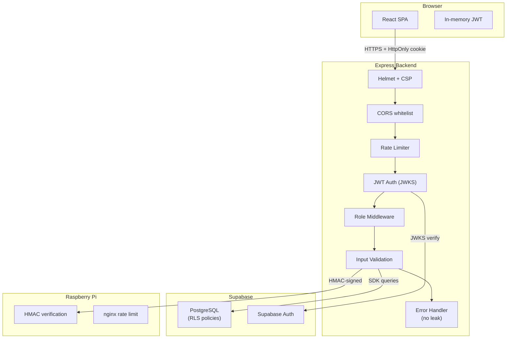

# Security & Risks

> **Security Hardening Phase:** Partially complete (8/10 current posture per README)  
> **Reference:** `SECURITY_HARDENING_PLAN.md` in project root

---

## 1. Security Architecture Overview



---

## 2. XSS Prevention

| Vector | Mitigation | Implementation |
|--------|-----------|----------------|
| **Stored XSS** | React auto-escapes JSX output | Framework default |
| **DOM XSS** | No `dangerouslySetInnerHTML` usage (except report templates) | Code review |
| **Reflected XSS** | CSP `script-src: 'self'` | Helmet configuration |
| **Token theft via XSS** | Access token in-memory (not localStorage/sessionStorage) | `src/api/axios.js` |
| **Cookie theft via XSS** | HttpOnly flag on refresh cookie | Backend `authController.js` |

### CSP Policy (Production)

```javascript
contentSecurityPolicy: {
  directives: {
    defaultSrc: ["'self'"],
    scriptSrc:  ["'self'"],
    styleSrc:   ["'self'", "'unsafe-inline'"],
    connectSrc: ["'self'", RAILWAY_PUBLIC_DOMAIN, SUPABASE_URL],
    imgSrc:     ["'self'", "data:", "blob:"],
  },
},
```

**⚠️ Risk:** `styleSrc: "'unsafe-inline'"` allows inline styles — needed for Recharts but increases XSS surface area. Consider migrating to nonce-based CSP in the future.

### Report Templates Risk

**File:** `src/utils/reportTemplates.js` generates full HTML documents with inline CSS and Plotly CDN scripts. These are opened in a new browser tab via `window.open()`. While the data is user-controlled, it's rendered via template literals and doesn't use `innerHTML` on the main app DOM.

---

## 3. CSRF Protection

| Vector | Mitigation | Status |
|--------|-----------|--------|
| **Cross-origin requests** | CORS whitelist (origin validation) | ✓ Implemented |
| **Cookie-based actions** | `SameSite` cookie attribute | ✓ (requires `CROSS_ORIGIN_COOKIES=true` in production) |
| **API mutations** | All mutations use POST with JSON body | ✓ |
| **CSRF tokens** | Not implemented (relies on SameSite + CORS) | ⚠️ No explicit CSRF tokens |

### CORS Configuration

```javascript
cors({
  origin: (origin, callback) => {
    if (!origin || allowedOrigins.includes(origin)) {
      callback(null, true);
    } else {
      callback(new Error("CORS not allowed"));
    }
  },
  credentials: true,
  allowedHeaders: ["Content-Type", "Authorization"],
  methods: ["GET", "POST", "PUT", "PATCH", "DELETE", "OPTIONS"],
})
```

---

## 4. Token Security

### Access Token

| Concern | Current State |
|---------|--------------|
| Storage location | In-memory variable — **secure** (not accessible to XSS reading storage) |
| Transmission | Bearer header over HTTPS |
| Verification | JWKS-based (public key from Supabase) |
| Expiry | Supabase default (~1 hour) |
| Refresh | Auto via 401 interceptor |
| Revocation | Clear in-memory on logout |

### Refresh Token

| Concern | Current State |
|---------|--------------|
| Storage | HttpOnly cookie — **secure** (JS cannot read) |
| SameSite | Configurable via `CROSS_ORIGIN_COOKIES` |
| Secure flag | Should be `true` in production (HTTPS) |
| Path | Should be restricted to `/api/auth` |
| Revocation | Backend clears cookie on logout |

---

## 5. API Security

### Rate Limiting

| Limiter | Scope | Configuration |
|---------|-------|---------------|
| Global | All `/api/*` routes | `express-rate-limit` (in-memory store) |
| Export | Audit CSV export | 5-second client-side cooldown |

**⚠️ Risk:** In-memory rate limiter resets on server restart and doesn't share state across multiple instances. If Railway auto-scales, each instance has its own counter. Redis store is recommended for production.

### Input Validation

- **Backend:** `express-validator` schemas in `backend/validators/`
- **Frontend:** Password validation via `passwordValidation.js`
- **UUID validation:** `validateUUID` middleware on device/user/rasPi routes

### Request Size Limiting

```javascript
express.json({ limit: '100kb' })
```

### Request ID Tracking

```javascript
// requestIdMiddleware.js
// Attaches unique request ID to every request for audit trail correlation
```

---

## 6. Environment & Secrets

### Secret Management

| Secret | Storage | Access |
|--------|---------|--------|
| `SUPABASE_SERVICE_ROLE_KEY` | Backend `.env` | Server only |
| `CONTROL_SIGNING_SECRET` | Backend `.env` | Server only (HMAC signing) |
| `SUPABASE_JWT_SECRET` | Backend `.env` | Server only (token verification) |
| `VITE_SUPABASE_ANON_KEY` | Frontend `.env` | Browser-exposed (by design) |
| `INTERNAL_SMOKE_TOKEN` | Backend `.env` | Server only |

### Environment Validation

**File:** `backend/config/envValidation.js`

The backend performs fail-fast validation on startup. Missing required variables cause the process to crash immediately, preventing the server from running in a misconfigured state.

### Gitignore Protection

```gitignore
.env
.env.*
!.env.example
!.env.production.example
```

---

## 7. Pi Communication Security

| Aspect | Implementation |
|--------|---------------|
| **Transport** | HTTPS via Tailscale Funnel (public endpoint) |
| **Authentication** | HMAC signature on every request (`CONTROL_SIGNING_SECRET`) |
| **Rate limiting** | nginx rate limiting on Pi (127.0.0.1:9000) |
| **Network isolation** | Pi only accepts requests through nginx gateway |
| **Timeout handling** | `piFetch` utility with configurable timeout |
| **Error codes** | Structured error codes for AP operations |

---

## 8. Data Security

### Database Access

| Concern | Implementation |
|---------|---------------|
| **ORM** | Supabase JS SDK (no raw SQL) |
| **Service role** | Backend uses `supabase_service_role_key` (bypasses RLS) |
| **Client access** | Frontend uses anon key (RLS-protected, but `persistSession: false` limits scope) |
| **Audit trail** | Append-only `audit_logging` table with actor, IP, user agent, old/new values |

### Sensitive Data Handling

| Data | Protection |
|------|-----------|
| Passwords | Hashed by Supabase Auth (bcrypt) |
| Refresh tokens | HttpOnly cookies only |
| Access tokens | In-memory only |
| User profiles | Status-gated access (active/on_hold/inactive) |
| Deactivated users | Optional anonymization on deactivate |

---

## 9. Known Risks & Mitigations

### High Priority

| Risk | Description | Mitigation Status |
|------|-------------|:-----------------:|
| `deviceApi.js` hardcoded URL | Uses `localhost:3000` instead of shared Axios instance | ⚠️ Not fixed |
| In-memory rate limiter | Resets on restart, no cross-instance sharing | ⚠️ Needs Redis |
| `err.message` leaks | Some controllers expose internal error messages | ⚠️ Partial fix |
| No CSRF tokens | Relies on SameSite + CORS (sufficient for modern browsers) | ℹ️ Acceptable |

### Medium Priority

| Risk | Description | Mitigation Status |
|------|-------------|:-----------------:|
| `unsafe-inline` styles | CSP allows inline styles for Recharts | ℹ️ Acceptable trade-off |
| No explicit 404 route | Unmatched frontend routes show empty content | ⚠️ Not implemented |
| Report template injection | `reportTemplates.js` generates HTML from user data | ℹ️ Opens in new tab |
| `console.log` statements | Debug logs in production (multiple hooks) | ⚠️ Should be removed |
| No request body validation on some routes | Some POST endpoints may lack express-validator | ⚠️ Needs audit |

### Low Priority

| Risk | Description | Mitigation Status |
|------|-------------|:-----------------:|
| `window.open()` popup blocker | Report export may fail if popups blocked | ℹ️ User notification |
| `localStorage` for SAM clear | `sam_cleared_{BSSID}` persists across sessions | ℹ️ By design |
| No CSP nonce | Inline scripts in report templates | ℹ️ Separate window |

---

## 10. Security Hardening Progress

Reference: `SECURITY_HARDENING_PLAN.md`

| Phase | Name | Status | Key Items |
|:---:|------|:------:|-----------|
| 0 | Secrets Remediation | ✅ Done | Pi secrets generated, unified HMAC auth |
| 1 | P0 Infrastructure | ✅ Done | `trust proxy`, Helmet/CSP, rate limiting, env validation |
| 2 | Route Auth Lockdown | ✅ Done | `authJWT` on all 9 route groups, `requireSuperadmin` on audit |
| 3 | Bug Fixes & Info Disclosure | ⚠️ Partial | Most leaks sealed; residual `err.message` in some controllers |
| 4 | Deployment Readiness | ⚠️ Partial | CORS via env, `VITE_API_BASE_URL`; `deviceApi.js` still hardcoded |
| 4.5 | Pi Connectivity Readiness | ❌ Not started | Funnel URL stability, nginx binding, Idempotency-Key |
| 5 | Optional Polish | ✅ Done | UUID validation middleware |
| 6 | Testing Deliverables | ✅ Done | Jest unit/integration, Playwright E2E, coverage |

---

## ⚠️ Needs Verification

- **Cookie `Secure` flag**: Verify that the refresh cookie has `Secure: true` in production
- **Cookie `Path`**: Verify that the refresh cookie is scoped to `/api/auth` to minimize CSRF surface
- **HSTS**: Helmet enables HSTS only in production (`appEnv === 'production'`) — verify Railway handles HTTPS termination
- **Supabase RLS policies**: Backend uses service role key (bypasses RLS) — verify that RLS is configured as a defense-in-depth measure
- **Audit log retention**: The `audit_logging_archive` table exists but archival logic was not fully inspected
