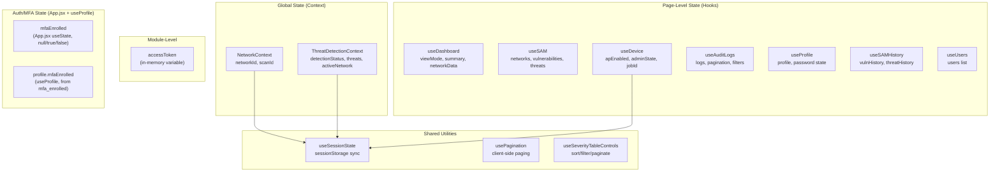

# State Management

> **Primary Pattern:** React Context API + Custom Hooks  
> **Persistence:** `sessionStorage` via `useSessionState` hook  
> **No external state library** (no Redux, Zustand, MobX, etc.)  
> **Last Updated:** 2026-06-22

> MFA enforcement mechanics (AAL2, TOTP) are documented in
> [`AUTHENTICATION_AND_AUTHORIZATION.md` §11](./AUTHENTICATION_AND_AUTHORIZATION.md#11-multi-factor-authentication-totp).
> This file covers only where MFA-related state lives.

---

## 1. State Management Architecture



---

## 2. Context Providers

### NetworkContext (`src/context/NetworkContext.jsx`)

**Purpose:** Persists the currently selected `network_id` and `scan_id` across page navigations and browser refreshes.

**Storage Key:** `wf:networkScan`

| State | Type | Default | Description |
|-------|------|---------|-------------|
| `networkId` | `string \| null` | `null` | Selected network UUID |
| `scanId` | `string \| null` | `null` | Selected scan ID |

**Provided Values:**

| Name | Type | Description |
|------|------|-------------|
| `networkId` | getter | Current network ID |
| `scanId` | getter | Current scan ID |
| `setNetworkId(id)` | setter | Set network (auto-resets `scanId` on change) |
| `setScanId(id)` | setter | Set scan ID |
| `setNetworkScan(nId, sId)` | setter | Set both atomically |
| `clearNetworkScan()` | setter | Reset both to null (logout) |

**Provider Position:** Wraps the entire app (above Router).

**Key Behavior:** When `networkId` changes, `scanId` is automatically reset to `null` to prevent network/scan mismatch.

---

### ThreatDetectionContext (`src/context/ThreatDetectionContext.jsx`)

**Purpose:** Global threat detection state shared between Sidebar (indicator), SAM page (controls), and other consumers. Runs a single polling loop for the entire app.

**Storage Key:** `wf:activeNetwork`

| State | Type | Source | Description |
|-------|------|--------|-------------|
| `detectionStatus` | `string` | `useThreatDetection` | `IDLE \| SCANNING \| DETECTING \| FAILED` |
| `detectionResults` | `object` | Poll response | Latest raw poll data |
| `liveThreats` | `array` | Poll response | Current poll's mapped threats |
| `displayThreats` | `array` | Accumulated | Merged threats across polls |
| `failureReason` | `string` | Backend state | Error description |
| `backendState` | `object` | `/detect/status` | Full backend detection state row |
| `lastUpdated` | `number` | `Date.now()` | Timestamp of last state change |
| `activeNetwork` | `string` | Resolved | Backend SSID → session cache fallback |

**Provider Position:** Wraps protected routes only (inside auth gate, around Sidebar + main content).

**Key Behavior:**
- `activeNetwork` resolves from: backend state SSID → sessionStorage cache → null
- `lastUpdated` bumps whenever `detectionStatus` or `detectionResults` change
- Provides `timeAgo()` utility for human-readable timestamps

---

## 2a. Auth / MFA State

| State | Owner | Type | Description |
|-------|-------|------|-------------|
| `mfaEnrolled` | `src/App.jsx` (`useState`) | `null \| boolean` | `null` = not yet known; `false` triggers a persistent redirect to `/mfa-setup` on every render; bootstrapped from `GET webapp/users/profiles/me` (AAL2-exempt) and fails open (`true`) on fetch error |
| `profile.mfaEnrolled` | `useProfile` hook (`src/hooks/useProfile.js:31`) | `boolean` | Maps backend `mfa_enrolled` column; drives the Profile page's "Two-Factor Authentication" card badge |

> Enforcement is always server-side via the JWT `aal` claim (`requireAAL2` middleware) — this client-side state is UX routing only. Full mechanics: [`AUTHENTICATION_AND_AUTHORIZATION.md` §11](./AUTHENTICATION_AND_AUTHORIZATION.md#11-multi-factor-authentication-totp).

---

## 3. Custom Hooks — State Ownership

### useSessionState (`src/hooks/useSessionState.js`)

**Pattern:** Drop-in replacement for `useState` that syncs with `sessionStorage`.

**Key Design:**
- Uses versioned envelope format: `{ v: 1, value: ... }`
- Tab-scoped (auto-clears on tab close)
- Supports functional updates: `setValue(prev => next)`
- SSR/build safe: guards against missing `window`
- `clearSessionState()` wipes all `wf:*` keys (called on logout)

**Used By:**
- `NetworkContext` → `wf:networkScan`
- `ThreatDetectionContext` → `wf:activeNetwork`
- `useDevice` → `wf:ap-job-id:{networkId}`, `wf:ap-job-status:{networkId}`, `wf:ap-target:{networkId}`

---

### useDashboard (`src/hooks/useDashboard.js`)

| State | Lifecycle | Persistence |
|-------|-----------|-------------|
| `viewMode` | Resets on unmount | In-memory |
| `summary` | Fetched on mount (summary view) | In-memory |
| `networkData` | Fetched when network selected | In-memory |
| `networks` | Fetched once on mount | In-memory |
| `scanList` | From per-network response | In-memory |
| `selectedScanId` | Resets when network changes | In-memory |
| `hoverContext` | Transient UI state | In-memory |

**Data fetching:** Triggers on `viewMode` or `selectedScanId` change via `useEffect`.

---

### useDevice (`src/hooks/useDevice.js`)

| State | Lifecycle | Persistence |
|-------|-----------|-------------|
| `networkConfig` | Fetched from DB on mount | In-memory |
| `adminState` | Polled every 12s when AP enabled | In-memory |
| `apEnabled` | From admin state | In-memory |
| `portalInitialized` | From admin state | In-memory |
| `jobId` | Set on ACCEPTED, cleared on completion | `sessionStorage` |
| `jobStatus` | Tracks async job state | `sessionStorage` |
| `targetApStatus` | "enable" or "disable" | `sessionStorage` |
| `apLiveStatus` | From live Pi poll | In-memory |
| `apLiveConfirmed` | True when Pi confirms state | In-memory |

**Polling cascade:**
1. Submit toggle → get `job_id` (ACCEPTED)
2. Poll `/device/jobs/{jobId}` every 2.5s until DONE/FAILED
3. Poll `/device/ap-live` every 3s to confirm Pi state
4. Refresh admin state from DB

---

### useSAM / useThreatDetection (`src/hooks/useSAM.js`)

| State | Lifecycle | Persistence |
|-------|-----------|-------------|
| `networks` | Fetched on mount | In-memory |
| `vulnerabilities` | Fetched per-BSSID selection | In-memory |
| `threats` | Static mock + API | In-memory |
| `detectionStatus` | Bootstrapped from `/detect/status` | In-memory |
| `displayThreats` | Accumulated across polls | In-memory |
| `backendState` | From `/detect/status` | In-memory |

**Clear mechanism:** `clearVulnerabilities(bssid)` stores timestamp in `localStorage` under `sam_cleared_{BSSID}`. Subsequent loads filter out older results.

---

### useAuditLogs (`src/hooks/useAuditLogs.js`)

| State | Lifecycle | Persistence |
|-------|-----------|-------------|
| `logs` | Server-paginated fetch | In-memory |
| `page`, `total` | Server-driven pagination | In-memory |
| `search` | Debounced (300ms) client input | In-memory |
| `statusFilter` | SUCCESS/FAILED filter | In-memory |
| `fromDate`, `toDate` | Date range filter | In-memory |
| `isExporting` | Export progress | In-memory |
| `lastExportRef` | Rate limiting timestamp | In-memory (ref) |

---

## 4. State Persistence Strategy

| Strategy | Mechanism | Scope | Cleared On |
|----------|-----------|-------|------------|
| **In-memory (module)** | Module-level `let accessToken` | Process lifetime | Page refresh, logout |
| **In-memory (React)** | `useState` | Component lifetime | Unmount, page refresh |
| **sessionStorage** | `useSessionState` with `wf:` prefix | Tab lifetime | Tab close, logout (`clearSessionState`) |
| **localStorage** | Direct `localStorage.setItem` | Persistent | Manual clear only |

### sessionStorage Keys

| Key | Owner | Data |
|-----|-------|------|
| `wf:networkScan` | `NetworkContext` | `{ networkId, scanId }` |
| `wf:activeNetwork` | `ThreatDetectionContext` | Network SSID string |
| `wf:ap-job-id:{networkId}` | `useDevice` | Job UUID |
| `wf:ap-job-status:{networkId}` | `useDevice` | Job status string |
| `wf:ap-target:{networkId}` | `useDevice` | "enable" or "disable" |

### localStorage Keys

| Key Pattern | Owner | Data |
|-------------|-------|------|
| `sam_cleared_{BSSID}` | `useVulnerabilities` | ISO timestamp of clear action |

---

## 5. Cache Behavior

| Data | Cache Strategy | Invalidation |
|------|---------------|-------------|
| Network list | Fetched once on mount | Page refresh |
| Dashboard summary | Re-fetched on view mode change | Manual navigation |
| Admin state | Polled every 12s when AP enabled | Toggle, unmount |
| Audit logs | Server-paginated, no client cache | Filter/page change |
| Vulnerabilities | Per-BSSID fetch, no cache | Network selection change |
| Profile | Fetched once on mount per component | Page refresh |
| Detection status | Bootstrapped once + 3s polling | Status change, stop |

---

## 6. Derived State

| Derived Value | Source | Computation |
|--------------|--------|-------------|
| `isAuthenticated` | `getAccessToken()` | `!!getAccessToken()` |
| `isSummary` | `viewMode` | `viewMode === "Summary"` |
| `isJobActive` | `jobId`, `jobStatus` | `!!(jobId && jobStatus && !['DONE','FAILED'].includes(jobStatus))` |
| `effectiveAccessPoint` | `apEnabled`, `networkConfig` | Object with status/network info |
| `resolvedActiveNetwork` | `backendState`, session cache | Backend SSID → cache → null |
| `samIndicator` | `detectionStatus`, `displayThreats` | JSX for sidebar dot/badge |
| `totalPages` | `total`, `limit` | `Math.ceil(total / limit)` |

---

## 7. State Flow Diagram

```mermaid
graph LR
    subgraph "User Action"
        UA[Click / Input]
    end

    subgraph "Hook"
        H[Custom Hook]
        LS[Local State]
    end

    subgraph "API"
        API[API Module]
        AX[Axios]
    end

    subgraph "Backend"
        BE[Express]
        DB[Supabase]
    end

    subgraph "Context"
        CTX[Context Provider]
        SS[sessionStorage]
    end

    UA --> H
    H --> LS
    H --> API
    API --> AX
    AX --> BE
    BE --> DB
    DB --> BE
    BE --> AX
    AX --> API
    API --> H
    H --> LS
    H --> CTX
    CTX --> SS
```

---

## ⚠️ Needs Verification

- **`localStorage` usage for SAM clear**: The `sam_cleared_{BSSID}` key persists across sessions — verify if this is intentional (it survives logout)
- **Concurrent tab behavior**: `sessionStorage` is tab-scoped, so two tabs may have different network/scan selections — verify if this is acceptable
- **Memory leaks**: Several hooks use `setInterval` and `setTimeout` — cleanup is implemented via `useEffect` returns and `mountedRef`, but edge cases should be tested
