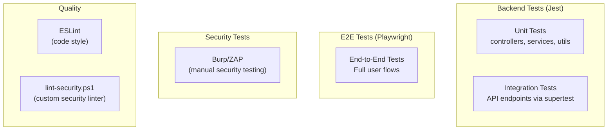

# Testing & Quality Assurance

> **Test Frameworks:** Jest 30 (backend), Playwright 1.58 (E2E)  
> **No frontend unit tests** (React Testing Library / Vitest not configured)

---

## 1. Test Architecture Overview



---

## 2. Backend Testing (Jest)

### Configuration

**File:** `backend/jest.config.js`

| Setting | Value |
|---------|-------|
| Test runner | Jest 30.2.0 |
| HTTP testing | Supertest 7.2.2 |
| Test directory | `backend/__tests__/` |
| Test pattern | `*.test.js` |

### Test Commands

| Command | Description |
|---------|-------------|
| `cd backend && npm test` | Run all tests |
| `npm run test:unit` | Unit tests only (`--testPathPattern=unit`) |
| `npm run test:integration` | Integration tests only (`--testPathPattern=integration`) |
| `npm run test:coverage` | Tests with coverage report |
| `npm run test:watch` | Watch mode |

### Test Directory Structure

```
backend/__tests__/
├── unit/                    # Isolated function/module tests
│   ├── controllers/         # Controller logic tests
│   ├── services/            # Service layer tests
│   └── utils/               # Utility function tests
└── integration/             # Full HTTP request tests
    └── routes/              # Express route tests via supertest
```

### Coverage

| Metric | Target |
|--------|--------|
| Lines | Not specified |
| Branches | Not specified |
| Functions | Not specified |
| Statements | Not specified |

> **Note:** Coverage thresholds are not configured in `jest.config.js`. Run `npm run test:coverage` to generate a report.

---

## 3. E2E Testing (Playwright)

### Configuration

**File:** `playwright.config.js`

| Setting | Value |
|---------|-------|
| Test directory | `./e2e` |
| Timeout | 30,000ms |
| Base URL | `http://localhost:5173` |
| Browser | Chromium only |
| Headless | `true` (default) |
| Screenshots | Only on failure |
| Traces | Retain on failure |
| Retries | 0 |
| Workers | 1 (sequential) |

### Auto-Started Web Servers

| Server | Command | Port | Timeout |
|--------|---------|------|---------|
| Backend | `cd backend && node server.js` | 3000 | 15,000ms |
| Frontend | `npm run dev` | 5173 | 15,000ms |

### Test Commands

| Command | Description |
|---------|-------------|
| `npm run test:e2e` | Headless E2E tests |
| `npm run test:e2e:headed` | Visual browser tests |
| `npm run test:e2e:ui` | Playwright UI mode |
| `npx playwright show-report` | View HTML report |

### E2E Test Structure

```
e2e/
├── *.spec.js                # Test files
└── ...
```

### Typical E2E Flow

```javascript
// Example: Login flow test
test('user can log in', async ({ page }) => {
  await page.goto('/login');
  await page.fill('input[type="email"]', 'test@example.com');
  await page.fill('input[type="password"]', 'TestPass123!');
  await page.click('button[type="submit"]');
  await expect(page).toHaveURL('/dashboard');
});
```

---

## 4. Security Testing

### Custom Security Linter

**File:** `backend/scripts/lint-security.ps1`

```bash
npm run lint:security  # PowerShell script
```

### External Tools (from README)

| Tool | Purpose | Status |
|------|---------|--------|
| Burp Suite | API security testing | Manual |
| OWASP ZAP | Automated vulnerability scanning | Manual |

---

## 5. Code Quality (ESLint)

### Configuration

**File:** `eslint.config.js`

| Setting | Value |
|---------|-------|
| Parser | Default (ES2020) |
| Environment | Browser, globals |
| Extends | `recommended`, `react-hooks`, `react-refresh` |
| Custom rules | `no-unused-vars` ignores uppercase/underscore-prefixed |
| Ignored | `dist/` |

### Lint Command

```bash
npm run lint
```

---

## 6. Frontend Testing Gap Analysis

### Current State

| Category | Framework | Status |
|----------|-----------|:------:|
| Unit tests (frontend) | None | ❌ Not configured |
| Component tests | None | ❌ Not configured |
| Hook tests | None | ❌ Not configured |
| Integration tests (frontend) | None | ❌ Not configured |
| E2E tests | Playwright | ✓ Configured |

### Recommended Additions

| Priority | Test Area | Recommended Tool | Rationale |
|:--------:|-----------|-----------------|-----------|
| High | Custom hooks | Vitest + `@testing-library/react` | `useDevice` and `useSAM` have complex state machines |
| High | API interceptor | Vitest + Mock Service Worker | Token refresh logic is critical path |
| Medium | Form validation | Vitest + RTL | Password validation, login form |
| Medium | Context providers | Vitest + RTL | `NetworkContext`, `ThreatDetectionContext` |
| Low | UI components | Vitest + RTL | Tables, modals, sidebar |

---

## 7. Testability Concerns

### Highly Testable (Good Patterns)

| Pattern | Why |
|---------|-----|
| Custom hooks extract logic from components | Can test hooks independently |
| API modules are separate from hooks | Can mock API layer |
| Pure utility functions (`pollUntil`, `passwordValidation`) | Easy to unit test |
| Context providers are isolated | Can test state management |

### Challenging to Test

| Area | Challenge |
|------|-----------|
| `useDevice` reconciliation logic | Complex state machine with multiple timers, polling loops, and sessionStorage |
| Token refresh interceptor | Singleton `isRefreshing` flag + promise queue requires careful mocking |
| `reportTemplates.js` | Generates full HTML documents; output validation is complex |
| Supabase auth integration | `supabase.auth.signInWithPassword()` requires mocking Supabase client |
| AP job cascade | Multi-step async flow: submit → job poll → live poll → admin refresh |

---

## 8. Manual QA Checklist

### Authentication Flows

- [ ] Login with valid credentials → redirects to dashboard
- [ ] Login with invalid credentials → shows error message
- [ ] Login with on_hold account → shows "account on hold" error
- [ ] Login with inactive account → shows deactivated error
- [ ] Login with must_change_password → redirects to force-reset page
- [ ] Force-reset: enter new password → clears flag, redirects to dashboard
- [ ] Forgot password → sends email → reset link → new password
- [ ] Session refresh on page reload (protected routes)
- [ ] Auto-logout on refresh token expiry

### Multi-Factor Authentication (MFA)

- [ ] Fresh account login → forced to `/mfa-setup` → scan QR → verify → reaches dashboard
- [ ] Logout/login again → MFA challenge appears → correct code → dashboard
- [ ] Wrong code 3x → error shown, no account lockout (only challenge retry)
- [ ] `aal1` token directly against an AAL2-gated route (curl) → 403 `MFA_REQUIRED`
- [ ] Superadmin resets another user's MFA → that user forced through `/mfa-setup` again on next login
- [ ] Re-enroll (new device) via Profile → old factor replaced, AAL2 still enforced

### Dashboard

- [ ] Summary view loads with charts
- [ ] Network view shows per-network data
- [ ] Network dropdown switches data
- [ ] Scan date dropdown loads specific scan
- [ ] Chart hover highlights linked elements

### SAM

- [ ] Network list loads from backend
- [ ] Selecting network loads vulnerabilities
- [ ] Vulnerability detail modal opens with recommendations
- [ ] Threat detection starts successfully
- [ ] Live threats appear in real-time during detection
- [ ] Stop detection with reason code
- [ ] PDF export (overall and per-network)
- [ ] Clear vulnerabilities list

### Device Management

- [ ] Network config displays correctly
- [ ] Enable AP with password → async job → success
- [ ] Disable AP → async job → success
- [ ] Portal update (announcement, terms, tips)
- [ ] Error handling for device unreachable

### Accounts & Audit (Superadmin)

- [ ] User list loads
- [ ] Edit user role
- [ ] Activate user with temp password
- [ ] Deactivate user (with/without anonymize)
- [ ] Reactivate user
- [ ] Audit logs load with pagination
- [ ] Search, filter, date range
- [ ] CSV export

### Mobile Responsiveness

- [ ] Sidebar collapses to hamburger on mobile
- [ ] All pages render correctly on narrow viewports
- [ ] Tables scroll horizontally or stack
- [ ] Modals are accessible on mobile

---

## 9. Performance Considerations

| Area | Current State | Recommendation |
|------|--------------|----------------|
| Bundle size | No code splitting | Consider `React.lazy()` for large pages |
| Network requests | Multiple concurrent on mount | Consider request deduplication |
| Polling intervals | 3s (detection), 12s (admin state) | Appropriate for real-time monitoring |
| Chart rendering | Recharts renders all data | Consider virtualization for large datasets |
| Re-renders | Context updates may trigger wide re-renders | Profile with React DevTools |

---

## ⚠️ Needs Verification

- **E2E test coverage**: Actual test files in `e2e/` directory were not fully inspected — verify which flows are covered
- **Backend test coverage**: Actual test files in `backend/__tests__/` were not fully inspected — run `npm run test:coverage` for a report
- **Security lint script**: `lint-security.ps1` is Windows-specific (PowerShell) — verify cross-platform compatibility
- **CI integration**: No CI configuration files found — verify if tests run automatically on push/PR
