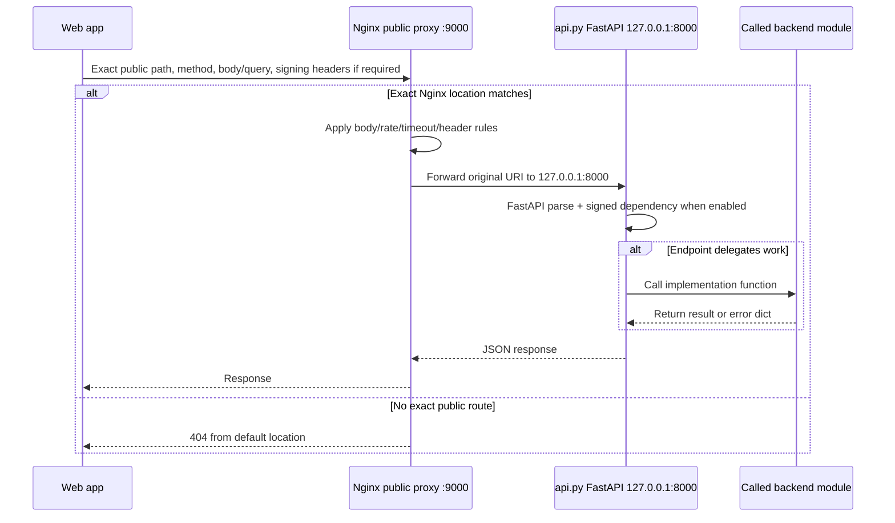

# API_PY_AND_PUBLIC_PROXY_CONTEXT

## Purpose of This Document

This file documents the local `api.py` backend and the public-facing Nginx proxy server used by the web app to reach that backend.

The goal is to provide enough implementation-validated context for web app integration and debugging without documenting the full product or unrelated services.

## Scope and Evidence Rules

This document only records behavior supported by repository files or inspected local configuration files.

Evidence labels used throughout:

| Label | Meaning |
|---|---|
| Confirmed from implementation | Behavior is directly visible in `api.py` or a directly called Python module. |
| Confirmed from proxy configuration | Behavior is directly visible in the inspected Nginx configuration. |
| Inferred from file relationships | Behavior follows from how inspected files reference each other, but was not live-tested. |
| Needs Verification | Repository or configuration evidence is incomplete, deployment-specific, or not live-verified. |
| Out of Scope | Not part of this document's `api.py` and public Nginx proxy focus. |

No fake request data, fake response data, fake public URLs, fake IP addresses, or invented status codes are used here. When an exact output shape is not fully determined from files, it is marked `Needs Verification`.

Browser-captive-portal files, separate browser-facing state routes, and unrelated frontend implementation details are Out of Scope.

## Reviewed Files

| File Path | Role | Why It Matters | Evidence Type | Notes |
|---|---|---|---|---|
| `api.py` | Local FastAPI backend implementation | Defines `app`, route handlers, local state, caches, jobs, validation, and response envelopes | Confirmed from implementation | Main source for local endpoint behavior. |
| `security_signed.py` | Signed-request FastAPI dependency | Defines HMAC headers, timestamp, nonce, body-hash, signature checks, and signing-related errors | Confirmed from implementation | Used by all `api.py` endpoints except `GET /portal/state`. |
| `device_status.py` | Device status builder | Defines direct structure returned through `GET /device/status` after Kismet status is available | Confirmed from implementation | Called by `api.py`. |
| `dispatcher.py` | Scan and detector-control dispatcher | Validates scan payloads, starts/stops detector state, returns scan/control result dictionaries | Confirmed from implementation | Called by `POST /scan` and `POST /detect/control`. |
| `scanner.py` | Kismet-backed target scan implementation | Defines scan result fields returned through `dispatcher.dispatch` | Confirmed from implementation | Called by `dispatcher.py`, not directly by `api.py`. |
| `discovery.py` | Network discovery implementation | Defines network list item fields returned through `GET /networks` | Confirmed from implementation | Called by `api.py`. |
| `kismet_control.py` | Kismet readiness helper | Defines Kismet readiness/error payloads used before status, network, scan, and orchestration work | Confirmed from implementation | May include operational diagnostics in returned `detail` objects. |
| `orchestrator.py` | Uplink/AP orchestration implementation | Defines synchronous orchestration result shape returned by `POST /orchestrate/apply` | Confirmed from implementation | Called by `api.py` through `_apply_orchestration_and_sync`. |
| `ap_runtime.py` | AP readiness snapshot helper | Defines `ap_ready()` fields used by `GET /ap/poll` | Confirmed from implementation | Called by `api.py`. |
| `agent_state.py` | Process-local shared state container | Defines detector queue, thread, target, and last-error fields used by scan/detect endpoints | Confirmed from implementation | Instantiated as `state = AgentState()` in `api.py`. |
| `/etc/nginx/sites-available/wifi-agent-gateway` | Public Nginx gateway configuration | Defines listen port, exact public paths, upstream target, headers, timeouts, body limits, and rate limits | Confirmed from proxy configuration | Inspected read-only; deployment equivalence still needs verification. |
| `/etc/nginx/sites-enabled/wifi-agent-gateway` | Enabled Nginx site symlink | Shows the inspected gateway is linked from `sites-enabled` | Confirmed from proxy configuration | Symlink points to `/etc/nginx/sites-available/wifi-agent-gateway`. |
| `/etc/nginx/nginx.conf` | Global Nginx configuration | Includes `/etc/nginx/sites-enabled/*`, global logs, gzip, SSL protocol defaults, and worker settings | Confirmed from proxy configuration | Does not itself define the API routes. |
| `/etc/systemd/system/wifi-py-agent.service` | Local backend service definition | Shows `uvicorn api:app --host 127.0.0.1 --port 8000 --workers 1` | Confirmed from local configuration | Active runtime state was not checked. |
| `/etc/systemd/system/nginx.service.d/override.conf` | Nginx service override | Shows restart behavior and network-online ordering | Confirmed from local configuration | Does not prove current service health. |
| `DOCS/NGINX_PROXY_CONTEXT.md` | Existing proxy documentation | Existing written context for public proxy behavior | Inferred from file relationships | Used as supporting context only, not as a substitute for config. |
| `tests/test_proxy_server.py` | Proxy behavior test script | Shows expected target default `http://127.0.0.1:9000` and expected throttle code assumptions | Inferred from file relationships | Not executed. |

## Local `api.py` Backend Overview

| Area | Evidence in `api.py` | Behavior | Integration Impact | Notes |
|---|---|---|---|---|
| FastAPI app | `app = FastAPI()` | `api.py` creates the FastAPI application object named `app`. | The service file can run `uvicorn api:app`. | Confirmed from implementation. |
| Route definitions | `@app.get` / `@app.post` decorators | Ten local endpoints are defined. | Web app calls only the endpoints exposed by Nginx, not every local endpoint. | Confirmed from implementation. |
| Middleware | No `app.add_middleware(...)` found in `api.py` | No explicit middleware setup was found. | Cross-origin browser behavior is not handled by backend middleware in `api.py`. | Confirmed from implementation. |
| CORS | No `CORSMiddleware` setup found in `api.py` | `api.py` does not configure CORS in inspected code. | Cross-origin browser calls may fail unless another layer handles CORS. | Confirmed from implementation; live behavior Needs Verification. |
| Signed requests | `Depends(verify_signed_request)` on most routes | All routes except `GET /portal/state` use the signed-request dependency. | Web app/control clients must send signing headers when signing enforcement is enabled. | Confirmed from implementation. |
| Signing enforcement flag | `security_signed.py` reads `CONTROL_REQUIRE_SIGNED` | If false, the dependency returns without checking signatures. If true, it checks headers/body/timestamp/nonce/signature. | Unsigned requests may work only when enforcement is disabled. | Confirmed from implementation; deployed env Needs Verification. |
| Global exception handling | `@app.exception_handler(Exception)` | Unhandled exceptions return JSON status `500`; debug mode can include redacted request data and traceback tail. | Some backend crashes produce structured JSON instead of default HTML/text. | Confirmed from implementation. |
| Startup/shutdown | No startup/shutdown handlers found | No explicit FastAPI lifecycle hook was found in `api.py`. | Caches and process-local state initialize at import time. | Confirmed from implementation. |
| Device cache | `_device_cache`, `DEVICE_CACHE_TTL_SEC = 2.0` | Device status responses are cached briefly. | Repeat `GET /device/status` can return `cached: True`. | Confirmed from implementation. |
| Network cache | `_networks_cache`, `NETWORKS_CACHE_TTL_SEC = 1.5` | Network list responses are cached briefly. | Repeat `GET /networks` can return cached data. | Confirmed from implementation. |
| Scan serialization | `_scan_lock = asyncio.Lock()` | `/scan` and `/detect/control` cannot run concurrently within one process. | Concurrent web app actions may wait on each other. | Confirmed from implementation. |
| Async orchestration jobs | `_orch_jobs`, `ORCH_MAX_JOBS`, `ORCH_MAX_ACTIVE_JOBS`, `ORCH_JOB_TTL_SEC` | Async orchestration job state is in memory only. | Jobs disappear after process restart or pruning. | Confirmed from implementation. |
| Portal state cache | `_portal_cache`, `_portal_lock` | Portal state is process-local RAM data. | Local `/portal/state` reflects current process memory only. | Confirmed from implementation. |
| Local host/port | Service file runs `--host 127.0.0.1 --port 8000` | Local backend is configured to bind loopback port `8000`. | Nginx upstream target is `127.0.0.1:8000`. | Confirmed from local configuration; live process state Needs Verification. |
| Public access design | Nginx exact routes forward to backend | Public web app integration should use Nginx public paths, not direct `127.0.0.1:8000` from a remote browser. | Prevents path/host confusion. | Confirmed from proxy configuration and service file relationship. |

## Endpoint Inventory from `api.py`

| Method | Local/Internal Path | Function Name | Purpose | Request Input | Response Output | Validation Status | Source Evidence |
|---|---|---|---|---|---|---|---|
| GET | `/device/status` | `device_status` | Return device/runtime/Kismet status | Signed-request headers when required | Device status dict from `build_device_status`, plus `cached`; or direct error dict | No endpoint query/body input; signing delegated | `api.py`, `device_status.py`, `security_signed.py` |
| GET | `/networks` | `networks` | Return discoverable Wi-Fi networks | Signed-request headers when required | Direct envelope containing `status`, `networks`, `cached`, optional warning/detail/error | No endpoint query/body input; discovery delegated | `api.py`, `discovery.py`, `kismet_control.py` |
| POST | `/scan` | `scan` | Dispatch scan/detection operation | JSON body parsed as `dict`; signed headers when required | Dispatcher/scanner result or direct Kismet/handler error | `api.py` checks Kismet status; scan payload validation delegated to `dispatcher.dispatch` | `api.py`, `dispatcher.py`, `scanner.py` |
| POST | `/detect/control` | `detect_control` | Stop/control detector | JSON body parsed as `dict`; signed headers when required | Detector-control result from `control_detection` or direct handler error | `api.py` checks object type and coerces `action`/`drain_queue`; action validation delegated | `api.py`, `dispatcher.py` |
| GET | `/detect/poll` | `detect_poll` | Drain queued detector results | Optional query `max_items:int=50`; signed headers when required | Direct dict with `running`, `target_bssid`, `last_error`, `results` | FastAPI int parsing only; no explicit bounds in `api.py` | `api.py`, `agent_state.py` |
| GET | `/ap/poll` | `ap_poll` | Return AP readiness snapshot | Signed-request headers when required | Direct envelope with AP snapshot or direct fallback error envelope | No endpoint input; AP snapshot delegated | `api.py`, `ap_runtime.py` |
| POST | `/orchestrate/apply` | `orchestrate_apply` | Apply uplink/AP orchestration sync or async | JSON body parsed as `dict`; optional `"async"` flag; signed headers when required | Sync result from orchestrator or direct async/error envelope | `api.py` validates object type and async job caps; orchestration payload semantics delegated | `api.py`, `orchestrator.py` |
| GET | `/orchestrate/poll` | `orchestrate_poll` | Poll async orchestration job | Required query `job_id:str`; signed headers when required | Direct job status/result/error envelopes | `api.py` strips and regex-validates `job_id` | `api.py` |
| POST | `/portal/patch` | `portal_patch` | Apply in-memory portal content patch | JSON body parsed as `dict`; `network_id`; `patch`; signed headers when required | Direct success/error envelopes | `api.py` validates size, object shape, required fields, patch object, key count, depth | `api.py` |
| GET | `/portal/state` | `portal_state` | Return local portal runtime state | No signed dependency; no request body | Direct synthesized local state from `_get_portal_data_for_current_unlocked()` | No request input validation needed | `api.py` |

## Detailed Endpoint Implementation Context

### `GET /device/status`

- Source file: `api.py`
- Function name: `device_status`
- Local/internal API path: `/device/status`
- Public proxy path used by web app: `/device/status`
- HTTP method: `GET`
- Purpose: Return current device/runtime/Kismet status.
- Request source: Query/body are not used by `api.py`; signed headers may be required by `security_signed.py`.
- Required query parameters: None.
- Optional query parameters: None.
- Required path parameters: None.
- Required request body: None.
- Optional request body fields: None.
- Input accepted by endpoint: request metadata consumed by `verify_signed_request` when enforcement is enabled.
- Input parsed by FastAPI/type hints: dependency injection only.
- Input explicitly validated in `api.py`: none beyond dependency requirement.
- Input not explicitly validated in `api.py`: any query string is not semantically used by `api.py`; signing dependency includes the path and query string in the canonical signature when enabled.
- Imported module/function called: `ensure_kismet_running()` from `kismet_control.py`; `build_device_status(ks)` from `device_status.py`.
- Data passed to imported module/function: Kismet status dict from `ensure_kismet_running()` is passed into `build_device_status()`.
- Response returned directly by `api.py`: cached response copy with `cached: True`; uncached response with `cached: False`; direct exception envelope.
- Response returned by called module/function: base device status structure is returned by `build_device_status()`.
- Fully confirmed response shape: `build_device_status()` returns `status`, `device`, `network`, `services`; `api.py` adds `cached`.
- Partially confirmed response shape: Kismet `services.kismet.status/message` values are dynamic.
- Unknown/Needs Verification response details: live device model, hostname, uptime, internet reachability, and Kismet status values.
- Explicit error responses raised by `api.py`: none raised; exceptions are caught and returned as a dict.
- FastAPI-generated error responses: signing dependency can raise HTTP errors; wrong method can generate `405`.
- Proxy/Nginx-generated error responses: Nginx can return 404 for wrong path, throttle status for rate limiting, and upstream errors if backend is unreachable.
- Status codes confirmed by implementation: successful route returns default `200`; exception envelope also returns default `200` because it is a dict.
- Status codes that need verification: live proxy/upstream failures and Nginx rate-limit status.
- CORS considerations: no `CORSMiddleware` found in `api.py`; no CORS headers found in inspected Nginx gateway.
- Rate limit considerations: public proxy uses `read_zone` with `burst=20`.
- Proxy considerations: exact public path is `/device/status`; `/api/device/status` and `/device/status/` do not match the exact Nginx location.
- Web app integration notes: call `GET /device/status` on the proxy base URL and include signing headers if signing enforcement is enabled.
- Common frontend mistakes: using `/api` prefix; using a trailing slash; omitting signing headers when required; treating an application-level `{"status":"ERROR"}` body as an HTTP non-200.
- Needs Verification: deployed signing env, live backend service state, public host/IP, and actual Kismet readiness.

| Input Field/Parameter | Required? | Accepted By | Explicitly Validated in `api.py`? | Validation Evidence | Notes |
|---|---|---|---|---|---|
| Signing headers | Required only when `CONTROL_REQUIRE_SIGNED` is truthy | `security_signed.py` dependency | No | `api.py` uses `Depends(verify_signed_request)`; validation is in `security_signed.py` | Headers: `X-Control-Timestamp`, `X-Control-Nonce`, `X-Control-Body-SHA256`, `X-Control-Signature`. |
| Query string | No | FastAPI request object/dependency | No | Handler has no query parameters | If signing is enabled, query string is included in signature canonical path. |
| Request body | No | HTTP client/FastAPI | No | Handler has no body parameter | A body on a GET is not used by handler logic. |

| Output / Response Case | Source of Output | Confirmed Fields | Status Code | Fully Determined? | Notes |
|---|---|---|---|---|---|
| Fresh success | Returned directly by `api.py` and called module | `status`, `device`, `network`, `services`, `cached` | 200 | Partially | `device_status.py` defines nested fields; values are runtime-dependent. |
| Cached success | Returned directly by `api.py` | Same cached payload plus `cached: True` | 200 | Partially | Cached data copied from prior result. |
| Handler exception | Returned directly by `api.py` | `status`, `error`, `detail`, `cached` | 200 | Yes | Error string is `device_status exception`; `detail` is `repr(e)`. |
| Signing disabled | Returned by called module | No response fields; dependency returns `None` | N/A | Yes | Request proceeds. |
| Signing secret missing while required | Generated by FastAPI | `detail` | 500 | Yes | Detail is `signing_secret_not_set` from `security_signed.py`. |
| Missing/bad signature inputs | Generated by FastAPI | `detail` | 401 | Yes | Details include `missing_signature_headers`, `bad_timestamp`, `timestamp_out_of_range`, `bad_body_hash`, `bad_signature`, `replay_detected`. |
| Wrong method | Generated by FastAPI or proxy/Nginx | `detail` if FastAPI handles it | 405 or proxy-dependent | Partially | Exact proxy location may still forward wrong method to FastAPI unless Nginx rejects first. |
| Proxy rate limit | Generated by proxy/Nginx | Needs Verification | Needs Verification | Needs Verification | Nginx config uses `limit_req`; no `limit_req_status` directive found in inspected gateway. |
| Backend unreachable | Generated by proxy/Nginx | Needs Verification | Needs Verification | Needs Verification | Depends on live Nginx defaults and backend state. |

### `GET /networks`

- Source file: `api.py`
- Function name: `networks`
- Local/internal API path: `/networks`
- Public proxy path used by web app: `/networks`
- HTTP method: `GET`
- Purpose: Return a list of discoverable Wi-Fi networks.
- Request source: Query/body are not used by `api.py`; signed headers may be required.
- Required query parameters: None.
- Optional query parameters: None.
- Required path parameters: None.
- Required request body: None.
- Optional request body fields: None.
- Input accepted by endpoint: request metadata consumed by signed dependency when enabled.
- Input parsed by FastAPI/type hints: dependency injection only.
- Input explicitly validated in `api.py`: none.
- Input not explicitly validated in `api.py`: any query string is not used by handler logic.
- Imported module/function called: `wifi_ops_lock_is_busy()` from `orchestrator.py`; `ensure_kismet_running()` from `kismet_control.py`; `get_networks(timeout=5)` from `discovery.py`.
- Data passed to imported module/function: `timeout=5` is passed to `get_networks`.
- Response returned directly by `api.py`: envelopes containing `status`, `networks`, `cached`, and optional `warning`, `detail`, or `error`.
- Response returned by called module/function: network list items returned by `discovery.get_networks`.
- Fully confirmed response shape: `api.py` envelope fields; `discovery.py` network items contain `ssid`, `bssid`, `channel`.
- Partially confirmed response shape: `detail` can contain Kismet status dict or exception string.
- Unknown/Needs Verification response details: actual network list values and Kismet availability.
- Explicit error responses raised by `api.py`: none raised; errors are returned as dicts.
- FastAPI-generated error responses: signing dependency errors; wrong method.
- Proxy/Nginx-generated error responses: exact-path 404, rate limiting, upstream timeout/errors.
- Status codes confirmed by implementation: normal and handler error dicts return default `200`.
- Status codes that need verification: proxy rate limit, backend unreachable, timeout behavior.
- CORS considerations: no CORS configured in inspected `api.py` or Nginx gateway.
- Rate limit considerations: public proxy uses `read_zone` with `burst=20`.
- Proxy considerations: exact path only; read timeout is longer than most read routes.
- Web app integration notes: call `GET /networks`; expect `networks` array when status is OK.
- Common frontend mistakes: assuming `networks` exists on every error response; using trailing slash; adding `/api`; treating empty network list as always an error.
- Needs Verification: actual radio/Kismet behavior, deployed signing mode, live timeout behavior.

| Input Field/Parameter | Required? | Accepted By | Explicitly Validated in `api.py`? | Validation Evidence | Notes |
|---|---|---|---|---|---|
| Signing headers | Required only when `CONTROL_REQUIRE_SIGNED` is truthy | `security_signed.py` dependency | No | Validation delegated to `security_signed.py` | Required public-control behavior depends on environment. |
| Query string | No | FastAPI/dependency | No | Handler declares no query parameters | Query string is not semantically used by `api.py`. |
| Request body | No | HTTP client/FastAPI | No | Handler declares no body parameter | Body is not used. |

| Output / Response Case | Source of Output | Confirmed Fields | Status Code | Fully Determined? | Notes |
|---|---|---|---|---|---|
| Cache hit | Returned directly by `api.py` | `status`, `networks`, `cached` | 200 | Partially | `networks` item values come from prior `discovery.py` result. |
| Orchestration busy with cache | Returned directly by `api.py` | `status`, `networks`, `cached`, `warning` | 200 | Partially | Warning is `orchestration_active_using_cache`. |
| Orchestration busy no cache | Returned directly by `api.py` | `status`, `networks`, `cached`, `warning` | 200 | Yes | Returns empty `networks` array and warning `orchestration_active_no_cache`. |
| Kismet unavailable with stale cache | Returned directly by `api.py` | `status`, `networks`, `cached`, `warning`, `detail` | 200 | Partially | `detail` is Kismet status dict. |
| Kismet unavailable no cache | Returned directly by `api.py` | `status`, `error`, `detail` | 200 | Partially | Error is `Kismet not available`; `detail` dynamic. |
| Fresh success | Returned directly by `api.py` and called module | `status`, `networks`, `cached` | 200 | Partially | `networks` list items confirmed as `ssid`, `bssid`, `channel`. |
| Exception with stale cache | Returned directly by `api.py` | `status`, `networks`, `cached`, `warning`, `detail` | 200 | Partially | Warning is `networks_exception_using_stale_cache`; `detail` is `repr(e)`. |
| Exception no cache | Returned directly by `api.py` | `status`, `error`, `detail` | 200 | Yes | Error is `networks handler exception`. |
| Signing failure | Generated by FastAPI | `detail` | 401 or 500 | Yes | Generated by dependency. |
| Proxy rate limit/timeout | Generated by proxy/Nginx | Needs Verification | Needs Verification | Needs Verification | Proxy has `proxy_read_timeout 45s`. |

### `POST /scan`

- Source file: `api.py`
- Function name: `scan`
- Local/internal API path: `/scan`
- Public proxy path used by web app: `/scan`
- HTTP method: `POST`
- Purpose: Dispatch a scan/detection operation.
- Request source: JSON request body parsed as `dict`; signed headers may be required.
- Required query parameters: None.
- Optional query parameters: None.
- Required path parameters: None.
- Required request body: JSON object accepted by FastAPI as `dict`.
- Optional request body fields: `api.py` does not define field-level schema; dispatcher expects `ssid`, `bssid`, `channel`.
- Input accepted by endpoint: any JSON object that FastAPI parses as `dict`.
- Input parsed by FastAPI/type hints: `payload: dict`.
- Input explicitly validated in `api.py`: Kismet status is checked before dispatch; payload field validation is not performed in `api.py`.
- Input not explicitly validated in `api.py`: `ssid`, `bssid`, `channel`, and any extra fields.
- Imported module/function called: `ensure_kismet_running()`; `dispatch(payload, state)`.
- Data passed to imported module/function: raw `payload` dict and module-level `state`.
- Response returned directly by `api.py`: Kismet unavailable envelope; handler exception envelope; otherwise dispatcher result.
- Response returned by called module/function: `dispatcher.dispatch()` result, which may include scanner fields and dispatcher metadata.
- Fully confirmed response shape: direct `api.py` error envelopes; dispatcher validation error fields; scanner success/error fields reviewed in called modules.
- Partially confirmed response shape: scanner dynamic values and optional `_perf` when `TRACE_PERF` is enabled.
- Unknown/Needs Verification response details: live Kismet scan data, detector thread behavior, exact scan findings values.
- Explicit error responses raised by `api.py`: none raised; errors returned as dicts.
- FastAPI-generated error responses: body parsing/type errors, signing errors, wrong method.
- Proxy/Nginx-generated error responses: body too large, rate limiting, upstream timeout/errors.
- Status codes confirmed by implementation: endpoint dict responses default to `200`.
- Status codes that need verification: Nginx body-limit/rate-limit/upstream errors.
- CORS considerations: no CORS configured in inspected backend/proxy.
- Rate limit considerations: public proxy uses `scan_zone` with `burst=2`.
- Proxy considerations: expensive route has `proxy_read_timeout 60s` and exact path only.
- Web app integration notes: send a JSON object to `POST /scan`; include signed headers if required; do not assume HTTP status alone indicates scan success.
- Common frontend mistakes: missing `ssid`/`bssid`/`channel`; invalid BSSID format; channel not parseable as positive integer; using `/api/scan`; trailing slash; omitting body hash/signature when required.
- Needs Verification: live scan duration, Kismet readiness, deployed signing, and exact scanner output for a given environment.

| Input Field/Parameter | Required? | Accepted By | Explicitly Validated in `api.py`? | Validation Evidence | Notes |
|---|---|---|---|---|---|
| JSON body object | Yes | FastAPI `payload: dict` | Partially | Handler receives `payload`; no field-level checks in `api.py` | Non-object JSON may be rejected by FastAPI before handler. |
| `ssid` | Required by dispatcher, not by `api.py` | `dispatcher.dispatch` | No | `dispatcher.py` returns missing-fields error | Passed through by `api.py`. |
| `bssid` | Required by dispatcher, not by `api.py` | `dispatcher.dispatch` | No | `dispatcher.py` validates lowercase colon-separated MAC after normalization | Passed through by `api.py`. |
| `channel` | Required by dispatcher, not by `api.py` | `dispatcher.dispatch` | No | `dispatcher.py` parses int and requires positive value | Passed through by `api.py`. |
| Extra body fields | No | FastAPI/dispatcher payload dict | No | No allowlist in `api.py` | Extra fields are not used by reviewed dispatcher logic. |
| Signing headers | Required only when `CONTROL_REQUIRE_SIGNED` is truthy | `security_signed.py` dependency | No | Validation delegated | Body hash must match exact raw body bytes when enforced. |

| Output / Response Case | Source of Output | Confirmed Fields | Status Code | Fully Determined? | Notes |
|---|---|---|---|---|---|
| Kismet unavailable before dispatch | Returned directly by `api.py` | `dispatch_status`, `error`, `detail` | 200 | Partially | Error is `Kismet not available`; `detail` is Kismet status dict. |
| Dispatch missing fields | Returned by called module | `dispatch_status`, `error`, `detail` | 200 | Yes | Error is `Missing required fields`; detail is `Need SSID, BSSID, Channel`. |
| Dispatch invalid BSSID | Returned by called module | `dispatch_status`, `error`, `detail` | 200 | Partially | Detail includes submitted BSSID representation. |
| Dispatch invalid channel | Returned by called module | `dispatch_status`, `error`, `detail` | 200 | Partially | Detail includes submitted channel representation. |
| Scanner unable to fetch AP devices | Returned by called module | `ssid`, `bssid`, `channel`, `status`, `error`, plus dispatcher metadata | 200 | Partially | Dispatcher mutates scan result after scanner returns. |
| Scanner success | Returned by called module | `ssid`, `bssid`, `channel`, `encryption`, `wps_state`, `mfp_state`, `num_clients`, `status`, `findings`, `scan_start`, `scan_end`, `dispatch_status`, `detection_halted_for_scan`, `detection_started_after_scan`, `detection_target_bssid` | 200 | Partially | Values are dynamic; `_perf` may appear if `TRACE_PERF` truthy. |
| Handler exception | Returned directly by `api.py` | `dispatch_status`, `error`, `detail` | 200 | Yes | Error is `scan handler exception`. |
| Signing/body parse failure | Generated by FastAPI | `detail` | 401, 422, or 500 | Partially | Exact 422 body is FastAPI/Pydantic generated. |
| Proxy body too large | Generated by proxy/Nginx | Needs Verification | 413 | Partially | `client_max_body_size 64k` is configured. Exact body depends on Nginx. |
| Proxy scan throttling | Generated by proxy/Nginx | Needs Verification | Needs Verification | Needs Verification | `limit_req zone=scan_zone burst=2 nodelay`. |
| Proxy read timeout | Generated by proxy/Nginx | Needs Verification | Needs Verification | Needs Verification | `proxy_read_timeout 60s` configured. |

### `POST /detect/control`

- Source file: `api.py`
- Function name: `detect_control`
- Local/internal API path: `/detect/control`
- Public proxy path used by web app: `/detect/control`
- HTTP method: `POST`
- Purpose: Control detector state, currently supporting disable semantics through the dispatcher.
- Request source: JSON request body parsed as `dict`; signed headers may be required.
- Required query parameters: None.
- Optional query parameters: None.
- Required path parameters: None.
- Required request body: JSON object accepted as `dict`.
- Optional request body fields: `action`, `drain_queue`.
- Input accepted by endpoint: any JSON object.
- Input parsed by FastAPI/type hints: `payload: dict`.
- Input explicitly validated in `api.py`: object type check; `action` coerced to lowercase string; `drain_queue` coerced through `_to_boolish`.
- Input not explicitly validated in `api.py`: action semantics beyond coercion; extra fields.
- Imported module/function called: `control_detection(state, action, drain_queue)` from `dispatcher.py`.
- Data passed to imported module/function: module-level `state`, normalized `action`, bool-like `drain_queue`.
- Response returned directly by `api.py`: non-dict payload error and handler exception envelope.
- Response returned by called module/function: structured detector-control result.
- Fully confirmed response shape: `dispatcher.control_detection` success and error shapes.
- Partially confirmed response shape: detector state values are runtime-dependent.
- Unknown/Needs Verification response details: actual detector running/thread state at request time.
- Explicit error responses raised by `api.py`: none raised.
- FastAPI-generated error responses: JSON/body parsing errors, signing errors, wrong method.
- Proxy/Nginx-generated error responses: rate limiting, body too large, upstream errors/timeouts.
- Status codes confirmed by implementation: returned dicts default to `200`.
- Status codes that need verification: proxy-generated statuses and FastAPI 422 exact payload.
- CORS considerations: no CORS configured in inspected backend/proxy.
- Rate limit considerations: public proxy uses `state_zone` with `burst=5`.
- Proxy considerations: exact path only; `proxy_read_timeout 15s`.
- Web app integration notes: for disable, send `action` as `disable`; `drain_queue` defaults to true when omitted by handler logic.
- Common frontend mistakes: sending unsupported action; assuming action is validated in `api.py`; sending non-object JSON; using wrong prefix/trailing slash; missing signing headers.
- Needs Verification: live detector state and signing mode.

| Input Field/Parameter | Required? | Accepted By | Explicitly Validated in `api.py`? | Validation Evidence | Notes |
|---|---|---|---|---|---|
| JSON body object | Yes | FastAPI `payload: dict` | Partially | `api.py` checks `isinstance(payload, dict)` | FastAPI may reject non-object before handler. |
| `action` | Required for useful control behavior | `api.py`, then `dispatcher.control_detection` | Partially | `api.py` coerces to normalized string; dispatcher validates supported action | Supported action in dispatcher is `disable`. |
| `drain_queue` | No | `api.py` | Yes | `_to_boolish(payload.get("drain_queue", True), default=True)` | Coerces common truthy/falsy values. |
| Extra fields | No | FastAPI payload dict | No | No allowlist in `api.py` | Not passed to dispatcher except ignored by handler. |
| Signing headers | Required only when `CONTROL_REQUIRE_SIGNED` is truthy | `security_signed.py` dependency | No | Validation delegated | Body hash/signature applies to raw body. |

| Output / Response Case | Source of Output | Confirmed Fields | Status Code | Fully Determined? | Notes |
|---|---|---|---|---|---|
| Non-dict payload reaches handler | Returned directly by `api.py` | `dispatch_status`, `error` | 200 | Yes | Error is `Payload must be a JSON object`. |
| Unsupported action | Returned by called module | `dispatch_status`, `error`, `detail` | 200 | Partially | Detail includes action representation. |
| Disable success | Returned by called module | `dispatch_status`, `action`, `was_running`, `detection_stopped`, `thread_exited`, `queue_drained`, `drained_items`, `previous_target_bssid`, `running`, `target_bssid`, `last_error` | 200 | Partially | Values depend on detector state. |
| Dispatcher exception | Returned by called module | `dispatch_status`, `error`, `detail` | 200 | Yes | Error is `Detection control exception`. |
| Handler exception | Returned directly by `api.py` | `dispatch_status`, `error`, `detail` | 200 | Yes | Error is `detect control handler exception`. |
| Signing/body parse failure | Generated by FastAPI | `detail` | 401, 422, or 500 | Partially | Exact 422 shape FastAPI-generated. |
| Proxy body/rate/timeout errors | Generated by proxy/Nginx | Needs Verification | 413 or Needs Verification | Needs Verification | Proxy has `client_max_body_size 64k`, `state_zone`, and `proxy_read_timeout 15s`. |

### `GET /detect/poll`

- Source file: `api.py`
- Function name: `detect_poll`
- Local/internal API path: `/detect/poll`
- Public proxy path used by web app: `/detect/poll`
- HTTP method: `GET`
- Purpose: Poll and drain queued detector results.
- Request source: optional query parameter; signed headers may be required.
- Required query parameters: None.
- Optional query parameters: `max_items`.
- Required path parameters: None.
- Required request body: None.
- Optional request body fields: None.
- Input accepted by endpoint: `max_items` query value parseable as int.
- Input parsed by FastAPI/type hints: `max_items: int = 50`.
- Input explicitly validated in `api.py`: none; used directly in `range(max_items)`.
- Input not explicitly validated in `api.py`: bounds, minimum, maximum, semantic safety.
- Imported module/function called: none; reads `state.detect_results` and detector state fields.
- Data passed to imported module/function: none.
- Response returned directly by `api.py`: detector runtime snapshot with drained results.
- Response returned by called module/function: none.
- Fully confirmed response shape: top-level fields are `running`, `target_bssid`, `last_error`, `results`.
- Partially confirmed response shape: result items come from detector queue and are not defined in `api.py`.
- Unknown/Needs Verification response details: exact queued detection result item schema.
- Explicit error responses raised by `api.py`: none.
- FastAPI-generated error responses: invalid `max_items` type, signing errors, wrong method.
- Proxy/Nginx-generated error responses: rate limiting, upstream errors/timeouts.
- Status codes confirmed by implementation: successful dict returns default `200`.
- Status codes that need verification: proxy-generated and FastAPI exact validation body.
- CORS considerations: no CORS configured in inspected backend/proxy.
- Rate limit considerations: public proxy uses `read_zone` with `burst=20`.
- Proxy considerations: exact path only; `proxy_read_timeout 10s`.
- Web app integration notes: polling drains queue items; clients should not assume repeated polls return the same results.
- Common frontend mistakes: using non-integer `max_items`; assuming `max_items` is bounded by `api.py`; using wrong path prefix; missing signing headers.
- Needs Verification: detector queue item schema and live detector state.

| Input Field/Parameter | Required? | Accepted By | Explicitly Validated in `api.py`? | Validation Evidence | Notes |
|---|---|---|---|---|---|
| `max_items` query | No | FastAPI | No | Type hint parses int; no manual bounds check | Default is `50`; negative values result in no loop iterations by Python behavior. |
| Signing headers | Required only when `CONTROL_REQUIRE_SIGNED` is truthy | `security_signed.py` dependency | No | Validation delegated | Query string is included in signature when present. |
| Request body | No | HTTP client/FastAPI | No | Handler has no body parameter | Body is not used. |

| Output / Response Case | Source of Output | Confirmed Fields | Status Code | Fully Determined? | Notes |
|---|---|---|---|---|---|
| Poll success | Returned directly by `api.py` | `running`, `target_bssid`, `last_error`, `results` | 200 | Partially | `results` item schema comes from detector queue, not fully determined in `api.py`. |
| Queue access exception during drain | Returned directly by `api.py` | Same top-level fields; `results` includes `dispatch_status`, `error`, `detail` entry | 200 | Partially | Error entry is appended then loop stops. |
| Invalid `max_items` type | Generated by FastAPI | `detail` | 422 | Partially | Exact validation body generated by FastAPI/Pydantic. |
| Signing failure | Generated by FastAPI | `detail` | 401 or 500 | Yes | From `security_signed.py`. |
| Proxy rate/timeout/upstream errors | Generated by proxy/Nginx | Needs Verification | Needs Verification | Needs Verification | Proxy has `read_zone` and `proxy_read_timeout 10s`. |

### `GET /ap/poll`

- Source file: `api.py`
- Function name: `ap_poll`
- Local/internal API path: `/ap/poll`
- Public proxy path used by web app: `/ap/poll`
- HTTP method: `GET`
- Purpose: Return current AP runtime readiness snapshot.
- Request source: signed headers may be required; no query/body used.
- Required query parameters: None.
- Optional query parameters: None.
- Required path parameters: None.
- Required request body: None.
- Optional request body fields: None.
- Input accepted by endpoint: request metadata for signing.
- Input parsed by FastAPI/type hints: dependency injection only.
- Input explicitly validated in `api.py`: none.
- Input not explicitly validated in `api.py`: any query string/body.
- Imported module/function called: `ap_ready(AP_IFACE)` from `ap_runtime.py`.
- Data passed to imported module/function: `AP_IFACE`.
- Response returned directly by `api.py`: success envelope or fallback error envelope.
- Response returned by called module/function: AP readiness snapshot under `ap`.
- Fully confirmed response shape: top-level success/error fields and fallback AP object fields.
- Partially confirmed response shape: AP snapshot values are runtime-dependent.
- Unknown/Needs Verification response details: live interface status and configured `AP_IFACE` value at deployment.
- Explicit error responses raised by `api.py`: none.
- FastAPI-generated error responses: signing errors, wrong method.
- Proxy/Nginx-generated error responses: rate limiting, upstream errors/timeouts.
- Status codes confirmed by implementation: returned dicts default to `200`.
- Status codes that need verification: proxy-generated statuses.
- CORS considerations: no CORS configured in inspected backend/proxy.
- Rate limit considerations: public proxy uses `read_zone` with `burst=20`.
- Proxy considerations: exact path only; `proxy_read_timeout 10s`.
- Web app integration notes: use `ap_up` for coarse status; inspect `ap` fields for detailed signals.
- Common frontend mistakes: assuming `status: ERROR` means HTTP error; using wrong prefix/trailing slash; missing signing headers.
- Needs Verification: actual AP interface state and deployment env.

| Input Field/Parameter | Required? | Accepted By | Explicitly Validated in `api.py`? | Validation Evidence | Notes |
|---|---|---|---|---|---|
| Signing headers | Required only when `CONTROL_REQUIRE_SIGNED` is truthy | `security_signed.py` dependency | No | Validation delegated | No endpoint body/query input. |
| Query string | No | FastAPI/dependency | No | Handler declares no query parameters | Not semantically used. |

| Output / Response Case | Source of Output | Confirmed Fields | Status Code | Fully Determined? | Notes |
|---|---|---|---|---|---|
| AP poll success | Returned directly by `api.py` and called module | `status`, `ts`, `ap_up`, `ap` | 200 | Partially | `ap_runtime.ap_ready()` defines `ifname`, `link_up`, `ap_mode`, `ipv4_addrs`, `has_ipv4`, `has_expected_ipv4`, `expected_ipv4`. |
| AP poll exception | Returned directly by `api.py` | `status`, `error`, `detail`, `ts`, `ap_up`, `ap` fallback fields | 200 | Partially | Error is `ap_poll_exception`; `detail` is dynamic. |
| Signing failure | Generated by FastAPI | `detail` | 401 or 500 | Yes | From signed dependency. |
| Proxy rate/timeout/upstream errors | Generated by proxy/Nginx | Needs Verification | Needs Verification | Needs Verification | Proxy has `read_zone` and `proxy_read_timeout 10s`. |

### `POST /orchestrate/apply`

- Source file: `api.py`
- Function name: `orchestrate_apply`
- Local/internal API path: `/orchestrate/apply`
- Public proxy path used by web app: `/orchestrate/apply`
- HTTP method: `POST`
- Purpose: Apply uplink/AP orchestration request, either synchronously or through an in-memory async job.
- Request source: JSON body parsed as `dict`; signed headers may be required.
- Required query parameters: None.
- Optional query parameters: None.
- Required path parameters: None.
- Required request body: JSON object accepted as `dict`.
- Optional request body fields: `async`, plus orchestration fields consumed by `orchestrator.py` such as `action`/`ap_status`, `bssid`, `ssid`, `password`, `ap_password`, `ifname`, `channel`, `encryption_type`, `lock_wait_sec`, and other called-module inputs.
- Input accepted by endpoint: any JSON object.
- Input parsed by FastAPI/type hints: `payload: dict`.
- Input explicitly validated in `api.py`: object type; bool-like `async`; active job cap; total job cap; secrets redacted/scrubbed in helper paths.
- Input not explicitly validated in `api.py`: orchestration field semantics and most payload values.
- Imported module/function called: `_apply_orchestration_and_sync(payload)` in `api.py`; `apply_orchestration(payload)` from `orchestrator.py`; async path calls `_run_orchestrate_job`.
- Data passed to imported module/function: copy of payload with `async` removed for orchestration execution.
- Response returned directly by `api.py`: non-object error; async `202` acceptance envelope; async job cap `429` errors; sync orchestrator result; helper non-dict error.
- Response returned by called module/function: synchronous result from `orchestrator.apply_orchestration`.
- Fully confirmed response shape: async acceptance and job-cap envelopes; orchestrator reviewed result shape.
- Partially confirmed response shape: actual orchestration dynamic fields and nested status values.
- Unknown/Needs Verification response details: live AP/uplink operation results, external command behavior, and environment-specific failures.
- Explicit error responses raised by `api.py`: none raised; explicit `JSONResponse` returned for async status/cap cases.
- FastAPI-generated error responses: body parsing/type errors, signing errors, wrong method.
- Proxy/Nginx-generated error responses: rate limiting, body too large, upstream timeout/errors.
- Status codes confirmed by implementation: sync dict returns `200`; async accepted returns `202`; async job cap errors return `429`.
- Status codes that need verification: proxy timeout/rate-limit and live upstream errors.
- CORS considerations: no CORS configured in inspected backend/proxy.
- Rate limit considerations: public proxy uses `state_zone` with `burst=5`.
- Proxy considerations: exact path only; `proxy_read_timeout 45s`; async mode exists to avoid long-running proxy waits.
- Web app integration notes: for long-running work, send `"async": true` and poll `GET /orchestrate/poll?job_id=...`; include signing headers if required.
- Common frontend mistakes: using HTTP status only instead of body status; forgetting to remove/handle `async`; failing to poll returned `job_id`; assuming jobs survive restart; using wrong path prefix/trailing slash.
- Needs Verification: deployed signing mode, live timeout behavior, and exact orchestration results in target environment.

| Input Field/Parameter | Required? | Accepted By | Explicitly Validated in `api.py`? | Validation Evidence | Notes |
|---|---|---|---|---|---|
| JSON body object | Yes | FastAPI `payload: dict` | Partially | `api.py` checks `isinstance(payload, dict)` | Non-object may be rejected by FastAPI first. |
| `async` | No | `api.py` | Yes | `_to_boolish(payload.get("async", False), default=False)` | Removed before called orchestration execution. |
| Orchestration fields | Required depending on requested operation | `orchestrator.apply_orchestration` | No | `api.py` passes payload through after removing `async` | Validation delegated; Needs Verification for each operation. |
| `password`, `ap_password` | No, operation-dependent | `orchestrator.py`; redaction helpers | Partially | `api.py` redacts for safe state sync and scrubs working payload best-effort | Values are sensitive and must not be documented. |
| Signing headers | Required only when `CONTROL_REQUIRE_SIGNED` is truthy | `security_signed.py` dependency | No | Validation delegated | Body hash/signature must match exact raw body. |

| Output / Response Case | Source of Output | Confirmed Fields | Status Code | Fully Determined? | Notes |
|---|---|---|---|---|---|
| Non-object payload reaches handler | Returned directly by `api.py` | `status`, `error` | 200 | Yes | Error is `payload_must_be_object`. |
| Async accepted | Returned directly by `api.py` | `status`, `job_id` | 202 | Yes | Status is `ACCEPTED`; job ID generated by `_new_orch_job_id()`. |
| Too many active async jobs | Returned directly by `api.py` | `status`, `error` | 429 | Yes | Error is `too_many_active_orchestration_jobs`. |
| Async job store full | Returned directly by `api.py` | `status`, `error` | 429 | Yes | Error is `orchestration_job_store_full`. |
| Sync orchestration success/partial/error | Returned by called module | `status`, `user_message`, `requested`, `uplink`, `ap`, `elapsed_sec` | 200 | Partially | `orchestrator.py` defines envelope; values and nested details are runtime-dependent. |
| Helper non-dict input | Returned directly by `api.py` helper | `status`, `error` | 200 | Yes | Error is `payload_must_be_object`; normally guarded earlier. |
| Async job internal exception | Returned later by called/background path | `status`, `error`, `detail` inside job `result` | Retrieved through poll | Partially | Error is `orchestrate_job_exception`; stored in job result. |
| Signing/body parse failure | Generated by FastAPI | `detail` | 401, 422, or 500 | Partially | Dependency/body parser generated. |
| Proxy body/rate/timeout errors | Generated by proxy/Nginx | Needs Verification | 413 or Needs Verification | Needs Verification | Proxy has `state_zone`, `client_max_body_size 64k`, and `proxy_read_timeout 45s`. |

### `GET /orchestrate/poll`

- Source file: `api.py`
- Function name: `orchestrate_poll`
- Local/internal API path: `/orchestrate/poll`
- Public proxy path used by web app: `/orchestrate/poll`
- HTTP method: `GET`
- Purpose: Poll an async orchestration job created by `POST /orchestrate/apply`.
- Request source: required query parameter; signed headers may be required.
- Required query parameters: `job_id`.
- Optional query parameters: None.
- Required path parameters: None.
- Required request body: None.
- Optional request body fields: None.
- Input accepted by endpoint: `job_id` string.
- Input parsed by FastAPI/type hints: `job_id: str`.
- Input explicitly validated in `api.py`: stripped and matched against `^[A-Za-z0-9_-]{1,64}$`.
- Input not explicitly validated in `api.py`: no ownership/auth binding beyond signed-request dependency.
- Imported module/function called: no external module; uses `_orch_jobs` in-memory store and `_prune_orch_jobs_unlocked()`.
- Data passed to imported module/function: none.
- Response returned directly by `api.py`: invalid ID, not found, pending/running, done result envelopes.
- Response returned by called module/function: final `result` field was produced by orchestration job runner.
- Fully confirmed response shape: poll envelopes.
- Partially confirmed response shape: `result` field shape depends on `orchestrator.apply_orchestration` or job exception path.
- Unknown/Needs Verification response details: actual job lifecycle status at request time.
- Explicit error responses raised by `api.py`: none raised; explicit `JSONResponse` returned.
- FastAPI-generated error responses: missing `job_id`, signing errors, wrong method.
- Proxy/Nginx-generated error responses: rate limiting and upstream errors/timeouts.
- Status codes confirmed by implementation: invalid job ID `400`; missing/expired job `404`; pending/running `202`; done `200`.
- Status codes that need verification: FastAPI generated missing-query body, proxy-generated statuses.
- CORS considerations: no CORS configured in inspected backend/proxy.
- Rate limit considerations: public proxy uses `read_zone` with `burst=20`.
- Proxy considerations: exact path only; `proxy_read_timeout 10s`.
- Web app integration notes: preserve the exact `job_id` from async apply; poll until body `status` is not `PENDING` or `RUNNING`.
- Common frontend mistakes: missing query param; malformed job ID; polling after process restart/job TTL; signing a path that omits query string; using wrong prefix/trailing slash.
- Needs Verification: live job store contents, deployed job TTL, signing mode.

| Input Field/Parameter | Required? | Accepted By | Explicitly Validated in `api.py`? | Validation Evidence | Notes |
|---|---|---|---|---|---|
| `job_id` query | Yes | FastAPI, then `api.py` | Yes | Required function parameter and `_ORCH_JOB_ID_RE.match(job_id)` | Regex allows letters, numbers, underscore, hyphen, length 1-64. |
| Signing headers | Required only when `CONTROL_REQUIRE_SIGNED` is truthy | `security_signed.py` dependency | No | Validation delegated | Query string must be included in signature when enabled. |

| Output / Response Case | Source of Output | Confirmed Fields | Status Code | Fully Determined? | Notes |
|---|---|---|---|---|---|
| Invalid job ID | Returned directly by `api.py` | `status`, `error` | 400 | Yes | Error is `invalid_job_id`. |
| Job not found | Returned directly by `api.py` | `status`, `error`, `job_id` | 404 | Yes | Error is `job_not_found`; may mean unknown, expired, pruned, or process restart. |
| Job pending/running | Returned directly by `api.py` | `status`, `job_id` | 202 | Yes | `status` is stored job status. |
| Job done or error stored as final result | Returned directly by `api.py` | `status`, `job_id`, `result` | 200 | Partially | Top-level status is `DONE`; `result` may contain success or error shape from job runner. |
| Missing query parameter | Generated by FastAPI | `detail` | 422 | Partially | Exact body generated by FastAPI/Pydantic. |
| Signing failure | Generated by FastAPI | `detail` | 401 or 500 | Yes | From signed dependency. |
| Proxy rate/timeout/upstream errors | Generated by proxy/Nginx | Needs Verification | Needs Verification | Needs Verification | Proxy has `read_zone` and `proxy_read_timeout 10s`. |

### `POST /portal/patch`

- Source file: `api.py`
- Function name: `portal_patch`
- Local/internal API path: `/portal/patch`
- Public proxy path used by web app: `/portal/patch`
- HTTP method: `POST`
- Purpose: Apply a partial portal-content patch for a specific network in process-local memory.
- Request source: JSON body parsed as `dict`; request headers used for `Content-Length`; signed headers may be required.
- Required query parameters: None.
- Optional query parameters: None.
- Required path parameters: None.
- Required request body: JSON object with `network_id` and `patch`.
- Optional request body fields: any extra fields are accepted by FastAPI but not used by `api.py`.
- Input accepted by endpoint: JSON object.
- Input parsed by FastAPI/type hints: `payload: dict`, `request: Request`.
- Input explicitly validated in `api.py`: `Content-Length` if present; object type; non-empty `network_id`; `patch` is dict; patch key count and depth.
- Input not explicitly validated in `api.py`: allowed patch keys/schema/content semantics.
- Imported module/function called: `_count_keys_and_depth`, `_default_portal_payload`, `_deep_merge`, `_prune_portal_cache_unlocked`.
- Data passed to imported module/function: `patch`, `network_id`, current in-memory entry.
- Response returned directly by `api.py`: validation errors and success envelope.
- Response returned by called module/function: no external module response returned.
- Fully confirmed response shape: success and validation error envelopes.
- Partially confirmed response shape: none for top-level endpoint response; internal cached data shape can vary based on patch.
- Unknown/Needs Verification response details: downstream consumers of cached patch data; live state after merge.
- Explicit error responses raised by `api.py`: none raised; explicit `JSONResponse` for size/complexity errors.
- FastAPI-generated error responses: body parse/type errors, signing errors, wrong method.
- Proxy/Nginx-generated error responses: Nginx body size limit, rate limiting, upstream errors/timeouts.
- Status codes confirmed by implementation: `413` for oversized `Content-Length`; `400` for bad `Content-Length`; `422` for complex/invalid structure; success and several validation error dicts default to `200`.
- Status codes that need verification: proxy body-limit/rate-limit exact bodies.
- CORS considerations: no CORS configured in inspected backend/proxy.
- Rate limit considerations: public proxy uses `state_zone` with `burst=5`.
- Proxy considerations: Nginx `client_max_body_size 64k`; backend default `PORTAL_PATCH_MAX_BYTES` is `65536`; `proxy_read_timeout 12s`.
- Web app integration notes: send only structured JSON object; do not expect arbitrary patch schemas to be semantically validated by `api.py`.
- Common frontend mistakes: missing `network_id`; empty `network_id`; `patch` not object; oversized body; too many nested keys/depth; using wrong path prefix/trailing slash; missing signing headers.
- Needs Verification: live configured `PORTAL_PATCH_MAX_*` env values and exact frontend patch schema expectations.

| Input Field/Parameter | Required? | Accepted By | Explicitly Validated in `api.py`? | Validation Evidence | Notes |
|---|---|---|---|---|---|
| `Content-Length` header | No, but checked when present | `api.py` | Yes | Parsed as int and compared to `PORTAL_PATCH_MAX_BYTES` | Bad parse returns `400`; too large returns `413`. |
| JSON body object | Yes | FastAPI `payload: dict` | Partially | `api.py` checks `isinstance(payload, dict)` | FastAPI may reject non-object first. |
| `network_id` | Yes | `api.py` | Yes | Converted to string, stripped, checked non-empty | Used as portal cache key. |
| `patch` | Yes | `api.py` | Yes | Must be `dict` | Contents are structurally limited but not schema-allowlisted. |
| Patch key count/depth | Yes, for patch object | `api.py` | Yes | `_count_keys_and_depth`; compared to `PORTAL_PATCH_MAX_KEYS` and `PORTAL_PATCH_MAX_DEPTH` | Defaults from `api.py` env reads: keys `2500`, depth `10`. |
| Patch semantic fields | No fixed schema in `api.py` | `_deep_merge` | No | `_deep_merge` accepts arbitrary keys | Accepted by `api.py`, but not explicitly semantically validated in `api.py`. |
| Extra top-level fields | No | FastAPI payload dict | No | Handler reads only `network_id` and `patch` | Ignored by `api.py`. |
| Signing headers | Required only when `CONTROL_REQUIRE_SIGNED` is truthy | `security_signed.py` dependency | No | Validation delegated | Body hash/signature must match raw body. |

| Output / Response Case | Source of Output | Confirmed Fields | Status Code | Fully Determined? | Notes |
|---|---|---|---|---|---|
| Payload too large by backend header check | Returned directly by `api.py` | `status`, `error` | 413 | Yes | Error is `payload_too_large`. |
| Bad content length | Returned directly by `api.py` | `status`, `error` | 400 | Yes | Error is `bad_content_length`. |
| Non-object payload reaches handler | Returned directly by `api.py` | `status`, `error` | 200 | Yes | Error is `payload_must_be_object`. |
| Missing/empty `network_id` | Returned directly by `api.py` | `status`, `error` | 200 | Yes | Error is `network_id_required`. |
| `patch` not object | Returned directly by `api.py` | `status`, `error` | 200 | Yes | Error is `patch_must_be_object`. |
| Patch too complex | Returned directly by `api.py` | `status`, `error` | 422 | Yes | Error is `patch_too_complex`. |
| Patch structure count failure | Returned directly by `api.py` | `status`, `error` | 422 | Yes | Error is `patch_invalid_structure`. |
| Success | Returned directly by `api.py` | `status`, `network_id`, `ts` | 200 | Yes | Status is `OK`; `ts` is integer timestamp. |
| Signing/body parse failure | Generated by FastAPI | `detail` | 401, 422, or 500 | Partially | Exact 422 body generated by FastAPI/Pydantic. |
| Proxy body too large | Generated by proxy/Nginx | Needs Verification | 413 | Partially | Nginx `client_max_body_size 64k` can reject before backend. |
| Proxy rate/timeout/upstream errors | Generated by proxy/Nginx | Needs Verification | Needs Verification | Needs Verification | Proxy has `state_zone` and `proxy_read_timeout 12s`. |

### `GET /portal/state`

- Source file: `api.py`
- Function name: `portal_state`
- Local/internal API path: `/portal/state`
- Public proxy path used by web app: Not publicly proxied by the inspected Nginx gateway.
- HTTP method: `GET`
- Purpose: Return current local portal runtime state from process memory.
- Request source: no query/body/signed dependency used by `api.py`.
- Required query parameters: None.
- Optional query parameters: None.
- Required path parameters: None.
- Required request body: None.
- Optional request body fields: None.
- Input accepted by endpoint: none.
- Input parsed by FastAPI/type hints: none.
- Input explicitly validated in `api.py`: none.
- Input not explicitly validated in `api.py`: any query string/body is ignored by handler logic.
- Imported module/function called: `_get_portal_data_for_current_unlocked()` under `_portal_lock`.
- Data passed to imported module/function: none.
- Response returned directly by `api.py`: synthesized local runtime state.
- Response returned by called module/function: helper result from same file.
- Fully confirmed response shape: top-level fields from `_get_portal_data_for_current_unlocked()`.
- Partially confirmed response shape: `ap`, `uplink.detail`, and `data` depend on prior orchestration/patch state.
- Unknown/Needs Verification response details: current in-memory state at runtime.
- Explicit error responses raised by `api.py`: none.
- FastAPI-generated error responses: wrong method.
- Proxy/Nginx-generated error responses: inspected Nginx gateway default-denies this path publicly with `404`.
- Status codes confirmed by implementation: direct local route returns default `200`.
- Status codes that need verification: public proxy response body for `/portal/state`.
- CORS considerations: no CORS configured in `api.py`; this route is not exposed by inspected Nginx gateway.
- Rate limit considerations: no `api.py` rate limit; not present in inspected Nginx allowlist.
- Proxy considerations: public web app should not call this route through the Nginx gateway; inspected proxy returns default `404` for non-allowlisted paths.
- Web app integration notes: this is local/internal backend state, not a public Nginx route in the inspected gateway.
- Common frontend mistakes: calling `/portal/state` on the public proxy; assuming local-only route is reachable remotely; assuming it uses signed headers.
- Needs Verification: whether any separate deployment layer exposes this path; not shown in inspected Nginx gateway.

| Input Field/Parameter | Required? | Accepted By | Explicitly Validated in `api.py`? | Validation Evidence | Notes |
|---|---|---|---|---|---|
| Query string | No | FastAPI | No | Handler declares no query parameters | Ignored by handler logic. |
| Signing headers | No | Not used by route | No | No `Depends(verify_signed_request)` on this route | Route is unsigned in `api.py`. |
| Request body | No | HTTP client/FastAPI | No | Handler declares no body parameter | Body is not used. |

| Output / Response Case | Source of Output | Confirmed Fields | Status Code | Fully Determined? | Notes |
|---|---|---|---|---|---|
| Local state success | Returned directly by `api.py` | `status`, `schema_version`, `seq`, `ts`, `current_network_id`, `portal_ready`, `portal_data_ts`, `orchestrator_last_apply_ts`, `portal_last_patch_ts`, `uplink`, `ap`, `data` | 200 | Partially | Nested dynamic values depend on process-local state and prior patch/orchestration results. |
| Default local data fallback | Returned directly by `api.py` | Same top-level fields; `data` contains default portal payload structure | 200 | Partially | Default content text exists in implementation but runtime timestamps/network ID are dynamic. |
| Wrong method | Generated by FastAPI | `detail` | 405 | Partially | Exact body generated by FastAPI. |
| Public proxy request | Generated by proxy/Nginx | Needs Verification | 404 | Partially | Inspected gateway has no exact `/portal/state` location and default `location / { return 404; }`. |

## Endpoint-to-Internal-Module Mapping

| Endpoint | `api.py` Function | Imported Module/Function Called | Input Passed | Output Returned | Validation Location | Failure Points |
|---|---|---|---|---|---|---|
| `GET /device/status` | `device_status` | `ensure_kismet_running`; `build_device_status` | Kismet status dict into `build_device_status` | Device status dict plus `cached` | Signing in `security_signed.py`; no request input validation in handler | Kismet readiness, device status build, handler exception |
| `GET /networks` | `networks` | `wifi_ops_lock_is_busy`; `ensure_kismet_running`; `get_networks` | `timeout=5` | Envelope with network list/cache/warnings/errors | Signing in `security_signed.py`; discovery validation inside `discovery.py` | Orchestration busy, Kismet unavailable, discovery exception |
| `POST /scan` | `scan` | `ensure_kismet_running`; `dispatch` | Raw payload and `state` | Dispatcher/scanner result | Scan field validation in `dispatcher.py`; signing in `security_signed.py` | Kismet unavailable, invalid scan payload, scanner failure, detector thread issues |
| `POST /detect/control` | `detect_control` | `control_detection` | `state`, normalized `action`, bool `drain_queue` | Detector-control result | Partial coercion in `api.py`; action validation in `dispatcher.py` | Unsupported action, detector state errors, queue drain issues |
| `GET /detect/poll` | `detect_poll` | None external | `max_items` used to drain queue | Direct detector snapshot | FastAPI int parsing only; no manual bounds | Queue access exception, stale process state |
| `GET /ap/poll` | `ap_poll` | `ap_ready` | `AP_IFACE` | Direct AP snapshot envelope | No request input validation; AP checks inside `ap_runtime.py` | Interface check exception |
| `POST /orchestrate/apply` | `orchestrate_apply` | `apply_orchestration` through helper | Payload copy with `async` removed | Sync orchestration result or async envelope | Async flag/job caps in `api.py`; operation validation in called modules | Job cap, orchestration failure, lock busy, runtime command failures |
| `GET /orchestrate/poll` | `orchestrate_poll` | None external | `job_id` query | Direct poll envelope | `job_id` regex in `api.py`; signing in `security_signed.py` | Missing/invalid/expired job, process restart |
| `POST /portal/patch` | `portal_patch` | Same-file helpers | `network_id`, `patch` | Direct success/error envelope | Size/object/required fields/complexity in `api.py` | Oversize body, malformed content length, invalid patch, merge failure retry |
| `GET /portal/state` | `portal_state` | Same-file helper | None | Direct local state snapshot | No request validation; local-only intended | Process-local state empty/reset, public proxy not exposing route |

## Public-Facing Proxy Server Overview

| Proxy Area | Confirmed Value | Source File/Path | Notes |
|---|---|---|---|
| Proxy server software | Nginx | `/etc/nginx/sites-available/wifi-agent-gateway`, `/etc/nginx/nginx.conf` | Confirmed from proxy configuration. |
| Enabled config | Symlink from `/etc/nginx/sites-enabled/wifi-agent-gateway` to `/etc/nginx/sites-available/wifi-agent-gateway` | `/etc/nginx/sites-enabled/wifi-agent-gateway`; live `readlink -f` check | Confirmed from proxy configuration and live read-only inspection. |
| Global include | `include /etc/nginx/sites-enabled/*;` | `/etc/nginx/nginx.conf` | Confirms enabled site files are included by config text. |
| Listen port | `9000` | `/etc/nginx/sites-available/wifi-agent-gateway` | Public web app proxy port from inspected config. |
| Server name | `_` | `/etc/nginx/sites-available/wifi-agent-gateway` | Catch-all/default-style server name. |
| Protocol | HTTP on port `9000` | `/etc/nginx/sites-available/wifi-agent-gateway` | No TLS server block found in inspected gateway. |
| SSL/TLS settings | None in gateway server block | `/etc/nginx/sites-available/wifi-agent-gateway` | Global `nginx.conf` has SSL protocol defaults but gateway does not configure cert/listen ssl. |
| External HTTPS layer | Tailscale Funnel on `https://mothership-1.tail781e52.ts.net` proxies `/` to `http://127.0.0.1:9000` | `tailscale serve status`, `tailscale funnel status` | Confirmed live after initial documentation. This is an HTTPS layer in front of the HTTP Nginx gateway. |
| External HTTPS TLS version | TLS 1.3 verified locally with `curl --tlsv1.3 --tls-max 1.3 --resolve mothership-1.tail781e52.ts.net:443:100.98.249.63` | Safe HTTPS HEAD check to `/definitely-not-here` | Negotiated `TLSv1.3 / TLS_AES_128_GCM_SHA256`, HTTP/2, Let's Encrypt certificate for `mothership-1.tail781e52.ts.net`, and returned Nginx 404. |
| Upstream target | `http://127.0.0.1:8000` | `/etc/nginx/sites-available/wifi-agent-gateway` | All exact proxy locations use this `proxy_pass`. |
| Backend service bind | `127.0.0.1:8000` | `/etc/systemd/system/wifi-py-agent.service` | Service command runs `uvicorn api:app --host 127.0.0.1 --port 8000`. |
| Public API base path | No prefix; exact paths such as `/device/status`, `/networks`, `/scan` | `/etc/nginx/sites-available/wifi-agent-gateway` | There is no `/api` prefix in the inspected gateway. |
| Default route behavior | `location / { return 404; }` | `/etc/nginx/sites-available/wifi-agent-gateway` | Non-allowlisted paths return 404 at proxy level. |
| Static/frontend behavior | None in inspected API gateway | `/etc/nginx/sites-available/wifi-agent-gateway` | This gateway only proxies selected API routes and returns 404 otherwise. |
| Access log | `/var/log/nginx/access.log` globally | `/etc/nginx/nginx.conf` | Global config. |
| Error log | `/var/log/nginx/error.log` globally | `/etc/nginx/nginx.conf` | Global config. |
| Request body limit | `client_max_body_size 64k` | `/etc/nginx/sites-available/wifi-agent-gateway` | Applies in server block before upstream handling. |
| Connection cap | `limit_conn conn_zone 20` | `/etc/nginx/sites-available/wifi-agent-gateway` | Per remote address zone from `limit_conn_zone`. |
| CORS | No `add_header Access-Control-*` found in inspected gateway | `/etc/nginx/sites-available/wifi-agent-gateway` | Cross-origin behavior Needs Verification in browser. |
| Rate limits | `read_zone`, `state_zone`, `scan_zone` | `/etc/nginx/sites-available/wifi-agent-gateway` | Route-specific `limit_req` directives. |
| Public hostname/IP | Current web app path uses Tailscale Funnel hostname `mothership-1.tail781e52.ts.net`; non-Tailscale hostname/IP remains deployment-specific | Tailscale status checks; `hostname -I`; user-reported web app integration | Use of `_` server name does not identify a public hostname/IP by itself. |
| Firewall/reachability | Partially verified from nftables service/config evidence | `/etc/nftables.conf`; `systemctl cat nftables`; `systemctl show nftables` | Tailscale HTTPS ingress on `tailscale0:443` is allowed by config; direct remote TCP `9000` is not proven and appears not allowlisted in the inspected nftables input policy. |
| Live service health | Confirmed locally | `systemctl show nginx`, `systemctl show wifi-py-agent`, `ss` listener checks | Confirms local running services/listeners, not every remote client path. |

Current integration note: The web app uses the Tailscale Funnel HTTPS URL `https://mothership-1.tail781e52.ts.net` to reach this public proxy. Live Tailscale status shows that URL proxies `/` to local `http://127.0.0.1:9000`, and user-reported manual testing confirms the web app and backend can already communicate through the secured HTTPS path. Direct TCP `9000`, tailnet address, LAN address, and AP/client-network access are alternate paths and still need separate verification if they are used.

## Public Proxy to Local `api.py` Route Mapping

| Web App Public URL/Path | Proxy Location Block | Proxy Target | Local `api.py` Path | Method | Rewrite Behavior | Trailing Slash Impact | Notes |
|---|---|---|---|---|---|---|---|
| `/device/status` | `location = /device/status` | `http://127.0.0.1:8000` | `/device/status` | GET | Original URI preserved; no `/api` stripping | `/device/status/` does not match exact location | Signed headers forwarded. |
| `/networks` | `location = /networks` | `http://127.0.0.1:8000` | `/networks` | GET | Original URI preserved | `/networks/` does not match exact location | Longer proxy read timeout. |
| `/detect/poll` | `location = /detect/poll` | `http://127.0.0.1:8000` | `/detect/poll` | GET | Original URI preserved | `/detect/poll/` does not match exact location | Poll drains detector queue. |
| `/ap/poll` | `location = /ap/poll` | `http://127.0.0.1:8000` | `/ap/poll` | GET | Original URI preserved | `/ap/poll/` does not match exact location | AP runtime status route. |
| `/detect/control` | `location = /detect/control` | `http://127.0.0.1:8000` | `/detect/control` | POST | Original URI preserved | `/detect/control/` does not match exact location | State-changing detector route. |
| `/orchestrate/apply` | `location = /orchestrate/apply` | `http://127.0.0.1:8000` | `/orchestrate/apply` | POST | Original URI preserved | `/orchestrate/apply/` does not match exact location | Supports sync and async mode. |
| `/orchestrate/poll?job_id=...` | `location = /orchestrate/poll` | `http://127.0.0.1:8000` | `/orchestrate/poll?job_id=...` | GET | Original URI and query string preserved | `/orchestrate/poll/` does not match exact location | Query string matters for signing. |
| `/portal/patch` | `location = /portal/patch` | `http://127.0.0.1:8000` | `/portal/patch` | POST | Original URI preserved | `/portal/patch/` does not match exact location | Nginx and backend both have body-size constraints. |
| `/scan` | `location = /scan` | `http://127.0.0.1:8000` | `/scan` | POST | Original URI preserved | `/scan/` does not match exact location | Expensive route with stricter rate limit. |
| `/portal/state` | No exact public location | N/A | `/portal/state` local route exists, but not exposed by this gateway | GET locally only | N/A | Public request falls to default 404 | Web app should not call this through the inspected public proxy. |
| `/api/...` | No exact public location | N/A | N/A | N/A | No `/api` stripping | Falls to default 404 | `/api` prefixes are not part of this Nginx gateway. |
| `/api/api/...` | No exact public location | N/A | N/A | N/A | No prefix normalization | Falls to default 404 | Duplicate prefix mistakes fail at proxy. |
| `/` or unknown path | `location /` | N/A | N/A | Any | N/A | N/A | Returns proxy-level 404. |

All inspected `proxy_pass` directives use `http://127.0.0.1:8000` without a path suffix. With exact-match locations and no URI suffix in `proxy_pass`, the original request URI is preserved. There is no evidence that Nginx strips, adds, or rewrites an `/api` prefix.

## Nginx/Proxy Configuration Details

| Config Directive | Value | File Path | Impact on Web App Integration | Notes |
|---|---|---|---|---|
| `limit_req_zone` | `$binary_remote_addr zone=read_zone:10m rate=60r/m` | `/etc/nginx/sites-available/wifi-agent-gateway` | Read routes can be throttled per remote address. | Applies to status/networks/poll routes via `limit_req`. |
| `limit_req_zone` | `$binary_remote_addr zone=state_zone:10m rate=20r/m` | `/etc/nginx/sites-available/wifi-agent-gateway` | State-changing routes can be throttled per remote address. | Applies to detector control, orchestration apply, portal patch. |
| `limit_req_zone` | `$binary_remote_addr zone=scan_zone:10m rate=6r/m` | `/etc/nginx/sites-available/wifi-agent-gateway` | Scan route has stricter throttling. | Applies to `/scan`. |
| `limit_conn_zone` | `$binary_remote_addr zone=conn_zone:10m` | `/etc/nginx/sites-available/wifi-agent-gateway` | Enables per-address connection limiting. | Used by `limit_conn conn_zone 20`. |
| `listen` | `9000` | `/etc/nginx/sites-available/wifi-agent-gateway` | Web app proxy base URL must include port `9000` unless another layer maps it. | Public host/IP Needs Verification. |
| `server_name` | `_` | `/etc/nginx/sites-available/wifi-agent-gateway` | Hostname is not constrained by a named virtual host here. | Does not prove DNS/hostname. |
| `client_max_body_size` | `64k` | `/etc/nginx/sites-available/wifi-agent-gateway` | Oversized POST bodies can be rejected before FastAPI. | Relevant to `/portal/patch`, `/scan`, `/detect/control`, `/orchestrate/apply`. |
| `client_body_timeout` | `10s` | `/etc/nginx/sites-available/wifi-agent-gateway` | Slow body upload can be terminated. | Exact error response Needs Verification. |
| `send_timeout` | `10s` | `/etc/nginx/sites-available/wifi-agent-gateway` | Slow client response transfer can time out. | Exact behavior Needs Verification. |
| `keepalive_timeout` | `15s` | `/etc/nginx/sites-available/wifi-agent-gateway` | Idle keepalive connections have bounded lifetime. | Client retry behavior should tolerate reconnects. |
| `limit_conn` | `conn_zone 20` | `/etc/nginx/sites-available/wifi-agent-gateway` | Too many concurrent connections from one remote address can be rejected. | Exact status/body Needs Verification. |
| `proxy_http_version` | `1.1` | `/etc/nginx/sites-available/wifi-agent-gateway` | Upstream uses HTTP/1.1. | No websocket behavior documented. |
| `proxy_set_header Host` | `$host` | `/etc/nginx/sites-available/wifi-agent-gateway` | Backend receives proxy host value. | `api.py` does not inspect it in reviewed code. |
| `proxy_set_header X-Forwarded-For` | `$proxy_add_x_forwarded_for` | `/etc/nginx/sites-available/wifi-agent-gateway` | Backend receives forwarded client chain. | `api.py` does not inspect it in reviewed code. |
| `proxy_set_header X-Forwarded-Proto` | `$scheme` | `/etc/nginx/sites-available/wifi-agent-gateway` | Backend receives original proxy scheme. | Gateway is plain HTTP in inspected config. |
| `proxy_set_header X-Control-Timestamp` | `$http_x_control_timestamp` | `/etc/nginx/sites-available/wifi-agent-gateway` | Signing timestamp header is forwarded to backend. | Required when signing enforcement is enabled. |
| `proxy_set_header X-Control-Nonce` | `$http_x_control_nonce` | `/etc/nginx/sites-available/wifi-agent-gateway` | Signing nonce header is forwarded to backend. | Required when signing enforcement is enabled. |
| `proxy_set_header X-Control-Body-SHA256` | `$http_x_control_body_sha256` | `/etc/nginx/sites-available/wifi-agent-gateway` | Body hash header is forwarded to backend. | Must match exact raw body when enforced. |
| `proxy_set_header X-Control-Signature` | `$http_x_control_signature` | `/etc/nginx/sites-available/wifi-agent-gateway` | HMAC signature header is forwarded to backend. | Must sign exact method/path/query/timestamp/nonce/body hash when enforced. |
| `location /` | `return 404` | `/etc/nginx/sites-available/wifi-agent-gateway` | Unknown paths and wrong prefixes fail at proxy. | No broad catch-all proxying. |
| `proxy_pass` | `http://127.0.0.1:8000` | `/etc/nginx/sites-available/wifi-agent-gateway` | Forwards exact public paths to local backend with URI preserved. | Same target for all public routes. |
| Access log | `/var/log/nginx/access.log` | `/etc/nginx/nginx.conf` | Manual debugging can inspect access records. | Manual verification only. |
| Error log | `/var/log/nginx/error.log` | `/etc/nginx/nginx.conf` | Manual debugging can inspect proxy/upstream errors. | Manual verification only. |
| Site include | `include /etc/nginx/sites-enabled/*;` | `/etc/nginx/nginx.conf` | Linked gateway config is included by text configuration. | Live reload state Needs Verification. |

## Public Proxy Endpoint Details

This section is intentionally detailed because the web app calls the public proxy, not the local backend directly.

### Proxy `GET /device/status`

| Proxy Detail | Confirmed Value |
|---|---|
| Public path | `/device/status` |
| Nginx location | `location = /device/status` |
| Exact match? | Yes |
| Allowed web app method | `GET` |
| Upstream | `http://127.0.0.1:8000` |
| Local backend route | `GET /device/status` |
| URI rewrite | None confirmed; original URI preserved |
| `/api` prefix handling | No `/api` stripping; prefixed paths fall to default 404 |
| Trailing slash | `/device/status/` does not match exact location |
| Rate limit | `limit_req zone=read_zone burst=20 nodelay` |
| Connect timeout | `proxy_connect_timeout 3s` |
| Read timeout | `proxy_read_timeout 10s` |
| Body size impact | Server-level `client_max_body_size 64k`, though route expects no body |
| Forwarded signing headers | `X-Control-Timestamp`, `X-Control-Nonce`, `X-Control-Body-SHA256`, `X-Control-Signature` |
| Backend success behavior | Returns device/Kismet status with `cached` flag |
| Main frontend risk | Treating `/api/device/status`, trailing slash, or missing signing headers as backend failures |
| Needs Verification | Actual proxy reachability, signing env, live Kismet/device values |

| Output / Response Case | Source of Output | Confirmed Fields | Status Code | Fully Determined? | Notes |
|---|---|---|---|---|---|
| Backend success | Returned by called backend path | `status`, `device`, `network`, `services`, `cached` | 200 | Partially | Runtime values dynamic. |
| Backend signing failure | Generated by FastAPI | `detail` | 401 or 500 | Yes | Depends on signing env and request headers. |
| Wrong public path | Generated by proxy/Nginx | Needs Verification | 404 | Partially | Default `location /` returns 404. |
| Wrong method | Generated by FastAPI or proxy/Nginx | Needs Verification | 405 or other non-2xx | Partially | Nginx does not define method-specific `limit_except`. |
| Rate limited | Generated by proxy/Nginx | Needs Verification | Needs Verification | Needs Verification | `limit_req_status` not found in inspected gateway. |
| Upstream connect/read failure | Generated by proxy/Nginx | Needs Verification | Needs Verification | Needs Verification | Depends on live backend state and Nginx defaults. |

### Proxy `GET /networks`

| Proxy Detail | Confirmed Value |
|---|---|
| Public path | `/networks` |
| Nginx location | `location = /networks` |
| Exact match? | Yes |
| Allowed web app method | `GET` |
| Upstream | `http://127.0.0.1:8000` |
| Local backend route | `GET /networks` |
| URI rewrite | None confirmed; original URI preserved |
| `/api` prefix handling | No `/api` stripping |
| Trailing slash | `/networks/` does not match exact location |
| Rate limit | `limit_req zone=read_zone burst=20 nodelay` |
| Connect timeout | `proxy_connect_timeout 3s` |
| Read timeout | `proxy_read_timeout 45s` |
| Body size impact | Server-level `64k`; route expects no body |
| Forwarded signing headers | Same signing headers forwarded |
| Backend success behavior | Returns `status`, `networks`, `cached`; may include `warning` |
| Main frontend risk | Assuming empty `networks` always means failure; wrong prefix/trailing slash |
| Needs Verification | Live radio/Kismet behavior and timeout under load |

| Output / Response Case | Source of Output | Confirmed Fields | Status Code | Fully Determined? | Notes |
|---|---|---|---|---|---|
| Backend fresh/cache success | Returned by backend | `status`, `networks`, `cached` | 200 | Partially | Network item structure confirmed; values dynamic. |
| Backend warning response | Returned by backend | `status`, `networks`, `cached`, `warning`, optional `detail` | 200 | Partially | Warnings depend on orchestration/Kismet/cache state. |
| Backend error envelope | Returned by backend | `status`, `error`, `detail` | 200 | Partially | Application-level error with HTTP 200. |
| Signing failure | Generated by FastAPI | `detail` | 401 or 500 | Yes | Dependency-generated. |
| Wrong public path | Generated by proxy/Nginx | Needs Verification | 404 | Partially | Exact location required. |
| Rate limited | Generated by proxy/Nginx | Needs Verification | Needs Verification | Needs Verification | Uses `read_zone`. |
| Upstream read timeout | Generated by proxy/Nginx | Needs Verification | Needs Verification | Needs Verification | Read timeout is 45s. |

### Proxy `GET /detect/poll`

| Proxy Detail | Confirmed Value |
|---|---|
| Public path | `/detect/poll` |
| Nginx location | `location = /detect/poll` |
| Exact match? | Yes |
| Allowed web app method | `GET` |
| Upstream | `http://127.0.0.1:8000` |
| Local backend route | `GET /detect/poll` |
| URI rewrite | None confirmed; original URI and query preserved |
| `/api` prefix handling | No `/api` stripping |
| Trailing slash | `/detect/poll/` does not match exact location |
| Query behavior | `max_items` query reaches backend and is parsed as int |
| Rate limit | `limit_req zone=read_zone burst=20 nodelay` |
| Connect timeout | `3s` |
| Read timeout | `10s` |
| Body size impact | Server-level `64k`; route expects no body |
| Forwarded signing headers | Same signing headers forwarded |
| Backend success behavior | Drains detector queue and returns detector snapshot |
| Main frontend risk | Polling with malformed `max_items` or assuming result items repeat |
| Needs Verification | Detector result item schema and live queue state |

| Output / Response Case | Source of Output | Confirmed Fields | Status Code | Fully Determined? | Notes |
|---|---|---|---|---|---|
| Backend poll success | Returned by backend | `running`, `target_bssid`, `last_error`, `results` | 200 | Partially | `results` item shape not fully determined in `api.py`. |
| Invalid `max_items` | Generated by FastAPI | `detail` | 422 | Partially | Generated by FastAPI/Pydantic. |
| Signing failure | Generated by FastAPI | `detail` | 401 or 500 | Yes | Dependency-generated. |
| Wrong public path | Generated by proxy/Nginx | Needs Verification | 404 | Partially | Exact path only. |
| Rate limited | Generated by proxy/Nginx | Needs Verification | Needs Verification | Needs Verification | Uses `read_zone`. |
| Upstream failure | Generated by proxy/Nginx | Needs Verification | Needs Verification | Needs Verification | Depends on live backend. |

### Proxy `GET /ap/poll`

| Proxy Detail | Confirmed Value |
|---|---|
| Public path | `/ap/poll` |
| Nginx location | `location = /ap/poll` |
| Exact match? | Yes |
| Allowed web app method | `GET` |
| Upstream | `http://127.0.0.1:8000` |
| Local backend route | `GET /ap/poll` |
| URI rewrite | None confirmed; original URI preserved |
| `/api` prefix handling | No `/api` stripping |
| Trailing slash | `/ap/poll/` does not match exact location |
| Rate limit | `limit_req zone=read_zone burst=20 nodelay` |
| Connect timeout | `3s` |
| Read timeout | `10s` |
| Body size impact | Server-level `64k`; route expects no body |
| Forwarded signing headers | Same signing headers forwarded |
| Backend success behavior | Returns `status`, `ts`, `ap_up`, `ap` |
| Main frontend risk | Treating `status: ERROR` body as HTTP-level failure only |
| Needs Verification | Live AP interface state |

| Output / Response Case | Source of Output | Confirmed Fields | Status Code | Fully Determined? | Notes |
|---|---|---|---|---|---|
| Backend AP success | Returned by backend | `status`, `ts`, `ap_up`, `ap` | 200 | Partially | Runtime interface state dynamic. |
| Backend AP exception fallback | Returned by backend | `status`, `error`, `detail`, `ts`, `ap_up`, `ap` | 200 | Partially | Fallback schema confirmed; detail dynamic. |
| Signing failure | Generated by FastAPI | `detail` | 401 or 500 | Yes | Dependency-generated. |
| Wrong public path | Generated by proxy/Nginx | Needs Verification | 404 | Partially | Exact path only. |
| Rate limited/upstream failure | Generated by proxy/Nginx | Needs Verification | Needs Verification | Needs Verification | Uses `read_zone`; read timeout 10s. |

### Proxy `POST /detect/control`

| Proxy Detail | Confirmed Value |
|---|---|
| Public path | `/detect/control` |
| Nginx location | `location = /detect/control` |
| Exact match? | Yes |
| Allowed web app method | `POST` |
| Upstream | `http://127.0.0.1:8000` |
| Local backend route | `POST /detect/control` |
| URI rewrite | None confirmed; original URI preserved |
| `/api` prefix handling | No `/api` stripping |
| Trailing slash | `/detect/control/` does not match exact location |
| Rate limit | `limit_req zone=state_zone burst=5 nodelay` |
| Connect timeout | `3s` |
| Read timeout | `15s` |
| Body size impact | Server-level `64k`; backend expects JSON object |
| Forwarded signing headers | Same signing headers forwarded |
| Backend success behavior | Delegates to detector control and returns structured result |
| Main frontend risk | Sending unsupported action or non-object body |
| Needs Verification | Live detector state and signing mode |

| Output / Response Case | Source of Output | Confirmed Fields | Status Code | Fully Determined? | Notes |
|---|---|---|---|---|---|
| Backend disable success | Returned by backend/called module | `dispatch_status`, `action`, `was_running`, `detection_stopped`, `thread_exited`, `queue_drained`, `drained_items`, `previous_target_bssid`, `running`, `target_bssid`, `last_error` | 200 | Partially | Runtime state dynamic. |
| Unsupported action | Returned by backend/called module | `dispatch_status`, `error`, `detail` | 200 | Partially | Detail includes action representation. |
| Body parse/type error | Generated by FastAPI | `detail` | 422 | Partially | Exact body generated by FastAPI/Pydantic. |
| Signing failure | Generated by FastAPI | `detail` | 401 or 500 | Yes | Dependency-generated. |
| Proxy body too large | Generated by proxy/Nginx | Needs Verification | 413 | Partially | Server-level body limit. |
| Proxy rate limited | Generated by proxy/Nginx | Needs Verification | Needs Verification | Needs Verification | Uses `state_zone`. |
| Upstream timeout/failure | Generated by proxy/Nginx | Needs Verification | Needs Verification | Needs Verification | Read timeout 15s. |

### Proxy `POST /orchestrate/apply`

| Proxy Detail | Confirmed Value |
|---|---|
| Public path | `/orchestrate/apply` |
| Nginx location | `location = /orchestrate/apply` |
| Exact match? | Yes |
| Allowed web app method | `POST` |
| Upstream | `http://127.0.0.1:8000` |
| Local backend route | `POST /orchestrate/apply` |
| URI rewrite | None confirmed; original URI preserved |
| `/api` prefix handling | No `/api` stripping |
| Trailing slash | `/orchestrate/apply/` does not match exact location |
| Rate limit | `limit_req zone=state_zone burst=5 nodelay` |
| Connect timeout | `3s` |
| Read timeout | `45s` |
| Body size impact | Server-level `64k`; backend expects JSON object |
| Forwarded signing headers | Same signing headers forwarded |
| Backend success behavior | Sync orchestration result or async accepted envelope |
| Main frontend risk | Long sync calls exceeding proxy timeout; not using async mode when appropriate |
| Needs Verification | Live orchestration duration, signing mode, environment commands |

| Output / Response Case | Source of Output | Confirmed Fields | Status Code | Fully Determined? | Notes |
|---|---|---|---|---|---|
| Backend sync result | Returned by backend/called module | `status`, `user_message`, `requested`, `uplink`, `ap`, `elapsed_sec` | 200 | Partially | Values runtime-dependent. |
| Backend async accepted | Returned by backend | `status`, `job_id` | 202 | Yes | Status is `ACCEPTED`. |
| Backend async capacity error | Returned by backend | `status`, `error` | 429 | Yes | Error indicates active-job or job-store cap. |
| Body parse/type error | Generated by FastAPI | `detail` | 422 | Partially | Exact body generated by FastAPI/Pydantic. |
| Signing failure | Generated by FastAPI | `detail` | 401 or 500 | Yes | Dependency-generated. |
| Proxy body too large | Generated by proxy/Nginx | Needs Verification | 413 | Partially | Server-level body limit. |
| Proxy rate limited | Generated by proxy/Nginx | Needs Verification | Needs Verification | Needs Verification | Uses `state_zone`. |
| Proxy read timeout | Generated by proxy/Nginx | Needs Verification | Needs Verification | Needs Verification | Read timeout 45s; async mode reduces risk. |

### Proxy `GET /orchestrate/poll`

| Proxy Detail | Confirmed Value |
|---|---|
| Public path | `/orchestrate/poll` |
| Nginx location | `location = /orchestrate/poll` |
| Exact match? | Yes |
| Allowed web app method | `GET` |
| Upstream | `http://127.0.0.1:8000` |
| Local backend route | `GET /orchestrate/poll` |
| URI rewrite | None confirmed; original URI and query preserved |
| `/api` prefix handling | No `/api` stripping |
| Trailing slash | `/orchestrate/poll/` does not match exact location |
| Query behavior | `job_id` query reaches backend and is validated |
| Rate limit | `limit_req zone=read_zone burst=20 nodelay` |
| Connect timeout | `3s` |
| Read timeout | `10s` |
| Body size impact | Server-level `64k`; route expects no body |
| Forwarded signing headers | Same signing headers forwarded |
| Backend success behavior | Returns pending/running/final job envelope |
| Main frontend risk | Signing URL without query string; polling expired/missing job |
| Needs Verification | Live job state and deployed job TTL |

| Output / Response Case | Source of Output | Confirmed Fields | Status Code | Fully Determined? | Notes |
|---|---|---|---|---|---|
| Pending/running job | Returned by backend | `status`, `job_id` | 202 | Yes | Status is `PENDING` or `RUNNING`. |
| Finished job | Returned by backend | `status`, `job_id`, `result` | 200 | Partially | `result` shape depends on orchestration. |
| Invalid job ID | Returned by backend | `status`, `error` | 400 | Yes | Error is `invalid_job_id`. |
| Missing/expired job | Returned by backend | `status`, `error`, `job_id` | 404 | Yes | Error is `job_not_found`. |
| Missing query parameter | Generated by FastAPI | `detail` | 422 | Partially | Exact body generated by FastAPI/Pydantic. |
| Signing failure | Generated by FastAPI | `detail` | 401 or 500 | Yes | Query string matters for signature. |
| Proxy rate/timeout/upstream errors | Generated by proxy/Nginx | Needs Verification | Needs Verification | Needs Verification | Uses `read_zone`; read timeout 10s. |

### Proxy `POST /portal/patch`

| Proxy Detail | Confirmed Value |
|---|---|
| Public path | `/portal/patch` |
| Nginx location | `location = /portal/patch` |
| Exact match? | Yes |
| Allowed web app method | `POST` |
| Upstream | `http://127.0.0.1:8000` |
| Local backend route | `POST /portal/patch` |
| URI rewrite | None confirmed; original URI preserved |
| `/api` prefix handling | No `/api` stripping |
| Trailing slash | `/portal/patch/` does not match exact location |
| Rate limit | `limit_req zone=state_zone burst=5 nodelay` |
| Connect timeout | `3s` |
| Read timeout | `12s` |
| Body size impact | Nginx `client_max_body_size 64k`; backend default `PORTAL_PATCH_MAX_BYTES=65536` |
| Forwarded signing headers | Same signing headers forwarded |
| Backend success behavior | Applies patch and returns `status`, `network_id`, `ts` |
| Main frontend risk | Oversized/too complex patch or assuming patch contents are semantically validated |
| Needs Verification | Live env overrides for portal patch limits |

| Output / Response Case | Source of Output | Confirmed Fields | Status Code | Fully Determined? | Notes |
|---|---|---|---|---|---|
| Backend success | Returned by backend | `status`, `network_id`, `ts` | 200 | Yes | Does not return merged patch content. |
| Backend validation error with default status | Returned by backend | `status`, `error` | 200 | Yes | Missing `network_id`, non-object patch, or non-object payload errors can be HTTP 200. |
| Backend bad content length | Returned by backend | `status`, `error` | 400 | Yes | Error is `bad_content_length`. |
| Backend payload too large | Returned by backend | `status`, `error` | 413 | Yes | Based on `Content-Length` header. |
| Backend patch complexity error | Returned by backend | `status`, `error` | 422 | Yes | `patch_too_complex` or `patch_invalid_structure`. |
| Signing/body parse failure | Generated by FastAPI | `detail` | 401, 422, or 500 | Partially | Dependency/body parser generated. |
| Proxy body too large | Generated by proxy/Nginx | Needs Verification | 413 | Partially | Can happen before backend. |
| Proxy rate/timeout/upstream errors | Generated by proxy/Nginx | Needs Verification | Needs Verification | Needs Verification | Uses `state_zone`; read timeout 12s. |

### Proxy `POST /scan`

| Proxy Detail | Confirmed Value |
|---|---|
| Public path | `/scan` |
| Nginx location | `location = /scan` |
| Exact match? | Yes |
| Allowed web app method | `POST` |
| Upstream | `http://127.0.0.1:8000` |
| Local backend route | `POST /scan` |
| URI rewrite | None confirmed; original URI preserved |
| `/api` prefix handling | No `/api` stripping |
| Trailing slash | `/scan/` does not match exact location |
| Rate limit | `limit_req zone=scan_zone burst=2 nodelay` |
| Connect timeout | `3s` |
| Read timeout | `60s` |
| Body size impact | Server-level `64k`; backend expects JSON object |
| Forwarded signing headers | Same signing headers forwarded |
| Backend success behavior | Runs dispatcher/scanner and returns scanner result plus dispatcher metadata |
| Main frontend risk | Invalid scan body, long scan duration, missing signing headers |
| Needs Verification | Live scan duration and scanner output |

| Output / Response Case | Source of Output | Confirmed Fields | Status Code | Fully Determined? | Notes |
|---|---|---|---|---|---|
| Backend scanner success | Returned by backend/called module | `ssid`, `bssid`, `channel`, `encryption`, `wps_state`, `mfp_state`, `num_clients`, `status`, `findings`, `scan_start`, `scan_end`, dispatcher metadata | 200 | Partially | Values are dynamic. |
| Backend dispatcher validation error | Returned by backend/called module | `dispatch_status`, `error`, `detail` | 200 | Partially | Missing fields, invalid BSSID, invalid channel. |
| Backend Kismet unavailable | Returned by backend | `dispatch_status`, `error`, `detail` | 200 | Partially | Detail dynamic. |
| Body parse/type error | Generated by FastAPI | `detail` | 422 | Partially | Exact body generated by FastAPI/Pydantic. |
| Signing failure | Generated by FastAPI | `detail` | 401 or 500 | Yes | Dependency-generated. |
| Proxy body too large | Generated by proxy/Nginx | Needs Verification | 413 | Partially | Server-level body limit. |
| Proxy rate limited | Generated by proxy/Nginx | Needs Verification | Needs Verification | Needs Verification | Uses stricter `scan_zone`. |
| Proxy read timeout | Generated by proxy/Nginx | Needs Verification | Needs Verification | Needs Verification | Read timeout 60s. |

### Proxy Default `location /`

| Proxy Detail | Confirmed Value |
|---|---|
| Public path | Any path not matched by exact locations |
| Nginx location | `location / { return 404; }` |
| Exact match? | Prefix/default location |
| Upstream | None |
| URI rewrite | None |
| `/api` prefix handling | No `/api` routes are allowlisted |
| Trailing slash impact | Trailing slash variants of allowlisted paths fall here |
| Rate limit | Not route-specific in default block |
| Backend behavior | Backend is not called |
| Main frontend risk | Diagnosing proxy 404 as backend failure |
| Needs Verification | Exact response body and headers from live Nginx |

| Output / Response Case | Source of Output | Confirmed Fields | Status Code | Fully Determined? | Notes |
|---|---|---|---|---|---|
| Unknown path | Generated by proxy/Nginx | Needs Verification | 404 | Partially | Config confirms `return 404`; body/header not documented. |
| Wrong `/api` prefix | Generated by proxy/Nginx | Needs Verification | 404 | Partially | No exact `/api` locations in inspected gateway. |
| Trailing slash variant | Generated by proxy/Nginx | Needs Verification | 404 | Partially | Exact locations do not match trailing slash variants. |
| Public `/portal/state` | Generated by proxy/Nginx | Needs Verification | 404 | Partially | No exact location; backend local route is not exposed by this gateway. |

## Request Flow: Web App → Public Proxy → Local `api.py`

1. Web app sends an HTTP request to the public proxy base URL using an exact allowlisted path.
2. Public Nginx receives the request on port `9000`.
3. Nginx matches an exact `location = ...` block, or falls through to `location / { return 404; }`.
4. For matched proxy routes, Nginx applies configured connection/body/rate/timeout limits.
5. Nginx forwards the request to `http://127.0.0.1:8000` with the original URI preserved.
6. Nginx forwards `Host`, `X-Forwarded-For`, `X-Forwarded-Proto`, and signing headers.
7. Local FastAPI `api.py` receives the request on the matching local route.
8. If the route uses `verify_signed_request`, signing validation runs only when `CONTROL_REQUIRE_SIGNED` is truthy.
9. FastAPI parses query parameters or JSON body according to the endpoint function signature.
10. `api.py` performs only the validation visible in the implementation, and delegates other validation to called modules where applicable.
11. The endpoint returns a dict or `JSONResponse`, or FastAPI/proxy generates an error response.
12. Nginx returns the upstream response or proxy-generated response to the web app.

## Web App Integration Requirements

| Requirement | Confirmed Value | Evidence | Risk if Wrong | Needs Verification |
|---|---|---|---|---|
| Public proxy base URL | Current web app base URL is `https://mothership-1.tail781e52.ts.net`; direct local gateway remains `http://<actual-pi-host-or-ip>:9000` only where direct access is intentionally allowed | Nginx `listen 9000`; Tailscale serve/funnel status; user-reported web app integration | Wrong host/port/protocol causes connection failure | Direct `:9000`, tailnet, LAN, or AP paths only if intentionally used |
| Public endpoint paths | Exact paths with no `/api` prefix | Nginx exact `location =` blocks | Proxy `404` | Live route exposure |
| Internal backend base | `http://127.0.0.1:8000` | Nginx `proxy_pass`; service `uvicorn` bind | Direct remote browser calls to `127.0.0.1` target the browser machine, not the Pi | Live backend process |
| Path rewrite | No rewrite or prefix stripping shown | `proxy_pass http://127.0.0.1:8000` without URI suffix | Signing wrong path or calling wrong URL | Live Nginx config |
| Trailing slash | Exact locations do not include trailing slashes | Nginx config | Proxy `404` | Live behavior |
| Required methods | As defined by `api.py` and proxy route intent | `api.py`, Nginx locations | `405`, `404`, or unexpected non-2xx | Live method behavior |
| Signing headers | Forwarded by Nginx; required only when backend env enforces signing | Nginx `proxy_set_header`; `security_signed.py` | `401` or `500` from backend | `CONTROL_REQUIRE_SIGNED` and secret provisioning |
| Request body hash | Required when signing is enforced | `security_signed.py` | `401 bad_body_hash` | Client signing implementation |
| CORS | No CORS headers found in inspected Nginx gateway; no `CORSMiddleware` found in `api.py` | Nginx config and `api.py` | Browser cross-origin request blocked | Actual origin and any other layer |
| Rate limit behavior | Route-specific Nginx `limit_req` zones | Nginx config | Bursts can be throttled | Exact live throttle status/body |
| Timeout behavior | Route-specific `proxy_read_timeout` values | Nginx config | Long requests can fail at proxy | Live duration and Nginx status |
| Body size behavior | Nginx `64k`; backend portal patch `65536` default | Nginx config and `api.py` | Large POST rejected | Env overrides and live status body |
| HTTPS expectation | Tailscale Funnel HTTPS URL `https://mothership-1.tail781e52.ts.net` proxies to local HTTP Nginx `127.0.0.1:9000`; Nginx itself still has no TLS server block | Tailscale status commands, Nginx config, safe TLS 1.3 curl check | Using direct HTTP `:9000` vs HTTPS Funnel URL changes origin/protocol and signing path/base URL assumptions | External client reachability and DNS from the web app's network |
| Public `/portal/state` | Not exposed by inspected Nginx gateway | Nginx allowlist/default 404 | Proxy `404` if web app calls it | Whether another deployment layer exposes it |
| Client network requirement | Current web app uses Tailscale Funnel HTTPS; direct remote TCP `9000` is not confirmed and appears blocked by nftables input policy unless another rule/layer applies | nftables config/service checks; Tailscale Funnel status; user-reported web app integration | Connection timeout/refused if the browser uses a blocked path | New client environments should still verify DNS/reachability to the Funnel URL |

## Web App Debugging Guide

| Symptom | Likely Cause | Related File/Config | What to Check | Notes |
|---|---|---|---|---|
| Web app cannot connect to proxy | Wrong host/IP, wrong port, firewall/routing issue, Nginx not reachable | Nginx `listen 9000`; service/network deployment | Manual verification of actual host/IP and port reachability | Do not assume backend bug before checking proxy reachability. |
| `404 Not Found` | Wrong path, trailing slash, `/api` prefix, public `/portal/state`, unknown route | Nginx exact locations and default 404 | Compare request path exactly against allowlist | Backend may not be reached. |
| `405 Method Not Allowed` | Wrong HTTP method on a valid backend path | `api.py` route decorators | Check method against endpoint inventory | Nginx locations are path-based, not method-limited in inspected config. |
| `422 Validation Error` | FastAPI could not parse query/body type, missing required query, JSON not object | `api.py` signatures | Check body type, `job_id`, `max_items`, JSON syntax | Exact body generated by FastAPI. |
| `429 Too Many Requests` | Backend async orchestration job cap | `api.py` async job checks | Check `/orchestrate/apply` async job volume | Nginx rate-limit status is not confirmed as 429. |
| Proxy throttle response | Nginx `limit_req` or connection cap | Nginx `limit_req`, `limit_conn` | Check burst/concurrency and route zone | Exact status/body Needs Verification. |
| `500 Internal Server Error` | Signing required but secret missing, or unhandled backend exception | `security_signed.py`, `api.py` exception handler | Check response `detail`/`status` fields and env setup | Debug mode can change backend 500 body. |
| `502 Bad Gateway` | Proxy cannot connect to upstream or upstream connection fails | Nginx upstream target; backend service | Check backend service and Nginx error logs manually | Status is proxy-level Needs Verification. |
| `503 Service Unavailable` | Possible Nginx throttling or upstream/service issue | Nginx rate limits/defaults | Check request rate and Nginx logs manually | Exact status depends on Nginx config/defaults. |
| `504 Gateway Timeout` | Upstream exceeded proxy read timeout | Nginx route timeouts | Check route timeout and backend duration | Use async orchestration mode for long work. |
| CORS error | Browser origin differs and no CORS layer allows it | `api.py`, Nginx config | Check origin, preflight, response headers | No CORS support found in inspected backend/proxy. |
| Wrong response shape | Endpoint returns called-module output or application-level error envelope | `api.py`, called modules | Check endpoint output table, not assumptions | Several errors are HTTP 200 with body status `ERROR`. |
| Request body not accepted | Non-object JSON, oversized body, malformed JSON, missing body | `api.py`, Nginx body limit | Check JSON object shape and size | FastAPI and Nginx can reject before handler logic. |
| Endpoint accepts data but does not validate expected meaning | `api.py` passes fields through to module or stores arbitrary patch keys | `api.py`, called module | Identify validation location in endpoint section | Accepted input is not the same as semantically validated input. |
| Wrong base URL | Client points to backend localhost or wrong public port | Nginx/service config | Use actual Pi host/IP and port `9000` for proxy | `127.0.0.1` from a remote browser is not the Pi. |
| Missing `/api` handling | Client assumes public API prefix exists | Nginx exact locations | Remove prefix for this gateway | This proxy has no `/api` route prefix. |
| Duplicate `/api/api` | Client combines base/path prefixes incorrectly | Nginx exact locations | Check constructed URL string | Falls to default 404. |
| Wrong port | Client uses `8000` or another port instead of public `9000` | Nginx/service config | Public proxy is `9000`; backend local service is `8000` | Direct remote access to backend is not established here. |
| Wrong protocol | Client calls direct Nginx `:9000` as HTTPS, or calls Funnel HTTPS while assuming direct `:9000` origin | Nginx config and Tailscale Funnel status | Use either direct HTTP `http://<pi-host-or-ip>:9000` where reachable, or the confirmed Funnel URL `https://mothership-1.tail781e52.ts.net` when using Tailscale Funnel | Nginx itself is HTTP; TLS terminates at Tailscale Funnel. |
| Raspberry Pi hostname/IP mismatch | Public host unknown in files | Needs Verification | Confirm actual deployed hostname/IP manually | Config uses `server_name _`, not a hostname. |
| Backend not reachable from proxy | Backend service down, wrong bind, process crash | Service file, Nginx upstream target | Check backend service/logs manually | Do not execute automatically. |
| Public proxy config missing or different | Deployment does not use inspected config | `/etc/nginx/sites-*`, docs | Compare deployed enabled site manually | This doc records inspected files, not live proof. |

## Validation Reality Check

| Previous/Typical Assumption | What Implementation Actually Shows | Correct Wording |
|---|---|---|
| If an endpoint accepts JSON, it validates all fields. | Several endpoints accept `payload: dict` and delegate semantics to modules or deep-merge arbitrary patch keys. | Accepted by `api.py`, but not always explicitly validated in `api.py`. |
| FastAPI type parsing is semantic validation. | FastAPI parses `dict`, `int`, or `str`; endpoint-specific meaning is separately checked only where code does so. | Parsed by FastAPI based on the function signature; semantic validation may be absent or delegated. |
| Public proxy paths match a prefixed API namespace. | Inspected Nginx uses exact paths without `/api`. | Web app should call exact paths like `/networks`, not prefixed variants. |
| The public proxy exposes every `api.py` route. | `/portal/state` exists locally but is not allowlisted in inspected Nginx gateway. | Local route exists; public proxy exposure is not configured in this gateway. |
| HTTP 200 always means operation success. | Many `api.py` handler errors return dicts with `status: ERROR` or `dispatch_status: ERROR` and default HTTP 200. | Check both HTTP status and response body status fields. |
| Nginx rate limit status is definitely one specific code. | `limit_req` directives are present, but no `limit_req_status` directive was found in inspected gateway. | Proxy throttle status/body Needs Verification unless live-tested or configured explicitly. |
| Repository docs alone prove deployment state. | Live read-only checks now confirm local service activity, listeners, safe proxy path behavior, Tailscale Funnel configuration, and TLS 1.3 on this host. User-reported testing confirms web app communication through the Funnel URL. | Separate the current Tailscale Funnel integration from alternate direct `:9000`, tailnet, LAN, or AP paths. |
| CORS is configured somewhere by default. | No CORS middleware or CORS headers were found in inspected backend/proxy. | CORS behavior Needs Verification from actual browser origin and response headers. |
| Response shape can be inferred from endpoint name. | Some endpoints return called-module results whose dynamic values are only partially determined here. | Use implementation evidence and mark uncertain details Needs Verification. |

## Live Verification Notes

Live verification was performed with read-only inspection and safe local HTTP checks only. No source code, service files, Nginx files, environment files, runtime files, logs, firewall rules, or network settings were modified. No service was started, stopped, restarted, or reloaded.

Action-like endpoints were not called. The verification did not call `POST /scan`, `POST /orchestrate/apply`, `POST /portal/patch`, or `POST /detect/control`. It also avoided `GET /device/status`, `GET /networks`, and `GET /detect/poll` as live checks because the implementation can start/check Kismet or drain detector queue state.

Important interpretation: these live checks confirm local proxy infrastructure, exact route behavior for selected safe paths, Nginx-to-FastAPI reachability, and the signed-request enforcement boundary. They do not prove that every proxied endpoint completed successfully end-to-end with valid signed web app requests. Because `CONTROL_REQUIRE_SIGNED=1` is enabled, protected endpoints are expected to reject unsigned requests before their handler logic runs.

| Verification Area | Status | Evidence From Safe Check | Notes |
|---|---|---|---|
| Enabled Nginx gateway path | Confirmed | `readlink -f /etc/nginx/sites-enabled/wifi-agent-gateway` returned `/etc/nginx/sites-available/wifi-agent-gateway`. | Confirms the enabled-site symlink target on this host. |
| Nginx service state | Confirmed | `systemctl is-active nginx` returned `active`; `systemctl show nginx` reported `ActiveState=active`, `SubState=running`, `MainPID=769`. | Read-only systemd inspection only. |
| Nginx listener on public proxy port | Confirmed | `ss -ltnp sport = :9000` showed `LISTEN` on `0.0.0.0:9000`; `ps -p 769` showed Nginx master process. | Confirms local listener, not remote client reachability. |
| Nginx syntax check | Inferred | `nginx -t` reported syntax is ok, then failed opening `/run/nginx.pid` with permission denied when run without root. | No `sudo` was used. Full `nginx -t` success remains Needs Manual Verification if root-only pid access is required. |
| Backend service state | Confirmed | `systemctl is-active wifi-py-agent` returned `active`; `systemctl show wifi-py-agent` reported `ActiveState=active`, `SubState=running`, `MainPID=1112`. | Read-only systemd inspection only. |
| Backend process command | Confirmed | `pgrep -a -f "uvicorn api:app"` and `ps -p 1112` showed `uvicorn api:app --host 127.0.0.1 --port 8000 --workers 1 --log-level info --no-access-log`. | Matches expected local backend command. |
| Backend listener | Confirmed | `ss -ltnp sport = :8000` showed `127.0.0.1:8000` listening with `uvicorn`, pid `1112`. | Confirms local backend bind. |
| Hostname and local addresses | Confirmed | `hostname` returned `mothership`; `hostname -I` returned `192.168.100.49`, `192.168.1.12`, `100.98.249.63`, and `fd7a:115c:a1e0::523b:f93f`. | Which address the web app should use depends on client network/routing. |
| Interface/route context | Confirmed | `ip -brief addr` showed `uplink0`, `mgmt0`, and `tailscale0` addresses; `ip route show` showed default route via `192.168.1.1` on `mgmt0`. | Interface and route facts are local; client-side reachability still depends on the chosen path. |
| nftables service state | Confirmed | `systemctl is-active nftables` returned `active`; `systemctl show nftables` reported `ActiveState=active`, `SubState=exited`, and `ExecMainStatus=0`. | Confirms the nftables unit completed successfully according to systemd. |
| nftables loaded config source | Confirmed from systemd unit definition | `systemctl cat nftables` showed `ExecStart=/usr/sbin/nft -f /etc/nftables.conf`. | The service unit loads `/etc/nftables.conf`; a separate `/etc/nftables.d/20-wifi-stack.nft` exists but was not proven loaded by this unit. |
| nftables loaded kernel ruleset dump | Not Confirmed | `nft list ruleset` could not be read without root permission. | Root-level manual verification is needed to prove the exact in-kernel ruleset. |
| Tailscale HTTPS firewall path | Confirmed from nftables config | `/etc/nftables.conf` contains `iifname "tailscale0" tcp dport 443 accept`; Tailscale Funnel proxies `/` to `http://127.0.0.1:9000`. | Supports the intended HTTPS Funnel path into the local Nginx gateway. |
| Direct remote TCP `9000` firewall path | Not Confirmed; likely not directly allowed by inspected nftables config | `/etc/nftables.conf` input chain has policy `drop`; no `tcp dport 9000 accept` rule was found in the inspected config. | Do not assume browsers can reach `http://<host>:9000` directly from a remote network. Use the Funnel path unless direct reachability is separately verified. |
| AP-to-uplink forwarding policy | Confirmed from nftables config | `/etc/nftables.conf` contains `iifname "ap0" oifname "uplink0" drop` with comment `Info-only captive SSID: never forward to uplink0`. | Confirms an AP isolation-style forwarding rule in the inspected config. |
| Tailscale Funnel route | Confirmed | `tailscale serve status` and `tailscale funnel status` showed Funnel on for `https://mothership-1.tail781e52.ts.net` with `/ proxy http://127.0.0.1:9000`. | Confirms external HTTPS layer in front of the local HTTP Nginx gateway. |
| Tailscale HTTPS listener | Confirmed | `ss -ltnp sport = :443` showed listeners on `100.98.249.63:443` and `[fd7a:115c:a1e0::523b:f93f]:443`. | Confirms local Tailscale HTTPS listeners. |
| Tailscale TLS 1.3 | Confirmed | `curl -v --resolve mothership-1.tail781e52.ts.net:443:100.98.249.63 --tlsv1.3 --tls-max 1.3 -I https://mothership-1.tail781e52.ts.net/definitely-not-here` negotiated `TLSv1.3 / TLS_AES_128_GCM_SHA256` and returned HTTP/2 404 from Nginx. | DNS lookup from this shell failed without `--resolve`, so external/client DNS still needs verification from the web app environment. |
| Unknown route proxy response | Confirmed | `curl -i http://127.0.0.1:9000/definitely-not-here` returned `HTTP/1.1 404 Not Found` from `Server: nginx`. | Safe default-route check. |
| Trailing slash behavior | Confirmed | `curl -i http://127.0.0.1:9000/networks/` returned `HTTP/1.1 404 Not Found` from Nginx. | Confirms exact-location behavior for this path variant. |
| Wrong `/api` prefix behavior | Confirmed | `curl -i http://127.0.0.1:9000/api/networks` returned `HTTP/1.1 404 Not Found` from Nginx. | Confirms `/api` is not stripped or proxied by this gateway. |
| Public `/portal/state` exposure | Confirmed | `curl -i http://127.0.0.1:9000/portal/state` returned `HTTP/1.1 404 Not Found` from Nginx. | Confirms this gateway does not expose the local route. |
| Nginx-to-backend reachability | Confirmed | `curl -i "http://127.0.0.1:9000/orchestrate/poll?job_id=bad!"` returned `HTTP/1.1 401 Unauthorized` with `{"detail":"missing_signature_headers"}`. | Confirms request reached FastAPI signed dependency through Nginx; no orchestration action was executed. |
| Live signing enforcement | Confirmed | Filtered `/proc/1112/environ` inspection showed `CONTROL_REQUIRE_SIGNED=1`. | Signing is enabled for protected routes in the live backend process. |
| Signing secret provisioning | Confirmed | Filtered process environment inspection showed `CONTROL_SIGNING_SECRET=[REDACTED_PRESENT]`. | Value was not printed or copied. |
| Signing clock/nonce settings | Confirmed | Filtered process environment inspection showed `CONTROL_MAX_SKEW_SEC=120` and `CONTROL_NONCE_TTL_SEC=300`. | Values are not secrets. |
| Portal/orchestration env overrides | Not Confirmed | Filtered process environment inspection did not show `PORTAL_PATCH_MAX_*`, `ORCH_JOB_TTL_SEC`, `ORCH_MAX_JOBS`, or `ORCH_MAX_ACTIVE_JOBS`. | Implementation defaults apply unless values are loaded elsewhere before process start; no secret-bearing env file was printed. |
| CORS headers on safe OPTIONS check | Not Confirmed | `curl -i -X OPTIONS` with an `Origin` header to `/device/status` returned `405 Method Not Allowed` with no `Access-Control-Allow-Origin` header in the observed response. | Confirms no obvious CORS response for this safe check; actual browser origin behavior still should be checked from the web app origin. |
| Rate-limit response body/status | Not Checked for Safety Reasons | No burst or hammering checks were run. | Config confirms rate-limit directives; live throttle response remains Needs Manual Verification. |
| Timeout behavior for action endpoints | Not Checked for Safety Reasons | `/scan` and `/orchestrate/apply` were not called. | Config timeout values remain documented; live timeout response remains Needs Manual Verification. |
| Live response shape for action/read-side-effect endpoints | Not Checked for Safety Reasons | `/scan`, `/orchestrate/apply`, `/portal/patch`, `/detect/control`, `/device/status`, `/networks`, and `/detect/poll` were not executed. | Avoided possible scans, orchestration, mutation, Kismet start/check side effects, and queue draining. |

| Proxy Endpoint | Public Route Exists in Nginx? | Backend Reachability Status | Successful Signed Endpoint Execution Verified? | Notes |
|---|---|---|---|---|
| `GET /device/status` | Confirmed | Inferred from shared upstream and Nginx-to-FastAPI reachability check | No | Not called because the handler may check/start Kismet; requires valid signing headers for live success. |
| `GET /networks` | Confirmed | Inferred from shared upstream and Nginx-to-FastAPI reachability check | No | Not called because the handler may check/start Kismet and discovery state; requires valid signing headers. |
| `GET /detect/poll` | Confirmed | Inferred from shared upstream and Nginx-to-FastAPI reachability check | No | Not called because it drains detector queue results. |
| `GET /ap/poll` | Confirmed | Inferred from shared upstream and Nginx-to-FastAPI reachability check | No | Not called with valid signing headers. |
| `POST /detect/control` | Confirmed | Inferred from shared upstream and Nginx-to-FastAPI reachability check | No | Not called because it can mutate detector runtime state. |
| `POST /orchestrate/apply` | Confirmed | Inferred from shared upstream and Nginx-to-FastAPI reachability check | No | Not called because it can apply network/AP orchestration changes. |
| `GET /orchestrate/poll` | Confirmed | Confirmed by safe unsigned request reaching FastAPI through Nginx | No | Unsigned request returned expected `401 missing_signature_headers`; this proves routing/auth boundary, not successful signed polling. |
| `POST /portal/patch` | Confirmed | Inferred from shared upstream and Nginx-to-FastAPI reachability check | No | Not called because it mutates in-memory portal state. |
| `POST /scan` | Confirmed | Inferred from shared upstream and Nginx-to-FastAPI reachability check | No | Not called because it triggers scan/detection work. |

## Confirmed Facts vs Needs Verification

| Item | Status | Evidence | Why It Matters |
|---|---|---|---|
| `api.py` creates `app = FastAPI()` | Confirmed | `api.py` | Uvicorn can load `api:app`. |
| `api.py` defines ten endpoints | Confirmed | Route decorators in `api.py` | Endpoint inventory is implementation-based. |
| Most endpoints depend on `verify_signed_request` | Confirmed | `api.py` route signatures | Signing may affect web app requests. |
| `GET /portal/state` has no signed dependency | Confirmed | `api.py` route signature | Local-only trust boundary matters. |
| Signing enforcement depends on `CONTROL_REQUIRE_SIGNED` | Confirmed | `security_signed.py` | Missing headers only fail when enforcement is enabled. |
| Backend service file binds `127.0.0.1:8000` | Confirmed | `/etc/systemd/system/wifi-py-agent.service` | Matches Nginx upstream target. |
| Nginx listens on port `9000` | Confirmed | `/etc/nginx/sites-available/wifi-agent-gateway`; `ss -ltnp sport = :9000` | Public proxy base URL uses this port unless another layer maps it. |
| Nginx forwards to `127.0.0.1:8000` | Confirmed | Nginx `proxy_pass` directives | Establishes public-to-local route mapping. |
| Nginx uses exact public route allowlist | Confirmed | Nginx `location =` blocks; safe local curl checks for unknown path, `/networks/`, `/api/networks`, and `/portal/state` returned Nginx 404 | Wrong prefixes/trailing slash fail. |
| Nginx strips `/api` prefix | Not Confirmed | No rewrite or `/api` location found; safe local curl to `/api/networks` returned Nginx 404 | Web app must not assume prefix handling. |
| Nginx forwards signing headers | Confirmed | Nginx `proxy_set_header` directives | Required for signed backend requests through proxy. |
| Signed web app/backend communication | Confirmed by user-reported manual testing | User reported prior testing showed the web app and backend can already communicate with signing enabled | Future debugging should focus on the remaining bugs, endpoint-specific behavior, request shape, response shape, CORS/origin, and runtime state rather than assuming the whole proxy/signing path is broken. |
| Nginx adds CORS headers | Not Confirmed | No CORS `add_header` found; safe OPTIONS response did not include `Access-Control-Allow-Origin` | Browser cross-origin calls may fail. |
| `api.py` configures CORS middleware | Not Confirmed | No `CORSMiddleware` found in `api.py`; safe OPTIONS response did not show CORS allow headers | Same-origin/proxy-origin matters. |
| Public hostname/IP | Confirmed for current web app via Tailscale Funnel; other client paths need separate verification if used | Tailscale status reports `mothership-1.tail781e52.ts.net`; user reported the web app uses that HTTPS URL; local addresses include `192.168.100.49`, `192.168.1.12`, `100.98.249.63`, and `fd7a:115c:a1e0::523b:f93f` | Web app base URL is the Funnel URL for the current integration; tailnet, LAN, AP, or direct `:9000` paths are separate. |
| Tailscale HTTPS path to Nginx | Confirmed | Tailscale Funnel proxies `https://mothership-1.tail781e52.ts.net/` to `http://127.0.0.1:9000`; nftables config allows `tailscale0` TCP `443`; TLS 1.3 check reached Nginx | This is the verified public HTTPS path to the proxy on this host. |
| Direct remote port `9000` reachability | Not Confirmed | Local listener confirmed on `0.0.0.0:9000`, but `/etc/nftables.conf` input policy is `drop` and no `tcp dport 9000 accept` rule was found | Do not tell the web app to use direct `:9000` unless direct client-network reachability is separately verified. |
| Firewall/AP isolation/VPN/routing policy | Inferred from config; partially confirmed by service state | nftables service is active/exited with status `0`; systemd loads `/etc/nftables.conf`; inspected config allows Tailscale `443`, drops non-allowlisted input by default, and drops `ap0` to `uplink0` forwarding | Explains why Funnel HTTPS can work while direct `:9000` from clients may fail. Exact loaded kernel ruleset still needs root-level verification. |
| Live Nginx service is running/reloaded with inspected config | Inferred | Nginx is active, listening on `:9000`, enabled symlink points to gateway config, and safe route behavior matches the gateway config | Exact reload/current loaded config identity still needs root/admin confirmation if required. |
| Live backend service is running | Confirmed | `systemctl show wifi-py-agent`, `pgrep`, `ps`, and `ss` show active `uvicorn api:app` on `127.0.0.1:8000` | Proxy has a live local upstream. |
| Exact live response bodies for proxy errors | Inferred | Safe local curl checks confirmed Nginx HTML 404 bodies for default, trailing slash, `/api` prefix, and public `/portal/state` cases | Throttle, upstream failure, and timeout bodies were not safely exercised. |
| TLS/HTTPS layer | Confirmed | Tailscale Funnel status shows `https://mothership-1.tail781e52.ts.net` proxying to `http://127.0.0.1:9000`; TLS 1.3-only curl check negotiated `TLSv1.3 / TLS_AES_128_GCM_SHA256` and received Nginx 404 | HTTPS is provided by Tailscale Funnel, not by the Nginx gateway server block. |
| Browser-captive-portal behavior | Out of Scope | User scope restriction | Not documented here. |

## Manual Verification Checklist

Manual verification only. Do not execute automatically.

Safely verified locally on this host:

- Enabled Nginx gateway symlink points to `/etc/nginx/sites-available/wifi-agent-gateway`.
- Nginx service is active and listening on `0.0.0.0:9000`.
- Backend service is active and running `uvicorn api:app --host 127.0.0.1 --port 8000`.
- Backend is listening on `127.0.0.1:8000`.
- Safe proxied request to `/orchestrate/poll?job_id=bad!` reached FastAPI and returned signed-request failure, confirming Nginx-to-backend reachability.
- The safe proxied request confirms routing and auth enforcement only; it does not mean all endpoints returned successful application responses.
- User reported prior manual testing showed the web app and backend can already communicate with signing enabled.
- `/api` prefix is not stripped by this Nginx gateway; `/api/networks` returned Nginx 404.
- Trailing slash variant `/networks/` returned Nginx 404.
- Public `/portal/state` returned Nginx 404.
- `CONTROL_REQUIRE_SIGNED=1` is enabled in the live backend process.
- `CONTROL_SIGNING_SECRET` is present in the live backend process environment; value was redacted.
- Tailscale Funnel is on for `https://mothership-1.tail781e52.ts.net` and proxies `/` to `http://127.0.0.1:9000`.
- User reported the web app uses `https://mothership-1.tail781e52.ts.net` and can communicate with the backend through that secured Tailscale HTTPS URL.
- TLS 1.3 was verified locally through the Tailscale HTTPS listener using a safe unknown path; the response reached Nginx and returned 404.
- nftables service is active and systemd loads `/etc/nftables.conf`.
- The inspected nftables config allows Tailscale HTTPS ingress on `tailscale0` TCP `443`.
- The inspected nftables config does not show a direct TCP `9000` allow rule; with input policy `drop`, direct remote `:9000` access should not be assumed.
- The inspected nftables config contains an AP forwarding isolation rule: `iifname "ap0" oifname "uplink0" drop`.

Still needs manual or client-side verification:

- If the integration changes away from the current Tailscale Funnel URL, confirm whether the web app should use a tailnet address, LAN/AP address, or direct `:9000` path.
- Confirm direct remote clients can reach port `9000` only if the design intentionally supports direct `:9000` access instead of Tailscale Funnel.
- Confirm the exact in-kernel nftables ruleset with root-level `nft list ruleset` if a maintainer needs proof beyond the service unit and config file evidence.
- For new web app/client environments, confirm client-side reachability and DNS for the Tailscale Funnel URL.
- Confirm whether the currently running Nginx master has loaded the exact inspected config if root-level `nginx -t` or config dump is required; non-root `nginx -t` reported syntax ok but failed opening `/run/nginx.pid`.
- If signing bugs reappear, re-check exact method, path plus query, timestamp, nonce, and raw body hash against `security_signed.py`.
- Confirm endpoint-specific signed success responses and remaining bug cases; user-reported testing confirms communication works generally, but this document does not capture exact successful live response bodies for every protected endpoint.
- Confirm live CORS behavior from the actual browser origin.
- Confirm live Nginx rate-limit behavior and exact throttle response status/body without disrupting service.
- Confirm live timeout behavior for `/scan` and `/orchestrate/apply` without triggering production side effects.
- Confirm actual endpoint response shapes for signed read-only calls if a safe signing harness is available.
- For new client environments or DNS-related bugs, confirm DNS resolution and reachability for `mothership-1.tail781e52.ts.net`; this shell required `curl --resolve` because direct hostname resolution failed locally, while user-reported web app testing confirms communication through the URL.

## AI Assistant Guidance

- Read this file before changing web app API calls.
- Treat `api.py` as the local backend implementation source.
- Treat the inspected Nginx gateway as the public-facing entry point for the web app, subject to deployment verification.
- Do not assume public proxy paths match a prefixed frontend convention.
- Do not add an `/api` prefix for this gateway unless a real config change proves it.
- Do not assume accepted input is validated input.
- Do not invent response fields or sample data.
- Do not create fake sample requests or responses.
- Do not diagnose the proxy as broken before checking base URL, path, method, body, CORS, host, port, signing headers, and rewrite behavior.
- Do not modify API, proxy, network, or security files without explicit user approval.
- Mark unclear behavior as Needs Verification.
