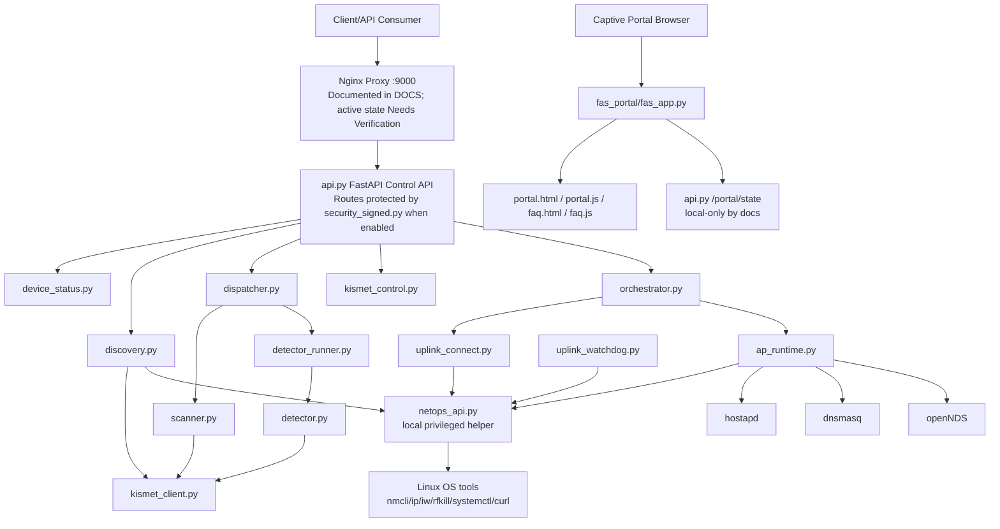

# PROJECT_CONTEXT_AND_PRD

## Purpose of This Document

This is the main source-of-truth context and PRD-style overview for the in-scope subsystem represented by this repository: a Python/FastAPI Wi-Fi agent, scanner/detector service layer, local network orchestration code, captive portal/FAS web layer, and related documentation for proxy/runtime/network deployment.

This document is scoped to repository evidence. It does not describe the full capstone product, remote website repository, cloud dashboards, live Raspberry Pi state, or deployed service state unless those details are directly represented by files in this repository and are marked with their evidence level.

## Documentation Index

| File | Purpose | Primary Audience | Evidence Level |
|---|---|---|---|
| `DOCS/PROJECT_CONTEXT_AND_PRD.md` | Main scoped repository context and PRD | AI assistants, maintainers, developers | Confirmed from repository files |
| `DOCS/API_ENDPOINT_CONTRACTS.md` | Endpoint contracts for main API, NetOps, and FAS surfaces | Frontend/backend/API maintainers | Confirmed documentation file |
| `DOCS/NGINX_PROXY_CONTEXT.md` | Documented Nginx proxy mappings and integration rules | API/proxy maintainers | Repository documentation; deployed state Needs Verification |
| `DOCS/NETWORK_HOSTAPD_CAPTIVE_PORTAL.md` | Documented AP, captive portal, DNS/DHCP, routing, firewall context | Network maintainers | Repository documentation; deployed state Needs Verification |
| `DOCS/DEPLOYMENT_RUNTIME_MONITORING.md` | Documented systemd/runtime/watchdog/log context | DevOps/network maintainers | Repository documentation; deployed state Needs Verification |
| `DOCS/SECURITY_AND_RISKS.md` | Security controls, sensitive boundaries, risks | Security reviewers, AI assistants | Confirmed code plus repository documentation |
| `DOCS/CAPSTONE_DOCUMENTATION.md` | Formal wider system summary | Capstone reviewers | Supporting documentation; wider product details are Out of Scope here |

## Scope-Bounded Executive Context

### Confirmed from repository files

- The repository contains a main FastAPI control API in `api.py` that exposes device status, network discovery, scanning, detector control/polling, AP polling, orchestration, portal patching, and local portal state routes.
- Scanner and detector behavior is implemented in `scanner.py`, `detector.py`, `dispatcher.py`, `detector_runner.py`, and `agent_state.py`.
- Kismet integration is implemented through `kismet_client.py` and `kismet_control.py`, using Kismet HTTP APIs and systemd-backed status/start handling.
- AP, hostapd, dnsmasq, and openNDS orchestration logic is implemented in `ap_runtime.py`; deterministic uplink connection logic is implemented in `uplink_connect.py`; high-level orchestration is implemented in `orchestrator.py`.
- A privileged local NetOps FastAPI helper is implemented in `netops_api.py`.
- A browser-facing captive portal/FAS FastAPI app and static portal assets are implemented under `fas_portal/`.
- HMAC request verification for protected control routes is implemented in `security_signed.py`.
- An uplink watchdog script exists in `uplink_watchdog.py`.
- Tests and test result artifacts exist under `tests/`, including unit tests and black-box proxy/captive portal security tests.

### Inferred from repository structure/code relationships

- `api.py` is the main API entry point for the repository because it instantiates `FastAPI()` and imports the scanner, detector, discovery, Kismet, orchestration, AP runtime, and request-signing modules.
- `netops_api.py` is intended to run with elevated privilege or stronger local trust because it can invoke `rfkill`, `ip`, `iw`, `nmcli`, `systemctl`, route-table operations, and AP orchestration through token-protected endpoints.
- `fas_portal/fas_app.py` is a separate FastAPI surface from `api.py`; it sanitizes local `/portal/state` data before browser exposure and serves the captive portal pages/scripts.
- The repository expects a Linux/Raspberry Pi-style runtime with NetworkManager, Kismet, hostapd, dnsmasq, openNDS, systemd, and network interfaces such as `ap0`, `uplink0`, `mgmt0`, and `mon0`, because those names/tools appear in implementation constants and docs.

### Needs Verification

- Actual Raspberry Pi hardware model, attached Wi-Fi adapter mapping, and live interface state.
- Active deployed systemd units, Nginx config, nftables rules, dnsmasq config, hostapd config, openNDS config, and NetworkManager profiles.
- Exact runtime environment values in `.env` and `/etc/*` environment files.
- Whether the documented Nginx proxy on port `9000` is reachable from the intended frontend/client network.
- Whether legacy service references documented in `DOCS/DEPLOYMENT_RUNTIME_MONITORING.md` are still present or active on a target host.

### Out of Scope

- The full capstone product workflow beyond this repository.
- Any remote website/frontend repository not present here.
- Cloud services, dashboards, databases, or production infrastructure not represented by repository files.
- Live operational claims about a currently running Raspberry Pi, wireless environment, or deployed network.
- Secret values, Wi-Fi credentials, tokens, API keys, private keys, and NetworkManager connection secrets.

## In-Scope and Out-of-Scope Boundaries

| Area | Status | Reason | Evidence |
|---|---|---|---|
| Main FastAPI control backend | In Scope | Implemented as repository code | `api.py`, `security_signed.py` |
| Scanner/detector logic | In Scope | Implements scan and detection workflows | `scanner.py`, `detector.py`, `dispatcher.py`, `detector_runner.py`, `agent_state.py` |
| Kismet HTTP/service integration | In Scope | Used by device status, discovery, scan, and detector modules | `kismet_client.py`, `kismet_control.py` |
| AP/uplink orchestration | In Scope | Implemented as Python modules and API endpoints | `orchestrator.py`, `uplink_connect.py`, `ap_runtime.py`, `api.py`, `netops_api.py` |
| Captive portal/FAS app | In Scope | Browser-facing portal files are in repo | `fas_portal/fas_app.py`, `fas_portal/portal.html`, `fas_portal/portal.js`, `fas_portal/faq.html`, `fas_portal/faq.js` |
| NetOps helper API | In Scope | Implemented as local privileged helper | `netops_api.py` |
| Nginx public proxy behavior | Partially In Scope | Existing DOCS describe mapping; active deployed config is outside repo | `DOCS/NGINX_PROXY_CONTEXT.md`, `tests/test_proxy_server.py` |
| hostapd/dnsmasq/openNDS/network/firewall context | Partially In Scope | Code and DOCS describe dependencies; live `/etc` state must be verified | `ap_runtime.py`, `DOCS/NETWORK_HOSTAPD_CAPTIVE_PORTAL.md` |
| systemd/watchdog/runtime monitoring | Partially In Scope | Repo has watchdog code and DOCS; active units are outside repo | `uplink_watchdog.py`, `DOCS/DEPLOYMENT_RUNTIME_MONITORING.md` |
| Python tests | In Scope | Test files document expected behavior and safety assumptions | `pytest.ini`, `tests/` |
| Generated caches and runtime artifacts | Out of Scope | Not source of truth; do not edit | `__pycache__/`, `.pytest_cache/`, `.hypothesis/`, `tests/test_results/`, `stress24h.log` |
| Repo-local secrets | Needs Verification | `.env` exists but values must not be documented | `.env`, `.gitignore` |
| Wider frontend/product workflows | Out of Scope | No full frontend repository is present | `fas_portal/` is only captive portal frontend |
| Live production state | Needs Verification | Cannot be assumed from repository | Any live `/etc`, systemd, network, or hardware state |

## System Identity and Environment

| Item | Detected Value | Source File/Path | Confirmed/Inferred | Notes |
|---|---|---|---|---|
| Repository subsystem | Wi-Fi Python agent with scanner/detector, API, NetOps, AP/uplink orchestration, and FAS portal | Python files at repo root and `fas_portal/` | Confirmed | This file is limited to that subsystem |
| Main backend framework | FastAPI | `api.py`, `netops_api.py`, `fas_portal/fas_app.py` | Confirmed | Three separate FastAPI app surfaces |
| Main API object | `app = FastAPI()` | `api.py` | Confirmed | Docs/OpenAPI are not disabled in `api.py` |
| NetOps API object | `FastAPI(docs_url=None, redoc_url=None, openapi_url=None)` | `netops_api.py` | Confirmed | Docs disabled |
| FAS API object | `FastAPI(docs_url=None, redoc_url=None, openapi_url=None)` | `fas_portal/fas_app.py` | Confirmed | Docs disabled |
| Python virtual environment | `venv`, Python `3.13.11`, executable `/usr/bin/python3.13` | `venv/pyvenv.cfg` | Confirmed from local file | The `venv/` directory is ignored and should not be edited |
| Dependency manifest | None found at repo root | file listing | Confirmed | No `requirements.txt` or `pyproject.toml` was found |
| Test runner config | pytest with `pythonpath = .`, `testpaths = tests` | `pytest.ini` | Confirmed | Do not run tests for doc-only updates unless explicitly requested |
| Hardware assumption | Raspberry Pi-style Linux host | `device_status.py`, `DOCS/CAPSTONE_DOCUMENTATION.md` | Inferred/Needs Verification | Code reads `/proc/device-tree/model`; actual hardware is live state |
| OS/runtime assumption | Linux with systemd, NetworkManager, Kismet, hostapd, dnsmasq, openNDS | `ap_runtime.py`, `kismet_control.py`, `netops_api.py`, `uplink_connect.py` | Inferred | Actual installed packages and services need verification |
| Main local API port | `127.0.0.1:8000` documented for `api.py` runtime | `DOCS/API_ENDPOINT_CONTRACTS.md`, `DOCS/DEPLOYMENT_RUNTIME_MONITORING.md` | Needs Verification for deployment | Code defines routes but not uvicorn bind |
| NetOps default bind | `127.0.0.1:8899` | `netops_api.py` | Confirmed default | Env can override via `NETOPS_HOST`/`NETOPS_PORT` |
| FAS default control-state URL | `http://127.0.0.1:8000/portal/state` | `fas_portal/fas_app.py` | Confirmed default | Browser sees sanitized `/api/portal/state`, not this direct URL |
| Kismet default URL/port | `http://127.0.0.1:2501` | `kismet_client.py`, `kismet_control.py` | Confirmed default | Credentials come from env; do not document values |
| Nginx proxy port | `9000` documented | `DOCS/NGINX_PROXY_CONTEXT.md`, `tests/test_proxy_server.py` | Needs Verification for deployment | Repository has docs/tests, not active Nginx config |
| AP interface default | `ap0` | `ap_runtime.py` | Confirmed default | Physical mapping Needs Verification |
| Uplink interface default | `uplink0` | `ap_runtime.py`, `uplink_connect.py`, `discovery.py`, `uplink_watchdog.py` | Confirmed default | Physical mapping Needs Verification |
| Management interface default | `mgmt0` | `ap_runtime.py`, `uplink_connect.py` | Confirmed default | Physical mapping Needs Verification |
| Monitor interface default | `mon0` | `ap_runtime.py`, `DOCS/NETWORK_HOSTAPD_CAPTIVE_PORTAL.md` | Confirmed default/docs | Physical mapping Needs Verification |

## Full In-Scope Repository Map

| Path | Type | Component | Purpose | Scope Status | Important Notes |
|---|---|---|---|---|---|
| `api.py` | Active implementation | Main FastAPI control API | Exposes control/status/scan/detect/orchestration/portal-state routes | In Scope | Uses process-local caches, locks, and job state |
| `security_signed.py` | Active implementation | HMAC verification | FastAPI dependency for signed control requests | In Scope | Secret value comes from env and must be redacted |
| `netops_api.py` | Active implementation | Privileged helper API | Token-protected local network/AP/uplink operations | In Scope | Requires `NETOPS_TOKEN` at import time |
| `fas_portal/fas_app.py` | Active implementation | FAS captive portal API | Serves portal/FAQ/static assets and sanitized browser state | In Scope | Separate FastAPI app with docs disabled |
| `fas_portal/portal.html` | Active implementation | Captive portal frontend | Main portal page template | In Scope | Served by `/fas` |
| `fas_portal/portal.js` | Active implementation | Captive portal frontend script | Polls same-origin `/api/portal/state` | In Scope | Browser-facing, GET-only state consumer |
| `fas_portal/faq.html` | Active implementation | Captive portal FAQ | FAQ page template | In Scope | Served by `/faq` |
| `fas_portal/faq.js` | Active implementation | Captive portal FAQ script | FAQ client behavior | In Scope | Served by `/static/faq.js` |
| `ap_runtime.py` | Active implementation | AP runtime | Builds runtime hostapd config; starts/stops hostapd, dnsmasq, openNDS | In Scope | Touches OS/network state when executed |
| `orchestrator.py` | Active implementation | High-level orchestration | Coordinates Kismet, uplink, AP runtime, and result shaping | In Scope | Uses `/run` or `/tmp` lock path |
| `uplink_connect.py` | Active implementation | Uplink connector | Deterministic NetworkManager/nmcli uplink connection and portal classification | In Scope | Handles sensitive Wi-Fi password inputs |
| `uplink_watchdog.py` | Active implementation | Uplink watchdog | Calls NetOps status/reconnect and tracks fail streak | In Scope | Runtime/service deployment Needs Verification |
| `discovery.py` | Active implementation | Network discovery | Intersects `nmcli` live scan on `uplink0` with Kismet AP presence | In Scope | Can call NetOps repair endpoints if token exists |
| `dispatcher.py` | Active implementation | Scan/detector coordinator | Validates scan payloads, runs scanner, controls detector lifecycle | In Scope | Called by `api.py` `/scan` and detector control |
| `scanner.py` | Active implementation | Scanner | Reads Kismet AP data and detects encryption/WPS/MFP/client count findings | In Scope | Uses vulnerability IDs `WFVT-001` to `WFVT-004` |
| `detector.py` | Active implementation | Detector | Detects deauth, evil twin, and MAC spoof indicators from Kismet data | In Scope | Uses vulnerability IDs `WFVT-005` to `WFVT-007` |
| `detector_runner.py` | Active implementation | Detector thread runner | Consumes `detector.run_detection()` and queues bounded results | In Scope | Drops oldest queued result when full |
| `agent_state.py` | Active implementation | Shared state | Holds detector thread, queue, lock, last scan/error state | In Scope | Used by `api.py` and `dispatcher.py` |
| `kismet_client.py` | Active implementation | Kismet HTTP client | Calls Kismet device/alert endpoints with thread-local sessions | In Scope | Loads `.env`; credentials sensitive |
| `kismet_control.py` | Active implementation | Kismet service control | Checks/starts/restarts Kismet via systemd and HTTP status | In Scope | Uses `sudo -n systemctl/journalctl` when executed |
| `device_status.py` | Active implementation | Device status builder | Reads model/hostname/uptime and checks internet reachability | In Scope | Reads `/proc` and connects to `1.1.1.1:53` when executed |
| `scan_demo.py` | Example/template | Scanner demo | CLI/demo wrapper around `scanner.run_scan()` | Partially In Scope | Contains a hard-coded external `API_URL`; not an active service |
| `detect_demo.py` | Example/template | Detector demo | Interactive detector generator demo | Partially In Scope | Manual/demo use only |
| `pytest.ini` | Configuration | Tests | Configures pytest discovery | In Scope | Do not run tests for doc-only task |
| `tests/` | Tests/documentation evidence | Unit/security/proxy tests | Documents expected module and route behavior | In Scope | Some tests are black-box and require running services |
| `DOCS/` | Documentation | Project documentation | Supporting endpoint/proxy/network/security/runtime docs | In Scope | Currently user-authored repository documentation |
| `.env` | Configuration | Sensitive local env | Kismet and possibly runtime credentials/config | Needs Verification | Values must remain `[REDACTED]`; `.gitignore` ignores it |
| `.gitignore` | Configuration | Ignore rules | Ignores `.env`, `venv/`, `__pycache__/`, `*.pyc` | In Scope | Supports secret/runtime boundary |
| `venv/` | Generated/runtime | Python virtualenv | Local Python environment | Needs Verification | Do not edit; ignored by git |
| `__pycache__/`, `.pytest_cache/`, `.hypothesis/` | Generated/runtime | Caches | Python/test/runtime caches | Out of Scope | Do not edit or document as source behavior |
| `tests/test_results/` | Generated/runtime | Test reports | Saved test output artifacts | Out of Scope | Not source of truth for implementation |
| `stress24h.log` | Generated/runtime | Log | Runtime/stress log artifact | Out of Scope | Do not edit or rely on as source of truth |
| `pcaps/` | Generated/runtime | Packet captures | Capture storage directory | Needs Verification | Contents/use not established from inspected files |

## In-Scope Architecture Source of Truth



## Python Environment and Dependencies

| Item | Value/Path | Purpose | Source | Notes |
|---|---|---|---|---|
| Virtual environment | `venv/` | Local Python runtime | `venv/pyvenv.cfg` | Ignored by git; do not edit |
| Python version | `3.13.11` | Runtime interpreter in local venv | `venv/pyvenv.cfg` | Confirmed local file, not a deployment guarantee |
| Dependency manifest | None detected | Package source of truth | file listing | Needs Verification for reproducible install |
| Test config | `pytest.ini` | Test discovery config | `pytest.ini` | `pythonpath = .`, `testpaths = tests` |
| Environment file | `.env` | Local sensitive config | `.gitignore`, imports using `load_dotenv()` | Do not reveal values |

| Dependency | Used By | Purpose | Evidence | Notes |
|---|---|---|---|---|
| `fastapi` | `api.py`, `netops_api.py`, `fas_portal/fas_app.py` | HTTP API framework | imports | Installed version Needs Verification |
| `fastapi.responses` | `api.py`, `netops_api.py`, `fas_portal/fas_app.py` | JSON/HTML/file responses | imports | Used for API/FAS responses |
| `requests` | `kismet_client.py`, `kismet_control.py`, `scan_demo.py`, tests | Kismet HTTP calls and tests/demos | imports | Installed version Needs Verification |
| `python-dotenv` / `dotenv` | `kismet_client.py`, `kismet_control.py`, `scanner.py` | Load `.env` | imports | `.env` values are sensitive |
| `uvicorn` | documented systemd runtime | ASGI server | `DOCS/DEPLOYMENT_RUNTIME_MONITORING.md` | No package manifest confirms version |
| `pytest` | `tests/` | Test runner | `pytest.ini`, tests imports | Do not run automatically for doc-only work |
| `hypothesis` | `tests/test_scanner_overall.py`, `.hypothesis/` | Optional fuzz/property tests | tests and cache dirs | Optional per test comments; installed status Needs Verification |
| Linux tools: `nmcli`, `ip`, `iw`, `rfkill`, `systemctl`, `curl`, `hostapd_cli` | network/orchestration modules | OS/network operations | `netops_api.py`, `uplink_connect.py`, `ap_runtime.py` | Runtime availability Needs Verification |

## Python Modules and Services Inventory

| File Path | Main Classes/Functions | Purpose | Inputs | Outputs | Called By | Connected Endpoint(s) | External/System Dependencies | Failure Points | Notes |
|---|---|---|---|---|---|---|---|---|---|
| `api.py` | `device_status`, `networks`, `scan`, `detect_control`, `detect_poll`, `ap_poll`, `orchestrate_apply`, `orchestrate_poll`, `portal_patch`, `portal_state` | Main control API, portal state cache, async orchestration job store | HTTP requests, JSON payloads, query params | JSON responses | Nginx/docs clients, FAS local state fetch | All main API routes | FastAPI, Kismet helpers, scanner/detector/orchestrator modules | Kismet unavailable, bad payloads, in-memory state reset, async job expiry | Backend/API-related; local-only `/portal/state` is intentionally distinct |
| `security_signed.py` | `verify_signed_request` | HMAC request validation dependency | HTTP method/path/query/body plus `X-Control-*` headers | `None` or `HTTPException` | `api.py` protected routes | Main API protected routes | `CONTROL_*` env vars | Missing secret, stale timestamp, bad hash/signature, replay nonce | Security-related; nonce cache is process-local |
| `netops_api.py` | `_auth`, `_run`, `_uplink_*`, route handlers | Root/local helper for Wi-Fi, NetworkManager, routing, AP operations | Token header, JSON/query inputs | JSON operation results | `ap_runtime.py`, `uplink_connect.py`, `discovery.py`, `uplink_watchdog.py` | NetOps routes | `nmcli`, `ip`, `iw`, `rfkill`, `systemctl`, `curl`, route tables | Missing `NETOPS_TOKEN`, command failure, invalid interface, network timing | Network/security-related; only `uplink0` and `ap0` allowed by `_ALLOWED_IFNAMES` |
| `fas_portal/fas_app.py` | `api_portal_state`, `static_portal_js`, `static_faq_js`, `faq_page`, `fas_portal`, `_fetch_control_state`, `_sanitize_for_clients` | Browser-facing captive portal app and sanitized state proxy | Browser GETs, optional `fas` query/cookie, env config | HTML, JS, sanitized JSON | openNDS/FAS clients, browser portal | FAS portal routes | Local files, `CONTROL_STATE_URL`, FastAPI | Missing `FAS_KEY`, bad host, missing files, upstream state unavailable, rate limit | Captive portal/security-related; no HMAC to local `/portal/state` |
| `ap_runtime.py` | `configure_ap`, `start_ap`, `stop_ap`, `configure_and_start_ap`, `ap_orchestrator_apply`, `ap_ready`, `bootstrap_persist` | AP lifecycle and hostapd runtime config management | AP command dicts, env defaults, runtime hostapd files | Structured dict results | `orchestrator.py`, `netops_api.py`, `api.py` | `/ap/poll`, NetOps `/ap/*`, orchestration | `systemctl`, `hostapd_cli`, `ip`, `iw`, `/run`, `/etc/hostapd` | Permission errors, missing services, hostapd readiness failure, invalid channel/encryption | Network/security-related; writes live secrets to runtime config only when executed |
| `orchestrator.py` | `apply_orchestration`, `ap_status_snapshot`, `uplink_status_snapshot`, `wifi_ops_lock_is_busy` | Coordinates Kismet, uplink connection, AP state, and result envelopes | Orchestration payloads | Structured result dicts | `api.py` | `/orchestrate/apply`, `/orchestrate/poll`, `/networks` busy check | `kismet_control.py`, `uplink_connect.py`, `ap_runtime.py`, `iw` | Lock busy/timeout, Kismet failure, uplink/AP failure | Orchestration-related; redacts `password`/`ap_password` |
| `uplink_connect.py` | `connect_uplink`, `disconnect_uplink`, `run_uplink_orchestrator_from_payload`, `classify_portal`, `uplink_portal_info` | Deterministic `uplink0` NetworkManager connection and portal classification | SSID/BSSID/channel/encryption/password payloads | `ConnectResult` and JSON-safe dicts | `orchestrator.py`, CLI `main()` | `/orchestrate/apply` via orchestrator | `nmcli`, `ip`, `iw`, `curl`, optional NetOps | Wrong password, encryption mismatch, SSID not found, no IP, portal/no internet, NetOps missing | Network/security-related; password fields redacted |
| `discovery.py` | `get_networks`, `_nmcli_wlan2_network_map`, `_build_kismet_bssid_set` | Builds visible network list by intersecting `nmcli` and Kismet | Optional timeout | List of network dicts | `api.py` | `/networks` | `nmcli`, `ip`, Kismet client, optional NetOps | nmcli failure, Kismet failure, stale/empty cycles, repair failure | Scanner-adjacent discovery; uses cache/stale-grace behavior |
| `dispatcher.py` | `dispatch`, `control_detection`, `_start_detection`, `_stop_detection` | Coordinates scan execution and detector lifecycle | Scan payload, `AgentState`, control action | Structured scan/control result | `api.py` | `/scan`, `/detect/control` | `scanner.py`, `detector_runner.py`, threads/queues | Invalid BSSID/channel, scanner errors, detector thread state | Scanner/detector-related control layer |
| `scanner.py` | `run_scan`, `detect_encryption_status`, `detect_wps_status`, `detect_mfp_status`, `get_clients_count` | Kismet-backed target scan for Wi-Fi findings | SSID, BSSID, channel | Scan result dict with findings | `dispatcher.py`, `scan_demo.py` | `/scan` via dispatcher | Kismet client, `.env` | Kismet empty/unavailable, malformed Kismet records, invalid target | Scanner-related; vuln IDs `WFVT-001` to `WFVT-004` |
| `detector.py` | `run_detection`, `run_detection_cycle`, `detect_deauth`, `process_evil_twin_alert`, `detect_mac_spoof_for_target_bssid` | Background detection for deauth, evil twin, MAC spoofing | Target BSSID, stop event, Kismet records/alerts | Detection result generator | `detector_runner.py`, `detect_demo.py` | `/detect/poll` via queue | Kismet client | Kismet failures, stateful thresholds, malformed records | Detector-related; vuln IDs `WFVT-005` to `WFVT-007` |
| `detector_runner.py` | `detector_thread_main` | Runs detector generator in a thread and queues results | `AgentState`, target BSSID, interval | Queue entries and last error state | `dispatcher.py` | `/detect/poll` indirectly | threading queue | Queue full, detector exception | Drops oldest queue item when full |
| `agent_state.py` | `AgentState` | Shared detector/scan state container | N/A | Dataclass instance | `api.py`, `dispatcher.py`, `detector_runner.py` | `/scan`, `/detect/*` | Threading, Queue | Process restart clears state | Bounded detection queue size is `300` |
| `kismet_client.py` | `fetch_ap_devices_view`, `fetch_ap_view`, `fetch_device_by_key`, `fetch_alerts_since`, `fetch_ap_devices_for_scan` | Kismet HTTP client wrappers | Kismet URL/credentials, timeouts | Lists/dicts or empty fallback | `scanner.py`, `detector.py`, `discovery.py` | `/networks`, `/scan`, `/detect/*` indirectly | `requests`, `.env`, Kismet HTTP | Auth failure, timeout, non-JSON, non-200 | Uses thread-local `requests.Session` |
| `kismet_control.py` | `ensure_kismet_running` | Systemd-backed Kismet health/start/restart helper | Timeout, Kismet env credentials | Structured status dict | `api.py`, `orchestrator.py` | `/device/status`, `/networks`, `/scan`, `/orchestrate/apply` indirectly | `sudo -n systemctl`, `journalctl`, Kismet HTTP | Bad auth, sudo missing, service not listening, restart failure | Service-control-related; may include journal tail in errors |
| `device_status.py` | `build_device_status` | Builds device, network, and Kismet status payload | Kismet status dict | JSON-safe dict | `api.py` | `/device/status` | `/proc`, hostname, socket to `1.1.1.1:53` | Missing `/proc` data, internet check failure | Hardware/OS info is runtime-dependent |
| `uplink_watchdog.py` | `main`, `_http_json`, `_status_bad` | Periodic NetOps client for uplink health/reconnect | Env `NETOPS_URL`, `NETOPS_TOKEN`, state file | JSON logs to stdout, state file updates | Documented systemd timer | None directly | NetOps API, `/run/uplink-watchdog` | Missing env, lock failure, NetOps unreachable, reconnect failure | Deployment/runtime-related; service wiring Needs Verification |
| `scan_demo.py` | `main` | Manual scan demo | CLI args | Console output and optional POST | Manual operator | None | `scanner.py`, `requests` | Hard-coded external URL may be stale | Example/template, not active service |
| `detect_demo.py` | `main` | Manual detector demo | Interactive BSSID | Console detection output | Manual operator | None | `detector.py`, threading | Manual input errors, detector exception | Example/template, not active service |

## FastAPI Application Context

| FastAPI Area | File Path | Description | Notes |
|---|---|---|---|
| Main app initialization | `api.py` | `app = FastAPI()` and `state = AgentState()` | No `APIRouter` objects detected; routes attach directly to `app` |
| Main middleware/CORS | `api.py` | No `CORSMiddleware` setup detected | Cross-origin browser access may require another layer; Needs Verification |
| Main rate limiting | `api.py` | No in-app rate limiter detected | Nginx rate limiting is documented separately in `DOCS/NGINX_PROXY_CONTEXT.md` |
| Main error handling | `api.py` | Catch-all `@app.exception_handler(Exception)` returns JSON error payload | `DEBUG_ERRORS` can include redacted request/trace details |
| Main background tasks | `api.py` | `asyncio.create_task()` used for async orchestration jobs | Jobs are in-memory and pruned by TTL/limits |
| Main dependency injection | `api.py`, `security_signed.py` | Most public control routes use `Depends(verify_signed_request)` | `/portal/state` does not use signing in code |
| Main request/response models | `api.py` | Raw `dict` payloads/query params; no Pydantic models detected | Endpoint shapes documented in `DOCS/API_ENDPOINT_CONTRACTS.md` |
| NetOps app initialization | `netops_api.py` | `FastAPI(docs_url=None, redoc_url=None, openapi_url=None)` | Docs/OpenAPI disabled |
| NetOps startup event | `netops_api.py` | `@app.on_event("startup")` attempts route-table mapping and probe user prep | Uses best-effort `try/except` |
| NetOps auth/error handling | `netops_api.py` | `X-Netops-Token` checked by `_auth`; catch-all exception handler | `/health` is unauthenticated |
| NetOps concurrency | `netops_api.py` | Shared async `_OP_LOCK` serializes operational routes | Helps avoid overlapping privileged operations |
| FAS app initialization | `fas_portal/fas_app.py` | `FastAPI(docs_url=None, redoc_url=None, openapi_url=None)` | Browser-facing captive portal app |
| FAS host/rate/security controls | `fas_portal/fas_app.py` | Host allow-list, route-specific in-process rate limiting, security headers | Process-local controls; not authentication |
| FAS local state fetch | `fas_portal/fas_app.py` | Fetches `CONTROL_STATE_URL`, default `http://127.0.0.1:8000/portal/state` | Sanitizes before returning to browser |

| Router/File | Prefix | Tags | Endpoints | Purpose |
|---|---|---|---|---|
| `api.py` | none | none declared | `/device/status`, `/networks`, `/scan`, `/detect/control`, `/detect/poll`, `/ap/poll`, `/orchestrate/apply`, `/orchestrate/poll`, `/portal/patch`, `/portal/state` | Main control-plane API |
| `netops_api.py` | none | none declared | `/health`, `/wifi/unblock`, `/if/up`, `/if/managed`, `/wifi/rescan`, `/nm/restart`, `/uplink/status`, `/uplink/reconnect`, `/uplink/disconnect`, `/uplink/connect`, `/ap/status`, `/ap/bootstrap`, `/ap/orch` | Local privileged network helper |
| `fas_portal/fas_app.py` | none | none declared | `/fas`, `/faq`, `/static/portal.js`, `/static/faq.js`, `/api/portal/state` | Captive portal browser/API surface |

## Endpoint and Client Contract Summary

| Method | Internal FastAPI Path | Public Nginx Path | Source File | Function | Request Input | Response Output | Client/Frontend Usage | Notes |
|---|---|---|---|---|---|---|---|---|
| GET | `/device/status` | `/device/status` | `api.py` | `device_status` | Signed headers when required | Device/network/Kismet status and `cached` | Control API client | Calls `ensure_kismet_running()` and `build_device_status()` |
| GET | `/networks` | `/networks` | `api.py` | `networks` | Signed headers when required | Network list, cache flag, optional warning | Control API client | Uses `discovery.get_networks()` and Kismet |
| POST | `/scan` | `/scan` | `api.py` | `scan` | JSON target payload; signed headers when required | Dispatcher/scanner result | Control API client | Serialized by `_scan_lock` |
| POST | `/detect/control` | `/detect/control` | `api.py` | `detect_control` | JSON `{action, drain_queue?}`; signed headers when required | Detector control result | Control API client | `disable` action is documented in code comments/docs |
| GET | `/detect/poll` | `/detect/poll` | `api.py` | `detect_poll` | Query `max_items`; signed headers when required | Detector state and drained results | Control API client | Polling drains queue items |
| GET | `/ap/poll` | `/ap/poll` | `api.py` | `ap_poll` | Signed headers when required | AP readiness snapshot | Control API client | Uses `ap_runtime.ap_ready()` |
| POST | `/orchestrate/apply` | `/orchestrate/apply` | `api.py` | `orchestrate_apply` | JSON orchestration payload; optional `"async": true`; signed headers when required | Sync result or `202` accepted job envelope | Control API client | Can enqueue process-local async job |
| GET | `/orchestrate/poll` | `/orchestrate/poll` | `api.py` | `orchestrate_poll` | Query `job_id`; signed headers when required | `202` pending/running, final result, or error | Control API client | Job store is in-memory |
| POST | `/portal/patch` | `/portal/patch` | `api.py` | `portal_patch` | JSON `{network_id, patch}`; signed headers when required | `{status, network_id, ts}` or validation error | Upstream/control client | Size/key/depth limits apply |
| GET | `/portal/state` | Not publicly proxied by documented Nginx | `api.py` | `portal_state` | No signing in code | Local runtime portal state | FAS app local fetch | Intended local-only by code comments/docs |
| GET | `/health` | Not documented public | `netops_api.py` | `health` | none | NetOps host/port/log level | Local monitoring | Unauthenticated |
| POST | `/wifi/unblock` | Not documented public | `netops_api.py` | `wifi_unblock` | `X-Netops-Token` | `rfkill unblock wifi` result | Local modules/operators | Privileged/network state change |
| POST | `/if/up` | Not documented public | `netops_api.py` | `if_up` | `ifname`, token | Link-up result | Local modules/operators | Allows only configured ifnames |
| POST | `/if/managed` | Not documented public | `netops_api.py` | `if_managed` | `ifname`, token | `iw` managed-mode result | Local modules/operators | Allows only configured ifnames |
| POST | `/wifi/rescan` | Not documented public | `netops_api.py` | `wifi_rescan` | `ifname`, token | `nmcli` rescan result | Local modules/operators | Default `uplink0` |
| POST | `/nm/restart` | Not documented public | `netops_api.py` | `nm_restart` | token | NetworkManager restart result | Local modules/operators | Privileged service operation |
| GET | `/uplink/status` | Not documented public | `netops_api.py` | `uplink_status` | `ifname`, token | Uplink state/portal classification | `uplink_watchdog.py`, modules | Default `uplink0` |
| POST | `/uplink/reconnect` | Not documented public | `netops_api.py` | `uplink_reconnect` | JSON `{ifname?}`, token | Reconnect result | `uplink_watchdog.py` | Uses saved profiles |
| POST | `/uplink/disconnect` | Not documented public | `netops_api.py` | `uplink_disconnect` | JSON `{ifname?}`, token | Disconnect result | Local modules/operators | Privileged network state change |
| POST | `/uplink/connect` | Not documented public | `netops_api.py` | `uplink_connect` | JSON SSID/password/encryption/BSSID/ifname, token | Connect/classification result | Local modules/operators | Password is sensitive |
| GET | `/ap/status` | Not documented public | `netops_api.py` | `ap_status` | token | AP status via `ap_runtime` | `ap_runtime.py` remote mode/operators | Privileged helper route |
| POST | `/ap/bootstrap` | Not documented public | `netops_api.py` | `ap_bootstrap` | token | Hostapd bootstrap result | `ap_runtime.py` remote mode/operators | Privileged helper route |
| POST | `/ap/orch` | Not documented public | `netops_api.py` | `ap_orch` | JSON AP command, token | AP orchestration result | `ap_runtime.py` remote mode/operators | Privileged helper route |
| GET | `/fas` | N/A | `fas_portal/fas_app.py` | `fas_portal` | Optional `fas` query/cookie/IP fallback | Portal HTML or redirect/error | Captive portal browser | Expected openNDS FAS entrypoint |
| GET | `/faq` | N/A | `fas_portal/fas_app.py` | `faq_page` | Host header | FAQ HTML | Captive portal browser | Host allow-list and rate limit |
| GET | `/static/portal.js` | N/A | `fas_portal/fas_app.py` | `static_portal_js` | Host header | JavaScript file | Captive portal browser | Fixed file path |
| GET | `/static/faq.js` | N/A | `fas_portal/fas_app.py` | `static_faq_js` | Host header | JavaScript file | Captive portal browser | Fixed file path |
| GET | `/api/portal/state` | N/A | `fas_portal/fas_app.py` | `api_portal_state` | Host header | Sanitized browser-safe JSON | `fas_portal/portal.js` | Same-origin FAS route, not Nginx main API |

## Nginx Proxy and Client Integration Context

Nginx behavior is documented from repository documentation and tests, not from live `/etc` inspection during this update. Treat active deployed Nginx configuration as Needs Verification.

| Public Path | Nginx Location | Proxy Target | Internal FastAPI Path | Rewrite Behavior | Client Notes |
|---|---|---|---|---|---|
| `/device/status` | exact documented location | `http://127.0.0.1:8000` | `/device/status` | Preserves original URI | No `/api` prefix |
| `/networks` | exact documented location | `http://127.0.0.1:8000` | `/networks` | Preserves original URI | Longer documented read timeout |
| `/detect/poll` | exact documented location | `http://127.0.0.1:8000` | `/detect/poll` | Preserves original URI | Polling drains detector queue |
| `/ap/poll` | exact documented location | `http://127.0.0.1:8000` | `/ap/poll` | Preserves original URI | AP runtime polling |
| `/orchestrate/poll` | exact documented location | `http://127.0.0.1:8000` | `/orchestrate/poll` | Preserves original URI | Poll async job ID |
| `/detect/control` | exact documented location | `http://127.0.0.1:8000` | `/detect/control` | Preserves original URI | State-changing route |
| `/orchestrate/apply` | exact documented location | `http://127.0.0.1:8000` | `/orchestrate/apply` | Preserves original URI | Can be long-running or async |
| `/portal/patch` | exact documented location | `http://127.0.0.1:8000` | `/portal/patch` | Preserves original URI | Payload limits also in `api.py` |
| `/scan` | exact documented location | `http://127.0.0.1:8000` | `/scan` | Preserves original URI | Expensive scan route |
| `/portal/state` | Not proxied by documented gateway | N/A | `/portal/state` local-only | N/A | Expected public `404` per docs/tests |
| `/api/*` | Not proxied by documented gateway | N/A | N/A | N/A | Do not use `/api` prefix for main `api.py` routes |

| Proxy Detail | Value | Evidence | Status | Notes |
|---|---|---|---|---|
| Public proxy base URL | `http://<pi-host-or-ip>:9000` | `DOCS/API_ENDPOINT_CONTRACTS.md`, `DOCS/NGINX_PROXY_CONTEXT.md`, `tests/test_proxy_server.py` | Needs Verification for deployment | Repo docs/tests show expected base |
| Nginx listen port | `9000` | `DOCS/NGINX_PROXY_CONTEXT.md`, `tests/test_proxy_server.py` | Needs Verification for deployment | Active `/etc` state not in repo |
| Upstream target | `127.0.0.1:8000` | `DOCS/NGINX_PROXY_CONTEXT.md` | Needs Verification for deployment | Matches documented `api.py` service bind |
| Forwarded signing headers | `X-Control-Timestamp`, `X-Control-Nonce`, `X-Control-Body-SHA256`, `X-Control-Signature` | `DOCS/NGINX_PROXY_CONTEXT.md`, `security_signed.py` | Confirmed docs/code relationship | Clients must sign exact public path/query |
| CORS | No `CORSMiddleware` detected in `api.py`; docs say Nginx does not add CORS | `api.py`, `DOCS/NGINX_PROXY_CONTEXT.md` | Confirmed for code, Needs Verification for deployed proxy | Same-origin/same-proxy integration preferred |
| Rate limit behavior | `read_zone`, `state_zone`, `scan_zone` documented | `DOCS/NGINX_PROXY_CONTEXT.md`, `tests/test_proxy_server.py` | Needs Verification for deployed Nginx | Main app has no in-app rate limiter |
| Common path mistake | Adding `/api` to main API routes | `DOCS/API_ENDPOINT_CONTRACTS.md`, `DOCS/NGINX_PROXY_CONTEXT.md` | Confirmed documentation rule | `/api/portal/state` belongs to FAS app, not main Nginx API |

## Network, hostapd, Captive Portal, and Security Context

| Component | File Path | Purpose | Interface/Port | Depends On | Scope Status | Notes |
|---|---|---|---|---|---|---|
| AP runtime | `ap_runtime.py` | Configure/start/stop AP services and runtime hostapd config | Default `ap0`, `192.168.50.1/24` | hostapd, dnsmasq, openNDS, systemd, `ip`, `iw` | In Scope | Execution changes OS/network state |
| hostapd runtime config | `ap_runtime.py` | Runtime-only AP SSID/password config | `/run/hostapd-ap-runtime.conf` default | hostapd | In Scope | Live secret-bearing file should not be documented |
| hostapd persistent sanitized config | `ap_runtime.py`, docs | Restore non-sensitive persistent hostapd config | `/etc/hostapd/...` documented paths | filesystem/systemd | Needs Verification | Actual `/etc` contents outside repo |
| dnsmasq | `ap_runtime.py`, `DOCS/NETWORK_HOSTAPD_CAPTIVE_PORTAL.md` | DHCP/DNS service for AP clients | Documented service/config | systemd | Needs Verification | DHCP range and actual config need maintainer verification |
| openNDS | `ap_runtime.py`, `DOCS/NETWORK_HOSTAPD_CAPTIVE_PORTAL.md` | Captive portal enforcement | Documented FAS `192.168.50.1:2090` | hostapd, dnsmasq, FAS app | Needs Verification | Active config outside repo |
| FAS app | `fas_portal/fas_app.py` | Browser-facing portal and sanitized API | Code routes; docs say `192.168.50.1:2090` | local files, `api.py /portal/state` | In Scope/Needs Verification for bind | Code does not bind itself; systemd/docs provide bind |
| Portal JS | `fas_portal/portal.js` | Same-origin browser polling | `/api/portal/state` | FAS app | In Scope | Does not call main Nginx API |
| Uplink connector | `uplink_connect.py` | Connect `uplink0` via NetworkManager and classify portal state | Default `uplink0` | `nmcli`, `iw`, `curl`, optional NetOps | In Scope | Avoids making `uplink0` host default route by design |
| Network discovery | `discovery.py` | Live `nmcli` scan plus Kismet confirmation | Default `uplink0` | `nmcli`, Kismet, optional NetOps | In Scope | Holds stale data through transient failure/empty cycles |
| NetOps helper | `netops_api.py` | Privileged local network operations | Default `127.0.0.1:8899` | token, OS tools | In Scope | Token required except `/health` |
| Firewall/routing docs | `DOCS/NETWORK_HOSTAPD_CAPTIVE_PORTAL.md` | Documents nftables/NAT/AP route table context | `ap0`, `uplink0`, `ap_uplink`, `192.168.50.0/24` | live system config | Partially In Scope | Actual nftables/routing state Needs Verification |
| Request signing | `security_signed.py` | HMAC protection for main control routes | HTTP headers | shared secret env | In Scope | Disabled unless `CONTROL_REQUIRE_SIGNED` truthy |
| FAS hardening | `fas_portal/fas_app.py` | Host allow-list, CSP/security headers, rate limiting, sanitization | Browser-facing routes | env flags | In Scope | Process-local controls |

Security-sensitive items:

- `CONTROL_SIGNING_SECRET`, `NETOPS_TOKEN`, `KISMET_USER`, `KISMET_PASS`, `FAS_KEY`, `OPENNDS_FASKEY`, Wi-Fi passwords, NetworkManager profiles, and AP runtime passwords are sensitive. Document names and file paths only; values must be `[REDACTED]`.
- `ap_runtime.py`, `orchestrator.py`, `uplink_connect.py`, `netops_api.py`, and `api.py` include redaction helpers for password-like fields.
- `fas_portal/fas_app.py` intentionally omits `uplink.detail`, `ap`, and extra upstream fields from browser-facing sanitized state.

## Runtime, Services, and Deployment Context

Runtime/service details below are repository-documented or code-inferred. They are not proof of active live service state.

| Service/Process | Purpose | Startup Method | Config File | Port/Interface | Logs | Notes |
|---|---|---|---|---|---|---|
| Main FastAPI API | Control-plane API | Documented `uvicorn api:app` service | `api.py`, `DOCS/DEPLOYMENT_RUNTIME_MONITORING.md` | Docs say `127.0.0.1:8000` | systemd/journal docs | Active service state Needs Verification |
| NetOps helper | Privileged local helper | Documented `uvicorn netops_api:app` service | `netops_api.py`, docs env files | Code default `127.0.0.1:8899` | systemd/journal docs | Requires `NETOPS_TOKEN` |
| FAS portal | Captive portal browser app | Documented `uvicorn fas_app:app` service | `fas_portal/fas_app.py`, docs env files | Docs say `192.168.50.1:2090` | systemd/journal docs | Actual bind Needs Verification |
| Nginx | Public API proxy | Documented systemd service | `DOCS/NGINX_PROXY_CONTEXT.md` | Docs say `:9000` to `127.0.0.1:8000` | `/var/log/nginx/*` in docs | Active config Needs Verification |
| Kismet | Wi-Fi observation | `kismet_control.py` uses `kismet.service`; docs mention systemd | `kismet_control.py`, docs | Code default HTTP `127.0.0.1:2501`; docs mention `mon0` | journal tail optional | Actual service/config Needs Verification |
| hostapd | AP radio service | `ap_runtime.py` uses systemctl | `ap_runtime.py`, docs | `ap0` default | journal/systemd docs | Runtime config can contain secrets |
| dnsmasq | AP DHCP/DNS | `ap_runtime.py` uses systemctl | docs mention `/etc/dnsmasq.conf` | AP client network | journal/systemd docs | Actual config Needs Verification |
| openNDS | Captive portal enforcement | `ap_runtime.py` uses systemctl | docs mention `/etc/opennds/opennds.conf` | FAS docs `2090` | journal/systemd docs | Actual config Needs Verification |
| Uplink watchdog | Reconnect unhealthy uplink | `uplink_watchdog.py`, documented timer | docs env files | `uplink0` default | stdout/journal, state file | Service/timer active state Needs Verification |
| Detector thread | Background detection loop | Started by `dispatcher.py` through `detector_runner.py` | process-local state | target BSSID | in-memory queue/errors | Starts after successful scan |
| Async orchestration jobs | Long-running orchestration | `asyncio.create_task` in `api.py` | env TTL/limits | in-process | in-memory job store | Lost on process restart |

Manual verification only. Do not execute automatically.

```bash
systemctl status wifi-py-agent.service
systemctl status wifi-netops.service
systemctl status fas.service
systemctl status nginx.service
systemctl status kismet.service
systemctl status hostapd.service
systemctl status dnsmasq.service
systemctl status opennds.service
systemctl list-timers 'uplink-watchdog.timer' 'mgmt0-watchdog.timer'
journalctl -u wifi-py-agent.service -n 100 --no-pager
nginx -T
nft list ruleset
ss -lntup
```

## Configuration, Constants, Ports, and Environment Variables

| Name | Value or Pattern | Location | Purpose | Environment-Specific | Secret/Sensitive | Notes |
|---|---|---|---|---|---|---|
| `CONTROL_SIGNING_SECRET` | `[REDACTED]` | `security_signed.py`, environment | HMAC signing secret | Yes | Yes | Required if signing is enforced |
| `CONTROL_REQUIRE_SIGNED` | truthy enables signing enforcement | `security_signed.py` | HMAC enforcement flag | Yes | No | Defaults false when unset |
| `CONTROL_MAX_SKEW_SEC` | default `120` | `security_signed.py` | Allowed timestamp skew | Yes | No | Process-local validation |
| `CONTROL_NONCE_TTL_SEC` | default `300` | `security_signed.py` | Replay nonce TTL | Yes | No | In-memory only |
| `DEBUG_ERRORS` | truthy enables detailed errors | `api.py` | Main API debug error output | Yes | Can expose internals | Keep disabled outside controlled testing |
| `DEVICE_CACHE_TTL_SEC` | `2.0` | `api.py` | Device status cache TTL | No | No | Constant |
| `NETWORKS_CACHE_TTL_SEC` | `1.5` | `api.py` | Network discovery cache TTL | No | No | Constant |
| `PORTAL_MAX_NETWORKS` | default `16` | `api.py` | Portal cache entry limit | Yes | No | Env override |
| `PORTAL_MAX_AGE_SEC` | default `7200` | `api.py` | Portal cache max age | Yes | No | Env override |
| `PORTAL_PATCH_MAX_BYTES` | default `65536` | `api.py` | Portal patch request size limit | Yes | No | Also Nginx docs mention `64k` |
| `PORTAL_PATCH_MAX_KEYS` | default `2500` | `api.py` | Portal patch complexity limit | Yes | No | Env override |
| `PORTAL_PATCH_MAX_DEPTH` | default `10` | `api.py` | Portal patch nesting limit | Yes | No | Env override |
| `ORCH_JOB_TTL_SEC` | default `900` | `api.py` | Async job TTL | Yes | No | In-memory jobs |
| `ORCH_MAX_JOBS` | default `64` | `api.py` | Async job store cap | Yes | No | In-memory jobs |
| `ORCH_MAX_ACTIVE_JOBS` | default `4` | `api.py` | Active async job cap | Yes | No | Returns 429 when exceeded |
| `NETOPS_HOST` | default `127.0.0.1` | `netops_api.py` | NetOps bind host | Yes | No | Deployment value Needs Verification |
| `NETOPS_PORT` | default `8899` | `netops_api.py` | NetOps bind port | Yes | No | Deployment value Needs Verification |
| `NETOPS_TOKEN` | `[REDACTED]` | `netops_api.py`, `ap_runtime.py`, `uplink_connect.py`, `discovery.py`, `uplink_watchdog.py` | NetOps auth token | Yes | Yes | Never document value |
| `NETOPS_URL` | default `http://127.0.0.1:8899` in clients except watchdog requires env | `ap_runtime.py`, `uplink_connect.py`, `discovery.py`, `uplink_watchdog.py` | NetOps client base URL | Yes | No | Watchdog errors if missing |
| `NETOPS_LOG_LEVEL` | default `info` | `netops_api.py` | NetOps health/log metadata | Yes | No | Returned by `/health` |
| `UPLINK_ROUTE_TABLE` | default `ap_uplink` | `netops_api.py`, `uplink_connect.py` | AP/uplink route table | Yes | No | Actual routing table Needs Verification |
| `UPLINK_ROUTE_TABLE_ID` | default `100` | `netops_api.py` | Route table numeric ID | Yes | No | Writes `/etc/iproute2/rt_tables` when executed |
| `RT_TABLES_FILE` | default `/etc/iproute2/rt_tables` | `netops_api.py` | Route table mapping file | Yes | No | System file; do not edit via docs task |
| `UPLINK_PROBE_USER` | default `uplinkprobe` | `netops_api.py` | User for route-table probes | Yes | No | Created/verified on startup when executed |
| `UPLINK_IFNAME` | default `uplink0` | `orchestrator.py`, `uplink_connect.py`, `uplink_watchdog.py` | Uplink interface | Yes | No | Physical adapter Needs Verification |
| `AP_IFACE` | default `ap0` | `ap_runtime.py` | AP interface | Yes | No | Physical adapter Needs Verification |
| `MGMT_IFNAME` / `MGMT_IFACE` | default `mgmt0` | `uplink_connect.py`, `ap_runtime.py` | Management interface | Yes | No | Actual management route Needs Verification |
| `MON_IFACE` | default `mon0` | `ap_runtime.py` | Monitor/Kismet interface default | Yes | No | Actual Kismet interface Needs Verification |
| `AP_EXPECT_IPV4` | default `192.168.50.1` | `ap_runtime.py` | Expected AP IP | Yes | No | Used by AP readiness |
| `AP_EXPECT_CIDR` | default `192.168.50.1/24` | `ap_runtime.py` | Expected AP CIDR | Yes | No | Env override |
| `AP_COUNTRY_CODE` | default `PH` | `ap_runtime.py` | hostapd country code | Yes | No | Regulatory correctness Needs Verification |
| `HOSTAPD_CTRL_DIR` | default `/run/hostapd` | `ap_runtime.py` | hostapd control socket dir | Yes | No | Must match hostapd config |
| `HOSTAPD_RUNTIME_CONF` | default `/run/hostapd-ap-runtime.conf` | `ap_runtime.py` | Runtime hostapd config | Yes | Contains live AP secret values when active | Do not document runtime contents |
| `HOSTAPD_UNIT` | default `hostapd` | `ap_runtime.py` | systemd unit name | Yes | No | Actual service Needs Verification |
| `DNSMASQ_UNIT` | default `dnsmasq` | `ap_runtime.py` | systemd unit name | Yes | No | Actual service Needs Verification |
| `OPENNDS_UNIT` | default `opennds` | `ap_runtime.py` | systemd unit name | Yes | No | Actual service Needs Verification |
| `AP_DTIM_PERIOD` | default `2` | `ap_runtime.py` | hostapd DTIM | Yes | No | Env override |
| `AP_BEACON_INT` | default `100` | `ap_runtime.py` | hostapd beacon interval | Yes | No | Env override |
| `KISMET_USER` | `[REDACTED]` | `kismet_client.py`, `kismet_control.py`, `.env` | Kismet HTTP auth user | Yes | Yes | Do not document value |
| `KISMET_PASS` | `[REDACTED]` | `kismet_client.py`, `kismet_control.py`, `.env` | Kismet HTTP auth password | Yes | Yes | Do not document value |
| `KISMET_BASE_URL` | default `http://127.0.0.1:2501` | `kismet_client.py` | Kismet HTTP API URL | Yes | May expose topology | Actual URL Needs Verification |
| `FAS_KEY` / `OPENNDS_FASKEY` | `[REDACTED]` | `fas_portal/fas_app.py` | openNDS FAS deployment-consistency key | Yes | Yes | Missing key makes `/fas` fail |
| `FAS_ALLOWED_HOSTS` | default `192.168.50.1,status.client,localhost,127.0.0.1` | `fas_portal/fas_app.py` | Host header allow-list | Yes | No | Host allow-list is not auth |
| `FAS_ALLOW_API` | default `1` | `fas_portal/fas_app.py` | Enable `/api/portal/state` | Yes | No | `0` hides route with 404 |
| `FAS_DEBUG` | default `0` | `fas_portal/fas_app.py` | Captive portal debug mode | Yes | Can expose internals | Keep disabled outside controlled testing |
| `FAS_SECURITY_HEADERS` | default `1` | `fas_portal/fas_app.py` | Add browser security headers | Yes | No | Env override |
| `FAS_RATE_LIMIT_ENABLED` | default `1` | `fas_portal/fas_app.py` | Enable FAS in-process limiter | Yes | No | Process-local |
| `FAS_RL_STATE_PER_MIN` / `FAS_RL_STATE_BURST` | defaults `300` / `60` | `fas_portal/fas_app.py` | `/api/portal/state` rate limit | Yes | No | Browser polling path |
| `FAS_RL_FAS_PER_MIN` / `FAS_RL_FAS_BURST` | defaults `60` / `20` | `fas_portal/fas_app.py` | `/fas` rate limit | Yes | No | Browser entry path |
| `FAS_RL_FAQ_PER_MIN` / `FAS_RL_FAQ_BURST` | defaults `60` / `20` | `fas_portal/fas_app.py` | `/faq` rate limit | Yes | No | Browser FAQ path |
| `FAS_RL_STATIC_PER_MIN` / `FAS_RL_STATIC_BURST` | defaults `240` / `80` | `fas_portal/fas_app.py` | Static JS rate limit | Yes | No | Browser assets |
| `CONTROL_STATE_URL` | default `http://127.0.0.1:8000/portal/state` | `fas_portal/fas_app.py` | FAS upstream local state | Yes | Topology-sensitive | Keep localhost unless deliberately changed |
| `STATE_CACHE_TTL_SEC` | default `1.0` | `fas_portal/fas_app.py` | FAS state cache TTL | Yes | No | Browser-state cache |
| `FAS_PARAM_MAX_LEN` | default `4096` | `fas_portal/fas_app.py` | FAS blob max length | Yes | No | Request validation |
| `FAS_IP_CACHE_TTL_SEC` | default `180` | `fas_portal/fas_app.py` | Per-IP FAS blob cache TTL | Yes | No | Shared IPs can misassociate |
| `FAS_IP_CACHE_MAX` | default `2048` | `fas_portal/fas_app.py` | Per-IP FAS blob cache max | Yes | No | Process-local |
| `UPLINK_WD_HTTP_TIMEOUT_SEC` | default `6.5` | `uplink_watchdog.py` | Watchdog NetOps timeout | Yes | No | Env override |
| `UPLINK_WD_FAIL_STREAK_TRIGGER` | default `2` | `uplink_watchdog.py` | Reconnect threshold | Yes | No | Conservative bad-poll count |
| `UPLINK_WD_STATE_FILE` | default `/run/uplink-watchdog/state.json` | `uplink_watchdog.py` | Watchdog state path | Yes | No | Runtime file |
| `UPLINK_WD_RUNTIME_DIR` | default `/run/uplink-watchdog` | `uplink_watchdog.py` | Watchdog lock/runtime dir | Yes | No | Runtime directory |
| `TRACE_PERF` | truthy enables dispatcher perf traces | `dispatcher.py` | Optional scan/detector timing | Yes | No | Disabled by default |
| `DETECTOR_JOIN_MIN_SEC` / `DETECTOR_JOIN_EXTRA_SEC` | defaults `1.0` / `1.0` | `dispatcher.py` | Detector stop join timing | Yes | No | Env override |
| `DETECT_AP_VIEW_TIMEOUT` / `DETECT_DEVICE_TIMEOUT` / `DETECT_ALERTS_TIMEOUT` | defaults `3` / `3` / `2` | `detector.py` | Kismet detector timeouts | Yes | No | Env override |
| `DETECTOR_TRACE_PERF` | truthy enables detector perf traces | `detector.py` | Optional detector timing | Yes | No | Disabled by default |
| Nginx public paths | exact paths listed in proxy section | `DOCS/NGINX_PROXY_CONTEXT.md` | Public API allowlist | Yes | No | Active Nginx config Needs Verification |
| `.env` | `[REDACTED]` values | `.env`, `.gitignore`, dotenv imports | Repo-local env/secrets | Yes | Yes | Do not open/copy values into docs |

## Scoped Reconstruction Context

This is documentation-only reconstruction guidance. Do not execute these steps automatically and do not use destructive commands.

### Confirmed Required Materials

- Repository files at root: `api.py`, `security_signed.py`, `netops_api.py`, `ap_runtime.py`, `orchestrator.py`, `uplink_connect.py`, `discovery.py`, `dispatcher.py`, `scanner.py`, `detector.py`, `detector_runner.py`, `agent_state.py`, `kismet_client.py`, `kismet_control.py`, `device_status.py`, `uplink_watchdog.py`.
- Captive portal files under `fas_portal/`: `fas_app.py`, `portal.html`, `portal.js`, `faq.html`, `faq.js`.
- Documentation files under `DOCS/`, especially endpoint, proxy, network, security, and runtime docs.
- Python environment capable of running FastAPI apps and dependencies listed above.
- Linux OS tools and services referenced by code: Kismet, NetworkManager/nmcli, `ip`, `iw`, `rfkill`, `systemctl`, `curl`, hostapd, dnsmasq, openNDS.
- Securely supplied environment values for signing, Kismet, NetOps, and FAS secrets.

### Required Knowledge Before Reconstruction

- Target OS and hardware must support the interface model used by code: `ap0`, `uplink0`, `mgmt0`, and `mon0`, or env overrides must be supplied.
- Main API entry point is `api:app`; NetOps entry point is `netops_api:app`; FAS entry point is `fas_portal/fas_app.py` app object when working from that directory.
- The repository has no dependency manifest; dependency versions must be recovered from a trusted environment or rebuilt intentionally.
- `api.py` process-local state includes caches, detector state, portal state, and async jobs; multi-worker deployments need redesign.
- Nginx public route mapping is documented in `DOCS/NGINX_PROXY_CONTEXT.md`, but the deployed Nginx file must be verified on the target host.
- hostapd/dnsmasq/openNDS/nftables/NetworkManager details are partly code defaults and partly supporting docs; live `/etc` files must be verified by an authorized maintainer.
- Secrets must be supplied securely and never copied into docs, prompts, commits, screenshots, or logs.

### High-Level Reconstruction Sequence

1. Prepare the target Raspberry Pi/Linux environment according to verified OS, hardware, and interface assumptions.
2. Restore the repository into the intended working directory.
3. Create the Python environment according to a verified dependency source; repository evidence only confirms a local Python `3.13.11` venv, not a dependency manifest.
4. Supply required environment variables securely, including signing, Kismet, NetOps, and FAS secrets.
5. Configure the main FastAPI runtime for `api:app` using the documented local bind only after verifying the intended deployment.
6. Configure the NetOps helper for `netops_api:app`, token protection, localhost binding, and required privileges.
7. Configure Nginx according to documented public-to-internal route mappings if that proxy is part of the target deployment.
8. Configure Kismet and scanner/detector dependencies according to documented module requirements.
9. Configure hostapd, dnsmasq, openNDS, routing, firewall, and NetworkManager according to verified system files and code defaults.
10. Configure watchdog/systemd/monitoring using verified unit files and the repository `uplink_watchdog.py` behavior.
11. Verify client-to-proxy-to-backend and captive-portal-to-FAS-to-local-state flows using manual verification only.

### Missing Information Needed for Full Reconstruction

- [ ] Exact dependency versions and install source.
- [ ] Active target OS image/version and package set.
- [ ] Physical Wi-Fi adapter mapping to `ap0`, `uplink0`, `mgmt0`, and `mon0`.
- [ ] Active Nginx config, firewall rule allowing intended access to port `9000`, and any TLS layer.
- [ ] Active systemd unit files and env files for main API, NetOps, FAS, Kismet, hostapd, dnsmasq, openNDS, and watchdogs.
- [ ] Sanitized hostapd/dnsmasq/openNDS/nftables/NetworkManager configuration details.
- [ ] Secure secret provisioning process for `.env`, `CONTROL_SIGNING_SECRET`, `NETOPS_TOKEN`, Kismet credentials, FAS key, and Wi-Fi credentials.
- [ ] Whether legacy service/docs references are still present or should be retired.

## AI Assistant Operating Context

- Read this PRD first before changing this repository.
- Stay within the scoped subsystem represented by this repository.
- Do not assume full product behavior, remote frontend behavior, cloud infrastructure, or live deployed state.
- Do not invent endpoints, proxy routes, environment variables, systemd units, scanner modules, detector modules, or network files.
- Do not assume deployed Nginx config is identical to repository documentation; mark it Needs Verification.
- Do not expose secrets from `.env`, env files, service files, NetworkManager profiles, hostapd runtime configs, logs, or prompts.
- Do not change scanner, detector, hostapd, captive portal, Nginx, firewall, security, runtime, or configuration files without explicit user approval.
- Check `DOCS/API_ENDPOINT_CONTRACTS.md` before changing endpoint contracts or client calls.
- Check captive portal flow before diagnosing `/api/portal/state`; that path belongs to FAS, while main API `/portal/state` is local-only by documentation.
- Mark uncertain details as Needs Verification.
- Mark unrelated wider-project details as Out of Scope.

| If Working On | Read These Docs First | Why |
|---|---|---|
| Scanner/detector logic | `PROJECT_CONTEXT_AND_PRD`, `API_ENDPOINT_CONTRACTS` | To understand module responsibilities and API effects |
| API integration | `PROJECT_CONTEXT_AND_PRD`, `API_ENDPOINT_CONTRACTS`, `NGINX_PROXY_CONTEXT` | To avoid wrong base URL or path |
| Backend endpoint changes | `PROJECT_CONTEXT_AND_PRD`, `API_ENDPOINT_CONTRACTS` | To understand route/module dependencies |
| Nginx/proxy debugging | `PROJECT_CONTEXT_AND_PRD`, `NGINX_PROXY_CONTEXT` | To understand public-to-internal route mapping |
| Wi-Fi/captive portal | `PROJECT_CONTEXT_AND_PRD`, `NETWORK_HOSTAPD_CAPTIVE_PORTAL` | To understand client network flow |
| Deployment/runtime | `PROJECT_CONTEXT_AND_PRD`, `DEPLOYMENT_RUNTIME_MONITORING` | To understand services and startup assumptions |
| Security review | `PROJECT_CONTEXT_AND_PRD`, `SECURITY_AND_RISKS` | To understand sensitive areas |

## Needs Verification and Out-of-Scope Master Checklist

| Item | Category | Why It Matters | Where to Verify | Priority |
|---|---|---|---|---|
| Dependency versions and reproducible install source | Needs Verification | No manifest was found, so rebuilds are not fully reproducible from repo alone | Trusted deployment environment or future manifest | Critical |
| `.env` values | Needs Verification | Contains sensitive local runtime config and possibly credentials | Authorized local secure review only | Critical |
| `CONTROL_SIGNING_SECRET` value/source | Needs Verification | Required for signed main API requests when enabled | Secure env management | Critical |
| `NETOPS_TOKEN` value/source | Needs Verification | Grants privileged local NetOps access | Secure env files/service config | Critical |
| Kismet credentials | Needs Verification | Required for Kismet HTTP API access | `.env` or secure env source | Critical |
| FAS key/openNDS key consistency | Needs Verification | `/fas` fails if key is missing; deployment needs consistency | Secure FAS/openNDS env/config | High |
| Active Nginx gateway config and port `9000` reachability | Needs Verification | Frontend/API clients depend on exact path mapping and network access | Target host Nginx/firewall | High |
| Active systemd unit files | Needs Verification | Docs describe expected services but live state is outside repo | Target host systemd | High |
| Physical adapter mapping | Needs Verification | Wrong interface mapping can break AP/uplink/monitoring | Target host hardware/udev/network config | High |
| dnsmasq DHCP/DNS settings | Needs Verification | Captive/AP clients depend on DHCP/DNS behavior | Target host `/etc/dnsmasq.conf` | High |
| hostapd active and sanitized config behavior | Needs Verification | AP startup and secret handling depend on it | Target host hostapd config and `ap_runtime.py` outputs | High |
| openNDS active config | Needs Verification | Captive portal redirect/FAS behavior depends on it | Target host openNDS config | High |
| nftables/firewall rules | Needs Verification | API, NetOps, AP forwarding, and captive access boundaries depend on it | Target host firewall rules | High |
| NetworkManager profiles and unmanaged-device rules | Needs Verification | Uplink/AP/management adapter behavior depends on it | Target host NetworkManager config | High |
| Legacy service references | Needs Verification | Stale units can confuse runtime diagnosis | Target host systemd and `DOCS/DEPLOYMENT_RUNTIME_MONITORING.md` | Medium |
| Browser/client behavior outside `fas_portal/` | Out of Scope | Remote website repository is not present here | Relevant frontend repository | Medium |
| Full capstone/product workflow | Out of Scope | Not represented by this repository | Capstone/product docs outside this scoped PRD | Low |
| Cloud dashboards or external control planes | Out of Scope | No implementation evidence in repo | External project documentation | Low |
| Live Raspberry Pi service health | Needs Verification | Repository files do not prove current runtime health | Manual operator verification only | High |
| Generated caches/logs/test reports | Out of Scope | Not source of truth for implementation | `__pycache__/`, `.pytest_cache/`, `.hypothesis/`, `tests/test_results/`, `stress24h.log` | Low |

