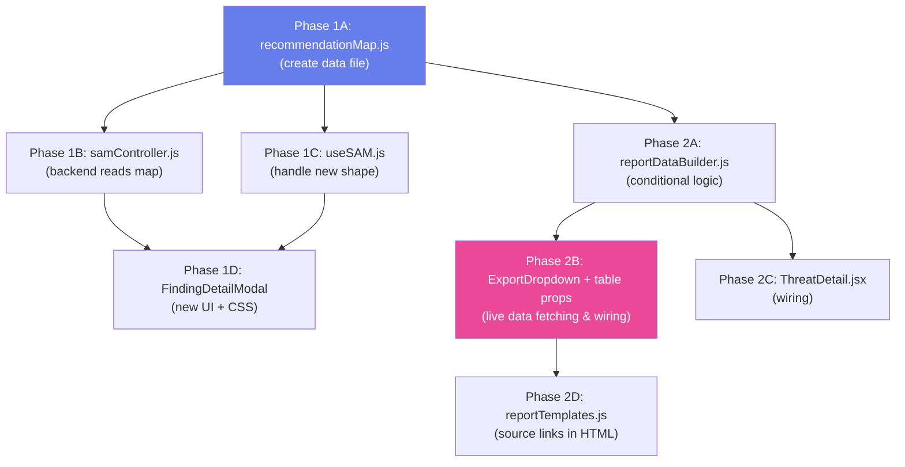

# Conditional Recommendation Mapping & Live Report Integration — Complete Implementation Plan

## Goal

1. **Conditional Mapping (Phase 1):** Create a **single source of truth** mapping each WFVT finding (001–007) to its specific recommendations with per-item source badges and clickable external links. This mapping drives the `FindingDetailModal` and the report recommendation engines.
2. **Full Live Report Integration (Phase 2):** Connect the PDF export pipeline to the live `dashboardApi` to completely replace mock data with live metrics, risk trend charts, historical scan records, and severity breakdowns.

*(Note: The recommendation source links defined below are currently being validated by the user and can be easily swapped if needed.)*

---

## Complete Recommendation Data Reference

### Source Documents

| Source Key | Full Label | External URL |
|---|---|---|
| `NIST SP 800-97` | NIST SP 800-97: Establishing Robust Security Networks | [https://csrc.nist.gov/pubs/sp/800/97/final](https://csrc.nist.gov/pubs/sp/800/97/final) |
| `NIST SP 800-153` | NIST SP 800-153: Guidelines for Securing WLANs | [https://csrc.nist.gov/pubs/sp/800/153/final](https://csrc.nist.gov/pubs/sp/800/153/final) |
| `ITL Bulletin` | ITL Bulletin – WLAN Security (July 2008) | [https://csrc.nist.gov/publications/detail/itl-bulletin/2008/07/securing-wireless-networks/final](https://csrc.nist.gov/publications/detail/itl-bulletin/2008/07/securing-wireless-networks/final) |

### All 9 Recommendations (Final)

| # | Vulnerability | Related Threat | Source | User-Friendly Recommendation | Verbatim Evidence (from standard) | Technical Meaning |
|---|---|---|---|---|---|---|
| 1 | WFVT-001 Open System Auth | WFVT-005 Evil Twin | NIST SP 800-97 | Avoid Open System Authentication. Use WPA2-Enterprise or WPA3 with 802.1X authentication to ensure only verified devices can connect. | "Open system authentication is a null authentication algorithm that involves a two-step authentication transaction." | Open authentication does not verify identity, allowing rogue AP impersonation. |
| 2 | WFVT-001 Open System Auth | WFVT-007 MAC Spoofing | NIST SP 800-97 | Implement strong authentication mechanisms. Use 802.1X/EAP to validate device identity and prevent unauthorized access. | "Authentication mechanisms should ensure that devices connecting to the WLAN are properly validated." | Weak authentication allows spoofed identities to access the network. |
| 3 | WFVT-002 Weak Crypto | WFVT-005 Evil Twin | NIST SP 800-97 | Use modern encryption standards. Configure WPA2-AES or WPA3 and avoid deprecated protocols such as WEP and TKIP. | "Early IEEE 802.11 security mechanisms had significant cryptographic weaknesses that could allow attackers to compromise confidentiality and integrity." | Weak encryption enables interception and manipulation of data. |
| 4 | WFVT-002 Weak Crypto | WFVT-007 MAC Spoofing | NIST SP 800-153 | Strengthen WLAN encryption policies. Enforce AES-based encryption and secure key management practices. | "Organizations should use strong cryptographic protections to secure wireless communications." | Strong cryptography protects against exploitation of weak security controls. |
| 5 | WFVT-003 WPS Enabled | WFVT-005 Evil Twin | NIST SP 800-153 | Disable Wi-Fi Protected Setup (WPS). Turn off WPS to prevent brute-force PIN attacks and unauthorized access. | "Organizations should configure wireless access points securely and disable unnecessary services." | WPS introduces unnecessary attack vectors. |
| 6 | WFVT-003 WPS Enabled | WFVT-007 MAC Spoofing | ITL Bulletin | Harden access point configurations. Disable unused features like WPS and restrict unnecessary services. | "Wireless networks should be securely configured and unnecessary features should be disabled." | Weak configurations increase attack surface. |
| 7 | WFVT-004 PMF Disabled | WFVT-006 Deauth | NIST SP 800-97 | Enable Protected Management Frames (PMF). Use IEEE 802.11w to prevent spoofed deauthentication attacks. | "Management frames in IEEE 802.11 networks were originally not protected, allowing attackers to forge management frames such as deauthentication and disassociation frames." | Attackers can spoof deauthentication frames to disconnect users. |
| 8 | WFVT-004 PMF Disabled | WFVT-006 Deauth | ITL Bulletin | Protect wireless management frames. Ensure management frame protection is enabled. | "Unprotected management frames can be exploited by attackers to disrupt wireless communications." | Lack of protection enables service disruption. |
| 9 | WFVT-004 PMF Disabled | WFVT-005 Evil Twin | NIST SP 800-153 | Deploy WLAN protections against rogue activity. Enable PMF and monitor for unauthorized access points. | "Security mechanisms should be implemented to prevent unauthorized access points and malicious wireless activity." | PMF helps prevent rogue interference and control manipulation. |

### Reverse Mapping — Threat → Recommendations

When the modal is opened for a **threat**, it pulls recommendations from all vulnerabilities that reference that threat:

| Threat | Recommendations it collects | Sources present |
|---|---|---|
| **WFVT-005** Evil Twin (Critical, 9.3) | Rec #1 (from WFVT-001), #3 (from WFVT-002), #5 (from WFVT-003), #9 (from WFVT-004) | NIST SP 800-97 × 2, NIST SP 800-153 × 2 |
| **WFVT-006** Deauth (High, 8.5) | Rec #7 (from WFVT-004), #8 (from WFVT-004) | NIST SP 800-97, ITL Bulletin |
| **WFVT-007** MAC Spoofing (Critical, 9.4) | Rec #2 (from WFVT-001), #4 (from WFVT-002), #6 (from WFVT-003) | NIST SP 800-97, NIST SP 800-153, ITL Bulletin |

### Severity → Priority Mapping

| Severity | CVSS Range | Findings | Priority |
|---|---|---|---|
| Critical | ≥ 9.0 | WFVT-001 (9.4), WFVT-002 (9.4), WFVT-005 (9.3), WFVT-007 (9.4) | **Immediate** (0–30 days) |
| High | 7.0–8.9 | WFVT-003 (7.6), WFVT-004 (7.1), WFVT-006 (8.5) | **Immediate** (0–30 days) |

All findings are High or Critical → all recommendations are priority **Immediate**.

---

## Design Decision: Why No Database Changes?

This implementation uses a **static JS configuration file** (`recommendationMap.js`) instead of adding new tables or columns to the Supabase database. Here's why:

### Why a JS file is the right fit

| Property of the data | Implication |
|---|---|
| **Fixed set** — 7 WFVT codes, 9 recommendations total | Not growing dynamically at runtime |
| **Standards-based** — sourced from published NIST SP 800-97, NIST SP 800-153, and ITL Bulletin | Won't change unless the standards themselves are revised (rare) |
| **Not user-generated** — no admin edits these at runtime | No CRUD UI or audit trail needed |
| **Not per-scan / per-network** — the same recommendations apply regardless of which network detected the finding | No relational joins needed |
| **Small dataset** — 9 recommendation objects, 3 source documents | No performance benefit from DB indexing |

The **conditional mapping** ("which recommendations appear in a report") is determined at **report generation time** by checking which WFVT codes were actually detected — and that detection data is **already stored in the database** (`vulnerabilities_threat` table → `vt_detail_id` → `vulnerability_threat_details.vt_code`). The JS file simply provides the recommendation text and metadata to match against those detected codes.

This is analogous to other static config already in the codebase:
- `STOP_REASON_CODES` array in `detectController.js` — hardcoded, not in DB
- Severity labels (`Critical`, `High`, `Medium`, `Low`) — used throughout without a DB lookup table
- The existing `defaultRecommendations()` in `samController.js` — already hardcoded in JS, we're just making it finding-specific

### When you *would* migrate to a DB approach

A database table would become necessary if any of these requirements emerge in the future:

| Future Scenario | Why DB would be needed |
|---|---|
| Admins can **edit recommendations** from the web app UI | Need persistent storage + CRUD API |
| New WFVT codes are added **frequently** without redeploying | Need runtime-insertable data |
| Different organizations get **different recommendation sets** | Need multi-tenant data isolation |
| Recommendations need **audit trails** (who changed what, when) | Need DB triggers / audit logging |

If that happens, the migration path is straightforward: add a `vt_recommendations` JSONB column to the existing `vulnerability_threat_details` table (or a new related table), seed it with the data from `recommendationMap.js`, and update `samController.js` to query it instead of `require()`-ing the file.

> [!NOTE]
> **No Supabase migrations, no schema changes, no seed scripts needed for this implementation.** The recommendation data lives entirely in application code.

---

## Component 1: Recommendation Map (Single Source of Truth)

#### [NEW] `src/data/recommendationMap.js`

A shared file importable by both frontend (ESM `import`) and backend (CommonJS `require`). Uses CommonJS `module.exports` for maximum compatibility (Vite handles CommonJS imports fine).

**Full file content:**

```javascript
// src/data/recommendationMap.js
// Single source of truth for WFVT finding → recommendation mapping.
// Consumed by: backend/controllers/samController.js (modal API)
//              src/utils/reportDataBuilder.js (report generation)

const SOURCES = {
  "NIST SP 800-97": {
    label: "NIST SP 800-97",
    url: "https://csrc.nist.gov/pubs/sp/800/97/final",
  },
  "NIST SP 800-153": {
    label: "NIST SP 800-153",
    url: "https://csrc.nist.gov/pubs/sp/800/153/final",
  },
  "ITL Bulletin": {
    label: "ITL Bulletin – WLAN Security",
    url: "https://csrc.nist.gov/publications/detail/itl-bulletin/2008/07/securing-wireless-networks/final",
  },
};

const RECOMMENDATION_MAP = {
  "WFVT-001": {
    name: "Open System Authentication",
    kind: "vulnerability",
    severity: "Critical",
    cvss: 9.4,
    recommendations: [
      {
        text: "Avoid Open System Authentication. Use WPA2-Enterprise or WPA3 with 802.1X authentication to ensure only verified devices can connect.",
        sources: ["NIST SP 800-97"],
        relatedThreat: "Evil Twin Attack",
        relatedThreatId: "WFVT-005",
        verbatimEvidence: "Open system authentication is a null authentication algorithm that involves a two-step authentication transaction.",
        technicalMeaning: "Open authentication does not verify identity, allowing rogue AP impersonation.",
        priority: "Immediate",
        responsible: "Network Administrator",
      },
      {
        text: "Implement strong authentication mechanisms. Use 802.1X/EAP to validate device identity and prevent unauthorized access.",
        sources: ["NIST SP 800-97"],
        relatedThreat: "MAC Address Spoofing Attack",
        relatedThreatId: "WFVT-007",
        verbatimEvidence: "Authentication mechanisms should ensure that devices connecting to the WLAN are properly validated.",
        technicalMeaning: "Weak authentication allows spoofed identities to access the network.",
        priority: "Immediate",
        responsible: "Network Administrator",
      },
    ],
  },
  "WFVT-002": {
    name: "Weak or Deprecated Cryptographic Algorithms",
    kind: "vulnerability",
    severity: "Critical",
    cvss: 9.4,
    recommendations: [
      {
        text: "Use modern encryption standards. Configure WPA2-AES or WPA3 and avoid deprecated protocols such as WEP and TKIP.",
        sources: ["NIST SP 800-97"],
        relatedThreat: "Evil Twin Attack",
        relatedThreatId: "WFVT-005",
        verbatimEvidence: "Early IEEE 802.11 security mechanisms had significant cryptographic weaknesses that could allow attackers to compromise confidentiality and integrity.",
        technicalMeaning: "Weak encryption enables interception and manipulation of data.",
        priority: "Immediate",
        responsible: "Network Administrator",
      },
      {
        text: "Strengthen WLAN encryption policies. Enforce AES-based encryption and secure key management practices.",
        sources: ["NIST SP 800-153"],
        relatedThreat: "MAC Address Spoofing Attack",
        relatedThreatId: "WFVT-007",
        verbatimEvidence: "Organizations should use strong cryptographic protections to secure wireless communications.",
        technicalMeaning: "Strong cryptography protects against exploitation of weak security controls.",
        priority: "Immediate",
        responsible: "Network Administrator",
      },
    ],
  },
  "WFVT-003": {
    name: "Wi-Fi Protected Setup (WPS) Enabled",
    kind: "vulnerability",
    severity: "High",
    cvss: 7.6,
    recommendations: [
      {
        text: "Disable Wi-Fi Protected Setup (WPS). Turn off WPS to prevent brute-force PIN attacks and unauthorized access.",
        sources: ["NIST SP 800-153"],
        relatedThreat: "Evil Twin Attack",
        relatedThreatId: "WFVT-005",
        verbatimEvidence: "Organizations should configure wireless access points securely and disable unnecessary services.",
        technicalMeaning: "WPS introduces unnecessary attack vectors.",
        priority: "Immediate",
        responsible: "Network Administrator",
      },
      {
        text: "Harden access point configurations. Disable unused features like WPS and restrict unnecessary services.",
        sources: ["ITL Bulletin"],
        relatedThreat: "MAC Address Spoofing Attack",
        relatedThreatId: "WFVT-007",
        verbatimEvidence: "Wireless networks should be securely configured and unnecessary features should be disabled.",
        technicalMeaning: "Weak configurations increase attack surface.",
        priority: "Immediate",
        responsible: "Network Administrator",
      },
    ],
  },
  "WFVT-004": {
    name: "Protected Management Frames (PMF) Disabled",
    kind: "vulnerability",
    severity: "High",
    cvss: 7.1,
    recommendations: [
      {
        text: "Enable Protected Management Frames (PMF). Use IEEE 802.11w to prevent spoofed deauthentication attacks.",
        sources: ["NIST SP 800-97"],
        relatedThreat: "Deauthentication Attack",
        relatedThreatId: "WFVT-006",
        verbatimEvidence: "Management frames in IEEE 802.11 networks were originally not protected, allowing attackers to forge management frames such as deauthentication and disassociation frames.",
        technicalMeaning: "Attackers can spoof deauthentication frames to disconnect users.",
        priority: "Immediate",
        responsible: "Network Administrator",
      },
      {
        text: "Protect wireless management frames. Ensure management frame protection is enabled.",
        sources: ["ITL Bulletin"],
        relatedThreat: "Deauthentication Attack",
        relatedThreatId: "WFVT-006",
        verbatimEvidence: "Unprotected management frames can be exploited by attackers to disrupt wireless communications.",
        technicalMeaning: "Lack of protection enables service disruption.",
        priority: "Immediate",
        responsible: "Network Administrator",
      },
      {
        text: "Deploy WLAN protections against rogue activity. Enable PMF and monitor for unauthorized access points.",
        sources: ["NIST SP 800-153"],
        relatedThreat: "Evil Twin Attack",
        relatedThreatId: "WFVT-005",
        verbatimEvidence: "Security mechanisms should be implemented to prevent unauthorized access points and malicious wireless activity.",
        technicalMeaning: "PMF helps prevent rogue interference and control manipulation.",
        priority: "Immediate",
        responsible: "Network Administrator",
      },
    ],
  },
};

/**
 * Reverse mapping — collects recommendations for a threat by scanning
 * all vulnerabilities whose recommendations reference that threat ID.
 */
function getRecommendationsForThreat(threatId) {
  const recs = [];
  for (const [vtCode, entry] of Object.entries(RECOMMENDATION_MAP)) {
    for (const rec of entry.recommendations) {
      if (rec.relatedThreatId === threatId) {
        recs.push({
          ...rec,
          fromVulnerability: vtCode,
          fromVulnerabilityName: entry.name,
        });
      }
    }
  }
  return recs;
}

/**
 * Resolve source keys to full source objects with URLs.
 */
function resolveSourceObjects(sourceKeys) {
  return sourceKeys.map((key) => SOURCES[key] || { label: key, url: null });
}

module.exports = {
  SOURCES,
  RECOMMENDATION_MAP,
  getRecommendationsForThreat,
  resolveSourceObjects,
};
```

---

## Component 2: Backend Controller Update

#### [MODIFY] `backend/controllers/samController.js`

**Lines affected:** 8–21 (remove `defaultRecommendations()`), 62–69 (threat response), 102–119 (vuln response)

**Changes:**

1. **Delete** `defaultRecommendations()` (lines 8–21)

2. **Add import** at top of file (after line 1):
```javascript
const {
  RECOMMENDATION_MAP,
  getRecommendationsForThreat,
  resolveSourceObjects,
} = require("../../src/data/recommendationMap");
```

3. **Add new helper** (replaces `defaultRecommendations`):
```javascript
/**
 * Build the recommendations array for a finding.
 * - For vulnerabilities: lookup RECOMMENDATION_MAP[vtCode]
 * - For threats: reverse-map via getRecommendationsForThreat(vtCode)
 * Returns an array of rich recommendation objects.
 */
function buildRecommendations(vtCode, vtKind) {
  let recs = [];

  if (vtKind === "threat") {
    recs = getRecommendationsForThreat(vtCode);
  } else {
    const entry = RECOMMENDATION_MAP[vtCode];
    if (entry) {
      recs = entry.recommendations.map((r) => ({
        ...r,
        fromVulnerability: vtCode,
        fromVulnerabilityName: entry.name,
      }));
    }
  }

  // Resolve source keys → { label, url } objects
  return recs.map((r) => ({
    text: r.text,
    sources: resolveSourceObjects(r.sources),
    relatedThreat: r.relatedThreat || null,
    relatedThreatId: r.relatedThreatId || null,
    fromVulnerability: r.fromVulnerability || null,
    fromVulnerabilityName: r.fromVulnerabilityName || null,
    verbatimEvidence: r.verbatimEvidence || null,
    technicalMeaning: r.technicalMeaning || null,
    priority: r.priority || "Immediate",
    responsible: r.responsible || "Network Administrator",
  }));
}
```

4. **Update `getThreatDetail` response** (line 68):
```diff
-      recommendations: defaultRecommendations(),
+      recommendations: buildRecommendations(detail.vt_code, "threat"),
```

5. **Update `getVulnDetail` response — not-found fallback** (line 108):
```diff
-        recommendations: defaultRecommendations(),
+        recommendations: [],
```

6. **Update `getVulnDetail` response — found** (line 118):
```diff
-      recommendations: defaultRecommendations(),
+      recommendations: buildRecommendations(detail.vt_code, detail.vt_kind || "vulnerability"),
```

**New API response shape** (both endpoints return the same structure):

```json
{
  "severity": "Critical",
  "name": "Open System Authentication",
  "cvss": 9.4,
  "cvssVector": "CVSS:4.0/AV:A/AC:L/AT:N/PR:N/UI:N/VC:H/VI:H/VA:L/SC:H/SI:H/SA:L",
  "description": "Open System Authentication (WFVT-001) was detected during analysis...",
  "recommendations": [
    {
      "text": "Avoid Open System Authentication. Use WPA2-Enterprise or WPA3...",
      "sources": [
        {
          "label": "NIST SP 800-97",
          "url": "https://csrc.nist.gov/pubs/sp/800/97/final"
        }
      ],
      "relatedThreat": "Evil Twin Attack",
      "relatedThreatId": "WFVT-005",
      "fromVulnerability": "WFVT-001",
      "fromVulnerabilityName": "Open System Authentication",
      "verbatimEvidence": "Open system authentication is a null authentication algorithm...",
      "technicalMeaning": "Open authentication does not verify identity...",
      "priority": "Immediate",
      "responsible": "Network Administrator"
    },
    {
      "text": "Implement strong authentication mechanisms...",
      "sources": [
        {
          "label": "NIST SP 800-97",
          "url": "https://csrc.nist.gov/pubs/sp/800/97/final"
        }
      ],
      "relatedThreat": "MAC Address Spoofing Attack",
      "relatedThreatId": "WFVT-007",
      "fromVulnerability": "WFVT-001",
      "fromVulnerabilityName": "Open System Authentication",
      "verbatimEvidence": "Authentication mechanisms should ensure...",
      "technicalMeaning": "Weak authentication allows spoofed identities...",
      "priority": "Immediate",
      "responsible": "Network Administrator"
    }
  ]
}
```

---

## Component 3: Frontend Hook Updates

The hooks currently expect `recommendations: { nist: string[], owasp: string[] }`. They must be updated to handle the new array shape.

#### [MODIFY] `src/hooks/useSAM.js`

**`useThreats` hook** (line 48): The threat detail is set directly from the API response, so no shape transformation is needed — the backend now returns the new format.

**`useVulnerabilities` hook** (lines 186–199, 210–220):

Change the **API success path** (line 193):
```diff
-              recommendations: res.data.recommendations ?? {
-                nist: [],
-                owasp: [],
-              },
+              recommendations: res.data.recommendations ?? [],
```

Change the **local fallback path** (line 217):
```diff
-        recommendations: { nist: [], owasp: [] },
+        recommendations: [],
```

---

## Component 4: Modal UI Update

#### [MODIFY] `src/components/modals/FindingDetailModal/FindingDetailModal.jsx`

**Full replacement of the Recommendations section.** Changes from 137-line file to ~155 lines.

**State change** (lines 7–8):
```diff
-  const [activeRecommendationTab, setActiveRecommendationTab] =
-    useState("nist");
+  const [expandedRecIndex, setExpandedRecIndex] = useState(null);
```

**Add toggle handler** (after the state declaration):
```javascript
  const toggleRec = (index) => {
    setExpandedRecIndex((prev) => (prev === index ? null : index));
  };
```

**Replace the entire Recommendations `<div>` block** (lines 82–129) with:

```jsx
          <div className="modal-section">
            <div className="recommendation-header-row">
              <h3>Recommendations</h3>
              <span className="rec-subtitle">Sourced from multiple standards</span>
            </div>

            <div className="recommendation-cards">
              {Array.isArray(vulnerability.recommendations) &&
                vulnerability.recommendations.map((rec, i) => (
                  <div
                    key={i}
                    className={`rec-card ${expandedRecIndex === i ? "expanded" : ""}`}
                  >
                    <div
                      className="rec-card-main"
                      onClick={() => toggleRec(i)}
                    >
                      <span className="rec-card-text">{rec.text}</span>
                      <span
                        className={`rec-chevron ${expandedRecIndex === i ? "open" : ""}`}
                      >
                        ▸
                      </span>
                    </div>
                    <div className="rec-card-badges">
                      {rec.sources &&
                        rec.sources.map((src, j) => (
                          <a
                            key={j}
                            href={src.url}
                            target="_blank"
                            rel="noopener noreferrer"
                            className="source-badge"
                            onClick={(e) => e.stopPropagation()}
                          >
                            {src.label}
                          </a>
                        ))}
                    </div>
                    {expandedRecIndex === i && (
                      <div className="rec-card-detail">
                        <blockquote className="rec-evidence">
                          "{rec.verbatimEvidence}"
                        </blockquote>
                        <p className="rec-technical">
                          {rec.technicalMeaning}
                        </p>
                        {rec.relatedThreat && (
                          <p className="rec-related">
                            Related threat: {rec.relatedThreat}
                          </p>
                        )}
                        {rec.fromVulnerabilityName && (
                          <p className="rec-related">
                            Related vulnerability: {rec.fromVulnerabilityName}
                          </p>
                        )}
                      </div>
                    )}
                  </div>
                ))}
              {(!vulnerability.recommendations ||
                vulnerability.recommendations.length === 0) && (
                <p className="rec-empty">
                  No recommendations available for this finding.
                </p>
              )}
            </div>
          </div>
```

#### [MODIFY] `src/components/modals/FindingDetailModal/FindingDetailModal.css`

**Remove old styles** (lines 140–203): `.recommendation-tabs`, `.rec-tab`, `.rec-tab.active`, `.recommendation-content ul/li`, `.rec-text`, `.rec-expand`

**Add new styles** (replacing lines 140–203):

```css
/* ── Recommendation cards ─────────────────────────────── */

.recommendation-header-row {
  display: flex;
  justify-content: space-between;
  align-items: baseline;
  margin-bottom: 16px;
}

.rec-subtitle {
  font-size: 12px;
  color: #9ca3af;
  font-style: italic;
}

.recommendation-cards {
  display: flex;
  flex-direction: column;
  gap: 10px;
}

.rec-card {
  background: #f9fafb;
  border: 1px solid #e5e7eb;
  border-radius: 10px;
  padding: 14px 16px;
  transition: box-shadow 0.2s ease;
}

.rec-card:hover {
  box-shadow: 0 1px 4px rgba(0, 0, 0, 0.06);
}

.rec-card-main {
  display: flex;
  justify-content: space-between;
  align-items: flex-start;
  cursor: pointer;
  gap: 12px;
}

.rec-card-text {
  font-size: 14px;
  line-height: 1.6;
  color: #111827;
  flex: 1;
}

.rec-chevron {
  font-size: 14px;
  color: #9ca3af;
  transition: transform 0.2s ease;
  flex-shrink: 0;
  margin-top: 2px;
}

.rec-chevron.open {
  transform: rotate(90deg);
}

.rec-card-badges {
  display: flex;
  flex-wrap: wrap;
  gap: 6px;
  margin-top: 10px;
}

.source-badge {
  display: inline-block;
  background: #1a1a1a;
  color: #ffffff;
  font-size: 11px;
  font-weight: 500;
  padding: 3px 10px;
  border-radius: 4px;
  text-decoration: none;
  transition: background 0.15s ease;
}

.source-badge:hover {
  background: #374151;
}

.rec-card-detail {
  margin-top: 14px;
  padding-top: 14px;
  border-top: 1px solid #e5e7eb;
}

.rec-evidence {
  font-size: 13px;
  font-style: italic;
  color: #6b7280;
  border-left: 3px solid #d1d5db;
  padding-left: 12px;
  margin: 0 0 10px 0;
  line-height: 1.6;
}

.rec-technical {
  font-size: 13px;
  color: #374151;
  margin: 0 0 8px 0;
  line-height: 1.5;
}

.rec-related {
  font-size: 12px;
  color: #6b7280;
  margin: 4px 0 0 0;
}

.rec-empty {
  font-size: 14px;
  color: #9ca3af;
  font-style: italic;
  text-align: center;
  padding: 20px 0;
}
```

**Mobile overrides** — update the existing `@media (max-width: 768px)` blocks (lines 257–273) to replace the old tab/list styles with:
```css
@media (max-width: 768px) {
  /* ... existing modal overrides stay ... */

  .recommendation-header-row {
    flex-direction: column;
    gap: 4px;
  }

  .rec-card {
    padding: 12px 14px;
  }

  .rec-card-text {
    font-size: 13px;
  }

  .source-badge {
    font-size: 10px;
  }
}
```

---

## Component 5: Live Data Export Wiring

#### [MODIFY] `src/components/sam/ExportDropdown.jsx`

This is where the "Live Integration" happens. Instead of relying on mocked data or only the current SAM page props, this component will make asynchronous API calls to `dashboardApi` to grab real metrics, severity counts, and risk scores right before generating the report.

**1. Update Imports:**
```javascript
import { useState, useRef, useEffect } from "react";
import {
  generateOverallReportHTML,
  generatePerNetworkReportHTML,
} from "../../utils/reportTemplates";
import { exportReport } from "../../utils/exportReport";
import { buildPerNetworkReportData, buildOverallReportData } from "../../utils/reportDataBuilder";
// Import dashboard API to fetch live metrics
import { getDashboardSummary, getDashboardForNetwork } from "../../api/dashboardApi";
import "./ExportDropdown.css";
```

**2. Component Signature:**
```javascript
const ExportDropdown = ({ selectedNetwork, vulnerabilities, threats }) => {
  const [open, setOpen] = useState(false);
  const [isExporting, setIsExporting] = useState(false);
  const ref = useRef(null);
  // ... existing click-outside effect ...
```

**3. Async Per-Network Export Handler:**
```javascript
  const handleExportPerNetwork = async () => {
    try {
      setOpen(false);
      setIsExporting(true);

      // Default data from props
      let networkData = selectedNetwork || {};
      let riskScore = 0;
      let riskLabel = "N/A";
      let riskTrend = [];
      let historicalScans = [];

      // Fetch live metrics for this network
      if (selectedNetwork?.id || selectedNetwork?.network_id) {
        const networkId = selectedNetwork.id || selectedNetwork.network_id;
        const res = await getDashboardForNetwork(networkId);
        if (res.data) {
          networkData = { ...networkData, ...res.data.network };
          riskScore = res.data.riskScoreData?.score || 0;
          riskLabel = res.data.riskScoreData?.label || "N/A";
          riskTrend = res.data.clientsRiskTrendData?.riskTrend || [];
          historicalScans = res.data.scanList?.slice(0, 10).map(s => ({
            date: new Date(s.finished_at).toLocaleDateString(),
            findings: s.findings_count || 0,
            riskScore: s.scan_risk_score || 0
          })) || [];
        }
      }

      const reportData = buildPerNetworkReportData({
        network: networkData,
        vulnerabilities: vulnerabilities || [],
        threats: threats || [],
        riskScore,
        riskLabel,
        riskTrend,
        historicalScans
      });

      const html = generatePerNetworkReportHTML(reportData);
      exportReport(html);
    } catch (err) {
      console.error("Failed to generate per-network report:", err);
      alert("Failed to gather live data for the report.");
    } finally {
      setIsExporting(false);
    }
  };
```

**4. Async Overall Export Handler:**
```javascript
  const handleExportSummary = async () => {
    try {
      setOpen(false);
      setIsExporting(true);

      let overallRiskScore = 0;
      let overallRiskLabel = "N/A";
      let networks = selectedNetwork ? [selectedNetwork] : [];

      // Fetch live summary metrics
      const res = await getDashboardSummary();
      if (res.data) {
        overallRiskScore = res.data.riskScoreData?.score || 0;
        overallRiskLabel = res.data.riskScoreData?.label || "N/A";
        // Convert API network list to report format
        if (Array.isArray(res.data.networks)) {
          networks = res.data.networks.map(n => ({
            ssid: n.ssid,
            bssid: n.bssid,
            encryption: n.encryption_status,
            clients: n.num_clients || 0,
            riskPercent: n.risk_score || 0,
            riskLabel: n.risk_bucket || "N/A",
            findings: n.findings_count || 0
          }));
        }
      }

      const reportData = buildOverallReportData({
        networks,
        allVulnerabilities: vulnerabilities || [],
        allThreats: threats || [],
        overallRiskScore,
        overallRiskLabel,
        // (Could also pass a mocked riskTrend here if dashboard summary API doesn't provide a global one)
      });

      const html = generateOverallReportHTML(reportData);
      exportReport(html);
    } catch (err) {
      console.error("Failed to generate overall report:", err);
      alert("Failed to gather live data for the report.");
    } finally {
      setIsExporting(false);
    }
  };
```

**5. Update Button UI:**
Update the main button text to show loading state:
```jsx
      <button
        className="export-btn"
        type="button"
        disabled={isExporting}
        onClick={() => setOpen((prev) => !prev)}
      >
        {isExporting ? "⏳ Exporting..." : "📎 Export"}
      </button>
```

#### [MODIFY] `src/components/sam/VulnerabilitiesTable.jsx`

Pass data props down to `ExportDropdown` where it's rendered:
```diff
-<ExportDropdown />
+<ExportDropdown
+  selectedNetwork={selectedNetwork}
+  vulnerabilities={vulnerabilities}
+  threats={displayThreats}
+/>
```

#### [MODIFY] `src/components/sam/ThreatsTable.jsx`

Same pattern — pass data props through to ExportDropdown.

#### [MODIFY] `src/components/sam/ThreatDetail.jsx`

Remove mock data import, use builder instead (same logic as `ExportDropdown` but focused on just this one threat).

---

## Component 6: Report Data Builder

#### [NEW] `src/utils/reportDataBuilder.js`

Conditional mapping logic — only includes recommendations for findings that were actually detected. Passes through the live metrics fetched by ExportDropdown.

```javascript
// src/utils/reportDataBuilder.js
import {
  RECOMMENDATION_MAP,
  SOURCES,
  getRecommendationsForThreat,
} from "../data/recommendationMap";

/**
 * De-duplicate an array of recommendation objects by their text field.
 */
function deduplicateByText(recs) {
  const seen = new Set();
  return recs.filter((r) => {
    if (seen.has(r.text)) return false;
    seen.add(r.text);
    return true;
  });
}

/**
 * Build report data for a single network — matches perNetworkMockData shape.
 */
export function buildPerNetworkReportData({
  network = {},
  vulnerabilities = [],
  threats = [],
  scanMeta = {},
  riskTrend = [],
  historicalScans = [],
  riskScore = 0,
  riskLabel = "N/A",
}) {
  // ── Recommendations (conditional on detected findings) ──
  const allRecs = [];

  for (const vuln of vulnerabilities) {
    const vtCode = vuln.id;   // e.g. "WFVT-001"
    const entry = RECOMMENDATION_MAP[vtCode];
    if (!entry) continue;
    for (const rec of entry.recommendations) {
      allRecs.push({
        text: rec.text,
        ref: `${rec.sources.join(", ")}`,
        sourceUrls: rec.sources.map((s) => SOURCES[s]?.url).filter(Boolean),
        responsible: rec.responsible,
        priority: rec.priority,
      });
    }
  }

  for (const threat of threats) {
    const threatRecs = getRecommendationsForThreat(threat.id);
    for (const rec of threatRecs) {
      allRecs.push({
        text: rec.text,
        ref: `${rec.sources.join(", ")}`,
        sourceUrls: rec.sources.map((s) => SOURCES[s]?.url).filter(Boolean),
        responsible: rec.responsible,
        priority: rec.priority,
      });
    }
  }

  const dedupedRecs = deduplicateByText(allRecs);

  // ── Finding details ──
  const findingDetails = [];

  for (const vuln of vulnerabilities) {
    const entry = RECOMMENDATION_MAP[vuln.id];
    findingDetails.push({
      id: vuln.id,
      title: vuln.name,
      issue: entry
        ? `${entry.name} detected — ${entry.recommendations.map((r) => r.technicalMeaning).join(" ")}`
        : `${vuln.name} was detected during analysis.`,
      impact: entry
        ? entry.recommendations.map((r) => r.technicalMeaning).join(" ")
        : "Review and apply recommendations to mitigate risk.",
      evidence: entry
        ? entry.recommendations.map((r) => `"${r.verbatimEvidence}"`).join(" | ")
        : "N/A",
      isThreat: false,
    });
  }

  for (const threat of threats) {
    const threatRecs = getRecommendationsForThreat(threat.id);
    findingDetails.push({
      id: threat.id,
      title: threat.name,
      issue: `${threat.name} detected during monitoring.`,
      impact: threatRecs.map((r) => r.technicalMeaning).join(" "),
      evidence: threatRecs.map((r) => `"${r.verbatimEvidence}"`).join(" | "),
      isThreat: true,
    });
  }

  // ── Assemble the perNetworkMockData-compatible shape ──
  return {
    meta: {
      dateOfIssue: scanMeta.dateOfIssue || new Date().toLocaleDateString(),
      preparedBy: scanMeta.preparedBy || "WhyPII Assessment Tool",
      forWhom: scanMeta.forWhom || "Network Administrator",
      classification: scanMeta.classification || "CONFIDENTIAL",
      lastScan: scanMeta.lastScan || new Date().toISOString(),
    },
    network: {
      ssid: network.ssid || "N/A",
      bssid: network.bssid || "N/A",
      channel: network.channel || "N/A",
      encryption: network.encryption || network.encryption_status || "N/A",
      clients: network.clients || network.num_clients || 0,
      lastScanDate: scanMeta.lastScan
        ? new Date(scanMeta.lastScan).toLocaleDateString()
        : new Date().toLocaleDateString(),
      lastScanTime: scanMeta.lastScan
        ? new Date(scanMeta.lastScan).toLocaleTimeString()
        : new Date().toLocaleTimeString(),
    },
    riskScore,
    riskLabel,
    vulnerabilities: vulnerabilities.map((v) => ({
      id: v.id,
      name: v.name,
      severity: v.severity,
      cvss: v.score || v.cvss || "N/A",
      presence: "Detected",
    })),
    threats: threats.map((t) => ({
      id: t.id,
      name: t.name,
      severity: t.severity,
      cvss: t.score || t.cvss || "N/A",
      occurrences: t.occurrences || 1,
    })),
    findingDetails,
    recommendations: {
      immediate: dedupedRecs.filter((r) => r.priority === "Immediate"),
      shortTerm: dedupedRecs.filter((r) => r.priority !== "Immediate"),
    },
    riskTrend,
    historicalScans,
  };
}

/**
 * Build report data for overall summary — matches overallMockData shape.
 */
export function buildOverallReportData({
  networks = [],
  allVulnerabilities = [],
  allThreats = [],
  scanMeta = {},
  riskTrend = {},
  historicalScans = [],
  overallRiskScore = 0,
  overallRiskLabel = "N/A",
}) {
  // ── Aggregate recommendations across all findings ──
  const allDetectedIds = new Set();
  for (const v of allVulnerabilities) allDetectedIds.add(v.id);
  for (const t of allThreats) allDetectedIds.add(t.id);

  const allRecs = [];

  for (const vtCode of allDetectedIds) {
    const entry = RECOMMENDATION_MAP[vtCode];
    if (entry) {
      for (const rec of entry.recommendations) {
        allRecs.push({
          finding: entry.name,
          action: rec.text,
          source: rec.sources.join(", "),
          sourceUrls: rec.sources.map((s) => SOURCES[s]?.url).filter(Boolean),
          priority: rec.priority,
          responsible: rec.responsible,
        });
      }
    }
    // Also check if this is a threat that gets reverse-mapped recs
    const threatRecs = getRecommendationsForThreat(vtCode);
    for (const rec of threatRecs) {
      allRecs.push({
        finding: rec.fromVulnerabilityName,
        action: rec.text,
        source: rec.sources.join(", "),
        sourceUrls: rec.sources.map((s) => SOURCES[s]?.url).filter(Boolean),
        priority: rec.priority,
        responsible: rec.responsible,
      });
    }
  }

  // De-duplicate by action text
  const dedupedMapping = [];
  const seen = new Set();
  for (const r of allRecs) {
    if (!seen.has(r.action)) {
      seen.add(r.action);
      dedupedMapping.push(r);
    }
  }

  // ── Severity breakdown ──
  const sevCounts = { Critical: { v: 0, t: 0 }, High: { v: 0, t: 0 }, Medium: { v: 0, t: 0 }, Low: { v: 0, t: 0 } };
  for (const v of allVulnerabilities) sevCounts[v.severity]
    ? (sevCounts[v.severity].v += 1) : null;
  for (const t of allThreats) sevCounts[t.severity]
    ? (sevCounts[t.severity].t += 1) : null;

  return {
    meta: {
      version: scanMeta.version || "1.0",
      dateOfIssue: scanMeta.dateOfIssue || new Date().toLocaleDateString(),
      preparedBy: scanMeta.preparedBy || "WhyPII Assessment Tool",
      reviewedBy: scanMeta.reviewedBy || "Network Administrator",
      classification: scanMeta.classification || "CONFIDENTIAL",
      assessmentWindow: scanMeta.assessmentWindow || "Current Session",
    },
    executiveSummary: {
      overallRiskScore,
      riskLabel: overallRiskLabel,
      criticalFindings: allVulnerabilities.filter((v) => v.severity === "Critical").length +
        allThreats.filter((t) => t.severity === "Critical").length,
      highFindings: allVulnerabilities.filter((v) => v.severity === "High").length +
        allThreats.filter((t) => t.severity === "High").length,
      totalClientsAtRisk: networks.reduce((sum, n) => sum + (n.clients || n.num_clients || 0), 0),
      keyBusinessImpacts: [
        "Unauthorized network access via weak authentication",
        "Data interception through deprecated encryption",
        "Service disruption from deauthentication attacks",
      ],
      top5Actions: dedupedMapping.slice(0, 5).map((r) => r.action),
    },
    networks, // Now populated by real data from dashboardApi
    severityBreakdown: Object.entries(sevCounts).map(([sev, counts]) => ({
      severity: sev,
      vulnerabilities: counts.v,
      threats: counts.t,
      total: counts.v + counts.t,
    })),
    detailedFindings: {
      openAndWeakCrypto: allVulnerabilities
        .filter((v) => ["WFVT-001", "WFVT-002"].includes(v.id))
        .map((v) => ({ network: v.network || "N/A", finding: v.name, kind: "Vulnerability", severity: v.severity, cvss: v.score })),
      misconfigurations: allVulnerabilities
        .filter((v) => ["WFVT-003", "WFVT-004"].includes(v.id))
        .map((v) => ({ network: v.network || "N/A", finding: v.name, kind: "Vulnerability", severity: v.severity, cvss: v.score })),
      activeThreats: allThreats
        .map((t) => ({ network: t.network || "N/A", finding: t.name, kind: "Threat", severity: t.severity, cvss: t.score, occurrences: t.occurrences || 1 })),
    },
    riskTrend,
    remediation: {
      quickWins: dedupedMapping.filter((r) => r.priority === "Immediate").map((r) => r.action),
      mediumTerm: dedupedMapping.filter((r) => r.priority !== "Immediate").map((r) => r.action),
      detailedMapping: dedupedMapping.map((r) => ({
        finding: r.finding,
        action: r.action,
        source: r.source,
        sourceUrls: r.sourceUrls,
        priority: r.priority,
        responsible: r.responsible,
      })),
    },
    historicalScans,
  };
}
```

---

## Component 7: Report Template Adjustments

#### [MODIFY] `src/utils/reportTemplates.js`

**Changes to `generatePerNetworkReportHTML()`** — Recommendations section:

Update the immediate/shortTerm list item rendering to include source links:
```html
<!-- Before: -->
<li class="priority-immediate">
  <strong>Immediate:</strong> ${rec.text}
  <br><small>Ref: ${rec.ref} | Responsible: ${rec.responsible}</small>
</li>

<!-- After: -->
<li class="priority-immediate">
  <strong>Immediate:</strong> ${rec.text}
  <br><small>
    Source: ${rec.sourceUrls && rec.sourceUrls.length > 0
      ? rec.sourceUrls.map((url, i) =>
          `<a href="${url}" target="_blank" style="color:#2563eb">${rec.ref.split(', ')[i] || rec.ref}</a>`
        ).join(', ')
      : rec.ref}
    | Responsible: ${rec.responsible}
  </small>
</li>
```

**Changes to `generateOverallReportHTML()`** — Remediation Roadmap section:

Add a **Source** column to the Detailed Recommendation Mapping table:
```diff
 <thead>
-  <tr><th>Finding</th><th>Action</th><th>Priority</th><th>Responsible</th></tr>
+  <tr><th>Finding</th><th>Action</th><th>Source</th><th>Priority</th><th>Responsible</th></tr>
 </thead>

 // Each row:
-  <td>${row.action}</td>
+  <td>${row.action}</td>
+  <td>${row.sourceUrls && row.sourceUrls.length > 0
+    ? row.sourceUrls.map((url, i) =>
+        `<a href="${url}" target="_blank">${row.source.split(', ')[i] || row.source}</a>`
+      ).join(', ')
+    : row.source || 'N/A'}</td>
```

---

## File Summary

| # | File | Action | Lines Changed | Purpose |
|---|------|--------|---------------|---------|
| 1 | `src/data/recommendationMap.js` | **NEW** | ~170 lines | Single source of truth for recommendations |
| 2 | `backend/controllers/samController.js` | **MODIFY** | ~30 lines | Integrate recommendations map into backend response |
| 3 | `src/hooks/useSAM.js` | **MODIFY** | ~4 lines | Array-based shape parsing |
| 4 | `src/components/modals/FindingDetailModal/FindingDetailModal.jsx` | **MODIFY** | ~50 lines | New UI: Cards with source badges & chevrons |
| 5 | `src/components/modals/FindingDetailModal/FindingDetailModal.css` | **MODIFY** | ~70 lines | Styles for cards, badges, chevrons |
| 6 | `src/components/sam/ExportDropdown.jsx` | **MODIFY** | ~80 lines | **Live Data Integration:** Fetch dashboard metrics asynchronously |
| 7 | `src/utils/reportDataBuilder.js` | **NEW** | ~250 lines | Construct full report object using live findings and dashboard metrics |
| 8 | `src/components/sam/VulnerabilitiesTable.jsx` | **MODIFY** | ~3 lines | Prop wiring |
| 9 | `src/components/sam/ThreatsTable.jsx` | **MODIFY** | ~3 lines | Prop wiring |
| 10 | `src/components/sam/ThreatDetail.jsx` | **MODIFY** | ~8 lines | Remove mock data, use builder |
| 11 | `src/utils/reportTemplates.js` | **MODIFY** | ~20 lines | Render clickable HTML links |

---

## Execution Order



**Phase 1** (Modal — files 1–5): Builds the map, connects it to modal API and UI.
**Phase 2** (Reports — files 6–11): Live data integration (API fetches) and report generation.

---

## Verification Plan

### Phase 1 Checks (Modal)
1. Open modal for **WFVT-001** → 2 recommendation cards, each with "NIST SP 800-97" badge
2. Open modal for **WFVT-002** → 2 cards — "NIST SP 800-97" + "NIST SP 800-153" badges
3. Open modal for **WFVT-003** → 2 cards — "NIST SP 800-153" + "ITL Bulletin" badges
4. Open modal for **WFVT-004** → 3 cards — "NIST SP 800-97" + "ITL Bulletin" + "NIST SP 800-153" badges
5. Open modal for **WFVT-005** (Evil Twin threat) → 4 recommendation cards reverse-mapped
6. Click a source badge → opens URL in new tab
7. Click chevron → expands to show verbatim evidence, technical meaning, and related threat/vulnerability

### Phase 2 Checks (Reports)
8. Export Per-Network Report → Verifies that the PDF displays the **live risk score**, **risk trend chart**, and **real recommendation texts** with clickable source links.
9. Export Summary Report → Verifies that the PDF displays the **live executive summary**, severity metrics, and the fully populated detailed mapping table.
